# ARM体系结构

## ARMnTDMI

## ARM处理器状态

ARM状态：32位，处理器执行字方式的ARM指令，处理器在系统上电时默认为ARM状态。

Thumb状态：16位，处理器执行半字方式的Thumb指令。  

Thumb代码密度大，比arm状态高30%。

## ARM处理器模式


## ARM寄存器

arm一共有37个用户可访问的32位寄存器，其中有6个32位宽的状态寄存器目前只使用了其中12位。

31个通用寄存器：r0-r15，r13_svc, r14_svc, r13_abt, r14_abt, r13_und, r14_und,  r13_irq, r14_irq, r8_fiq, r9_fiq, r10_fiq, r11_fiq, r12_fiq, r13_fiq, r14_fiq。

6个状态寄存器：CPSR, SPSR_svc, SPSR_abt, SPSR_und, SPSR_irq, SPSR_fiq。

arm处理器共有7种不同的处理器模式，每种模式都有一组相应的寄存器组。

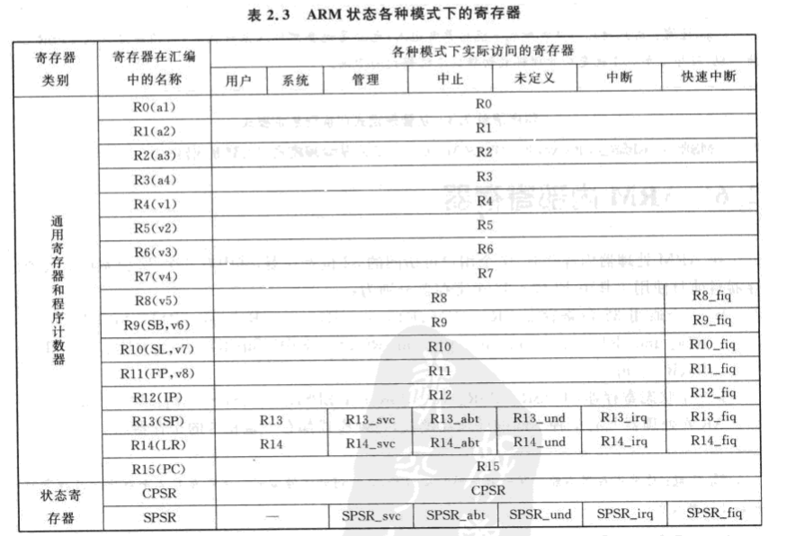


Thumb状态寄存器集是arm状态集的子集。

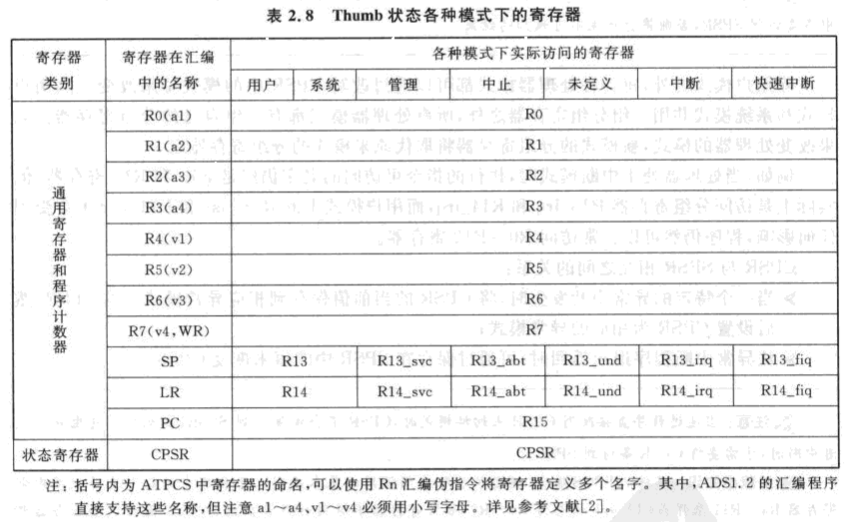

### 1.当前程序状态寄存器

CPSR:当前程序状态寄存器。监视和控制cpu内部操作。

SPSR:程序状态保存寄存器。 用于保存任务在异常发生之前的CPSR状态的当前值。.

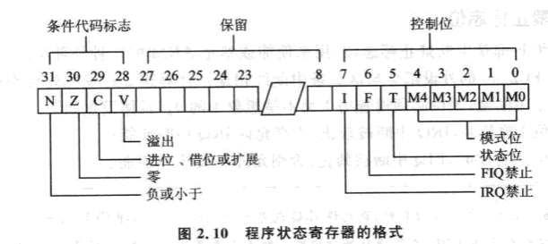

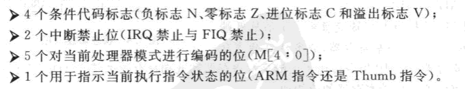

#### 1.1条件代码标志

#### 1.2控制标志位

I、F：中断禁止标志位。

T：处理器状态位。

M0-M4：处理器模式位。

##### 1.2.1 中断禁止标志位

##### 1.2.2 控制位t

​	表示了正在操作的状态。   是在Thumb状态下还是在ARM状态下。

##### 1.2.3 模式控制位

​	不是所有的组合都表示有效的模式。

#### 1.3 保留位

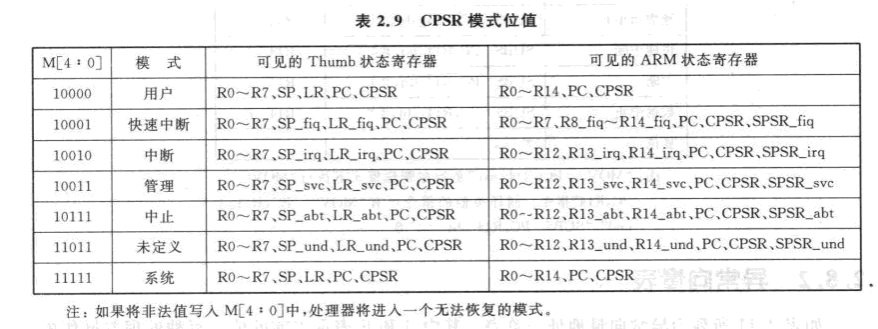

## ARM体系的异常、中断及其向量表

预留......


## ARM体系的存储系统

预留......


## ARM处理器寻址方式

4.1寄存器寻址

4.2立即寻址

4.3寄存器移位寻址

4.4寄存器间接寻址

4.5基址寻址

4.6多寄存器寻址

4.7堆栈寻址

4.8相对寻址

# Thumb汇编指令

Thumb指令集没有协处理器指令、信号量指令以及访问CPSR或SPSR指令。没有乘加指令及64位乘法指令等。

除了分支指令b有条件执行功能外，其他指令均无条件执行。


预留......


# ARM汇编指令

## 0.“.”开头的指令

```assembly
.global
@ .global关键字用来让一个符号对链接器可见，可以供其他链接对象模块使用。
@ .global _start 让_start符号成为可见的标示符，这样链接器就知道跳转到程序中的什么地方并开始执行。linux寻找这个 _start标签作为程序的默认进入点。


.extern XXXX 
@ XXXX，调用的时候可以遍访所有文件找到该函数并且使用它


.macro
.endm
@ 类似宏定义，将一组命令放在这两个命令中间组成一个命令集合。
.macro STACK_MAGIC_SET param0, param1, param2
    ldr     r0, =\param0
    mov     r1, \param1
    ldr     r2, =\param2
    bl      excstack_magic
.endm


.code 32
@ 表示后面的指令全部用arm指令集

.code 16
@ 表示下面的汇编代码都使用thumb指令集


.section .text        
#定义文本段（代码段）

.section .data        
#定义数据段

.section .bss          
#定义 bss 段

.section ".vectors", "ax"       
#指定以下代码段必须存放在.vectors段里， “ax”表示该段可执行并且可分配
```


## 1.相对跳转指令：

b、bl:

​	bl除了跳转之外，还将返回地址(bl的下一条指令的地址)保存在lr寄存器中。他们是位置无关的指令（范围为当前指令的前后32mb）

```nasm
	b fun1
......
fun1:
	bl fun2
......
fun2:
......
```

有两种方式实现跳转：1.使用分支指令直接跳转。 2.向PC寄存器赋值实现跳转。

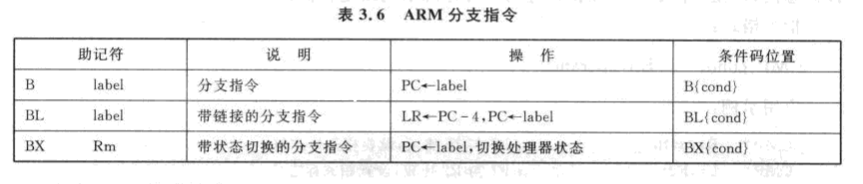

## 2.数据处理：传送指令mov,地址读取伪指令ldr

mov :

​	指令是把一个寄存器的值赋给另一个寄存器，或者把一个常数赋给寄存器。

```nasm
mov r1, r2
mov r1, #4096
```

如果传送的数不能确定是否可以使用“立即数”来表示的话，可以使用Ldr命令来赋值。

ldr是伪指令，如果该常数能用立即数表示，则直接使用mov指令，否则编译时将常数放入某个位置，使用内存读取伪指令把它读出来。

```nasm
ldr r1, =4097       /*r1=4097,将常数赋值给r1*/
ldr r1, =label		/*获取代码的绝对地址*/
label:
......
```

ldr: 本意为“大范围的地址读取伪指令”   


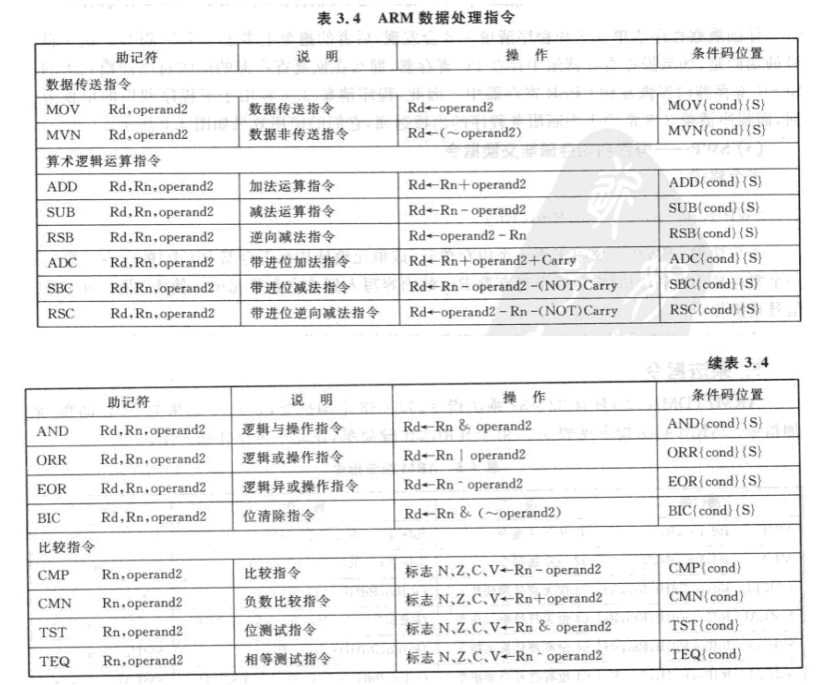

## 3.内存访问指令：ldr,str,ldm,stm

ldr：既可以是“大范围地址读取伪指令” 也可以是内存访问指令。  当它的第二个参数前面有“=”时，表示伪指令，否则表示内存访问指令。


ldr：从内存中读取数据到寄存器。操作的数据为32位。

str：把寄存器的值存储到内存中。操作的数据为32位。

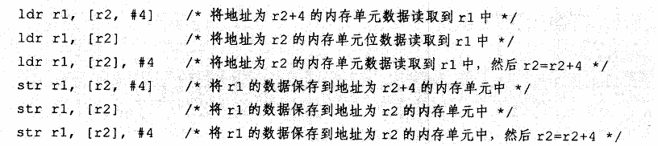

ldm和stm：属于批量内存访问指令，只用一条指令就可以读写多个数据。

格式：

```nasm
ldm {cons}<addressing_mode> <rn>{!} <register list>{^}
stm {cons}<addressing_mode> <rn>{!} <register list>{^}
```

{cond} :表示指令的执行条件。  条件如下表3.2所示.

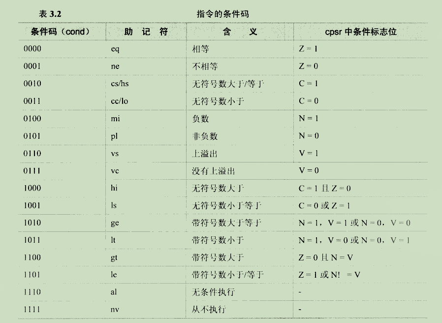

{addressing_mode}表示地址变化模式，有下列4中方式：

​	ia: 事后递增方式。

​	ib：事先递增方式。

​	da：事后递减方式。

​	db：事先递减方式。

{rn}中保存内存的地址，如果后面加上感叹号，指令执行后，rn的值会变成下一个内存单元的地址。

<registre list>表示寄存器列表，对于ldm指令，从<rn>所对应的内存块中取出数据，写入这些寄存器；对于stm指令，把这些寄存器的值写入<rn>对应的内存块中。

{^}：

​	1.<register list>中有pc寄存器，它表示指令执行后，spsr寄存器的值将自动复制到cpsr寄存器中--常用来从中断函数中返回。

​	2.<register list>中没有pc寄存器，它表示操作的是用户模式下的寄存器，而不是当前特权模式的寄存器。

指令中寄存器列表和内存单元的对应关系为：编号低的寄存器对应内存中的低地址单元，编号高的寄存器对应内存中的高地址单元。

```nasm
HandleIRQ:					@中断入口函数
	sub lr, lr, #4			@计算返回地址
	stmdb sp!,	{r0-r12,lr} @保存使用到的寄存器
							@r0-r12,lr被保存在sp表示的内存中
							@“！”使得指令执行后sp=sp-14*4
							
	ldr lr, =int_return		@设置调用IRQ_Handle函数后的返回地址
	ldr pc, =IRQ_Handle		@调用中断分发函数
int_return:
	ldmia	sp!,	{r0-r12,pc }^	@中断返回，^表示将spsr的值复制到cpsr
									@于是从irq模式返回被中断的工作模式
									@！使得指令执行后sp=sp+14*4
```

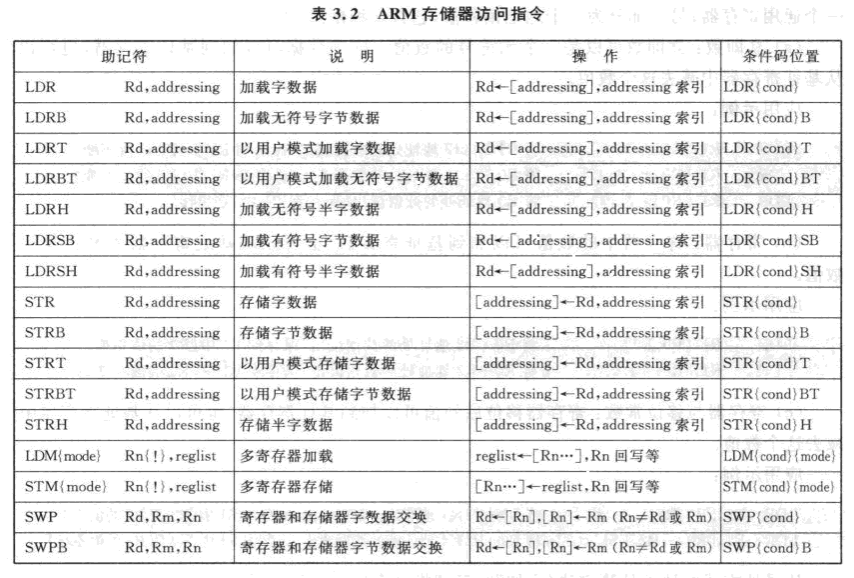

## 4.乘法指令(arm7tdmi-s加入的指令)

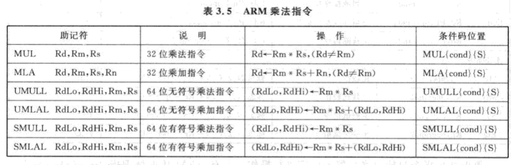

## 5.加减指令：add,sub

```nasm
add r1, r2, #1		@表示r1=r2+1
sub r1, r2, #1		@表示r1=r2-1
```

## 6.程序状态寄存器的访问指令：msr,mrs

arm处理器有一个程序状态寄存器cpsr， 用来控制处理器的工作模式、设置中断的总开关。

```nasm
msr cpsr, r0		@复制r0到cpsr中
mrs r0, cpsr		@复制cpsr到r0中
```

## 7.杂项指令：swi,mrs,msr

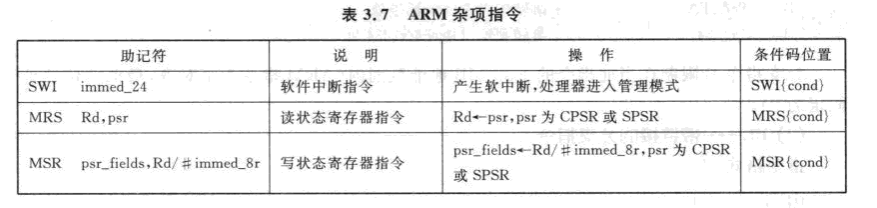

## 8.其他伪指令

```nasm
.extern main	@定义一个外部符号（可以是变量和函数） 这个main代表一个函数。
.text			@表示下面的语句都属于代码段。
.global _start	@将本文中的某个程序标号定义为全局的，这个_start表示一个全局函数。
_start:

adr				@小范围地址读取伪指令
adrl			@中等范围的地址读取伪指令
ldr				@大范围地址读取伪指令

nop				@空操作伪指令

SPACE和DCD的区别在于：
SPACE和DCD的功能类似，SPACE申请一片内存空间，DCD申请一个字(32bit)的内存空间。
SPACE和DCD的区别在于，SPACE申请空间但不赋初值，DCD申请一个字的空间，并赋初值。

```

```assembly
MCR
@ 指令将ARM处理器的寄存器中的数据传送到协处理器的寄存器中。如果协处理器不能成功地执行该操作，将产生未定义的指令异常中断。
MCR{<cond>} p15, 0, <Rd>, <CRn>, <CRm>{,<opcode_2>}

MCR2 p15, 0, <Rd>, <CRn>, <CRm>{,<opcode_2>}

mrc 
@ 从协处理器移动到寄存器

and 
@ 按位与操作


bne
@ 数据跳转指令，标志寄存器中Z标志位不等于零时, 跳转到BNE后标签处。


.irp <param> {,<val_1>} {,<val_2>} …
@ 循环执行.endr前的代码段，param依次取后面给出的值。
@ 在循环执行的代码段中必须以“/<param> ”表示参数。

.endr 
@结束循环(与armasm中的WEND相似).


LDRD 和 STRD 双字数据传送必须是八字节对齐的。如果要用 LDRD 或 STRD 访问
数据，则在内存分配指令（如 DCQ）之前使用 ALIGN 8（请参阅第7-17 页的数
据定义指令）。

strd: 将double word存储到指定内存地址

```


## 9.汇编指令的执行条件

详解：https://www.jianshu.com/p/0c6192da2fd0

条件有：看上边表3.2

arm指令包含4位的条件域码，这表明可以定义16个执行条件，可以将这些执行条件的助记符附加到汇编指令后。

例如：moveq,movgt等。


# arm-thumb子程序调用规则ATPCS

预留......


