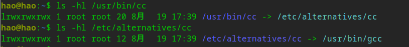
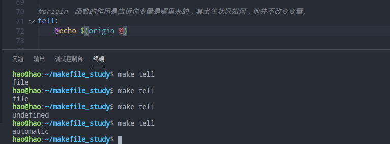

# Makefile详解

## 1.makefile的规则

```makefile
  target... : prerequisites ...

          command

          ...

          ...
```

**target**也就是一个目标文件，可以是**Object File**，也可以是执行文件。还可以是一个标签（Label:伪目标）

**prerequisites**就是，要生成那个target所需要的文件或是目标。

**command**也就是make需要执行的命令。（任意的Shell命令）

1.target这一个或多个的目标文件依赖于prerequisites中的文件，其生成规则定义在command中。

2.prerequisites中如果有一个以上的文件比target文件要新的话，command所定义的命令就会被执行。

```makefile
#例子：
main: openssl $(object12) call1 $(obj_base)
    $(cc) $(objects) -o main $(arg) $(arg_base)
```

## 2.make是如何工作的？

在默认的方式下，也就是我们只输入make命令。那么，

1. make会在当前目录下找名字叫“Makefile”或“makefile”的文件。
2. 读入Makefile，被include的其他Makefile，初始化变量，推导隐式规则，并分析所有规则，为所有的目标文件创建依赖关系链，根据依赖关系，决定哪些目标要生成或重新生成。
3. 它会找文件中的第一个目标文件（target），在例子中，他会找到“main”这个文件，并把这个文件作为最终的目标文件。
4. 如果main文件不存在，或是main所依赖的后面的 .o 文件的文件修改时间要比main这个文件新，那么，他就会执行后面所定义的命令来生成main这个文件。
5. 如果main所依赖的.o文件存在，那么make会在当前文件中找目标为.o文件的依赖性，如果找到则再根据那一个规则生成.o文件。 如果不存在，会使用隐式规则。
6. 当main所依赖的.o文件全部生成之后，就开始生成main文件。

## 3.隐式规则

（让make自动推导）

​    只要make看到一个[.o]文件，它就会自动的把[.c]文件加在依赖关系中，如果make找到一个whatever.o，那么whatever.c，就会是whatever.o的依赖文件。并且 cc -c whatever.c 也会被推导出来。于是，我们的makefile再也不用写得这么复杂。

**cc命令介绍：**

cc是Unix系统的C Compiler，而baigcc则是GNU Compiler Collection，GNU编译du器套装。

而linux下的cc就是gcc的软连接。



```makefile
#例子：
#显式规则
1.o:1.c
    $(cc) -c 1.c -o 1.o $(arg_base)
2.o:2.c
    $(cc) -c 2.c -o 2.o $(arg_base)


#隐式规则, 甚至可以不写。
1.o:1.c
2.o:2.c
```

### 隐式规则一览：

​    这里我们将讲述所有预先设置（也就是make内建）的隐含规则，如果我们不明确地写下规则，那么，make就会在这些规则中寻找所需要规则和命令。当然，我们也可以使用make的参数“-r”或“--no-builtin-rules”选项来取消所有的预设置的隐含规则。

​    当然，即使是我们指定了“-r”参数，某些隐含规则还是会生效，因为有许多的隐含规则都是使用了“后缀规则”来定义的，所以，只要隐含规则中有“后缀列表 ”（也就一系统定义在目标.SUFFIXES的依赖目标），那么隐含规则就会生效。默认的后缀列表是：

​    .out,.a, .ln, .o, .c, .cc, .C, .p, .f, .F, .r, .y, .l, .s, .S, .mod, .sym, .def, .h, .info, .dvi, .tex, .texinfo, .texi, .txinfo, .w, .ch .web, .sh, .elc, .el。

```makefile
1、编译C程序的隐含规则。
“<n>.o”的目标的依赖目标会自动推导为“<n>.c”，并且其生成命令是“$(CC) –c $(CPPFLAGS) $(CFLAGS)”


2、编译C++程序的隐含规则。
“<n>.o” 的目标的依赖目标会自动推导为“<n>.cc”或是“<n>.C”，并且其生成命令是“$(CXX) –c $(CPPFLAGS) $(CFLAGS)”。
（建议使用“.cc”作为C++源文件的后缀，而不是“.C”）


3、编译Pascal程序的隐含规则。
“<n>.o”的目标的依赖目标会自动推导为“<n>.p”，并且其生成命令是“$(PC) –c $(PFLAGS)”。


4、编译Fortran/Ratfor程序的隐含规则。
“<n>.o”的目标的依赖目标会自动推导为“<n>.r”或“<n>.F”或“<n>.f”，并且其生成命令是:
“.f” “$(FC) –c $(FFLAGS)”
“.F” “$(FC) –c $(FFLAGS) $(CPPFLAGS)”
“.f” “$(FC) –c $(FFLAGS) $(RFLAGS)”


5、预处理Fortran/Ratfor程序的隐含规则。
“<n>.f”的目标的依赖目标会自动推导为“<n>.r”或“<n>.F”。这个规则只是转换Ratfor或有预处理的Fortran程序到一个标准的Fortran程序。其使用的命令是：
“.F” “$(FC) –F $(CPPFLAGS) $(FFLAGS)”
“.r” “$(FC) –F $(FFLAGS) $(RFLAGS)”


6、编译Modula-2程序的隐含规则。
“<n>.sym” 的目标的依赖目标会自动推导为“<n>.def”，并且其生成命令是：“$(M2C) $(M2FLAGS) $(DEFFLAGS)”。“<n.o>” 的目标的依赖目标会自动推导为“<n>.mod”，
并且其生成命令是：“$(M2C) $(M2FLAGS) $(MODFLAGS)”。


7、汇编和汇编预处理的隐含规则。
“<n>.o” 的目标的依赖目标会自动推导为“<n>.s”，默认使用编译器“as”，并且其生成命令是：“$(AS) $(ASFLAGS)”。“<n>.s” 的目标的依赖目标会自动推导为“<n>.S”，默认使用C预编译器“cpp”，并且其生成命令是：“$(AS) $(ASFLAGS)”。


8、链接Object文件的隐含规则。
“<n>” 目标依赖于“<n>.o”，通过运行C的编译器来运行链接程序生成（一般是“ld”），其生成命令是：“$(CC) $(LDFLAGS) <n>.o $(LOADLIBES) $(LDLIBS)”。这个规则对
于只有一个源文件的工程有效，同时也对多个Object文件（由不同的源文件生成）的也有效。例如如下规则：

x : y.o z.o


并且“x.c”、“y.c”和“z.c”都存在时，隐含规则将执行如下命令：


cc -c x.c -o x.o
cc -c y.c -o y.o
cc -c z.c -o z.o
cc x.o y.o z.o -o x
rm -f x.o
rm -f y.o
rm -f z.o


如果没有一个源文件（如上例中的x.c）和你的目标名字（如上例中的x）相关联，那么，你最好写出自己的生成规则，不然，隐含规则会报错的。


9、Yacc C程序时的隐含规则。

“<n>.c”的依赖文件被自动推导为“n.y”（Yacc生成的文件），其生成命令是：“$(YACC) $(YFALGS)”。（“Yacc”是一个语法分析器，关于其细节请查看相关资料）


10、Lex C程序时的隐含规则。
“<n>.c”的依赖文件被自动推导为“n.l”（Lex生成的文件），其生成命令是：“$(LEX) $(LFALGS)”。（关于“Lex”的细节请查看相关资料）


11、Lex Ratfor程序时的隐含规则。
“<n>.r”的依赖文件被自动推导为“n.l”（Lex生成的文件），其生成命令是：“$(LEX
) $(LFALGS)”。


12、从C程序、Yacc文件或Lex文件创建Lint库的隐含规则。
“<n>.ln” （lint生成的文件）的依赖文件被自动推导为“n.c”，其生成命令是：“$(LINT) $(LINTFALGS) $(CPPFLAGS) -i”。对于“<n>.y”和“<n>.l”也是同样的规则。
```

### 隐式规则的变量：

​    在隐含规则中的命令中，基本上都是使用了一些预先设置的变量。你可以在你的makefile中改变这些变量的值，或是在make的命令行中传入这些值，或是在你的环境变量中设置这些值，无论怎么样，只要设置了这些特定的变量，那么其就会对隐含规则起作用。当然，你也可以利用make的“-R”或“--no– builtin-variables”参数来取消你所定义的变量对隐含规则的作用。

​    例如，第一条隐含规则——编译C程序的隐含规则的命令是“$(CC) –c $(CFLAGS) $(CPPFLAGS)”。Make默认的编译命令是“cc”，如果你把变量“$(CC)”重定义成“gcc”，把变量“$(CFLAGS)”重定义成 “-g”，那么，隐含规则中的命令全部会以“gcc –c -g $(CPPFLAGS)”的样子来执行了。

#### 1、关于命令的变量

```makefile
AR   函数库打包程序。默认命令是“ar”。
AS
汇编语言编译程序。默认命令是“as”。
CC
C语言编译程序。默认命令是“cc”。
CXX
C++语言编译程序。默认命令是“g++”。
CO
从 RCS文件中扩展文件程序。默认命令是“co”。
CPP
C程序的预处理器（输出是标准输出设备）。默认命令是“$(CC) –E”。
FC
Fortran 和 Ratfor 的编译器和预处理程序。默认命令是“f77”。
GET
从SCCS文件中扩展文件的程序。默认命令是“get”。
LEX
Lex方法分析器程序（针对于C或Ratfor）。默认命令是“lex”。
PC
Pascal语言编译程序。默认命令是“pc”。
YACC
Yacc文法分析器（针对于C程序）。默认命令是“yacc”。
YACCR
Yacc文法分析器（针对于Ratfor程序）。默认命令是“yacc –r”。
MAKEINFO
转换Texinfo源文件（.texi）到Info文件程序。默认命令是“makeinfo”。
TEX
从TeX源文件创建TeX DVI文件的程序。默认命令是“tex”。
TEXI2DVI
从Texinfo源文件创建军TeX DVI 文件的程序。默认命令是“texi2dvi”。
WEAVE
转换Web到TeX的程序。默认命令是“weave”。
CWEAVE
转换C Web 到 TeX的程序。默认命令是“cweave”。
TANGLE
转换Web到Pascal语言的程序。默认命令是“tangle”。
CTANGLE
转换C Web 到 C。默认命令是“ctangle”。
RM
删除文件命令。默认命令是“rm –f”。
```

#### 2、关于命令参数的变量

```
下面的这些变量都是相关上面的命令的参数。如果没有指明其默认值，那么其默认值都是
空。
ARFLAGS
函数库打包程序AR命令的参数。默认值是“rv”。
ASFLAGS
汇编语言编译器参数。（当明显地调用“.s”或“.S”文件时）。
CFLAGS
C语言编译器参数。
CXXFLAGS
C++语言编译器参数。
COFLAGS
RCS命令参数。
CPPFLAGS
C预处理器参数。（ C 和 Fortran 编译器也会用到）。
FFLAGS
Fortran语言编译器参数。
GFLAGS
SCCS “get”程序参数。
LDFLAGS
链接器参数。（如：“ld”）
LFLAGS
Lex文法分析器参数。
PFLAGS
Pascal语言编译器参数。
RFLAGS
Ratfor 程序的Fortran 编译器参数。
YFLAGS
Yacc文法分析器参数。
```

### 隐式规则链：

​    有些时候，一个目标可能被一系列的隐含规则所作用。例如，一个[.o]的文件生成，可能会是先被Yacc的[.y]文件先成[.c]，然后再被C的编译器生成。我们把这一系列的隐含规则
叫做“隐含规则链”。

### 模式规则：

​    可以使用模式规则来定义一个隐含规则。

​    一个模式规则就好像一个一般的规则，只是在规则中，目标的定义需要有"%"字符。　　"%"的意思是表示一个或多个任意字符。在依赖目标中同样可以使用"%"，只是依赖目标中的"%"的取值，取决于其目标。

​    有一点需要注意的是，"%"的展开发生在变量和函数的展开之后，变量和函数的展开发生在make载入Makefile时，而模式规则中的"%"则发生在运行时。

​    模式规则中，至少在规则的目标定义中要包含"%"，否则，就是一般的规则。目标中的"%"定义表示对文件名的匹配，"%"表示长度任意的非空字符串。例如：

```makefile
"%.c"：表示以".c"结尾的文件名（文件名的长度至少为3）。
"s.%.c"：表示以"s."开头，".c"结尾的文件名（文件名的长度至少为5）。
```

#### １．模式规则示例：

```makefile
%.o : %.c
    $(CC) -c $(CFLAGS) $(CPPFLAGS) $< -o $@
```

​    其中，"$@"表示所有目标的挨个值，"$<"表示了所有依赖的挨个值。这些奇怪的变量我们叫"自动化变量".

```makefile
%.tab.c %.tab.h: %.y
    bison -d $<
```

​    这条规则告诉make把所有的[.y]文件都以"bison -d <n>.y"执行，然后生成"<n>.tab.c"和"<n>.tab.h"文件。（其中，"<n>" 表示一个任意字符串）。

#### ２．自动化变量

​    在上述的模式规则中，目标和依赖文件都是一系例的文件，那么我们如何书写一个命令来完成从不同的依赖文件生成相应的目标？因为在每一次的对模式规则的解析时，都会是不同的目标和依赖文件。

​    自动化变量就是完成这个功能的。所谓自动化变量，就是这种变量会把模式中所定义的一系列的文件自动地挨个取出，直至所有的符合模式的文件都取完了。这种自动化变量只应出现在规则的命令中。

下面是所有的自动化变量及其说明：

```makefile
$@
#表示规则中的目标文件集。在模式规则中，如果有多个目标，那么，"$@"就是匹配于目标中模式定义的集合。


$%
#仅当目标是函数库文件中，表示规则中的目标成员名。例如，如果一个目标是"foo.a(bar.o)"，那么，"$%"就是"bar.o"，"$@"就是"foo.a"。如果目标不是函数库文件（Unix下是[.a]，Windows下是[.lib]），那么，其值为空。

$<
#依赖目标中的第一个目标名字。如果依赖目标是以模式（即"%"）定义的，那么"$<"将是符合模式的一系列的文件集。注意，其是一个一个取出来的。

$?
#所有比目标新的依赖目标的集合。以空格分隔。

$^
#所有的依赖目标的集合。以空格分隔。如果在依赖目标中有多个重复的，那个这个变量会去除重复的依赖目标，只保留一份。

$+
#这个变量很像"$^"，也是所有依赖目标的集合。只是它不去除重复的依赖目标。


$*
#这个变量表示目标模式中"%"及其之前的部分。如果目标是"dir/a.foo.b"，并且目标的模式是"a.%.b"，那么，"$*"的值就是"dir/a.foo"。   这个变量对于构造有关联的文件名是比较有用。如果目标中没有模式的定义，那么"$*"也就不能被推导出，但是，如果目标文件的后缀是 make所识别的，那么"$*"就是除了后缀的那一部分。

#例如：如果目标是"foo.c"，因为".c"是make所能识别的后缀名，所以，"$*"的值就是"foo"。这个特性是GNU make的，很有可能不兼容于其它版本的make，所以，你应该尽量避免使用"$*"，除非是在隐含规则或是静态模式中。如果目标中的后缀是make所不能识别的，那么"$*"就是空值。

#当你希望只对更新过的依赖文件进行操作时，"$?"在显式规则中很有用，例如，假设有一个函数库文件叫"lib"，其由其它几个object文件更新。那么把object文件打包的比较有效率的Makefile规则是：

lib : foo.o bar.o lose.o win.o
    ar r lib $?
```

​    在上述所列出来的自动量变量中。四个变量（$@、$<、$%、$*）在扩展时只会有一个文件，而另三个的值是一个文件列表。这七个自动化变量还可以取得文件的目录名或是在当前目录下的符合模式的文件名，只需要搭配上"D"或"F"字样。这是GNU make中老版本的特性，在新版本中，我们使用函数"dir"或"notdir"就可以做到了。"D"的含义就是Directory，就是目录，"F"的含义就是File，就是文件。

下面是对于上面的七个变量分别加上"D"或是"F"的含义：

```makefile
$(@D)
#表示"$@"的目录部分（不以斜杠作为结尾），如果"$@"值是"dir/foo.o"，那么"$(@D)"就是"dir"，而如果"$@"中没有包含斜杠的话，其值就是"."（当前目录）。


$(@F)
#表示"$@"的文件部分，如果"$@"值是"dir/foo.o"，那么"$(@F)"就是"foo.o"，"$(@F)"相当于函数"$(notdir $@)"。


"$(*D)"
"$(*F)"
#和上面所述的同理，也是取文件的目录部分和文件部分。对于上面的那个例子，"$(*D)"返回"dir"，而"$(*F)"返回"foo"


"$(%D)"
"$(%F)"
#分别表示了函数包文件成员的目录部分和文件部分。这对于形同"archive(member)"形式的目标中的"member"中包含了不同的目录很有用。


"$(<D)"
"$(<F)"
#分别表示依赖文件的目录部分和文件部分。


"$(^D)"
"$(^F)"
#分别表示所有依赖文件的目录部分和文件部分。（无相同的）


"$(+D)"
"$(+F)"
分别表示所有依赖文件的目录部分和文件部分。（可以有相同的）


"$(?D)"
"$(?F)"

#分别表示被更新的依赖文件的目录部分和文件部分。

#最后想提醒一下的是，对于"$<"，为了避免产生不必要的麻烦，我们最好给$后面的那个特定字符都加上圆括号，比如，"$(< )"就要比"$<"要好一些。

#还得要注意的是，这些变量只使用在规则的命令中，而且一般都是"显式规则"和"静态模式规则"（参见前面"书写规则"一章）。其在隐含规则中并没有意义。
```

#### 3.模式的匹配：

​    一般来说，一个目标的模式有一个有前缀或是后缀的"%"，或是没有前后缀，直接就是一个"%"。因为"%"代表一个或多个字符，所以在定义好了的模式中，我们把"%"所匹配的内容叫做"茎"，例如"%.c"所匹配的文件"test.c"中"test"就是"茎"。因为在目标和依赖目标中同时有"%"时，依赖目标的"茎"会传给目标，当做目标中的"茎"。

​    当一个模式匹配包含有斜杠（实际也不经常包含）的文件时，那么在进行模式匹配时，目录部分会首先被移开，然后进行匹配，成功后，再把目录加回去。在进行"茎"的传递时，我们需要知道这个步骤。例如有一个模式"e%t"，文件"src/eat" 匹配于该模式，于是"src/a"就是其"茎"，如果这个模式定义在依赖目标中，而被依赖于这个模式的目标中又有个模式"c%r"，那么，目标就是"src/car"。（"茎"被传递）

#### 4.重建内建的隐式规则：

你可以重载内建的隐含规则（或是定义一个全新的），例如你可以重新构造和内建隐含规则不同的命令，如：

```makefile
%.o : %.c
    $(CC) -c $(CPPFLAGS) $(CFLAGS) -D$(date)
```

你可以取消内建的隐含规则，只要不在后面写命令就行。如：

```makefile
%.o : %.s
```

同样，你也可以重新定义一个全新的隐含规则，其在隐含规则中的位置取决于你在哪里写下这个规则。朝前的位置就靠前。

### 老式风格的“后缀规则”：

​    后缀规则是一个比较老式的定义隐含规则的方法。后缀规则会被模式规则逐步地取代。因为模式规则更强更清晰。为了和老版本的Makefile兼容，GNU make同样兼容于这些东西。

​    以后会弃用，使用新式模式规则就好。在这里知道有这个规则就行。

### 隐式规则的搜索算法：

​    比如我们有一个目标叫 T。

​    下面是搜索目标T的规则的算法。

​    请注意，在下面，我们没有提到后缀规则，原因是，所有的后缀规则在Makefile被载入内存时，会被转换成模式规则。

​    如果目标是"archive(member)"的函数库文件模式，那么这个算法会被运行两次，第一次是找目标T，如果没有找到的话，那么进入第二次，第二次会把"member"当作T来搜索。

```
1、把T的目录部分分离出来。叫D，而剩余部分叫N。（如：如果T是"src/foo.o"，那么，D就是"src/"，N就是"foo.o"）

2、创建所有匹配于T或是N的模式规则列表。

3、如果在模式规则列表中有匹配所有文件的模式，如"%"，那么从列表中移除其它的模式。

4、移除列表中没有命令的规则。

5、对于第一个在列表中的模式规则：

    1）推导其"茎"S，S应该是T或是N匹配于模式中"%"非空的部分。

    2）计算依赖文件。把依赖文件中的"%"都替换成"茎"S。如果目标模式中没有包含斜框字符，而把D加在第一个依赖文件的开头。

    3）测试是否所有的依赖文件都存在或是理当存在。（如果有一个文件被定义成另外一个规则的目标文件，或者是一个显式规则的依赖文件，那么这个文件就叫"理当存在"）

    4）如果所有的依赖文件存在或是理当存在，或是就没有依赖文件。那么这条规则将被采用，退出该算法。

6、如果经过第5步，没有模式规则被找到，那么就做更进一步的搜索。对于存在于列表中的第一个模式规则：

    1）如果规则是终止规则，那就忽略它，继续下一条模式规则。

    2）计算依赖文件。（同第5步）

    3）测试所有的依赖文件是否存在或是理当存在。

    4）对于不存在的依赖文件，递归调用这个算法查找他是否可以被隐含规则找到。

    5）如果所有的依赖文件存在或是理当存在，或是就根本没有依赖文件。那么这条规则被采用，退出该算法。

7、如果没有隐含规则可以使用，查看".DEFAULT"规则，如果有，采用，把".DEFAULT"的命令给T使用。
```

## 4.Makefile文件名

​    默认的情况下，make命令会在当前目录下按顺序找寻文件名为**“GNUmakefile”、“makefile”、“Makefile”**的文件，找到了开始解释这个文件。在这三个文件名中，最好使用“Makefile”这个文件名，因为，这个文件名第一个字符为大写，这样有一种显目的感觉。最好不要用“GNUmakefile”，这个文件是GNU的make识别的。有另外一些make只对全小写的“makefile”文件名敏感，但是基本上来说，大多数的make都支持“**makefile”和“Makefile”**这两种默认文件名。

   当然，你可以使用别的文件名来书写Makefile，比如：“Make.Linux”，“Make.Solaris”，“Make.AIX”等，如果要指定特定的Makefile，你可以使用make的“-f”和“--file”参数，如：make -f Make.Linux或make --file Make.AIX。

## 5.引用其他的Makefile

语法为：

```makefile
#filename可以是当前操作系统Shell的文件模式（可以保含路径和通配符）
include<filename>
```

​    make命令开始时，会找寻include所指出的其它Makefile，并把其内容安置在当前的位置。就好像C/C++的#include指令一样。如果文件都没有指定绝对路径或是相对路径的话，make会在当前目录下首先寻找，如果当前目录下没有找到，那么，make还会在下面的几个目录下找：

```
1.如果make执行时，有“-I”或“--include-dir”参数，那么make就会在这个参数所指定的目录下去寻找。
2.如果目录/include（一般是：/usr/local/bin或/usr/include）存在的话，make也会去找。
```

```makefile
#例子：
include ./openssl/openssl.mk
```

## 6.变量

​    在 Makefile中的定义的变量，他代表了一个文本字串，在Makefile中执行的时候其会自动原模原样地展开在所使用的地方。

​    变量可以使用在“目标”，“依赖目标”，“命令”或是 Makefile的其它部分中。

​    变量的命名字可以包含字符、数字，下划线（可以是数字开头），但不应该含有“:”、“#”、“=”或是空字符（空格、回车等）。变量是大小写敏感的，“foo”、“Foo”和“FOO”是三个不同的变量名。

​    变量在声明时需要给予初值，而在使用时，需要给在变量名前加上“$”符号，但最好用小括号“（）”或是大括号“{}”把变量给包括起来。如果你要使用真实的“$”字符，那么你需要用“$$”来表示。变量可以使用在许多地方，如规则中的“目标”、“依赖”、“命令”以及新的变量中。

1.普通变量

```makefile
#例子：
foo = c
prog.o : prog.$(foo)
$(foo)$(foo) -$(foo) prog.$(foo)


#展开后得到：
prog.o : prog.c
cc -c prog.c
```

2.变量中的变量

前面的变量不能使用后面的变量，只能使用前面已定义好了的变量。

```makefile
#例子：
x := foo
y := $(x) bar
x := later

#其等价于：
y := foo bar
x := later
```

3.变量值的替换

```makefile
#例子：
foo := a.o b.o c.o
bar := $(foo:.o=.c)
```

另一种格式是以“静态模式”定义的：

```makefile
#例子：
foo := a.o b.o c.o
bar := $(foo:%.o=%.c)
```

4.变量的嵌套

```makefile
#例子：
x = y
y = z
a := $($(x))


#在这个例子中，$(x)的值是“y”，所以$($(x))就是$(y)，于是$(a)的值就是“z”。（注意，是“x=y”，而不是“x=$(y)”）
```

5.追加变量值

我们可以使用“+=”操作符给变量追加值

```makefile
#例子：
objects = main.o foo.o bar.o utils.o
objects += another.o
```

于是，我们的$(objects)值变成：“main.o foo.o bar.o utils.o another.o”（another.o被追加进去了）

6.override 指示符

​    通常在执行make时，如果通过命令行定义了一个变量，那么它将替代在Makefile中出现的同名变量的定义。就是说，对于一个在Makefile中使用常规方式（使用“=”、“:=”或者“define”）定义的变量，我们可以在执行make时通过命令行方式重新指定这个变量的值，命令行指定的值将替代出现在Makefile中此变量的值。如果不希望命令行指定的变量值替代在Makefile中的变量定义，那么我们需要在Makefile中使用指示符“override”来对这个变量进行声明，像下边那样：

```makefile
override VARIABLE = VALUE
```

7.多行变量

​    还有一种设置变量值的方法是使用define关键字。使用define关键字设置变量的值可以有换行，这有利于定义一系列的命令（前面我们讲过“命令包”的技术就是利用这个关键字）。

​    define 指示符后面跟的是变量的名字，而重起一行定义变量的值，定义是以endef关键字结束。其工作方式和“=”操作符一样。变量的值可以包含函数、命令、文字，或是其它变量。因为命令需要以**[Tab]**键开头，所以如果你用define定义的命令变量中没有以[Tab]键开头，那么make就不会把其认为是命令。

下面的这个示例展示了define的用法：

```makefile
#例子：
define two-lines
echo foo            #因为不是tab建开头,makefile不认为是命令
echo $(bar)
endef
```

8.环境变量

​    make 运行时的系统环境变量可以在make开始运行时被载入到Makefile文件中，但是如果Makefile中已定义了这个变量，或是这个变量由make命令行带入，那么系统的环境变量的值将被覆盖。（如果make指定了“-e”参数，那么，系统环境变量将覆盖Makefile中定义的变量）

​    因此，如果我们在环境变量中设置了“CFLAGS”环境变量，那么我们就可以在所有的Makefile中使用这个变量了。这对于我们使用统一的编译参数有比较大的好处。如果Makefile中定义了CFLAGS，那么则会使用Makefile中的这个变量，如果没有定义则使用系统环境变量的值，很像“全局变量”和“局部变量”的特性。   当make嵌套调用时，上层Makefile中定义的变量会以系统环境变量的方式传递到下层的Makefile中。当然，默认情况下，只有通过命令行设置的变量会被传递。而定义在文件中的变量，如果要向下层 Makefile传递，则需要使用exprot关键字来声明。

```makefile
#例子：
#没啥作用就是为了显示环境变量
ENV:
    echo $(PATH)
```

9.目标变量

​    前面我们所讲的在Makefile中定义的变量都是“全局变量”，在整个文件，我们都可以访问这些变量。当然，“自动化变量”除外，如“$<”等这种类量的自动化变量就属于“规则型变量”，这种变量的值依赖于规则的目标和依赖目标的定义。

​    当然，我样同样可以为某个目标设置局部变量，这种变量被称为“Target-specific Variable”，它可以和“全局变量”同名，因为它的作用范围只在这条规则以及连带规则中，所以其值也只在作用范围内有效。而不会影响规则链以外的全局变量的值。

```makefile
#例子：
prog : CFLAGS = -g
prog : prog.o foo.o bar.o
$(CC) $(CFLAGS) prog.o foo.o bar.o

prog.o : prog.c
$(CC) $(CFLAGS) prog.c

foo.o : foo.c
$(CC) $(CFLAGS) foo.c

bar.o : bar.c
$(CC) $(CFLAGS) bar.c

#在这个示例中，不管全局的$(CFLAGS)的值是什么，在prog目标，以及其所引发的所有规则中（prog.o foo.o bar.o的规则），$(CFLAGS)的值都是“-g”
```

10.模式变量

​    上面目标变量是变量定义在某个目标上，而模式变量就是变量定义在“模式”上。

```makefile
%.o : CFLAGS = -O
```

## 7.静态模式

静态模式可以更加容易地定义多目标的规则.

```makefile
<targets...>: <target-pattern>: <prereq-patterns ...>

　　　<commands>
```

targets定义了一系列的目标文件，可以有通配符。是目标的一个集合。

target-parrtern是指明了targets的模式，也就是目标集模式。

prereq-parrterns是目标的依赖模式，它对target-parrtern形成的模式再进行一次依赖目标的定义。

```makefile
objects = foo.o bar.o common.h
all: $(objects)
$(objects): %.o: %.c
   $(CC) -c $(CFLAGS) $< -o $@
```

​    上面的例子中，指明了我们的目标从$objects中获取，“%.o”表明要所有以“.o”结尾的目标，也就是“foo.o bar.o”，而依赖模式“%.c”则取模式“%.o”的“%”，也就是“foo和bar”，并为其加下“.c”的后缀，于是，我们的依赖目标就是“foo.c　bar.c”。而命令中的“$<”和“$@”则是自动化变量，“$<”表示所有的依赖目标集（也就是“foo.c bar.c”），“$@”表示目标集（也就是foo.o bar.o）。

```makefile
$@    #目标文件，
$^    #所有的依赖文件
$<    #第一个依赖文件。
```

## 8.自动生成依赖项

在Makefile中，我们的依赖关系可能会需要包含一系列的头文件，比如，如果我们的main.c中有一句“#include "defs.h"”，那么我们的依赖关系应该是：

```makefile
  main.o : main.c defs.h
```

但是如果是大型项目，手动添加太费劲，就可以使用

```
gcc -MM main.c
```

来自动生成依赖项。如下图所示：


GNU组织建议把编译器为每一个源文件的自动生成的依赖关系放到一个文件中，为每一个“name.c”的文件都生成一个“name.d”的Makefile文件，[.d]文件中就存放对应[.c]文件的依赖关系。

## 9.伪目标

例如：

```makefile
.PHONY: clean
clean:
    -rm $(CALLSRC:.c=.o)
    -rm $(CALLSRC:.c=.d)
```

​    比如例子中的clean就是一个伪目标，我们并不需要生成一个clean的文件。“伪目标”并不是一个文件，只是一个标签，由于“伪目标”不是文件，所以make无法生成它的依赖关系和决定它是否要执行。我们只有通过显示地指明这个“目标”才能让其生效。当然，“伪目标”的取名不能和文件名重名，不然其就失去了“伪目标”的意义了。

​    为了避免和文件重名的这种情况，我们可以使用一个特殊的标记“.PHONY”来显示地指明一个目标是“伪目标”，向make说明，不管是否有这个文件，这个目标就是“伪目标”。

## 10.条件判断

​    使用条件判断，可以让make根据运行时的不同情况选择不同的执行分支。条件表达式可以是比较变量的值，或是比较变量和常量的值。

```makefile
libs_for_gcc = -lgnu
normal_libs =


foo: $(objects)
ifeq ($(CC),gcc)
    $(CC) -o foo $(objects) $(libs_for_gcc)
else
    $(CC) -o foo $(objects) $(normal_libs)
endif
```

ifeq：是makefile的关键字，比较两个参数是否相同。此类关键字有4个。

ifneq：判断两个参数是否不同

ifdef：判断变量的值是否为空

ifndef：判断变量是否不为空

## 11.命令与命令包

​    1.每条规则中的命令和操作系统Shell的命令行是一致的。

​    2.make会一按顺序一条一条的执行命令.

​    3.每条命令的开头必须以[Tab]键开头，除非，命令是紧跟在依赖规则后面的分号后的。

​    4.在命令行之间中的空格或是空行会被忽略，但是如果该空格或空行是以Tab键开头的，那么make会认为其是一个空命令。

​    5.make的命令默认是被“/bin/sh”——UNIX的标准Shell解释执行的。除非你特别指定一个其它的Shell.

```shell
make SHELL=/bin/bash
```

​    6.“#”是注释符，很像C/C++中的“//”，其后的本行字符都被注释。

1).**显示/隐藏命令**

通常，make会把其要执行的命令行在命令执行前输出到屏幕上。当我们用“@”字符在命令行前，那么，这个命令将不被make显示出来，最具代表性的例子是，我们用这个功能来像屏幕显示一些信息。如：

```makefile
@echo 正在编译XXX模块......
```

如果make执行时，带入make参数“-n”或“--just-print”，那么其只是显示命令，但不会执行命令，这个功能很有利于我们调试我们的Makefile，看看我们书写的命令是执行起来是什么样子的或是什么顺序的。

而make参数“-s”或“--slient”则是全面禁止命令的显示。

2).**命令执行**

​    当依赖目标新于目标时，也就是当规则的目标需要被更新时，make会一条一条的执行其后的命令。需要注意的是，如果你要让上一条命令的结果应用在下一条命令时，你应该使用分号分隔这两条命令。比如你的第一条命令是cd命令，你希望第二条命令得在cd之后的基础上运行，那么你就不能把这两条命令写在两行上，而应该把这两条命令写在一行上，用分号分隔。

```makefile
cd /home/hchen; pwd
#和
cd /home/hchen
pwd
#的执行效果是不同的。
```

3).**命令出错**

​    每当命令运行完后，make会检测每个命令的返回码，如果命令返回成功，那么make会执行下一条命令，当规则中所有的命令成功返回后，这个规则就算是成功完成了。如果一个规则中的某个命令出错了（命令退出码非零），那么make就会终止执行当前规则，这将有可能终止所有规则的执行。

想要让脚本在报错时继续执行，则使用：

1.加'-'参数。

```
-mkdir test;
```

2.给make加上“-i”或是“--ignore-errors”参数，那么，Makefile中所有命令都会忽略错误。

3.给make加上“-k”或是“--keep-going”，这个参数的意思是，如果某规则中的命令出错了，那么就终止该规则的执行，但继续执行其它规则。

4).**命令包**

​    如果Makefile中出现一些相同命令序列，那么我们可以为这些相同的命令序列定义一个变量。定义这种命令序列的语法以“define”开始，以“endef”结束，如：

```makefile
define run-yacc
  yacc $(firstword $^)
  mv y.tab.c $@
endef

#调用命令包
foo.c : foo.y
  $(run-yacc)
```

run-yacc：命令包的名称。

$^：就是foo.y

$@：就是foo.c

make在执行命令包时，命令包中的每个命令会被依次独立执行。

## 12.函数

在Makefile中可以使用函数来处理变量，从而让我们的命令或是规则更为的灵活和具有智能。

函数调用后，函数的返回值可以当做变量来使用。

### １）**函数的语法**

```makefile
$(<function> <arguments> )
#或者
${<function> <arguments>}
```

<function>就是函数名

<arguments>是函数的参数，参数间以逗号“,”分隔，而函数名和参数之间以“空格”分隔。

函数调用以“$”开头，以圆括号或花括号把函数名和参数括起。很像一个变量.

函数中的参数可以使用变量，为了风格的统一，函数和变量的括号最好一样，如使用“$(subst a,b,$(x))”这样的形式，而不是“$(subst a,b,${x})”的形式。

例：

```makefile
comma:= ,
empty:= 
space:= $(empty) $(empty)
foo:= a b c
bar:= $(subst $(space),$(comma),$(foo))

#===============下面为扩展===============
#解释：makefile中定义空格的两种方式
#1. 
empty:=
space:=$(empty) #
#号前面有多少个空格，space就被定义为多少空格。

#2.
empty:=
space:=$(empty) $(empty)
#两个$(empty)之间有多少个空格，space就被定义为多少空格。

#解释：subst函数：
#这是一个替换函数，这个函数有三个参数，
#第一个参数是被替换字串，
#第二个参数是替换字串，
#第三个参数是替换操作作用的字串。
#这个函数也就是把$(foo)中的空格替换成逗号，所以$(bar)的值是“a,b,c”。
```

### ２）**Makefile函数集合**

#### 1.**字符串处理函数**

```makefile
$(subst <from>,<to>,<text> )

#名称：字符串替换函数——subst。
#功能：把字串<text>中的<from>字符串替换成<to>。
#返回：函数返回被替换过后的字符串。
```

```makefile
$(patsubst <pattern>,<replacement>,<text> )


#名称：模式字符串替换函数——patsubst。
#功能：查找<text>中的单词（单词以“空格”、“Tab”或“回车”“换行”分隔）是否符合模式<pattern>，如果匹配的话，#则以<replacement>替换。这里，<pattern>可以包括通配符“%”，表示任意长度的字串。如果<replacement>中也包#含“%”，那么，<replacement>中的这个“%”将是<pattern>中的那个“%”所代表的字串。（可以用“\”来转义以“\%”#来表示真实含义的“%”字符）
#返回：函数返回被替换过后的字符串。

#例：
$(patsubst %.c,%.o,x.c.c bar.c)
#把字串“x.c.c bar.c”符合模式[%.c]的单词替换成[%.o]，返回结果是“x.c.o bar.o”
```

```makefile
$(strip <string> )

#名称：去空格函数——strip。
#功能：去掉<string>字串中开头和结尾的空字符。
#返回：返回被去掉空格的字符串值。

#示例：
$(strip a b c )
#把字串“a b c ”去掉开头和结尾的空格，结果是“a b c”。
```

```makefile
$(findstring <find>,<in> )
#名称：查找字符串函数——findstring。
#功能：在字串<in>中查找<find>字串。
#返回：如果找到，那么返回<find>，否则返回空字符串。


#示例：
$(findstring a,a b c)
$(findstring a,b c)

#第一个函数返回“a”字符串，第二个返回“”字符串（空字符串）
```

```makefile
$(filter <pattern...>,<text> )


#名称：过滤函数——filter。
#功能：以<pattern>模式过滤<text>字符串中的单词，保留符合模式<pattern>的单词。可以有多个模式。
#返回：返回符合模式<pattern>的字串。
#示例：


sources := foo.c bar.c baz.s ugh.h
foo: $(sources)
    cc $(filter %.c %.s,$(sources)) -o foo


$(filter %.c %.s,$(sources))
#返回的值是“foo.c bar.c baz.s”。
```

```makefile
$(filter-out <pattern...>,<text> )


#名称：反过滤函数——filter-out。
#功能：以<pattern>模式过滤<text>字符串中的单词，去除符合模式<pattern>的单词。可以有多个模式。
#返回：返回不符合模式<pattern>的字串。
#示例：


objects=main1.o foo.o main2.o bar.o
mains=main1.o main2.o


$(filter-out $(mains),$(objects)) 
#返回值是“foo.o bar.o”。
```

```makefile
$(sort <list> )


#名称：排序函数——sort。
#功能：给字符串<list>中的单词排序（升序）。
#返回：返回排序后的字符串。

#示例：
$(sort foo bar lose)
#返回“bar foo lose” 。

#备注：sort函数会去掉<list>中相同的单词。
```

```makefile
$(word <n>,<text> )


#名称：取单词函数——word。
#功能：取字符串<text>中第<n>个单词。（从一开始）
#返回：返回字符串<text>中第<n>个单词。如果<n>比<text>中的单词数要大，那么返回空字符串。
#示例：

$(word 2, foo bar baz)
#返回值是“bar”。
```

```makefile
$(wordlist <s>,<e>,<text> )


#名称：取单词串函数——wordlist。
#功能：从字符串<text>中取从<s>开始到<e>的单词串。<s>和<e>是一个数字。
#返回：返回字符串<text>中从<s>到<e>的单词字串。如果<s>比<text>中的单词数要大，那么返回空字符串。如果<e>大于<text>的单词数，那么返回从<s>开始，到<text>结束的单词串。
#示例： 

$(wordlist 2, 3, foo bar baz)
#返回值是“bar baz”。
```

```makefile
$(words <text> )


#名称：单词个数统计函数——words。
#功能：统计<text>中字符串中的单词个数。
#返回：返回<text>中的单词数。
#示例：
$(words, foo bar baz)
#返回值是“3”。
#备注：如果我们要取<text>中最后的一个单词，我们可以这样：$(word $(words <text> ),<text> )。
```

```makefile
$(firstword <text> )


#名称：首单词函数——firstword。
#功能：取字符串<text>中的第一个单词。
#返回：返回字符串<text>的第一个单词。
#示例：

$(firstword foo bar)
#返回值是“foo”。
#备注：这个函数可以用word函数来实现：$(word 1,<text> )。
```

#### 2.文件名操作函数

```makefile
$(dir <names...> )


#名称：取目录函数——dir。
#功能：从文件名序列<names>中取出目录部分。目录部分是指最后一个反斜杠（“/”）之前的部分。如果没有反斜杠，那么返回“./”。
#返回：返回文件名序列<names>的目录部分。
#示例： 
$(dir src/foo.c hacks)
#返回值是“src/ ./”。
```

```makefile
$(notdir <names...> )


#名称：取文件函数——notdir。
#功能：从文件名序列<names>中取出非目录部分。非目录部分是指最后一个反斜杠（“/”）之后的部分。
#返回：返回文件名序列<names>的非目录部分。
#示例： 
$(notdir src/foo.c hacks)
#返回值是“foo.c hacks”。
```

```makefile
$(suffix <names...> )


#名称：取后缀函数——suffix。
#功能：从文件名序列<names>中取出各个文件名的后缀。
#返回：返回文件名序列<names>的后缀序列，如果文件没有后缀，则返回空字串。
#示例：
$(suffix src/foo.c src-1.0/bar.c hacks)
#返回值是“.c .c”。
```

```makefile
$(basename <names...> )


#名称：取前缀函数——basename。
#功能：从文件名序列<names>中取出各个文件名的前缀部分。
#返回：返回文件名序列<names>的前缀序列，如果文件没有前缀，则返回空字串。
#示例：
$(basename src/foo.c src-1.0/bar.c hacks)
#返回值是“src/foo src-1.0/bar hacks”。
```

```makefile
$(addsuffix <suffix>,<names...> )


#名称：加后缀函数——addsuffix。
#功能：把后缀<suffix>加到<names>中的每个单词后面。
#返回：返回加过后缀的文件名序列。
#示例：
$(addsuffix .c,foo bar)
#返回值是“foo.c bar.c”。
```

```makefile
$(addprefix <prefix>,<names...> )


#名称：加前缀函数——addprefix。
#功能：把前缀<prefix>加到<names>中的每个单词后面。
#返回：返回加过前缀的文件名序列。
#示例：
$(addprefix src/,foo bar)
#返回值是“src/foo src/bar”。
```

```makefile
$(join <list1>,<list2> )


#名称：连接函数——join。
#功能：把<list2>中的单词对应地加到<list1>的单词后面。如果<list1>的单词个数要比<list2>的多，那么，<list1>中的多出来的单词将保持原样。如果<list2>的单词个数要比<list1>多，那么，<list2>多出来的单词将被复制到<list2>中。
#返回：返回连接过后的字符串。
#示例：
$(join aaa bbb , 111 222 333)
#返回值是“aaa111 bbb222 333”。
```

#### 3.**foreach函数**

​    foreach 函数和别的函数非常的不一样。因为这个函数是用来做循环用的，Makefile中的foreach函数几乎是仿照于Unix标准Shell（/bin /sh）中的for语句，或是C-Shell（/bin/csh）中的foreach语句而构建的。它的语法是：

```makefile
$(foreach <var>,<list>,<text> )
```

​    这个函数的意思是，把参数<list>中的单词逐一取出放到参数<var>所指定的变量中，然后再执行<text>所包含的表达式。每一次<text>会返回一个字符串，循环过程中，<text>的所返回的每个字符串会以空格分隔，最后当整个循环结束时，<text>所返回的每个字符串所组成的整个字符串（以空格分隔）将会是foreach函数的返回值。

​    所以，<var>最好是一个变量名，<list>可以是一个表达式，而<text>中一般会使用<var>
这个参数来依次枚举<list>中的单词。举个例子：

```makefile
names := a b c d
files := $(foreach n,$(names),$(n).o)
```

​    上面的例子中，$(name)中的单词会被挨个取出，并存到变量“n”中，“$(n).o”每次根据“$(n)”计算出一个值，这些值以空格分隔，最后作为foreach函数的返回，所以，$(files)的值是“a.o b.o c.o d.o”。

注意，foreach中的<var>参数是一个临时的局部变量，foreach函数执行完后，参数<var>的变量将不在作用，其作用域只在foreach函数当中。

#### 4.if函数

​    if函数很像GNU的make所支持的条件语句——ifeq（参见前面所述的章节），if函数的语法是：

```makefile
$(if <condition>,<then-part> )
#或是
$(if <condition>,<then-part>,<else-part> )
```

​    可见，if函数可以包含“else”部分，或是不含。即if函数的参数可以是两个，也可以是三个。

​    <condition>参数是if的表达式，如果其返回的为非空字符串，那么这个表达式就相当于返回真，于是，<then-part>会被计算，否则<else-part> 会被计算。

​    而if函数的返回值是，如果<condition>为真（非空字符串），那个<then- part>会是整个函数的返回值，如果<condition>为假（空字符串），那么<else-part>会是整个函数的返回值，此时如果<else-part>没有被定义，那么，整个函数返回空字串。

所以，<then-part>和<else-part>只会有一个被计算。

```makefile
SRC_DIR := src

#if函数---设置默认值
#如果变量SRC_DIR的值不为空,则将SRC_DIR指定的目录作为SUBDIR子目录;否则将/home/src作为子目录
SUBDIR += $(if $(SRC_DIR),$(SRC_DIR),/home/src)

all:
    @echo $(SUBDIR)

#值为：src
```

#### 5.call函数

​    call函数是唯一一个可以用来**创建新的参数化**的函数。你可以写一个非常复杂的表达式，这个表达式中，你可以定义许多参数，然后你可以用call函数来向这个表达式传递参数。其语法是：

```makefile
$(call <expression>,<parm1>,<parm2>,<parm3>...)
```

​    当 make执行这个函数时，<expression>参数中的变量，如$(1)，$(2)，$(3)等，会被参数<parm1>，<parm2>，<parm3>依次取代。而<expression>的返回值就是 call函数的返回值。例如：

```makefile
reverse = $(1) $(2)
foo = $(call reverse,a,b)
```

那么，foo的值就是“a b”。当然，参数的次序是可以自定义的，不一定是顺序的，如：

```makefile
reverse = $(2) $(1)
foo = $(call reverse,a,b)
```

此时的foo的值就是“b a”。


#### 6.origin函数

origin函数不像其它的函数，他并不操作变量的值，他只是告诉你你的这个变量是哪里来的？其语法是：

```makefile
$(origin <variable> )
```



```makefile
“undefined”
如果<variable>从来没有定义过，origin函数返回这个值“undefined”。

“default”
如果<variable>是一个默认的定义，比如“CC”这个变量，这种变量我们将在后面讲述。

“environment”
如果<variable>是一个环境变量，并且当Makefile被执行时，“-e”参数没有被打开。


“file”
如果<variable>这个变量被定义在Makefile中。


“command line”
如果<variable>这个变量是被命令行定义的。

“override”
如果<variable>是被override指示符重新定义的。

“automatic”
如果<variable>是一个命令运行中的自动化变量。关于自动化变量将在后面讲述。
```

#### 7.shell函数

```makefile
#shell 函数也不像其它的函数。顾名思义，它的参数应该就是操作系统Shell的命令。它和反引号“`”是相同的功能。这就是说，shell函数把执行操作系统命令后的输出作为函数返回。于是，我们可以用操作系统命令以及字符串处理命令awk，sed等等命令来生成一个变量，如：


contents := $(shell cat foo)
files := $(shell echo *.c)


#注意，这个函数会新生成一个Shell程序来执行命令，所以你要注意其运行性能，如果你的Makefile中有一些比较复杂的规则，并大量使用了这个函数，那么对于你的系统性能是有害的。特别是Makefile的隐晦的规则可能会让你的shell函数执行的次数比你想像的多得多。
```

#### 8.make的控制函数

​    make提供了一些函数来控制make的运行。通常，你需要检测一些运行Makefile时的运行时信息，并且根据这些信息来决定，你是让make继续执行，还是停止。

1). $(error <text ...> )

产生一个致命的错误，<text ...>是错误信息。

```makefile
ifdef ERROR_001
    $(error error is $(ERROR_001))
endif
#在变量ERROR_001定义了后执行时产生error调用
```

2). $(warning <text ...> )

这个函数很像error函数，只是它并不会让make退出，只是输出一段警告信息，而make继续执行.

## 13.文件搜寻

1. 第一种方式

　在一些大的工程中，有大量的源文件，我们通常的做法是把这许多的源文件分类，并存放在不同的目录中。所以，当make需要去找寻文件的依赖关系时，你可以在文件前加上路径，但最好的方法是把一个路径告诉make，让make在自动去找。

​    Makefile文件中的特殊变量“VPATH”就是完成这个功能的，如果没有指明这个变量，make只会在当前的目录中去找寻依赖文件和目标文件。如果定义了这个变量，那么，make就会在当前目录找不到的情况下，到所指定的目录中去找寻文件了。

```makefile
  VPATH = src:../headers
```

​    上面的的定义指定两个目录，“src”和“../headers”，make会按照这个顺序进行搜索。目录由“冒号”分隔。（当然，当前目录永远是最高优先搜索的地方）

2. 第二种方式

　另一个设置文件搜索路径的方法是使用make的“vpath”关键字（注意，它是全小写的），这不是变量，这是一个make的关键字，这和上面提到的那个VPATH变量很类似，但是它更为灵活。它可以指定不同的文件在不同的搜索目录中。这是一个很灵活的功能。它的使用方法有三种：

```makefile
vpath < pattern> < directories>  #为符合模式<pattern>的文件指定搜索目录<directories>。
vpath < pattern>                 #清除符合模式<pattern>的文件的搜索目录。
vpath                            #清除所有已被设置好了的文件搜索目录。

#例子：
vpath %.h ../headers

#============================
vpath %.c foo:bar
vpath %   blish
#而上面的语句则表示“.c”结尾的文件，先在“foo”目录，然后是“bar”目录，最后才是“blish”目录。
```

## 14.增量编译

依赖实例：

```makefile
target:dependencies
<TAB>system command1    #语句前用<tab>识别为命令。
<TAB>system command..
```

当某个依赖的源文件更新后，就只编译这个源文件，称为增量编译。

在Linux中，通过控制Makefile实现增量编译的效果。

Makefile中使用　“依赖dependencies“　来实现增量编译。

依赖是一个文件列表，当有文件更新时，执行这条规则。

根据文件的修改时间来判断是否要更新。

比如某个依赖文件的时间比目标文件的时间要新就编译。

makefile会递归检查依赖，并判断文件的时间。

时间比较：
target(T1):dependencies(T2)
1.若target文件不存在，则T1为0
2.若dependencies为空，则T2为0

Makefile比较T2与T1
if(T1==0)执行
else if(T2>T1)执行
else "已是最新，不执行规则"
