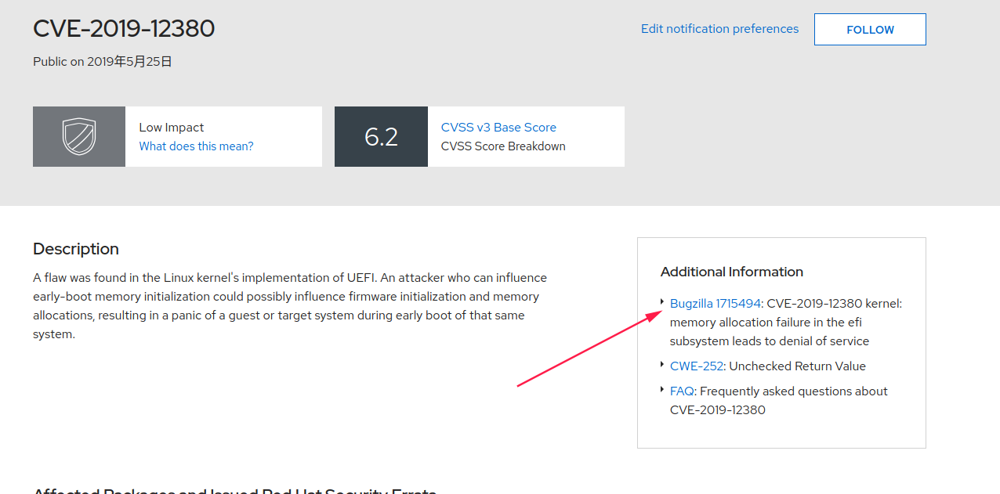
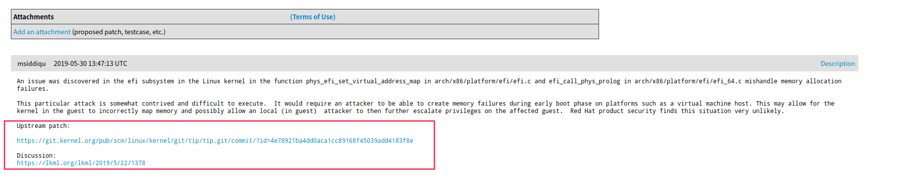
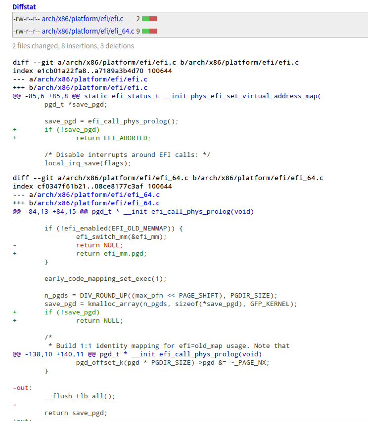

# Git

## 前提

1.在gitlab上申请账号并登陆。 

2.使用下边命令生成sshkey。

```powershell
ssh-keygen -t rsa -C "your_email@youremail.com"
```

3.添加sshkey到gitlab上，然后才能下载代码。


## git命令总结

### 1.命令集合

```sh
git format-patch HEAD^ 　　　　　　　　　　　　　   #生成最近的1次commit的patch

#git am 合并patch命令
git am
# 查看patch的情况
$ git apply --stat 0001-limit-log-function.patch   　　　　 

# 检查patch是否能够打上，如果没有任何输出，则说明无冲突，可以打上
$ git apply --check 0001-limit-log-function.patch   　　　  
#(注：git apply是另外一种打patch的命令，其与git am的区别是，git apply并不会将commit message等打上去，打完patch后需要重新git add和git commit，而git am会直接将patch的所有信息打上去，而且不用重新git add和git commit,author也是patch的author而不是打patch的人)

# 将名字为0001-limit-log-function.patch的patch打上
$ git am 0001-limit-log-function.patch

# 添加-s或者--signoff，还可以把自己的名字添加为signed off by信息，作用是注明打patch的人是谁，因为有时打patch的人并不是patch的作者
$ git am --signoff 0001-limit-log-function.patch                  

# 将路径~/patch-set/*.patch 按照先后顺序打上
$ git am ~/patch-set/*.patch　　　　　　

# 当git am失败时，用以将已经在am过程中打上的patch废弃掉(比如有三个patch，打到第三个patch时有冲突，那么这条命令会把打上的前两个patch丢弃掉，返回没有打patch的状态)
$ git am --abort                   

#当git am失败，解决完冲突后，这条命令会接着打patch
$ git am --resolved     


#Git回滚代码到某个commit
回退命令：
git reset --hard HEAD^ 回退到上个版本
git reset --hard HEAD~3 回退到前3次提交之前，以此类推，回退到n次提交之前
git reset --hard commit_id 退到/进到，指定commit的哈希码（这次提交之前或之后的提交都会回滚）
```

### 2.参考博客

git命令同步和提交代码

https://blog.csdn.net/u012302552/article/details/78975593

path命令详细介绍：

https://www.cnblogs.com/ArsenalfanInECNU/p/8931377.html

git冲突解决：

https://www.cnblogs.com/peterpanzsy/p/3791179.html

git回滚代码：

https://blog.csdn.net/xinzhifu1/article/details/92770108


### CVE内核patch检查更新方法

1. 再这个网站输入patch号，可以查找patch信息。 

   ```sh
   https://access.redhat.com/security/security-updates/#/cve?q=CVE-2019-12380&p=1&sort=cve_publicDate%20desc&rows=10&documentKind=Cve
   ```

2. 进入如下图中：

3. 再下图中找出上游patch或者Discussion。

4. 再patch或者discussion中找出不同，然后修改本地对应文件。如下图：

5. 上传基代码到github上任意账号下， 或者直接git init都可以。  然后在原来的基础上修改代码后使用

   ```sh
   git format-patch HEAD^
   ```

   生成一个patch文件。

### 一、下载代码

```sh
git clone 代码库地址
```

下载指定分支的某个版本代码：

```shell
git clone -b 分支名 代码库地址
```

### 二、查看代码分支

查看所有分支（结果列表中前面标*号的表示当前使用分支）

```shell
git branch -a
```

查看当前使用分支

```shell
git branch
```

切换分支

```shell
git checkout 分支名
```

### 三、更新、修改与提交代码


### 四、fork别人的仓库，并创建自己分支

1.下载代码

```sh
git clone [仓库url] 
```

2.创建自己分支

创建自己的分支branch可以灵活的编辑、修改代码，同时不会破坏原来的master分支。

```shell
git branch [your branch]
git checkout [your branch] #切换到自己的分支 
#也可以修改本地分支的名称
git branch -m [old_name] [new_name]
```

3.添加自己的远程仓库地址

url表示远程仓库的地址，有两种url可以选择：
git@github.com:facebookresearch/maskrcnn-benchmark.git (配置好本地秘钥后可以直接push)
https://github.com/facebookresearch/maskrcnn-benchmark.git (每次push需要输入账号和密码)
shortname可以是远程url的名称,默认是origin,可以自己定义名称

```sh
git remote add upstream "git 地址"
```

4.给自己修改提交

```sh
git add -u #-u表示只增加文件修改，不添加新创建的文件
git commit -m "本次提交的描述"
```

5.推送到自己的仓库

```sh
git remote -v # 查看远程link
git push [自己的仓库url名] [分支名] #例如git push origin master 或者git push [my_repo_url] new_branch
```

6.推送到官方仓库

```sh
#如果没有官方的url地址，需要增加上游地址，这里命名为upstream
git remote add upstream git@github.com:facebookresearch/maskrcnn-benchmark.git
# 合并官方仓库分支和本地自己修改的分支
git fetch origin
git merge origin/master
# 推送到官方仓库master分支
git push upstream master 
```

7.与上游保持一致

```sh
# 获取上游更新
git fetch upstream
git checkout master
# merge
git merge upstream/master

# 推送到自己的仓库
git push origin master
```


## git patch使用教程

git基本原理介绍：https://www.runoob.com/manual/git-guide/

git fetch: 相当于从远程获取最新版本的地址到本地。

### git format-patch打patch命令：

```sh
git format-patch HEAD^ 　　　　　　　　　　　　　   #生成最近的1次commit的patch
```

### git am 合并patch命令：

```sh
git am
## 查看patch的情况
$ git apply --stat 0001-limit-log-function.patch   　　　　 

## 检查patch是否能够打上，如果没有任何输出，则说明无冲突，可以打上
$ git apply --check 0001-limit-log-function.patch   　　　  
#(注：git apply是另外一种打patch的命令，其与git am的区别是，git apply并不会将commit message等打上去，打完patch后需要重新git add和git commit，而git am会直接将patch的所有信息打上去，而且不用重新git add和git commit,author也是patch的author而不是打patch的人)

## 将名字为0001-limit-log-function.patch的patch打上
$ git am 0001-limit-log-function.patch

## 添加-s或者--signoff，还可以把自己的名字添加为signed off by信息，作用是注明打patch的人是谁，因为有时打patch的人并不是patch的作者
$ git am --signoff 0001-limit-log-function.patch                  

## 将路径~/patch-set/*.patch 按照先后顺序打上
$ git am ~/patch-set/*.patch　　　　　　

## 当git am失败时，用以将已经在am过程中打上的patch废弃掉(比如有三个patch，打到第三个patch时有冲突，那么这条命令会把打上的前两个patch丢弃掉，返回没有打patch的状态)
$ git am --abort                   

##当git am失败，解决完冲突后，这条命令会接着打patch
$ git am --resolved                                                             
```

## Git回滚代码到某个commit

```sh
回退命令：
git reset --hard HEAD^ 回退到上个版本
git reset --hard HEAD~3 回退到前3次提交之前，以此类推，回退到n次提交之前
git reset --hard commit_id 退到/进到，指定commit的哈希码（这次提交之前或之后的提交都会回滚）
```

## 查看代码的修改状态

```sh
git status  
```

## git仓库使用命令

git remote -v 查看远程仓库名称

git fetch origin master 更新远程仓库的master分支到本地，在这之前，如果有为提交的，需要先提交。

git merge origin/master 与远程仓库比较


## CVE内核patch检查更新方法

1. 再这个网站输入patch号，可以查找patch信息。 

   ```sh
   https://access.redhat.com/security/security-updates/#/cve?q=CVE-2019-12380&p=1&sort=cve_publicDate%20desc&rows=10&documentKind=Cve
   ```

2. 进入如下图中：

3. 再下图中找出上游patch或者Discussion。

4. 再patch或者discussion中找出不同，然后修改本地对应文件。如下图：

5. 上传基代码到github上任意账号下， 或者直接git init都可以。  然后在原来的基础上修改代码后使用

   ```sh
   git format-patch HEAD^
   ```

   生成一个patch文件。


## 参考博客：

git命令同步和提交代码

https://blog.csdn.net/u012302552/article/details/78975593

path命令详细介绍：

https://www.cnblogs.com/ArsenalfanInECNU/p/8931377.html

git冲突解决：

https://www.cnblogs.com/peterpanzsy/p/3791179.html

git回滚代码：

https://blog.csdn.net/xinzhifu1/article/details/92770108