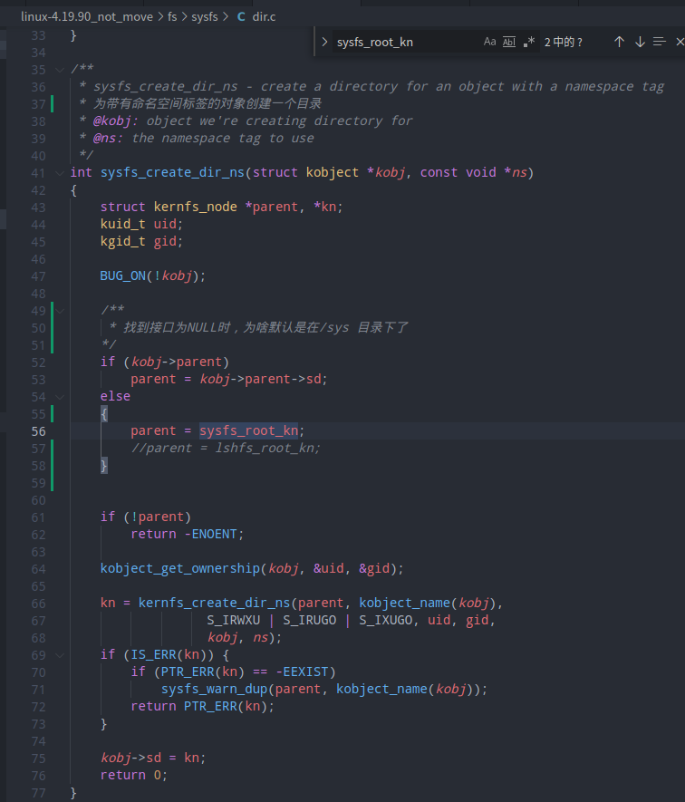
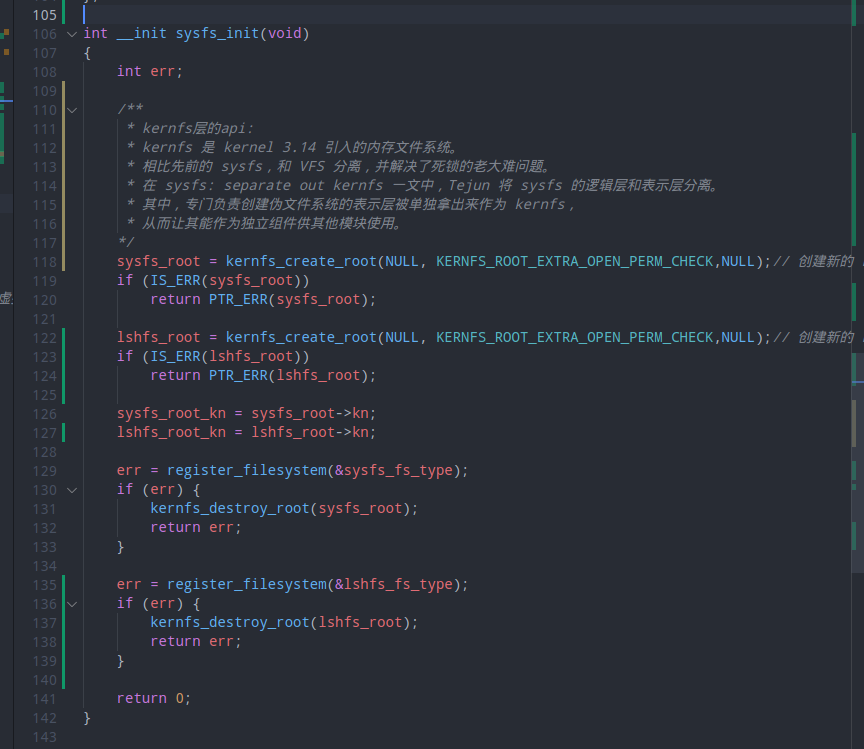
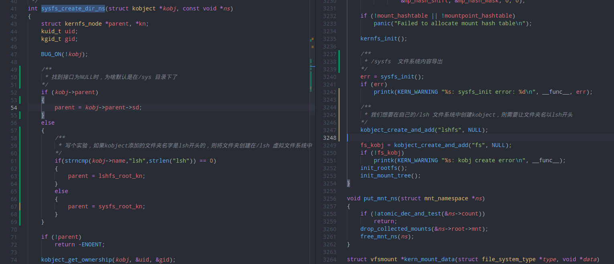
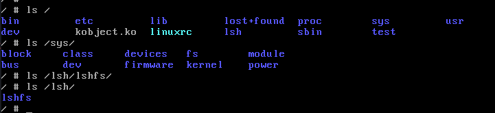

# linux源码分析-sysfs虚拟文件系统的生成

sysfs和kobject实现为两套独立的框架。

一个kobject在sysfs中表现为一个目录，属性在sysfs中表现为一个文件。

kernfs_node->priv指向kobject；

kobject->sd指向kernfs_node，这实现了kobject框架和sysfs的连接。

总的来说sysfs实现了文件/目录结构层次的管理；

kobject框架提供了底层文件/目录的操作方法。


## 从改内核源码让你了解sysfs虚拟文件系统

1.为啥kobject创建的时候默认在 /sys/ 文件夹下了。



需要增加自定义的虚拟文件系统:  lshfs , 和lshfs_root 根层





实验结果：




# 一些结构体


## file_system_type

```c
/*
*	file_systems:指向文件系统链表的第一个元素.
*	所有文件系统类型对象都插入到该链表中.
*/
static struct file_system_type *file_systems; 

struct file_system_type { 
    const char *name; 
    int fs_flags; 
    
    //用于从底层存储介质读取超级块的函数
    struct super_block *(*get_sb) (struct file_system_type *, int, 
                                   const char *, void *, struct vfsmount *); 
    void (*kill_sb) (struct super_block *); 
    struct module *owner; 
    struct file_system_type * next; 
    
    //同一文件系统类型可能对应了多个超级块结构，这些超级块聚集在一个链表中。fs_supers是对应的表头。
    struct list_head fs_supers; 
};
```


## file_system_type.fs_flags

FS_REQUIRES_DEV: 

​	文件系统必须在物理设备上。

FS_BINARY_MOUNTDATA: 

​	mount此文件系统时（参见mount_fs函数 - fs/super.c）需要使用二进制数据结构的mount data（如每个位域都有固定的位置和意义），常见的nfs使用这种mount data（参见struct nfs_mount_data结构 - include/uapi/linux/nfs_mount.h）。

FS_HAS_SUBTYPE: 

​	文件系统含有子类型，最常见的就是FUSE，FUSE本是不是真正的文件系统，所以要通过子文件系统类型来区别通过FUSE接口实现的不同文件系统。

FS_USERNS_MOUNT: 

​	文件系统每次挂载都后都是不同的user namespace，如用于devpts。

FS_USERNS_DEV_MOUNT: 

​	user namespace挂载支持MNT_DEV， 即非nodev模式。

FS_RENAME_DOES_D_MOVE: 

​	文件系统将把重命名操作reame()直接按照移动操作d_move()来处理，主要用于网络万件系统。


# vfs相关结构

哈希索引：

```c
dentry_hashtable: "Dentry cache"
    static struct hlist_bl_head *dentry_hashtable __read_mostly;
inode_hashtable: "Inode-cache"
    static struct hlist_head *inode_hashtable __read_mostly;
mount_hashtable: "Mount-cache"
    static struct hlist_head *mount_hashtable __read_mostly;
mountpoint_hashtable: "Mountpoint-cache"
    static struct hlist_head *mountpoint_hashtable __read_mostly;
```

链表结构：

```c
static struct kmem_cache *dentry_cache __read_mostly;

static struct kmem_cache *inode_cachep __read_mostly;

static struct kmem_cache *filp_cachep __read_mostly;

static struct kmem_cache *mnt_cache __read_mostly;
```

