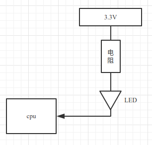
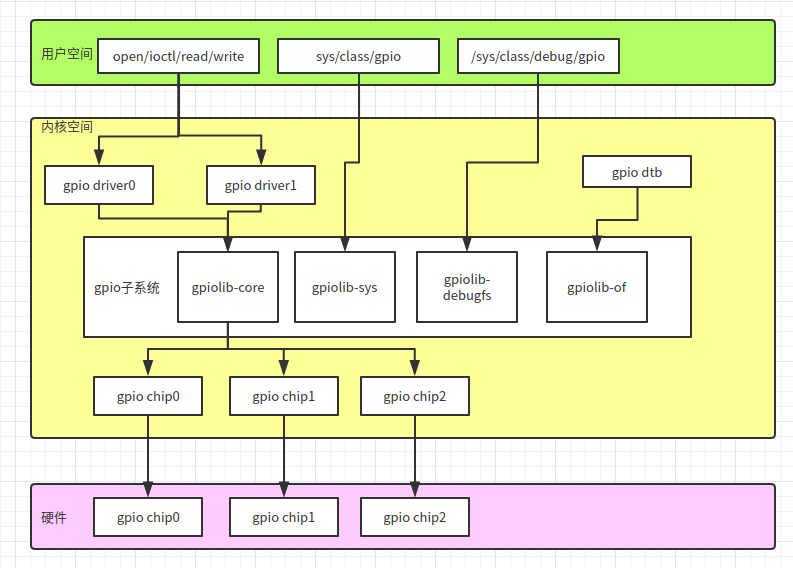

# Linux设备驱动程序

## 1.最简单的字符设备驱动

### 1.需要先创建设备节点

```sh
mknod /dev/xxx c 111 0
```

创建一个名字为xxx的字符设备， c表示字符设备，  主设备号是111， 此设备号是0。

### 2. 驱动程序

```c
#include <linux/fs.h>
#include <linux/init.h>
#include <linux/module.h>

static int first_drv_open(struct inode *inodep, struct file *filep)
{
    printk("open\n");
    return 0;
}

static ssize_t first_drv_write(struct file *filep, const char __user *buf,size_t len, loff_t *ppos)
{
    printk("write\n");
    return 0;
}

static const struct file_operations first_drv_file_operation = {
    .owner = THIS_MODULE,
    .open = first_drv_open,
    .write = first_drv_write,
};

static int __init first_drv_init(void)
{
    register_chrdev(111,"first_drv", &first_drv_file_operation);
    printk("first_drv_init\n");
    return 0;
}

static void __exit first_drv_exit(void)
{
    //注册字符设备 主设备号是111.从设备号因为我们驱动程序没指定所以，默认是0.
    unregister_chrdev(111,"first_drv_exit"); 
    printk("first_drv_exit\n");
}

module_init(first_drv_init);
module_exit(first_drv_exit);
MODULE_LICENSE("GPL");
```

### 3. 应用程序，调用驱动程序

```c
#include <stdio.h>
#include <sys/types.h>
#include <sys/stat.h>
#include <fcntl.h>
#include <unistd.h>

int main(void)
{
    char buf[10];
    /* 以可读可写方式打开/dev/目录下的xxx设备,open的返回值是一个文件描述符 */
    int fd = open("/dev/xxx", O_RDWR);    
    if(fd < 0)        /* 文件描述符小于0表示打开文件失败 */
    {   
        printf("open /dev/xxx fail\n");
        return -1; 
    }   
 
    /* 该文件中写入5个字节,写入的内容是buf中的前五个字节 */
    write(fd, buf, 5); 
    
    return 0;
}
```

### 4.测试效果

测试效果需要使用sudo dmesg来查看. 如下图所示:

## 2.

# =========

# USB驱动

usb设备基础概念：https://blog.csdn.net/zqixiao_09/article/details/50984074

## USB设备基础

USB设备是非常复杂的，它由许多不同的逻辑单元组成，这些逻辑单元之间的关系可以简单地描述如下：

1. 设备通常具有一个或者多个配置
2. 配置经常具有一个或者多个接口
3. 接口通常具有一个或者多个设置
4. 接口没有或者具有一个以上的端点


## USB鼠标驱动代码详解

```c
/*
 *  Copyright (c) 1999-2001 Vojtech Pavlik
 *
 *  USB HIDBP Mouse support
 */

/*
 * This program is free software; you can redistribute it and/or modify
 * it under the terms of the GNU General Public License as published by
 * the Free Software Foundation; either version 2 of the License, or
 * (at your option) any later version.
 *
 * This program is distributed in the hope that it will be useful,
 * but WITHOUT ANY WARRANTY; without even the implied warranty of
 * MERCHANTABILITY or FITNESS FOR A PARTICULAR PURPOSE.  See the
 * GNU General Public License for more details.
 *
 * You should have received a copy of the GNU General Public License
 * along with this program; if not, write to the Free Software
 * Foundation, Inc., 59 Temple Place, Suite 330, Boston, MA 02111-1307 USA
 *
 * Should you need to contact me, the author, you can do so either by
 * e-mail - mail your message to <vojtech@ucw.cz>, or by paper mail:
 * Vojtech Pavlik, Simunkova 1594, Prague 8, 182 00 Czech Republic
 */

#include <linux/kernel.h>
#include <linux/slab.h>
#include <linux/module.h>
#include <linux/init.h>
#include <linux/usb/input.h>
#include <linux/hid.h>

/* for apple IDs */
#ifdef CONFIG_USB_HID_MODULE
#include "../hid-ids.h"
#endif

/*
 * Version Information
 */
#define DRIVER_VERSION "v1.6"
#define DRIVER_AUTHOR "Vojtech Pavlik <vojtech@ucw.cz>"
#define DRIVER_DESC "USB HID Boot Protocol mouse driver"

MODULE_AUTHOR(DRIVER_AUTHOR);
MODULE_DESCRIPTION(DRIVER_DESC);
MODULE_LICENSE("GPL");

/*  
 * 鼠标结构体，用于描述鼠标设备。  
 */
struct usb_mouse {
	char name[128]; /* 鼠标设备的名称，包括生产厂商、产品类别、产品等信息 */
	char phys[64]; /* 设备节点名称 */
	struct usb_device *
		usbdev; /* USB 鼠标是一种 USB 设备，需要内嵌一个 USB 设备结构体来描述其 USB 属性 */
	struct input_dev *
		dev; /* USB 鼠标同时又是一种输入设备，需要内嵌一个输入设备结构体来描述其输入设备的属性 */
	struct urb *irq; /* URB 请求包结构体，用于传送数据 */

	signed char *data; /* 普通传输用的地址 */
	dma_addr_t data_dma; /* 普通传输用的地址 */
};
/*  
 * urb 回调函数，在完成提交 urb 后，urb 回调函数将被调用。  
 * 此函数作为 usb_fill_int_urb 函数的形参，为构建的 urb 制定的回调函数。  
 */
static void usb_mouse_irq(struct urb *urb)
{
	/*  
     * urb 中的 context 指针用于为 USB 驱动程序保存一些数据。比如在这个回调函数的形参没有传递在 probe中为 mouse 结构体分配的那块内存的地址指针，而又需要用到那块内存区域中的数据，context 指针则帮了大忙了！ 
     * 在填充 urb 时将 context 指针指向 mouse 结构体数据区，在这又创建一个局部 mouse 指针指向在 probe函数中为 mouse 申请的那块内存，那块内存保存着非常重要数据。 
     * 当 urb 通过 USB core 提交给 hc 之后，如果结果正常，mouse->data 指向的内存区域将保存着鼠标的按键和移动坐标信息，系统则依靠这些信息对鼠标的行为作出反应。  
     * mouse 中内嵌的 dev 指针，指向 input_dev 所属于的内存区域。 
     */
	struct usb_mouse *mouse = urb->context;
	signed char *data = mouse->data;
	struct input_dev *dev = mouse->dev;
	int status;
	/*  
     * status 值为 0 表示 urb 成功返回，直接跳出循环把鼠标事件报告给输入子系统。  

     * ECONNRESET 出错信息表示 urb 被 usb_unlink_urb 函数给 unlink 了，ENOENT 出错信息表示 urb 被usb_kill_urb 函数给 kill 了。usb_kill_urb 表示彻底结束 urb 的生命周期，而 usb_unlink_urb 则是停止 urb，这个函数不等 urb 完全终止就会返回给回调函数。这在运行中断处理程序时或者等待某自旋锁时非常有用，在这两种情况下是不能睡眠的，而等待一个 urb 完全停止很可能会出现睡眠的情况。 
     * ESHUTDOWN 这种错误表示 USB 主控制器驱动程序发生了严重的错误，或者提交完 urb 的一瞬间设备被拔出。 
     * 遇见除了以上三种错误以外的错误，将申请重传 urb。  
     */
	switch (urb->status) {
	case 0: /* success */
		break;
	case -ECONNRESET: /* unlink */
	case -ENOENT:
	case -ESHUTDOWN:
		return;
	/* -EPIPE:  should clear the halt */
	default: /* error */
		goto resubmit;
	}
	/*  
     * 向输入子系统汇报鼠标事件情况，以便作出反应。  
     * data 数组的第0个字节：bit 0、1、2、3、4分别代表左、右、中、SIDE、EXTRA键的按下情况；  
     * data 数组的第1个字节：表示鼠标的水平位移；  
     * data 数组的第2个字节：表示鼠标的垂直位移；  
     * data 数组的第3个字节：REL_WHEEL位移。  
     */
	input_report_key(dev, BTN_LEFT, data[0] & 0x01);
	input_report_key(dev, BTN_RIGHT, data[0] & 0x02);
	input_report_key(dev, BTN_MIDDLE, data[0] & 0x04);
	input_report_key(dev, BTN_SIDE, data[0] & 0x08);
	input_report_key(dev, BTN_EXTRA, data[0] & 0x10);

	input_report_rel(dev, REL_X, data[1]);
	input_report_rel(dev, REL_Y, data[2]);
	input_report_rel(dev, REL_WHEEL, data[3]);
	/*  
     * 这里是用于事件同步。上面几行是一次完整的鼠标事件，包括按键信息、绝对坐标信息和滚轮信息，输入子系统正是通过这个同步信号来在多个完整事件报告中区分每一次完整事件报告。示意如下： 
     * 按键信息 坐标位移信息 滚轮信息 EV_SYC | 按键信息 坐标位移信息 滚轮信息 EV_SYC ...  
     */
	input_sync(dev);
	/*  
     * 系统需要周期性不断地获取鼠标的事件信息，因此在 urb 回调函数的末尾再次提交 urb 请求块，这样又会  
     * 调用新的回调函数，周而复始。  
     * 在回调函数中提交 urb 一定只能是 GFP_ATOMIC 优先级的，因为 urb 回调函数运行于中断上下文中，在提交 urb 过程中可能会需要申请内存、保持信号量，这些操作或许会导致 USB core 睡眠，一切导致睡眠的行为都是不允许的。 
     */
resubmit:
	status = usb_submit_urb(urb,
				GFP_ATOMIC); //提交到USB核心，以发送到USB设备。
	if (status)
		dev_err(&mouse->usbdev->dev,
			"can't resubmit intr, %s-%s/input0, status %d\n",
			mouse->usbdev->bus->bus_name, mouse->usbdev->devpath,
			status);
}

/*  
 * 打开鼠标设备时，开始提交在 probe 函数中构建的 urb，进入 urb 周期。  
 */
static int usb_mouse_open(struct input_dev *dev)
{
	struct usb_mouse *mouse = input_get_drvdata(dev);

	mouse->irq->dev = mouse->usbdev;
	if (usb_submit_urb(mouse->irq, GFP_KERNEL))
		return -EIO;

	return 0;
}
/*  
 * 关闭鼠标设备时，结束 urb 生命周期。  
 */
static void usb_mouse_close(struct input_dev *dev)
{
	struct usb_mouse *mouse = input_get_drvdata(dev);

	usb_kill_urb(mouse->irq);
}
/*  
 * 驱动程序的探测函数  
 */
static int usb_mouse_probe(struct usb_interface *intf,
			   const struct usb_device_id *id)
{
	/*   
     * 接口结构体包含于设备结构体中，interface_to_usbdev 是通过接口结构体获得它的设备结构体。 
     * usb_host_interface 是用于描述接口设置的结构体，内嵌在接口结构体 usb_interface 中。  
     * usb_endpoint_descriptor 是端点描述符结构体，内嵌在端点结构体 usb_host_endpoint 中，而端点结构体内嵌在接口设置结构体中。 
     */
	struct usb_device *dev =
		interface_to_usbdev(intf); //根据usb接口获取动态创建的usb_device
	struct usb_host_interface *interface;
	struct usb_endpoint_descriptor *endpoint;
	struct usb_mouse *mouse;
	struct input_dev *input_dev;
	int pipe, maxp;
	int error = -ENOMEM;

	interface = intf->cur_altsetting;
	/* 鼠标仅有一个 interrupt 类型的 in 端点，不满足此要求的设备均报错 */
	if (interface->desc.bNumEndpoints != 1)
		return -ENODEV;

	endpoint = &interface->endpoint[0].desc;
	if (!usb_endpoint_is_int_in(endpoint))
		return -ENODEV;
	/*  
     * 返回对应端点能够传输的最大的数据包，鼠标的返回的最大数据包为4个字节，数据包具体内容在 urb  
     * 回调函数中有详细说明。  
     */
	pipe = usb_rcvintpipe(dev, endpoint->bEndpointAddress);
	/* 
	 * bEndpointAddress这是这个特定端点的 USB 地址. 还包含在这个 8-位 值的是端点的方向. 位掩码 USB_DIR_OUT 和 USB_DIR_IN 可用来和这个成员比对, 
	 * 来决定给这个端点的数据是到设备还是到主机.
	 * pipe,要访问的端点所对应的管道，使用usb_sndintpipe()或usb_rcvintpipe()创建
	 */
	maxp = usb_maxpacket(dev, pipe, usb_pipeout(pipe));
	/* 为 mouse 设备结构体分配内存 */
	mouse = kzalloc(sizeof(struct usb_mouse), GFP_KERNEL);
	input_dev = input_allocate_device();
	if (!mouse || !input_dev)
		goto fail1;
	/*  
     * 申请内存空间用于数据传输，data 为指向该空间的地址，data_dma 则是这块内存空间的 dma 映射，即这块内存空间对应的 dma 地址。
	 * 在使用 dma 传输的情况下，则使用 data_dma 指向的 dma 区域，否则使用 data 指向的普通内存区域进行传输。 
	 * GFP_ATOMIC 表示不等待，GFP_KERNEL 是普通的优先级，可以睡眠等待，由于鼠标使用中断传输方式，不允许睡眠状态，
	 * data 又是周期性获取鼠标事件的存储区，因此使用 GFP_ATOMIC 优先级，如果不能分配到内存则立即返回 0。 
     */
	mouse->data = usb_alloc_coherent(dev, 8, GFP_ATOMIC, &mouse->data_dma);
	if (!mouse->data)
		goto fail1;
	/*  
     * 为 urb 结构体申请内存空间，第一个参数表示等时传输时需要传送包的数量，其它传输方式则为0。申请的内存将通过下面即将见到的 usb_fill_int_urb 函数进行填充。
	 */
	mouse->irq = usb_alloc_urb(0, GFP_KERNEL);
	if (!mouse->irq)
		goto fail2;
	/* 填充 usb 设备结构体和输入设备结构体 */
	mouse->usbdev = dev;
	mouse->dev = input_dev;
	/* 获取鼠标设备的名称 */
	if (dev->manufacturer)
		strlcpy(mouse->name, dev->manufacturer, sizeof(mouse->name));

	if (dev->product) {
		if (dev->manufacturer)
			strlcat(mouse->name, " ", sizeof(mouse->name));
		strlcat(mouse->name, dev->product, sizeof(mouse->name));
	}

	if (!strlen(mouse->name))
		snprintf(mouse->name, sizeof(mouse->name),
			 "USB HIDBP Mouse %04x:%04x",
			 le16_to_cpu(dev->descriptor.idVendor),
			 le16_to_cpu(dev->descriptor.idProduct));
	/*  
     * 填充鼠标设备结构体中的节点名。usb_make_path 用来获取 USB 设备在 Sysfs 中的路径，格式  
     * 为：usb-usb 总线号-路径名。  
     */
	usb_make_path(dev, mouse->phys, sizeof(mouse->phys));
	strlcat(mouse->phys, "/input0", sizeof(mouse->phys));
	/* 将鼠标设备的名称赋给鼠标设备内嵌的输入子系统结构体 */
	input_dev->name = mouse->name;
	/* 将鼠标设备的设备节点名赋给鼠标设备内嵌的输入子系统结构体 */
	input_dev->phys = mouse->phys;
	/*  
     * input_dev 中的 input_id 结构体，用来存储厂商、设备类型和设备的编号，这个函数是将设备描述符中的编号赋给内嵌的输入子系统结构体  
     */
	usb_to_input_id(dev, &input_dev->id);
	/* cdev 是设备所属类别（class device） */
	input_dev->dev.parent = &intf->dev;

	/* evbit 用来描述事件，EV_KEY 是按键事件，EV_REL 是相对坐标事件 */
	input_dev->evbit[0] = BIT_MASK(EV_KEY) | BIT_MASK(EV_REL);
	/* keybit 表示键值，包括左键、右键和中键 */
	input_dev->keybit[BIT_WORD(BTN_MOUSE)] =
		BIT_MASK(BTN_LEFT) | BIT_MASK(BTN_RIGHT) | BIT_MASK(BTN_MIDDLE);
	/* relbit 用于表示相对坐标值 */
	input_dev->relbit[0] = BIT_MASK(REL_X) | BIT_MASK(REL_Y);
	/* 有的鼠标还有其它按键 */
	input_dev->keybit[BIT_WORD(BTN_MOUSE)] |=
		BIT_MASK(BTN_SIDE) | BIT_MASK(BTN_EXTRA);
	/* 中键滚轮的滚动值 */
	input_dev->relbit[0] |= BIT_MASK(REL_WHEEL);

	input_set_drvdata(input_dev, mouse);

	input_dev->open = usb_mouse_open;
	input_dev->close = usb_mouse_close;
	/*  
     * 填充构建 urb，将刚才填充好的 mouse 结构体的数据填充进 urb 结构体中，在 open 中递交 urb。  
     * 当 urb 包含一个即将传输的 DMA 缓冲区时应该设置URB_NO_TRANSFER_DMA_MAP。USB核心使用  
     * transfer_dma变量所指向的缓冲区，而不是transfer_buffer变量所指向的。  
     * URB_NO_SETUP_DMA_MAP 用于 Setup 包，URB_NO_TRANSFER_DMA_MAP 用于所有 Data 包。  
     */
	usb_fill_int_urb(mouse->irq, dev, pipe, mouse->data,
			 (maxp > 8 ? 8 : maxp), usb_mouse_irq, mouse,
			 endpoint->bInterval);
	mouse->irq->transfer_dma = mouse->data_dma;
	mouse->irq->transfer_flags |= URB_NO_TRANSFER_DMA_MAP;
	/* 向系统注册输入设备 */
	error = input_register_device(mouse->dev);
	if (error)
		goto fail3;
	/*  
     * 一般在 probe 函数中，都需要将设备相关信息保存在一个 usb_interface 结构体中，以便以后通过  
     * usb_get_intfdata 获取使用。这里鼠标设备结构体信息将保存在 intf 接口结构体内嵌的设备结构体中的 driver_data 数据成员中，即 intf->dev->dirver_data = mouse。
	 */
	usb_set_intfdata(intf, mouse);
	return 0;

fail3:
	usb_free_urb(mouse->irq);
fail2:
	usb_free_coherent(dev, 8, mouse->data, mouse->data_dma);
fail1:
	input_free_device(input_dev);
	kfree(mouse);
	return error;
}

/*  
 * 鼠标设备拔出时的处理函数  
 */ 
static void usb_mouse_disconnect(struct usb_interface *intf)
{
	/* 获取鼠标设备结构体 */ 
	struct usb_mouse *mouse = usb_get_intfdata(intf);
	/* intf->dev->dirver_data = NULL，将接口结构体中的鼠标设备指针置空。*/
	usb_set_intfdata(intf, NULL);
	if (mouse) {
		/* 结束 urb 生命周期 */
		usb_kill_urb(mouse->irq);
		/* 将鼠标设备从输入子系统中注销 */  
		input_unregister_device(mouse->dev);
		/* 释放 urb 存储空间 */ 
		usb_free_urb(mouse->irq);
		/* 释放存放鼠标事件的 data 存储空间 */
		usb_free_coherent(interface_to_usbdev(intf), 8, mouse->data,
				  mouse->data_dma);
		/* 释放存放鼠标结构体的存储空间 */ 
		kfree(mouse);
	}
}
/*  
 * usb_device_id 结构体用于表示该驱动程序所支持的设备，USB_INTERFACE_INFO 可以用来匹配特定类型的接口， 
 * 这个宏的参数意思为 (类别, 子类别, 协议)。  
 * USB_INTERFACE_CLASS_HID 表示是一种 HID (Human Interface Device)，即人机交互设备类别； 
 * USB_INTERFACE_SUBCLASS_BOOT 是子类别，表示是一种 boot 阶段使用的 HID； 
 * USB_INTERFACE_PROTOCOL_MOUSE 表示是鼠标设备，遵循鼠标的协议。 
 */
/**
    #define USB_INTERFACE_INFO(cl,sc,pr)\
            match_flags = USB_DEVICE_ID_MATCH_DEV_INFO,\
            bDeviceClass = (cl),\  //设备的类型
            bDeviceSubclass = (src),\//设备的子类型
            bDeviceProtocol = (pr)//设备使用的协议
    这个宏用来创建要给struct usb_device_id结构体，这个结构体存储了设备的类型和协议信息     
*/
static const struct usb_device_id usb_mouse_id_table[] = {
	//设备的类型是 人机交互类设备，子类型是一种boot设备 ，遵循鼠标协议
	{ USB_INTERFACE_INFO(USB_INTERFACE_CLASS_HID,
			     USB_INTERFACE_SUBCLASS_BOOT,
			     USB_INTERFACE_PROTOCOL_MOUSE) },
	{} /* Terminating entry */
};
/*  
 * 这个宏用来让运行在用户空间的程序知道这个驱动程序能够支持的设备，对于 USB 驱动程序来说，第一个参数必须  
 * 是 usb。  
 */ 
MODULE_DEVICE_TABLE(usb, usb_mouse_id_table);

/*  
 * 鼠标驱动程序结构体  
 */
//匹配成功后会调用驱动提供的probe函数
static struct usb_driver usb_mouse_driver = {
	.name = "usbmouse",
	.probe = usb_mouse_probe,
	.disconnect = usb_mouse_disconnect,
	.id_table = usb_mouse_id_table,
};

module_usb_driver(usb_mouse_driver);
```


# 块设备驱动程序

## 注册

### 1.注册块设备驱动

```c
//注册块设备驱动程序: 
int register_blkdev(unsigned int major, const char *name);
//major: 该设备使用的主设备号.  为0时,内核分派一个新的主设备号给设备,并返回.   <0:报错
//name:	该设备使用的名字.   内核在/proc/devices中显示名字.


//注销块设备驱动程序:
int unregister_blkdev(unsigned int major, const char *name);
//参数必须和注册时相匹配.  否则返回:-EINVAL
```

### 2.注册磁盘

* 注册磁盘时需要的数据结构

**块设备操作**

使用block_device_operations结构告诉系统对他们的操作接口.

成员有:

```c
//设备被打开或者关闭时调用.
int (*open)(struct inode *inode, struct file *filp);
int (*release)(struct inode *inode, struct file *filp);

//实现ioctl系统调用的函数.
int (*ioctl)(struct inode *inode, struct file *filp, unsigned int cmd, unsigned long arg);

//检查用户是否更换了驱动器内的介质. 非零值:更换了.  只适用于可移动介质.其他情况,忽略该函数
int (*media_changed)(struct gendisk *gd);
    
//介质被更换时,调用该函数做出响应,它告诉驱动程序完成必要的工作,以便适用新的介质.  返回值被忽略.
int (*revalidate_disk)(struct gendisk *gd);

//一个指向拥有该结构体的模块指针,通常初始化为THIS_MODULE
struct module *owner;
```

块设备驱动没有read和write函数,都是由request函数处理的.


**gendisk结构:**

内核适用该结构来表示一个独立的磁盘设备.

还用来表示分区.

该结构中的许多成员必须由驱动程序进行初始化.

```c
struct gendisk {
	/* major, first_minor and minors are input parameters only,
	 * don't use directly.  Use disk_devt() and disk_max_parts().
	 */
	int major;			/* major number of driver */
	int first_minor;
	int minors;                     /* maximum number of minors, =1 for
                                         * disks that can't be partitioned. */

	char disk_name[DISK_NAME_LEN];	/* name of major driver */
	char *(*devnode)(struct gendisk *gd, umode_t *mode);

	unsigned int events;		/* supported events */
	unsigned int async_events;	/* async events, subset of all */

	/* Array of pointers to partitions indexed by partno.
	 * Protected with matching bdev lock but stat and other
	 * non-critical accesses use RCU.  Always access through
	 * helpers.
	 */
	struct disk_part_tbl __rcu *part_tbl;
	struct hd_struct part0;

	const struct block_device_operations *fops;
	struct request_queue *queue;
	void *private_data;

	int flags;
	struct rw_semaphore lookup_sem;
	struct kobject *slave_dir;

	struct timer_rand_state *random;
	atomic_t sync_io;		/* RAID */
	struct disk_events *ev;
#ifdef  CONFIG_BLK_DEV_INTEGRITY
	struct kobject integrity_kobj;
#endif	/* CONFIG_BLK_DEV_INTEGRITY */
	int node_id;
	struct badblocks *bb;
	struct lockdep_map lockdep_map;
};
```

gendisk是动态分配的结构. 需要特殊处理进行初始化, 驱动程序不能自己动态分配该结构.必须调用

```c
struct gendisk *alloc_disk(int minors);
//minors: 是该磁盘使用的此设备号的数目.

//卸载磁盘
void del_gendisk(struct gendisk *gd);
```

gendisk是一个引用计数结构.所有卸载时并不是直接删除该结构,只有等计数为0时,卸载才会删除.

分配一个gendisk结构并不能使磁盘对系统可用. 必须初始化结构并调用add_disk();

```c
void add_disk(struct gendisk *gd);
```


##　sbull中的初始化


## 请求处理

内核需要驱动程序处理读取、写入、其他对设备的操作时，就会调用请求处理函数。

它只是启动对请求的响应。

每个设备都有一个请求队列。 内核会安排在适当的时刻（把相邻磁盘扇区的请求放在一组）然后传输。


#### request结构

```c
//request结构
```

一个request结构代表一个块设备的I/O请求。


# =========

# GPIO子系统

General-purpose input/output 

通用型之输入输出的简称.

​	gpio子系统帮助我们管理整个系统gpio的使用情况，同时通过sys文件系统导出了调试信息和应用层控制接口。它内部实现主要提供了两类接口，一类给bsp工程师，用于注册gpio_chip（也就是所谓的gpio控制器驱动），另一部分给驱动工程师使用，为驱动工程师屏蔽了不同gpio chip之间的区别，驱动工程师调用的api的最终操作流程会导向gpio对应的gpio chip的控制代码，也就是bsp的代码。

​	本文重点介绍gpio驱动.

​	功能类似8051的P0—P3，其接脚可以供[使用者](https://baike.baidu.com/item/使用者/1162412)由程控自由使用，PIN脚依现实考量可作为通用输入（*GPI*）或通用输出（*GPO*）或通用输入与输出（*GPIO*），如当clk generator, chip select等。

​	既然一个[引脚](https://baike.baidu.com/item/引脚/10879873)可以用于输入、输出或其他特殊功能，那么一定有[寄存器](https://baike.baidu.com/item/寄存器/187682)用来选择这些功能。

​	对于输入，一定可以通过读取某个寄存器来确定引脚电位的高低；

​	对于输出，一定可以通过写入某个寄存器来让这个引脚输出高电位或者低电位；

​	对于其他特殊功能，则有另外的寄存器来控制它们。

## 介绍

### 什么是GPIO？

​	(GPIO) 是一种灵活的软件控制数字信号。它们由多种芯片提供，对于使用嵌入式和定制硬件的 Linux 开发人员来说是熟悉的。每个 GPIO 代表一个连接到特定引脚或球栅阵列 (BGA) 封装上的“球”的位。电路板原理图显示哪些外部硬件连接到哪些 GPIO。可以通用地编写驱动程序，以便电路板设置代码将此类引脚配置数据传递给驱动程序。


片上系统（SOC）处理器严重依赖GPIO。

在某些情况下,非专用引脚可配置为GPIO；

大多数芯片至少有几十个。

可编程逻辑器件（如FPGA）可以轻松提供GPIO；

多功能芯片，如电源管理器和音频编解码器通常有几个这样的引脚来帮助解决SOC上引脚不足的问题；

还有“GPIO扩展器”芯片，使用I2C或SPI串行总线连接。

大多数PC机都有几十个支持GPIO的引脚（只有BIOS固件知道如何使用它们）。


GPIO 的确切功能因系统而异。常用选项：

> - 输出值是可写的（高=1，低=0）。一些芯片还可以选择如何驱动该值.
> - 输入值同样是可读的 (1, 0)。一些芯片支持配置为“输出”的引脚回读，这在这种“线或”情况下非常有用（以支持双向信号）。GPIO 控制器可能具有输入去毛刺/去抖动逻辑，有时带有软件控制。
> - 输入通常可以用作 IRQ 信号，通常是边沿触发，但有时是电平触发。此类 IRQ 可配置为系统唤醒事件，以将系统从低功率状态唤醒。
> - 通常，GPIO 可根据不同产品板的需要配置为输入或输出；单向的也存在。
> - 大多数 GPIO 可以在持有自旋锁时访问，但通过串行总线访问的那些通常不能。一些系统支持这两种类型。


​	在给定的板上，每个GPIO都用于一个特定的目的，如监视MMC/SD卡插入/拔出，检测卡写保护状态，驱动

一个LED，配置一个收发机，敲打一个串行总线，戳一个硬件看门狗，感应开关，等等。

### 高电平有效和低电平有效

假设GPIO 在其输出信号为 1（“高”）时为“活动”，而在为 0（“低”）时为非活动。

具体要看设备树怎么来设定.

这个根据具体的芯片和外设之间的电路链接.



由图所示,cpu链接led和上拉电阻.  

则cpu的gpio口为低电平时,led亮,则表明该gpio口低电平有效.


例如:	该gpio控制的为led的亮灭.

gpiod_set_value() 设置的值是逻辑值而非电平值，1 表示使能，0 表示不使能

| Function                  | line property | physical line |
| ------------------------- | ------------- | ------------- |
| gpiod_set_value(desc, 0); | active high   | low           |
| gpiod_set_value(desc, 1); | active high   | high          |
| gpiod_set_value(desc, 0); | active low    | high          |
| gpiod_set_value(desc, 1); | active low    | low           |

表中所示,设备树中设置为high时有效,驱动调用gpiod_set_value(desc, 0)意思为该引脚不使能,则Led为灭.

### 优缺点

低功耗：GPIO具有更低的功率损耗(大约1μA，μC的工作电流则为100μA)。

集成IIC从机接口：GPIO内置IIC从机接口，即使在待机模式下也能够全速工作。

小封装：GPIO器件提供最小的封装尺寸 ― 3mm x 3mm QFN!

低成本：您不用为没有使用的功能买单。

快速上市：不需要编写额外的代码、文档，不需要任何维护工作。

灵活的灯光控制：内置多路高分辨率的PWM输出。

可预先确定响应时间：缩短或确定外部事件与中断之间的响应时间。

更好的灯光效果：匹配的电流输出确保均匀的显示亮度。

布线简单：仅需使用2条就可以组成IIC总线或3条组成SPI总线。

与ARM 的几组GPIO[引脚](https://baike.baidu.com/item/引脚)，功能相似，GPxCON 控制引脚功能，GPxDAT用于读写引脚数据。另外，GPxUP用于确定是否使用上拉电阻。 x为A,B,,H/J,

GPAUP 没有上拉电阻。


### x86平台gpio注意事项
调X86平台GPIO的时候，先看清是Super IO (SIO)的GPIO，还是南桥（PCH）的GPIO
它们可能重名，比如都叫GP20
 这些GPIO都是通过打开/dev/port设备来操作，只不过操作的地址不同
 原理图上，PCH(南桥)的GPIO一般表示为PCH_GPIOxxx
 南桥GPIO调时看文档看Intel的datasheet
 而SIO的芯片一般是winbond的，看这个文档调试


## gpio驱动和gpio chip驱动



正常情况下，驱动工程师不需要了解 gpio chip driver 和 gpiolib：

- 驱动工程师负责编写 gpio drvier;
- 芯片厂商的 bsp 工程师负责编写 gpio chip driver;
- 开源社区里的人负责 gpiolib 的核心实现;


## Sysfs Interface for Userspace

用户空间的 Sysfs 接口.

gpio_operation 通过 /sys/ 文件接口操作 IO 端口 GPIO 到文件系统的映射。
控制 GPIO 的目录位于 /sys/class/gpio。
/sys/class/gpio/export 文件用于通知系统需要导出控制的 GPIO 引脚编号。
/sys/class/gpio/unexport 用于通知系统取消导出。
/sys/class/gpio/gpiochipX 目录保存系统中 GPIO 寄存器的信息，包括每个寄存器控制引脚的起始编号 base，寄存器名称，引脚总数


若要操作某个gpio,则需要参考数据手册.

以编号19为例:
1.向文件 /sys/class/gpio/export 写入引脚编号，即可激活引脚。
命令执行成功后，目录下，便会出现 gpio18 文件夹，如果没有出现，则表示引脚不可导出。
```shell
echo 19 > /sys/class/gpio/export
```
2.引脚导出成功后，即可通过写入 /sys/class/gpio/gpio19/direction 控制引脚 [输入] 或 [输出]。
```shell
echo "out" > direction

#in		引脚输入信号
#out		输出控制到引脚
#high 	输出一个高电平（`value`:`1`）
#low 	输出一个低电平（`value`:`0`）
```

3.输入输出的值，通过 gpioX 下的 value 文件控制

当为输入时，请 echo /sys/class/gpio/gpio18/value 读出值；
当为输出时，请 echo 1 > /sys/class/gpio/gpio18/value 输入值；

这里 value 的值对应着，上面的 high 和 low 时的 1 / 0

4.取消导出

```shell
echo 19 > /sys/class/gpio/unexport
```


## GPIO implementor’s framework 

GPIO 实现者的框架

要启用此框架，平台的 Kconfig 将“选择”GPIOLIB，否则由用户配置对 GPIO 的支持。

作用：

- 向下为 gpio chip driver 提供注册 struct gpio_chip 的接口：gpiochip_xxx();
- 向上为 gpio consumer 提供引用 gpio 的接口：gpiod_xxx();
- 实现字符设备的功能;
- 注册 sysfs;

目前 gpio subsystem 提供了 2 套接口:
**legacy API：**

​	integer-based GPIO interface，形式为 gpio_xxx()，例如 void gpio_set_value(unsigned gpio, int value);

**推荐 API:** 

​	descriptor-based GPIO interface，形式为 gpiod_xxx()，例如 void gpiod_set_value(struct gpio_desc *desc, int value)，新添加的驱动代码一律采用这套 API。

### Now GPIO Interfaces

全部接口非常多,在内核代码include/linux/gpio/consumer.h文件中.

常用api为:

```c
//获得/释放 一个或者一组 gpio：
[devm]_gpiod_get*()
[devm]_gpiod_put*()
//设置/查询 输入或者输出
gpiod_direction_input()
gpiod_direction_output()
gpiod_get_direction()
//读写一个 gpio
gpiod_get_value()
gpiod_set_value()
gpiod_get_value_cansleep()
gpiod_set_value_cansleep()
//读写一组 gpio
gpiod_get_array_value()
gpiod_set_array_value()
//获得 gpio 对应的中断号
gpiod_to_irq()
```


代码示例:

```c
static struct gpio_desc *red, *green, *btn1, *btn2;
static int irq;

static irqreturn_t btn1_pushed_irq_handler(int irq, void *dev_id)
{
    int state;

    /* read the button value and change the led state */
    state = gpiod_get_value(btn2);
    gpiod_set_value(red, state);
    gpiod_set_value(green, state);

    pr_info("btn1 interrupt: Interrupt! btn2 state is %d)\n", state);
    return IRQ_HANDLED;
}

static const struct of_device_id gpiod_dt_ids[] = {
    { .compatible = "gpio-descriptor-sample", },
};


static int my_pdrv_probe(struct platform_device *pdev)
{
    int retval;
    struct device *dev = &pdev->dev;

    // 获得 gpio descriptor 的同时也将其设置为 output，并且输出低电平
    red = gpiod_get_index(dev, "led", 0, GPIOD_OUT_LOW);
    green = gpiod_get_index(dev, "led", 1, GPIOD_OUT_LOW);
    
    btn1 = gpiod_get(dev, "btn1", GPIOD_IN);
    btn2 = gpiod_get(dev, "btn2", GPIOD_IN);

    // 获得中断号
    irq = gpiod_to_irq(btn1);

    // 申请中断
    retval = request_threaded_irq(irq, NULL,
                            btn1_pushed_irq_handler,
                            IRQF_TRIGGER_LOW | IRQF_ONESHOT,
                            "gpio-descriptor-sample", NULL);
    pr_info("Hello! device probed!\n");
    return 0;
}

static int my_pdrv_remove(struct platform_device *pdev)
{
    free_irq(irq, NULL);

    // 释放 gpio
    gpiod_put(red);
    gpiod_put(green);
    gpiod_put(btn1);
    gpiod_put(btn2);
    pr_info("good bye reader!\n");
    return 0;
}

static struct platform_driver mypdrv = {
    .probe      = my_pdrv_probe,
    .remove     = my_pdrv_remove,
    .driver     = {
        .name     = "gpio_descriptor_sample",
        .of_match_table = of_match_ptr(gpiod_dt_ids),  
        .owner    = THIS_MODULE,
    },
};
module_platform_driver(mypdrv);
```


### Legacy GPIO Interfaces

常用api:

```c
gpio_request(gpioNum,gpioName)
//申请一个空闲的GPIO

gpio_free(gpioNum)
//释放申请到的GPIO

gpio_direction_input(gpioNum)
//设置GPIO为输入模式

gpio_direction_output(gpioNum,value)
//设置GPIO为输出模式+值

gpio_get_value(gpioNum)
//获取GPIO的电平值

gpio_set_value(gpioNum,value)
//设置GPIO输出电平值

gpio_to_irq(gpioNum)
//返回GPIO对应的中断号

irq_to_gpio(irq)
//返回irq对应的GPIO号
```

代码示例:

```c
#include <linux/init.h>  
#include <linux/module.h>  
#include <asm/uaccess.h>  
#include <linux/fs.h>  
#include <linux/errno.h>  
#include <linux/gpio.h>  
//#include <linux/sys_config.h>  
#include <linux/miscdevice.h>  
  
  
#define IGPIO_DEVICE_NAME       "igpioDrv"  
#define IGPIO_IOCTL_MAGIC       0XF12  
#define IGPIO_IOCTL_RESET       _IO(IGPIO_IOCTL_MAGIC, 0x0)  
#define IGPIO_IOCTL_SET         _IO(IGPIO_IOCTL_MAGIC, 0x1)  
static DEFINE_MUTEX(igpio_ioctlmutex);          /* 声明并初始化互斥锁 */  
static int gpioNumer = 0;                       /*用以保存申请到的io*/  
  
static int igpio_open(struct inode *node, struct file *filp)  
{  
    return 0;  
}  
  
static long igpio_ioctl(struct file *filp, unsigned int cmd, unsigned long gpioNum)  
{  
    int nRet = 0;  
  
    printk(KERN_EMERG "cmd= %d,gpioNum= %d\n",cmd,gpioNum);  
    mutex_lock(&igpio_ioctlmutex);  
    if(gpioNumer != gpioNum)  
    {     
        nRet = gpio_request(gpioNum, NULL);  
        if(nRet){  
            printk(KERN_EMERG "%d gpio_request failed\n", gpioNum);  
            nRet = -EINVAL;  
            goto iExit;  
        }  
  
        gpio_free(gpioNumer); //如果申请了新的那就释放掉旧的  
        gpioNumer = gpioNum;  
    }  
      
    switch(cmd){  
        case IGPIO_IOCTL_RESET:  
            gpio_direction_output(gpioNumer,0x00);  
            break;  
        case IGPIO_IOCTL_SET:  
            gpio_direction_output(gpioNumer,0x01);  
            break;  
        default:  
        nRet = -EINVAL;  
    }  
      
iExit:  
  
    mutex_unlock(&igpio_ioctlmutex);  
    return nRet;  
}  
  
static const struct file_operations gpio_fops ={  
    .owner  = THIS_MODULE,  
    .open   = igpio_open,  
    .unlocked_ioctl = igpio_ioctl,  
};  
  
static struct miscdevice gpioMiscDevSt ={  
    .minor = MISC_DYNAMIC_MINOR,  
    .name  = IGPIO_DEVICE_NAME,  
    .fops  = &gpio_fops,  
};  
  
static int __init gpioDrv_init(void)  
{  
    int nRet = 0;  
    /*注册设备*/  
    nRet = misc_register(&gpioMiscDevSt);  
    printk(KERN_EMERG "%s misc_deregister nRet=%d \n",__FUNCTION__,nRet);
  
    return nRet;  
}  
  
static void __exit gpioDrv_exit(void)  
{  
    int nRet = -1;  
  
    gpio_free(gpioNumer);
    //nRet = misc_deregister(&gpioMiscDevSt);  
    // if(nRet<0)  
    //     printk(KERN_EMERG "%s misc_deregister failed\n",__FUNCTION__);  
    misc_deregister(&gpioMiscDevSt);  
}  
  
module_init(gpioDrv_init);  
module_exit(gpioDrv_exit);  
MODULE_LICENSE("GPL");  
```


# ==========

# platform子系统

## 什么是platform总线？

platform总线是一种虚拟、抽象出来的总线，实际中并不存在这样的总线。

是Linux设备驱动模型为了保持设备驱动的统一性而虚拟出来的总线。

因为对于usb设备、i2c设备、pci设备、spi设备等等，他们与cpu的通信都是直接挂在相应的总线下面与我们的cpu进行数据交互的，但是在我们的嵌入式系统当中，并不是所有的设备都能够归属于这些常见的总线，在嵌入式系统里面，SoC系统中集成的独立的外设控制器、挂接在SoC内存空间的外设却不依附与此类总线。所以Linux驱动模型为了保持完整性，将这些设备挂在一条虚拟的总线上（platform总线），而不至于使得有些设备挂在总线上，另一些设备没有挂在总线上。


## platform device

平台设备是通常在系统中显示为实体的设备.

这包括传统的基于端口的设备和到外围总线的主桥，以及集成到片上系统平台的大多数控制器。它们通常的共同点是从 CPU 总线直接寻址。极少情况下，platform_device将通过某种其他类型的总线连接；但它的寄存器仍然可以直接寻址。

为平台设备指定一个名称（用于驱动程序绑定）和一个资源列表（如地址和IRQ）：

用如下结构表示一个设备：

```c
struct platform_device {
      const char      *name;// 平台总线下设备的名字
      u32             id;
      struct device   dev;	// 所有设备通用的属性部分
      u32             num_resources; // 设备使用到的resource的个数
      struct resource *resource;// 设备使用到的资源数组的首地址
};

//设备资源信息
struct resource {
    resource_size_t start; //资源起始地址
    resource_size_t end;   //资源结束地址
    const char *name;
    unsigned long flags;    //资源类型
    struct resource *parent, *sibling, *child;
};
```


## platform driver

​	平台驱动程序遵循标准驱动程序模型约定。

​	我们只需要关注总线，设备和驱动这三个实体，总线将设备和驱动绑定。

​	系统每注册一个设备的时候，会寻找与之匹配的驱动；相反，系统每注册一个驱动的时候，会寻找与之匹配的设备，而匹配则由总线完成。

```c
struct platform_driver {
      int (*probe)(struct platform_device *);
      int (*remove)(struct platform_device *);
      void (*shutdown)(struct platform_device *);
      int (*suspend)(struct platform_device *, pm_message_t state);
      int (*suspend_late)(struct platform_device *, pm_message_t state);
      int (*resume_early)(struct platform_device *);
      int (*resume)(struct platform_device *);
      struct device_driver driver;
};
```

一般来说，probe（）应该验证指定的设备硬件是否实际存在。


## driver和device的匹配过程

第一步：系统启动时在bus系统中注册platform
第二步：提供platform_device
第三步：提供platform_driver
第四步：platform的match函数发现driver和device匹配后，调用driver的probe函数来完成驱动的初始化和安装，然后设备就工作起来了


## 常用接口

```c
//platform driver注册
int platform_driver_register(struct platform_driver *drv);

//在已知设备不可热插拔的常见情况下，probe（）例程可以存在于init部分中，以减少驱动程序的运行时内存占用
int platform_driver_probe(struct platform_driver *drv,
                  int (*probe)(struct platform_device *));
    
//内核模块可以由多个平台驱动程序组成。平台核心提供了用于注册和注销一组驱动程序的接口
//如果其中一个driver未能注册，则在此之前注册的所有driver将以相反的顺序取消注册。
int __platform_register_drivers(struct platform_driver * const *drivers,
                              unsigned int count, struct module *owner);
void platform_unregister_drivers(struct platform_driver * const *drivers,
                                 unsigned int count);


//platform device注册
int platform_device_register(struct platform_device *pdev);

int platform_add_devices(struct platform_device **pdevs, int ndev);
```


## 驱动架构

```c
int hello_probe(struct platform_device *pdev)
{  
     //当platform_device 和platform_driver 匹配成功之后，才会调用probe，
     1. 申请设备号
     2. cdev
     3. class
     4. ioremap
     5. beep初始化
}

int hello_remove(struct platform_device *pdev)
{
     释放资源
}

struct platform_driver pdrv={
    .probe = hello_probe,
    .remove = hello_remove,
    .driver.name = "chuanpu",
};

static int hello_init(void)
{   
    return platform_driver_register(&pdrv);
}

static void hello_exit(void)
{
    platform_driver_unregister(&pdrv);
   
}
```


