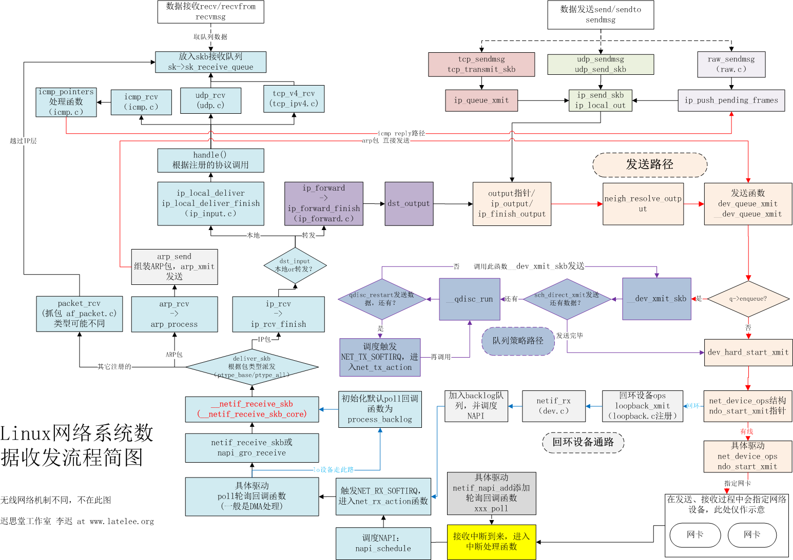

# 佛、儒、道哲学

​	佛教认为，没有任何人和神的精心策划，因缘和合的时候，一切就会出现，不需要任何神和鬼的干预。一切都是因缘的结果，一切都是自己掌控，来世的去向与境遇，都是自己创造的，不受任何鬼神的摆布，自己的未来自己决定，自己的命运自己创造。佛陀反反复复地讲，“我为汝说解脱法，解脱依己当精进。”佛陀从来没有自命为救世主，一切都靠自己。运气好不好、身体好不好，都是靠自己。


# ----------------------


# 内核调试技术

## 1. ARM

## 2. X86

## 3. 龙芯


# ----------------------


# 操作系统（李治军）

课程地址:https://www.icourse163.org/learn/HIT-1002531008?tid=1450346461&from=study#/learn/content?type=detail&id=1214728532&cid=1218670721


# ----------------------


# X86汇编从实模式到保护模式


Intel 8086 在实模式下可以访问 1MB 的内存空间，地址范围为 0x00000 到 0xFFFFF。

出于各方面的考虑，计算机系统的设计者将这 1MB 的内存空间从物理上分为几个部分。
8086 有 20 根地址线，但并非全都用来访问 DRAM，也就是内存条。事实上，这些地址
线经过分配，大部分用于访问 DRAM，剩余的部分给了只读存储器 ROM 和外围的板卡.

1.0x00000-0x9FFFF:DRAM(动态随机访问存储器):

2.0xA0000-0xEFFFF:   分给外围设备

3.0xF0000-0xFFFFF:ROM(只读存储器),占据内存顶端的64k空间. 固化了开机时要执行的指令


0xB8000～0xBFFFF : 分给显卡的.

8086加电或复位时,cs=0xffff,ip=0x0000,位于rom处,开始执行bios程序. 

物理地址为0xFFFF0, 到最后结束也只有16个字节.所以一般为一个jmp指令.

处理器取指令执行的自然顺序是从内存的低地址向高地址推进.


# ----------------------


# Linux设备驱动程序

## 1.最简单的字符设备驱动

### 1.需要先创建设备节点

```sh
mknod /dev/xxx c 111 0
```

创建一个名字为xxx的字符设备， c表示字符设备，  主设备号是111， 此设备号是0。

### 2. 驱动程序

```c
#include <linux/fs.h>
#include <linux/init.h>
#include <linux/module.h>

static int first_drv_open(struct inode *inodep, struct file *filep)
{
    printk("open\n");
    return 0;
}

static ssize_t first_drv_write(struct file *filep, const char __user *buf,size_t len, loff_t *ppos)
{
    printk("write\n");
    return 0;
}

static const struct file_operations first_drv_file_operation = {
    .owner = THIS_MODULE,
    .open = first_drv_open,
    .write = first_drv_write,
};

static int __init first_drv_init(void)
{
    register_chrdev(111,"first_drv", &first_drv_file_operation);
    printk("first_drv_init\n");
    return 0;
}

static void __exit first_drv_exit(void)
{
    //注册字符设备 主设备号是111.从设备号因为我们驱动程序没指定所以，默认是0.
    unregister_chrdev(111,"first_drv_exit"); 
    printk("first_drv_exit\n");
}

module_init(first_drv_init);
module_exit(first_drv_exit);
MODULE_LICENSE("GPL");
```

### 3. 应用程序，调用驱动程序

```c
#include <stdio.h>
#include <sys/types.h>
#include <sys/stat.h>
#include <fcntl.h>
#include <unistd.h>

int main(void)
{
    char buf[10];
    /* 以可读可写方式打开/dev/目录下的xxx设备,open的返回值是一个文件描述符 */
    int fd = open("/dev/xxx", O_RDWR);    
    if(fd < 0)        /* 文件描述符小于0表示打开文件失败 */
    {   
        printf("open /dev/xxx fail\n");
        return -1; 
    }   
 
    /* 该文件中写入5个字节,写入的内容是buf中的前五个字节 */
    write(fd, buf, 5); 
    
    return 0;
}
```

### 4.测试效果

测试效果需要使用sudo dmesg来查看. 如下图所示:

## 2.


# ----------------------

# Linux内核设计的艺术

intel8086系列的cpu可以分别在16位实模式和32位保护模式下运行。为了兼容intel将所有80x86系列cpu都设计为上电既进入16位实模式状态运行。并将cs值置为：0xffff    ip值置为：0x0000.这样cs:ip指向0xffff0

Intel 8086 在16位实模式下可以访问 1MB 的内存空间，地址范围为 0x00000 到 0xFFFFF。

16位实模式下，有20位地址总线，所有可以访问1mb的地址空间。

出于各方面的考虑，计算机系统的设计者将这 1MB 的内存空间从物理上分为几个部分。
8086 有 20 根地址线，但并非全都用来访问 DRAM，也就是内存条。事实上，这些地址
线经过分配，大部分用于访问 DRAM，剩余的部分给了只读存储器 ROM 和外围的板卡.

1.0x00000-0x9FFFF:DRAM(动态随机访问存储器):

2.0xA0000-0xEFFFF:   分给外围设备

3.0xF0000-0xFFFFF: ROM(只读存储器),占据内存顶端的64k空间. 固化了开机时要执行的指令


0xB8000～0xBFFFF : 分给显卡的.

8086加电或复位时,cs=0xffff,ip=0x0000,位于rom处,开始执行bios程序. 

物理地址为0xFFFF0, 到最后结束也只有16个字节.所以一般为一个jmp指令.

处理器取指令执行的自然顺序是从内存的低地址向高地址推进.


## 1.linux0.11启动流程分析

### 1.1 初始化阶段/boot/中的汇编代码

1.bios入口地址为0xffff0，bios的第一条指令就设计在这个位置上。

2.bios检测显卡内存，并在内存中建立中断向量表和中断服务程序。

中断向量表：0x00000~0x003ff，1kb的内存空间。并在紧挨着他的位置用256字节构建bios数据区：0x00400~0x004ff，在大约56kb以后的位置(0x0x0e2ce)，加载了8kb左右的与中断向量表相对应的中断服务程序。

3.bios调用0x19中断服务程序(启动加载服务程序)将启动盘的第一个扇区512b读入到内存0x7c00处。这个512b的程序就是启动扇区。就是linux0.11代码中bootsect.s汇编而成的。

4.在bootsect.s中,start.执行将0x7c00处的代码(也就是自己)复制到0x9000处.   然后跳转到新地址中的go标记继续执行.

```asm
; 刘十三
; 1.将要加载的setup程序的扇区数(SETUPLEN),和被加载到的位置(SETUPSEG)
; 启动扇区被bios加载的位置(BOOTSEG),和将要移动到的新位置(INITSEG)
; 内核被加载的位置(SYSSEG),内核的末尾位置(ENDSEG)
; 根文件系统设备号(ROOT_DEV)
entry start
start:
	mov	ax,#BOOTSEG
	mov	ds,ax
	mov	ax,#INITSEG
	mov	es,ax
	mov	cx,#256
	sub	si,si
	sub	di,di
	rep
	movw				
	; 从start到这行, bootsect将自身从内存0x7c00处拷贝到0x9000处.
```

5.初始化栈寄存器，就可使用push和pop操作， 压栈方向从高地址到低地址。

```assembly
;  刘十三:
;  2.对DS(数据段寄存器) ES(附加段寄存器) SS(栈基址寄存器) 设置成0x9000, 并将sp(栈顶指针)指向0xff00处.
;  对这几个寄存器的设置,就可以在后边使用push和pop操作。
go:	mov	ax,cs
	mov	ds,ax
	mov	es,ax
;  put stack at 0x9ff00.
	mov	ss,ax
	mov	sp,#0xFF00		;  arbitrary value >>512
```

6.调用0x13中断，将软盘从第2扇区开始的4个扇区（2~5扇区），既setup.s对应的程序加载到0x90200处，紧挨着启动扇区。

```assembly
load_setup:
	mov	dx,#0x0000		;  drive 0, head 0
	mov	cx,#0x0002		;  sector 2, track 0
	mov	bx,#0x0200		;  address = 512, in INITSEG
	mov	ax,#0x0200+SETUPLEN	;  service 2, nr of sectors
	int	0x13			;  read it
	jnc	ok_load_setup		;  ok - continue
	mov	dx,#0x0000
	mov	ax,#0x0000		;  reset the diskette
	int	0x13
	j	load_setup
```

7.调用0x13中断，将system模块加载到内存。

​	system模块有240个扇区，然后跳转到0x90200处执行。

8.setup.s开始运行，提取内核运行需要的机器系统数据。

从0x41和0x46的中断向量函数中获取硬盘参数表1和硬盘参数表2并分别放在0x9000:0x0080和0x9000:0x0090处。  大约占用内存0x90000~0x901fc. 覆盖了原来的bootsect程序，只剩余2字节未被覆盖。 后续main函数执行时，需要用到这里边的机器系统数据。

9.


未完待续，汇编太多，看不下去了。


### 1.2 从main到怠速状态


### 系统调用

1.系统调用号:  对应相应的系统调用。


# ----------------------


# 嵌入式开发（JZ2440开发版）

教程地址：https://www.bilibili.com/video/BV1EW411L7RE?p=13

1.线的链接和驱动的安装

2.eop烧写裸版


# ----------------------


# 鸿蒙app开发总结

鸿蒙官方开发文档:https://developer.harmonyos.com/cn/docs/documentation/doc-guides/ability-page-lifecycle-0000000000029840

## 1.鸿蒙app开发环境搭建


## 2.Ability

 Ability是应用所具备能力的抽象，也是应用程序的重要组成部分。一个应用可以具备多种能力（即可以包含多个Ability），HarmonyOS支持应用以Ability为单位进行部署。 

FA（Feature Ability）： FA支持[Page Ability](https://developer.harmonyos.com/cn/docs/documentation/doc-guides/ability-page-concept-0000000000033573)

​	Page模板是FA唯一支持的模板，用于提供与用户交互的能力。一个Page实例可以包含一组相关页面，每个页面用一个AbilitySlice实例表示。 

PA（Particle Ability）： PA支持[Service Ability](https://developer.harmonyos.com/cn/docs/documentation/doc-guides/ability-service-concept-0000000000044457)和[Data Ability](https://developer.harmonyos.com/cn/docs/documentation/doc-guides/ability-data-concept-0000000000043058) 

- Service模板：用于提供后台运行任务的能力。
- Data模板：用于对外部提供统一的数据访问抽象。

### 2.1 Page Ability


# ----------------------


# Golang从入门到进阶实战

## 1.基本语法(基本数据)

### 1.1变量定义

#### 1.1.1 标准格式 

Go 量声明格式为： 

var  	变量名	   变量类型 

变量声明 关键字 var 开头，后置变量类型，行尾无须分号。

```go
 var a 
 var b string 
 var c [] float32 
 var d func() bool 
 var e struct{ 
 x int 
 }
```

#### 1.1.2 批量格式 

```go
var ( 
a int 
b string 
c [] float32 
d func () bool 
e struct { 
x int 
}
)
```


### 1.2变量赋值

#### 1.2.1 标准格式

var 变量名类型＝表达式
例如：游戏中，玩家的血量初始值为 100 。可以这样写：

```go
var hp int = 100
```

#### 1.2.2 编译器推导类型的格式

var hp = 100 
等号右边的部分在编译原理里被称做“右值”。
下面是编译器根据右值推导变量类型完成初始化的例子

```go
 var attack = 40 
 
 var defence = 20 
 
 var damageRate float32 = 0 . 17 
 
 var damage= float32 (attack-defence) * damageRate 
 
 fmt.Println(damage)
```

#### 1.2.3 短变量声明并初始化

var 的变量声 明还有 种更为精简的写法，例如： 

hp := 100  

这是 Go 语言的推导声明写法，编译器会自动根据右值类型推断出左值的对应类型。

#### 1.2.4 匿名变量

在使用多重赋值时，如果不需要在左值中接收变量 可以使用匿名变量。 

```go
 func GetData() (int ，int) { 
 	return 100 , 200 
 } 
 
 a , _: = GetData() 
 
 _, b : = GetData() 
 
 fmt . Println(a , b)
```

### 1.3数据类型

Go 语言中有丰富的数据类型，除了基本的整型、浮点型、布尔型 字符串外，还有 

切片、结构体 函数、 map 通道（ channel ）等。 Go 语言的基本类型和其他语言大同小异，切片类型有着指针的便利性，但 比指针更为安全 很多高级语言都配有切片进行安全和高效率的内 存操作。 

结构体是 Go 语言基 的复杂类型之一，后面会用单独的一章进行讲解。 

函数也是 Go 语言的 种数据类型，可 对函数类型 变量进行赋值和获取，函数特 

性较多，将被放在独立章节讲解 。

map和切片是开发中常见的数据容器类型。

通道与并发息息相关 读者会在第 章了解通道的细节。

1. 整型。
2. 浮点型。
3. 布尔
4. 字符串
5. 字符
6. 切片-能动态分配的空间

切片是一个拥有相同类型元素的可变长度的序列 切片的声明方式如下： T是切片元素类型，可以使整型，浮点，切片，map，函数等。

```go
var name [] T 
```

```go
 a := make([]int , 3) 
 
 a [O] = 1 
 a [1] = 2 
 a [3] = 3
```

解释：1.创建类型为Int，容量为3的切片。

2. 给3个切片赋值。 

### 1.4数据类型转换

Go 语言使用类型前置加括号的方式进行类型转换 一般格式如下 ：

T（表达式）

代表要转换的类型。表达式包括变量、复杂算子和函数返回值等。

注意：类型转换 ，需要考虑两种类型的关系和范围，是否会发生数值截断等 。


### 1.5指针

指针概念在 Go 语言中被拆分为两个核 概念 

1.类型指针，允许对这个指针类型的数据进行修改。传递数据使用指针，而无须拷贝数据。类型指针不能进行偏移和运算。 

2.切片，由指向起始元素的原始指针、元素数量和容量组成。

ptr : = &v   

v的类型为 T, 

其中V代表被取地址的变量，被取地址V使用ptr变量进行接收， prt的类型就为"*T"， 

称做T的指针类型,"*"代表指针。

#### 1.5.1使用指针变量获取命令行的输入信息

#### 1.5.2创建指针的另外一种方法new()

	Go 还提供了另外 种方法来创建指针变 ，格式如下： 

new(类型 )

一般这样写： 

str := new(string)  

*str = "ninja"  

fmt.Println(*str)  

new （）函数可以创建一个对应类型的指针，创建过程会分配内存。被创建的指针指向的值为默认值。


### 1.6变量的声明周期

#### 1.6.1 栈空间

#### 1.6.2 堆空间


### 1.7 字符串

#### 1.7.1 保存格式

字符串一般utf-8保存， 一个汉字占用3个字符。

#### 1.7.2 遍历字符

以ascii打印字符。

```go
theme ：＝"狙击 start"
for i := O; i < len(theme) ; i++ { 
    fmt . Printf ("ascii %c %d\n ”， theme [i] , theme[i])
}
```

打印汉字的时候就乱码。

以unicode打印字符。 

```go
theme := "狙击 start"

for _,s := range theme{

	fmt.Printf("Unicode: %c %d\n",s,s)

} 
```

就会以正常汉字打印了。

#### 1.7.3 **总结：** 

**• ASCII 字符串遍历直接使用下标** 

**• Unicode 字符串遍历用 for range** 

#### 1.7.4 字符串拼接

```go
hammer "吃我一锤"
sickle "死吧”
//声明字节缓
var stringBuilder bytes.Buffer 
//把字符串写入缓冲
stringBuilder.WriteString(hammer) 
stringBuilder.WriteString(sickle) 
//将缓冲 字符串形式输出
fmt.Println(stringBuilder.String())
```

#### 1.7.5 格式化

预留

#### 1.7.6 base64 ini文件读取写入操作等

#### 1.7.7 别名


## **2.容器：存储和组织数据的方式**

本章将以实用为目的，详细介绍数组、切片、映射，以及列表的增加、删除、修改和遍 

历的使用方法

### 2.1 数组-固定大小的连续空间

#### 2.1.1 声明: 

*var 数组变量名［元素数量］T*

· 数组变量名 数组声明及使用时的变量名。 

· 元素数量 数组的元素数量。可以是一个表达式，但最终通过编译期计算的结果必须是整型数值。也就是说，元素数量不能含有到运行时才能确认大小的数值 

· T 可以是任意基本类型，包括 为数组本身。但类型为数组本身时，可以实现多维数组。

```go
var team [3]string  //将 team 明为包含3个元素的字符串数组。
```

#### 2.1.2 **初始化**

定义时初始化：

```go
var team [3]string{"hammer","soldier","mum"}
```

遍历初始化：

```go
var team [3]string
team[0] = "hammer"
team[1] = "soldier" 
team[2] = "mum" 

for k,v := range team { 
	fmt.Println(k , v) 
}
```

### 2.2 切片(slice)-动态分配大小的连续空间

### 2.3 映射(map)-建立食物关联的容器（无序的）

1. 一般用法

```go
//使用时， 需要手动使用 make创建。如果不创建使用map类型，会触发岩机错误。
scene := make(map[string]int)  
//向map中加入映射关系，写法和数组一样，key可以是除函数外的任意类型。
scene ["route"] = 66 
//查找map中的值。
fmt.Println(scene["route"])
//查找一个不存在的值，会返回ValueType的默认值
v := scene["route2"] 
fmt.Println(v)
```

2. 判断值是否在map中有固定用法：

```go
v,ok := scene ["route"]
```

在默认获取键值的基础上，多取了一个变量 ok 可以判断键 route 是否存在于 map 中。

3. 声明时填充内容的方式：

```go
m := map[string]string{
	"W":"forward", 
	"A":"left", 
	"D":"right", 
	"S":"backward",
}
```

这种情况可以不是用make。 

4. 遍历map。  

可是使用for range 


5. 需要在多进程或者多线程中使用的map——sync.Map

### 2.4 列表（list)-可以快速增删的非连续性空间的容器

1. 双链表支持从队列前方或后方插入元素，分 对应的方法是 PushFront和PushBack。
2. 初始化列表（定义）

通过container/list 包的New方法初始化list 

```go
变量名 := list.New()
```

通过声明初始化list 

```go
var 变量名 list.List
```

3. 添加元素

```go
//创建一个列表示例
l := list.New()
//将fist字符串插入到列表尾部，此时列表是空的，插入后只有一个元素。
l.PushBack("fist")
//将67放入列表，67将被放在fist的前面。
l.PushFront(67)
```

4. 还有很多方法后边研究。

## 3.流程控制


## 4.函数

### 4.1 声明形式

```go
func 函数名（参数列表）（返回参数列表）｛
	函数体
}

func foo ( a int, b string ) int
//参数类型简写， 返回int类型
func add (a,b int ）int { 
	return a + b 
}

//返回多个值
func swap(x, y string) (string, string) {
   return y, x
}        
```

### 4.2 函数变量

Go 语言中， 函数也是一种类型，可以和其他类型一样被保存在变量中。下面的代码定义了一个函数变量f,并将一个个函数名 fire()赋给函数变量f，这样调用函数变量f时，实际调用的就是fire()函数，代码如下：

```go
package main 

import (
	"fmt"
)

func fire() { 
	fmt.Println("fire") 
} 

func main() { 
	var f func() 
	f = fire 
	f () 
}
```

### 4.3 匿名函数

定义: 匿名函数就是没有名字的普通函数定义. 

```go
func (参数列表) (返回参数列表){
	函数体
}
```

4.3.1 在定义时直接调用匿名函数

```go
func(data init) { 
	fmt.Println (”hello”, data) 
} (100)
```

4.3.2 将匿名函数赋值给变量

```go
//将匿名函数体保存到f()中
f := func(data int){
    fmt.Println("hello",data)
}
//使用f()调用
f(100)
```

4.3.3 匿名函数作为回调函数

```go
//对切片进行遍历操作,遍历中访问每个元素的操作使用匿名函数来实现

//遍历切片的每个元素,通过给定函数进行元素访问
func visit(list []int, f func(int)){
    for _,v := range list{
        f(v)
    }
}

func main() {
    //使用匿名函数打印切片内容
    visit([]int{1,2,3,4}, func(v int){
        fmt.Println(v)
    })
}
```

4.3.4 使用匿名函数实现操作封装


### 5.函数类型实现接口


### 6.闭包

闭包＝函数＋引用环境

### 7.可变参数

```go
//v 为可变参数变量, 类型为[]T, 也就是拥有多个T元素的T类型切片.
//T为可变参数类型,当T为interface{}时,传入的可以是任意类型.
func 函数名 (固定参数列表, v ... T) (返回参数列表){
    函数体
}
```

7.1 所有参数都是可变参数:

```go
//打印函数定义如下:
func Println(a ... interface{}) (n int, err error){
    //略
}

//调用时,参数可以是任意类型.
fmt.Println(5,"hello". &struct{a int}{1}, true)
```

7.2 部分参数为可变参数

```go
func Printf(format string, a ...interface{}) (n int, err error){
    //略
}

//调用时,第一个参数必须为string
fmt.Printf("pure string\n")
fmt.Printf("value: %v %f\n",true, math.Pi)
```


### 8.延迟执行语句

​	Go 言的 defe 语句会将其后面跟随的语句进行延迟处理。在 defer 归属的函数即将返回时，将延迟处理的语句按 defer 的逆序进行执行，也就是说，先被 defer 的语句最后被执行，最后被 defer 的语旬，最先被执行。

（内心独白：好鸡肋的作用，按c语言编程习惯，这个就是个无用的东西．）

8.1使用延迟语句在函数退出时释放资源.

### 9.处理运行时发生的错误

### 10.宕机(panic)

10.1 手动触发宕机

```go
func main(){
    panic("crash")
}
//代码运行崩溃并输出如下:
panci: crash
goroutine 1 [running]:
main.main()
main.go:5 +0x6b
```

10.2 在运行依赖的必备资源时主动触发宕机

10.3 在宕机时触发延迟执行语句

```go
func main(){
    defer fmt.Println("宕机后要做的事情1")
    defer fmt.Println("宕机后要做的事情2")
    panic("宕机")
}
```

### 11.宕机恢复


## 5.结构体

定义: 一个复合类型.  没有类等面向对象的概念.

```go
type 类型名 struct{
    字段1   字段1的类型
    字段2   字段2的类型
    ...
}
```

#### 5.1 实例化结构体

```go
var test T
```

T为结构体类型.  test为结构体的实例.

5.1.1 创建指针类型的结构体


# ----------------------


# 30天自制操作系统

git clone到本地才能看到图片显示哦!!!!!!!
git clone到本地才能看到图片显示哦!!!!!!!
git clone到本地才能看到图片显示哦!!!!!!!

## 必备知识

### 1.c程序编译的步骤


### 2.环境安装

windowsXP之后版本。

toolset包。

### 3.内存分布图

| start                       | end      | size                          | type                                 | description                            |
| :-------------------------- | :------- | :---------------------------- | :----------------------------------- | :------------------------------------- |
| Low Memory (the first MiB)  |          |                               |                                      |                                        |
| 00000000                    | 000003FF | 400 (1 KiB)                   | RAM - partially unusable (see above) | Real Mode IVT (Interrupt Vector Table) |
| 00000400                    | 000004FF | 100                           | RAM - partially unusable (see above) | BDA (BIOS data area)                   |
| 00000500                    | 00007BFF | 7700 (almost 30 KiB)          | RAM (guaranteed free for use)        | Conventional memory                    |
| 00007C00 (typical location) | 00007DFF | 200                           | RAM - partially unusable (see above) | Your OS BootSector                     |
| 00007E00                    | 0007FFFF | 7FB00 (481 KiB)               | RAM (guaranteed free for use)        | Conventional memory                    |
| 00080000                    | 0009FBFF | 1FC00 (approximately 120 KiB) | RAM (free for use, **if it exists**) | Conventional memory                    |
| 0009FC00 (typical location) | 0009FFFF | 400                           | RAM (unusable)                       | EBDA (Extended BIOS Data Area)         |
| 000A0000                    | 000FFFFF | 60000                         | various (unusable)                   | ROM Area (384 KiB)                     |

参考博客：https://blog.csdn.net/huangkangying/article/details/8495163

## 第一天：

因为咱们的目的是为了研究操作系统的组成，所以暂时略过bootloader的启动部分。　直接从系统启动的第二阶段的主引导记录开始。

前提是将编译工具放在该文件目录的同级目录下，该工具为日本人川合秀实自制的编译程序，优化过的nasm编译工具。

工具下载地址(内网)：http://10.7.11.84/my_os_source/tolset/z_tools/

写入以下汇编代码生成img文件，然后使用qemu虚拟机启动。

```assembly
; hello-os
; TAB=4

	DB 0xeb, 0x4e, 0x90
	DB "HELLOIPL"			;必须是8个字节
	DW 512					;一个扇区的大小
	DB 1
	DW 1					;fat的起始位置
	DB 2					;fat的个数，必须为2
	DW 224
	DW 2880
	DB 0xf0
	DW 9
	dw 18
	dw 2
	dd 0
	dd 2880
	db 0,0,0x29
	dd 0xffffffff
	db "HELLO-OS   "		;必须是11字节，磁盘的名称
	db "FAT12   "			;必须是8字节	磁盘格式名称
	resb 18
; 程序主体
	DB		0xb8, 0x00, 0x00, 0x8e, 0xd0, 0xbc, 0x00, 0x7c
	DB		0x8e, 0xd8, 0x8e, 0xc0, 0xbe, 0x74, 0x7c, 0x8a
	DB		0x04, 0x83, 0xc6, 0x01, 0x3c, 0x00, 0x74, 0x09
	DB		0xb4, 0x0e, 0xbb, 0x0f, 0x00, 0xcd, 0x10, 0xeb
	DB		0xee, 0xf4, 0xeb, 0xfd
	
; 信息显示部分
	db 0x0a, 0x0a 	;两个换行
	db "hello, uos"
	db 0x0a
	db 0
	
	resb 0x1fe-$	;$:表示前面已经输出多少个字节， 这里的$等于132
	db 0x55,0xaa
	
; 以下是启动区以外部分的输出

	DB		0xf0, 0xff, 0xff, 0x00, 0x00, 0x00, 0x00, 0x00
	RESB	4600
	DB		0xf0, 0xff, 0xff, 0x00, 0x00, 0x00, 0x00, 0x00
	RESB	1469432
```

启动运行脚本:

```powershell
..\z_tools\nask.exe helloos.nas helloos.img
copy helloos.img ..\z_tools\qemu\fdimage0.bin
..\z_tools\make.exe -C ..\z_tools\qemu
```


## 第二天：

### 1.将扇区加载到指定内存中。

在第一天的基础上进行代码的加工，第二天给程序中加入将引导扇区读入指定内存地址:0x7c00处，并使用软中断显示字符。

出现了一个问题，发现0扇区内出现莫名其妙的数据，经过分析，是编译器自己写入的启动数据。

优化后的代码为：

```assembly
; hello-os
; TAB=4

		ORG		0x7c00			; このプログラムがどこに読み込まれるのか
		JMP		entry
entry:
		MOV		AX,0			; 初始化寄存器
		MOV		SS,AX
		MOV		SP,0x7c00		;这一句啥意思？　没搞懂，注释后直接卡死了。上边不是已经有ORG 0x7c00了。
		MOV		DS,AX
		MOV		ES,AX

		MOV		SI,msg
putloop:
		MOV		AL,[SI]
		ADD		SI,1			
		CMP		AL,0
		JE		fin
		MOV		AH,0x0e			; ?示一个文字
		MOV		BX,15			; 指定字符?色，不知道???色没?， 有知道的大?告?我下。
		INT		0x10			; ?用??bios，可以理解??用了一个接口。
		JMP		putloop
fin:
		HLT						; ?cpu停止防止cpu空?，等待指令，只要外部?生?化，比如按下??，移?鼠?，cpu就会醒?来???行。
		JMP		fin				; 死循?。

msg:
		DB		0x0a, 0x0a		; 改行を2つ
		DB		"hello, uos1"
		DB		0x0a			; 改行
		DB		0

		RESB	0x7dfe-$		

		DB		0x55, 0xaa

; 以下はブートセクタ以外の部分の記述

		DB		0xf0, 0xff, 0xff, 0x00, 0x00, 0x00, 0x00, 0x00
		RESB	4600
		DB		0xf0, 0xff, 0xff, 0x00, 0x00, 0x00, 0x00, 0x00
		RESB	1469432
```

经过下面命令编译后，生成helloos.img打开后如图所示,出现了一些代码中未实现的数据。

```powershell
..\z_tools\nask.exe helloos.nas helloos.img
```


后来经过屏蔽代码，显示如图，证明是编译器写入的初始数据。


费了好长时间再调这个问题，请大佬们不要鄙视。

为什么是0x7c00处呢，这是bios规定的。0x00007c00-0x00007dff为启动区内容的装载地址

执行结果如图：


### 2.完善工程架构

去掉helloos.nas中55aa后边占字符的所有代码，只留下引导扇区内容。

```assembly
; hello-os
; TAB=4

		ORG		0x7c00			; このプログラムがどこに読み込まれるのか

; 以下は標準的なFAT12フォーマットフロッピーディスクのための記述

		JMP		entry
		DB		0x90
		DB		"HELLOIPL"		; ブートセクタの名前を自由に書いてよい（8バイト）
		DW		512				; 1セクタの大きさ（512にしなければいけない）
		DB		1				; クラスタの大きさ（1セクタにしなければいけない）
		DW		1				; FATがどこから始まるか（普通は1セクタ目からにする）
		DB		2				; FATの個数（2にしなければいけない）
		DW		224				; ルートディレクトリ領域の大きさ（普通は224エントリにする）
		DW		2880			; このドライブの大きさ（2880セクタにしなければいけない）
		DB		0xf0			; メディアのタイプ（0xf0にしなければいけない）
		DW		9				; FAT領域の長さ（9セクタにしなければいけない）
		DW		18				; 1トラックにいくつのセクタがあるか（18にしなければいけない）
		DW		2				; ヘッドの数（2にしなければいけない）
		DD		0				; パーティションを使ってないのでここは必ず0
		DD		2880			; このドライブ大きさをもう一度書く
		DB		0,0,0x29		; よくわからないけどこの値にしておくといいらしい
		DD		0xffffffff		; たぶんボリュームシリアル番号
		DB		"HELLO-OS   "	; ディスクの名前（11バイト）
		DB		"FAT12   "		; フォーマットの名前（8バイト）
		RESB	18				; とりあえず18バイトあけておく

; プログラム本体

entry:
		MOV		AX,0			; レジスタ初期化
		MOV		SS,AX
		MOV		SP,0x7c00
		MOV		DS,AX
		MOV		ES,AX

		MOV		SI,msg
putloop:
		MOV		AL,[SI]
		ADD		SI,1			; SIに1を足す
		CMP		AL,0
		JE		fin
		MOV		AH,0x0e			; 一文字表示ファンクション
		MOV		BX,15			; カラーコード
		INT		0x10			; ビデオBIOS呼び出し
		JMP		putloop
fin:
		HLT						; 何かあるまでCPUを停止させる
		JMP		fin				; 無限ループ

msg:
		DB		0x0a, 0x0a		; 改行を2つ
		DB		"hello, uos  "
		DB		0x0a			; 改行
		DB		0

		RESB	0x7dfe-$		; 0x7dfeまでを0x00で埋める命令

		DB		0x55, 0xaa

```

将文件名改为ipl.nas,因为要将程序逐渐修改成一个ipl（Initial program loader）

加入makefile文件,和makefile的执行批处理文件。

Makefile:    makefile的编写规则，自己学习，这是基础就不讲了。

```makefile
# 默认行为

default :
	../z_tools/make.exe img

# 文件生成规则

ipl.bin : ipl.nas Makefile
	../z_tools/nask.exe ipl.nas ipl.bin ipl.lst

helloos.img : ipl.bin Makefile
	../z_tools/edimg.exe   imgin:../z_tools/fdimg0at.tek \
		wbinimg src:ipl.bin len:512 from:0 to:0   imgout:helloos.img

# 命令

asm :
	../z_tools/make.exe -r ipl.bin

img :
	../z_tools/make.exe -r helloos.img

run :
	../z_tools/make.exe img
	copy helloos.img ..\z_tools\qemu\fdimage0.bin
	../z_tools/make.exe -C ../z_tools/qemu

install :
	../z_tools/make.exe img
	../z_tools/imgtol.com w a: helloos.img

clean :
	-del ipl.bin
	-del ipl.lst

src_only :
	../z_tools/make.exe clean
	-del helloos.img

```

make.bat:		这是批处理文件的编写规则，和linux下的shell类似，不讲了，自己学习。

```powershell
..\z_tools\make.exe %1 %2 %3 %4 %5 %6 %7 %8 %9
```

使用make run编译代码，生成ipl.bin二进制文件，并生成空img，然后将ipl.bin写入空img中,最后运行。

其实只用ipl.bin放入qemu中启动也是可以的。ipl.bin只是一个启动扇区。

结果如下图所示：


遗留问题：jmp开始直接跳过那段代码，为啥还不能删除？

实验证明可以删除，只是会影响他自己写的这个程序生成img文件而已。不影响。


## 第三天：系统引导完成

对第二天代码进行了修改，只打印hello ,uos没一点意思。

读取磁盘上10个柱面的1-18个扇区，（目前ssd已经没有柱面这个概念了）。读出来的数据放入内存0x8200起始的地方。

启动区放在0x8000内存扇区中。为什么要放在0x8000以后的内存中的呢？　只是因为这块内存没有用而已。

为什么要将启动程序(img的0扇区)放在0x7c00处？　这是ibm规定的。

向一个空软盘保存文件时：

​	1.文件名会写在0x002600以后的地方。

​	2.文件内容会写在0x004200以后的地方。

所以若想启动位于0x004200的程序，就得让引导程序运行完成后跳转到0x8000+0x4200＝0xc200处。

作者这一块写的很混乱啊，咱们整理一下为啥是0xc200地址，看下图：


bios会把磁盘0位置的内容拷贝到内存0x7c00这个位置然后跳过去执行，
也就是把A拷贝到了内存，然后执行A
A会把磁盘后面的内容从内存0x8200开始拷贝
这样的话磁盘0x4200位置就会对应到内存0xC200
一个扇区512字节，十六进制表示就是0x200

**程序的执行情况：**

1.bios读取磁盘0扇区到0x7c00处。

2.bios跳转到0x7c00处开始执行,该处为ipl10.nas程序，该程序功能为加载磁盘[1-最后]扇区到内存的0x8200处。并跳转到0xc200处执行。

3.0xc200处为asmhead.nas程序，该程序功能为，调用显卡bios，设置画面模式，调用操作系统代码。

4.操作系统代码目前就一个功能就是让cpu睡眠，开始进入c程序。


下面根据功能修改代码：

### 1.修改ipl.nas

ipl10.nas：

```assembly
; haribote-ipl
; TAB=4

CYLS	EQU		10				; 声明CYLS=10

		ORG		0x7c00			; 指明程序装载地址

; 标准FAT12格式软盘专用的代码 Stand FAT12 format floppy code

		JMP		entry
		DB		0x90
		DB		"HARIBOTE"		; 启动扇区名称（8字节）
		DW		512				; 每个扇区（sector）大小（必须512字节）
		DB		1				; 簇（cluster）大小（必须为1个扇区）
		DW		1				; FAT起始位置（一般为第一个扇区）
		DB		2				; FAT个数（必须为2）
		DW		224				; 根目录大小（一般为224项）
		DW		2880			; 该磁盘大小（必须为2880扇区1440*1024/512）
		DB		0xf0			; 磁盘类型（必须为0xf0）
		DW		9				; FAT的长度（必??9扇区）
		DW		18				; 一个磁道（track）有几个扇区（必须为18）
		DW		2				; 磁头数（必??2）
		DD		0				; 不使用分区，必须是0
		DD		2880			; 重写一次磁盘大小
		DB		0,0,0x29		; 意义不明（固定）
		DD		0xffffffff		; （可能是）卷标号码
		DB		"HARIBOTEOS "	; 磁盘的名称（必须为11字?，不足填空格）
		DB		"FAT12   "		; 磁盘格式名称（必??8字?，不足填空格）
		RESB	18				; 先空出18字节

; 程序主体

entry:
		MOV		AX,0			; 初始化寄存器
		MOV		SS,AX
		MOV		SP,0x7c00
		MOV		DS,AX

; 读取磁盘

		MOV		AX,0x0820
		MOV		ES,AX
		MOV		CH,0			; 柱面0
		MOV		DH,0			; 磁头0
		MOV		CL,2			; 扇区2

readloop:
		MOV		SI,0			; 记录失败次数寄存器

retry:
		MOV		AH,0x02			; AH=0x02 : 读入磁盘
		MOV		AL,1			; 1个扇区
		MOV		BX,0
		MOV		DL,0x00			; A驱动器
		INT		0x13			; 调用磁盘BIOS
		JNC		next			; 没出错则跳转到next
		ADD		SI,1			; 往SI加1
		CMP		SI,5			; 比较SI与5
		JAE		error			; SI >= 5 跳转到error
		MOV		AH,0x00
		MOV		DL,0x00			; A驱动器
		INT		0x13			; 重置驱动器
		JMP		retry
next:
		MOV		AX,ES			; 把内存地址后移0x200（512/16十六进制转换）
		ADD		AX,0x0020
		MOV		ES,AX			; ADD ES,0x020因为没有ADD ES，只能通过AX进行
		ADD		CL,1			; 往CL里面加1
		CMP		CL,18			; 比较CL与18
		JBE		readloop		; CL <= 18 跳转到readloop
		MOV		CL,1
		ADD		DH,1
		CMP		DH,2
		JB		readloop		; DH < 2 跳转到readloop
		MOV		DH,0
		ADD		CH,1
		CMP		CH,CYLS
		JB		readloop		; CH < CYLS 跳转到readloop

; 读取完毕，跳转到haribote.sys执行！
		MOV		[0x0ff0],CH		; 记下IPL读到哪里了
		JMP		0xc200

error:
		MOV		SI,msg

putloop:
		MOV		AL,[SI]
		ADD		SI,1			; 给SI加1
		CMP		AL,0
		JE		fin
		MOV		AH,0x0e			; 显示一个文字
		MOV		BX,15			; 指定字符颜色
		INT		0x10			; 调用显卡BIOS
		JMP		putloop

fin:
		HLT						; 让CPU停止，等待指令
		JMP		fin				; 无限循环

msg:
		DB		0x0a, 0x0a		; 换行两次
		DB		"load error"
		DB		0x0a			; 换行
		DB		0

		RESB	0x7dfe-$		; 填写0x00直到0x001fe

		DB		0x55, 0xaa

```

我们在使用段寄存器时，以ES:BX这种方式表示地址，写成"MOV AL, [ES:BX]"她代表ES×16+BX内存地址。

### 2.修改asmhead.nas

```assembly
; haribote-os boot asm
; TAB=4

;一些定义
BOTPAK	EQU		0x00280000		; bootpack�̃��[�h��
DSKCAC	EQU		0x00100000		; �f�B�X�N�L���b�V���̏ꏊ
DSKCAC0	EQU		0x00008000		; �f�B�X�N�L���b�V���̏ꏊ�i���A�����[�h�j

; 有关BOOT_INFO
CYLS	EQU		0x0ff0			; 设定启动区
LEDS	EQU		0x0ff1
VMODE	EQU		0x0ff2			; 该位置保存颜色数目的信息，颜色的位数。
SCRNX	EQU		0x0ff4			; 该位置保存 分辨率的x
SCRNY	EQU		0x0ff6			; 该位置保存 分辨率的y
VRAM	EQU		0x0ff8			; 图像缓冲区的开始地址。

		ORG		0xc200			; 这个程序需要装载到内存的什么地方呢。

; 画面设定

		MOV		AL,0x13			; VGA显卡，320*320*8位彩色，调色板模式。
		MOV		AH,0x00
		INT		0x10			;调用显卡bios的函数，切换显示模式。
		MOV		BYTE [VMODE],8	; 将画面模式信息保存到这些内存地址中。
		MOV		WORD [SCRNX],320
		MOV		WORD [SCRNY],200
		MOV		DWORD [VRAM],0x000a0000		
;VRAM指的时显卡内存，也就是用来显示画面的内存。这一块内存地址都对应着画面上的像素。
;VRAM在0xa0000~0xaffff之间的64kb。 VRAM分布在内存分布图中的好几个不同的地方。

; 用bios取得键盘上各种led灯的状态。

		MOV		AH,0x02
		INT		0x16 			; keyboard BIOS
		MOV		[LEDS],AL

;=====================================后边的留以后再看,这块时调用bootpack.c程序的======================
; 防止PIC接受所有中断
;	AT兼容机的规范、PIC初始化
;	然后之前在CLI不做任何事就挂起
;	PIC在同意后初始化

		MOV		AL,0xff
		OUT		0x21,AL
		NOP						; ; 不断执行OUT指令
		OUT		0xa1,AL

		CLI						;进一步中断CPU

; ; 让CPU支持1M以上内存、设置A20GATE

		CALL	waitkbdout
		MOV		AL,0xd1
		OUT		0x64,AL
		CALL	waitkbdout
		MOV		AL,0xdf			; enable A20
		OUT		0x60,AL
		CALL	waitkbdout

; 保护模式转换

[INSTRSET "i486p"]				; 说明使用486指令

		LGDT	[GDTR0]			;设置临时GDT
		MOV		EAX,CR0
		AND		EAX,0x7fffffff	; 使用bit31（禁用分页）
		OR		EAX,0x00000001	; bit0到1转换（保护模式过渡）
		MOV		CR0,EAX
		JMP		pipelineflush
pipelineflush:
		MOV		AX,1*8			;  写32bit的段
		MOV		DS,AX
		MOV		ES,AX
		MOV		FS,AX
		MOV		GS,AX
		MOV		SS,AX

;bootpack传递

		MOV		ESI,bootpack	; 源
		MOV		EDI,BOTPAK		; 目标
		MOV		ECX,512*1024/4
		CALL	memcpy

; 传输磁盘数据

; 从引导区开始

		MOV		ESI,0x7c00		; 源
		MOV		EDI,DSKCAC		; 目标
		MOV		ECX,512/4
		CALL	memcpy

; 剩余的全部

		MOV		ESI,DSKCAC0+512	; 源
		MOV		EDI,DSKCAC+512	; 目标
		MOV		ECX,0
		MOV		CL,BYTE [CYLS]
		IMUL	ECX,512*18*2/4	; 除以4得到字节数
		SUB		ECX,512/4		; IPL偏移量
		CALL	memcpy

; 由于还需要asmhead才能完成
; 完成其余的bootpack任务

; bootpack启动

		MOV		EBX,BOTPAK
		MOV		ECX,[EBX+16]
		ADD		ECX,3			; ECX += 3;
		SHR		ECX,2			; ECX /= 4;
		JZ		skip			; 传输完成
		MOV		ESI,[EBX+20]	; 源
		ADD		ESI,EBX
		MOV		EDI,[EBX+12]	; 目标
		CALL	memcpy
skip:
		MOV		ESP,[EBX+12]	; 堆栈的初始化
		JMP		DWORD 2*8:0x0000001b

waitkbdout:
		IN		 AL,0x64
		AND		 AL,0x02
		JNZ		waitkbdout		; AND结果不为0跳转到waitkbdout
		RET

memcpy:
		MOV		EAX,[ESI]
		ADD		ESI,4
		MOV		[EDI],EAX
		ADD		EDI,4
		SUB		ECX,1
		JNZ		memcpy			; 运算结果不为0跳转到memcpy
		RET
; memcpy地址前缀大小

		ALIGNB	16
GDT0:
		RESB	8				; 初始值
		DW		0xffff,0x0000,0x9200,0x00cf	; 写32bit位段寄存器
		DW		0xffff,0x0000,0x9a28,0x0047	; 可执行的文件的32bit寄存器（bootpack用）

		DW		0
GDTR0:
		DW		8*3-1
		DD		GDT0

		ALIGNB	16
bootpack:

```

### 3.加入bootpack.c操作系统代码

这个操作系统实现了一个最简单的功能：让cpu睡眠

```c
void io_hlt(void);


void HariMain(void)
{

fin:
	io_hlt(); /* 执行naskfunc.nas里边的_io_hlt()函数。 */
	goto fin;

}

```

### 4.加入naskfunc.nas

加入这个文件是因为c程序不能调用HLT指令，所以使用c程序调用汇编程序，在汇编程序中用HLT让cpu睡眠。

```assembly
; naskfunc
; TAB=4

[FORMAT "WCOFF"]				; 制作目标文件的模式	
[BITS 32]						; 制作32位模式用的机器语言


; 制作目标文件的信息。
[FILE "naskfunc.nas"]			; 源文件名信息

		GLOBAL	_io_hlt			; 程序中包含的函数名


;实际的函数

[SECTION .text]		;目标中间中写了这些之后再写程序

_io_hlt:	; void io_hlt(void); 这个函数只执行了一个HLT命令，让cpu睡眠。
		HLT
		RET

```

### 5.运行结果


## 第四天：操作系统界面绘制

OUT:让cpu给设备发送电信号．

IN:让cpu从设备获取电信号．

为了区别不同的设备，要使用设备号码，用port表示．

pushad: 将所有的32位通用寄存器压入堆栈

pusha:将所有的16位通用寄存器压入堆栈

pushfd:然后将32位标志寄存器EFLAGS压入堆栈

pushf::将的16位标志寄存器EFLAGS压入堆栈

popad:将所有的32位通用寄存器取出堆栈

popa:将所有的16位通用寄存器取出堆栈

popfd:将32位标志寄存器EFLAGS取出堆栈

popf:将16位标志寄存器EFLAGS取出堆栈

今天比较简单是在第三天基础上扩充c语言进行画图的．

### 1.对内存写入数据

改写bootpack.c代码如下：

VRAM:保存的是0xa0000,指的是显卡内存．这块内存可以像一般的内存一样存储数据，也可以保存画面上的像素．利用这一点可以在画面上显示不同的图像．

```c
void io_hlt(void);

void HariMain(void)
{
	int i; /*i为DWORD４个字节*/
	char *p; /* p用于byte类型地址 */

	p = (char *) 0xa0000; /*  */

	for (i = 0; i <= 0xffff; i++) {
		*(p + i) = i & 0x0f;				//这样对内存进行赋值以后就会显示出图案了．
	}

	for (;;) {
		io_hlt();
	}
}
```

显示如下：


### 2.色号设定

　　rgb表示一个像素颜色时需要6位十六进制数，也就是24位来指定颜色．　而我们显示这个虚拟显示屏只有320*200的8位颜色模式．也就是只能使用0-255的数．　　　

　　这个8位彩色模式，是由程序员随意指定0-255的数字所对应的颜色的，比如25号颜色对应#ffffff,26号颜色对应#123456等，这种方式就叫做调色板．　　

　　目前需要这16种颜色就够了．　

```c
static unsigned char table_rgb[16 * 3] = {
		0x00, 0x00, 0x00,	/*  0:黑 */
		0xff, 0x00, 0x00,	/*  1:亮红*/
		0x00, 0xff, 0x00,	/*  2:亮绿*/
		0xff, 0xff, 0x00,	/*  3:亮黄*/
		0x00, 0x00, 0xff,	/*  4:亮蓝*/
		0xff, 0x00, 0xff,	/*  5:亮紫 */
		0x00, 0xff, 0xff,	/*  6:浅亮蓝*/
		0xff, 0xff, 0xff,	/*  7:白*/
		0xc6, 0xc6, 0xc6,	/*  8:亮灰*/
		0x84, 0x00, 0x00,	/*  9:暗红*/
		0x00, 0x84, 0x00,	/* 10:暗绿*/
		0x84, 0x84, 0x00,	/* 11:暗黄*/
		0x00, 0x00, 0x84,	/* 12:暗青*/
		0x84, 0x00, 0x84,	/* 13:暗紫*/
		0x00, 0x84, 0x84,	/* 14:浅暗紫*/
		0x84, 0x84, 0x84	/* 15:暗灰*/
	};
```

　　这个调色模式在上一节中已经说明，调用bios函数切换显示模式，

```assembly
int 0x10 ，
ah=0x00 设置显卡模式，
al=模式，
0x03：16色字符模式，80×25（最基础）  
0x12: VGA图形模式，640×480×4位彩色模式，独特的4面存储模式.
0x13：VGA图形模式，320×200×8位彩色模式，调色板模式.
0x6a: 扩展vga图形模式，800x600x4位彩色模式，独特的4面存储模式．
返回值：无
```

本系统采用0x13。8位彩色模式，就是有程序员随意指定0~255的数字所对应的颜色。如25号颜色对应#ffffff，26号对应#123456，这种方式叫做调色板palette。

调色板的访问步骤：

（1）首先在一连串的访问中屏蔽中断（比如CLI）。

（2）将想要设定的调色板号码写入0x03c8端口，紧接着，按RGB的顺序写入0x03c9。若还想继续设定下个调色板，就省略调色板的号码，再按RGB的顺序写入0x03c9就行了。

（3）若想读出当前调色板的状态，首先要将调色板的号码写入0x03c7，再从0x03c9中读取3次，顺序为RGB。若要继续读下一个，则省略调色板号码设定，继续按RGB读出。

（4）若开始执行了CLI，则最后执行STI。

调色板设置代码如下：

```c
void set_palette(int start, int end, unsigned char *rgb)
{
	int i, eflags;
	eflags = io_load_eflags();	/* 保存EFLAGS寄存器的值 */
	io_cli(); 					/*禁止中断*/
	io_out8(0x03c8, start);
	for (i = start; i <= end; i++) {
		io_out8(0x03c9, rgb[0] / 4);	//往指定装置里传送数据的函数
		io_out8(0x03c9, rgb[1] / 4);
		io_out8(0x03c9, rgb[2] / 4);
		rgb += 3;
	}
	io_store_eflags(eflags);	/* 恢复EFLAGS寄存器的值 */
	return;
}
```

c程序中调用的汇编函数如下：

```assembly
_io_out8:	; void io_out8(int port, int data);
		MOV		EDX,[ESP+4]		; port  DX寄存器通常被称为数据寄存器。常用来存放双字长数据的高16位，或存放外设端口地址。
		MOV		AL,[ESP+8]		; data
		OUT		DX,AL
		RET
_io_hlt:	; void io_hlt(void);
		HLT
		RET
		
_io_cli:	; void io_cli(void);
		CLI			;禁止中断发生
		RET

_io_sti:	; void io_sti(void);
		STI			;允许中断发生
		RET
		
_io_load_eflags:	; int io_load_eflags(void);
		PUSHFD		; PUSH EFLAGS 
		POP		EAX
		RET

_io_store_eflags:	; void io_store_eflags(int eflags);
		MOV		EAX,[ESP+4]
		PUSH	EAX
		POPFD		; POP EFLAGS 
		RET
```

### 3.绘制矩形

颜色配好了，现在开始画，在画面模式中，画面上有320x200=64000个像素，假设坐上角坐标是(0,0),右下角坐标是(319x199)，(书里为什么是319x319不明白)，那么像素坐标(x,y)对应的VRAM地址应该是

0xa0000+x+y*320

画矩形框函数如下：

```c
void boxfill8(unsigned char *vram, int xsize, unsigned char c, int x0, int y0, int x1, int y1)
{
	int x, y;
	for (y = y0; y <= y1; y++) {
		for (x = x0; x <= x1; x++)
			vram[y * xsize + x] = c; //将某个像素点设置成某个颜色．
	}
	return;
}
```

### 4.画出系统界面的大概轮廓

```c
void HariMain(void)
{
	char *vram;
	int xsize, ysize;

	init_palette();		//设定调色板
	vram = (char *) 0xa0000;
	xsize = 320;
	ysize = 200;

	boxfill8(vram, xsize, COL8_008484,  0,         0,          xsize -  1, ysize - 29);
	boxfill8(vram, xsize, COL8_C6C6C6,  0,         ysize - 28, xsize -  1, ysize - 28);
	boxfill8(vram, xsize, COL8_FFFFFF,  0,         ysize - 27, xsize -  1, ysize - 27);
	boxfill8(vram, xsize, COL8_C6C6C6,  0,         ysize - 26, xsize -  1, ysize -  1);

	boxfill8(vram, xsize, COL8_FFFFFF,  3,         ysize - 24, 59,         ysize - 24);
	boxfill8(vram, xsize, COL8_FFFFFF,  2,         ysize - 24,  2,         ysize -  4);
	boxfill8(vram, xsize, COL8_848484,  3,         ysize -  4, 59,         ysize -  4);
	boxfill8(vram, xsize, COL8_848484, 59,         ysize - 23, 59,         ysize -  5);
	boxfill8(vram, xsize, COL8_000000,  2,         ysize -  3, 59,         ysize -  3);
	boxfill8(vram, xsize, COL8_000000, 60,         ysize - 24, 60,         ysize -  3);

	boxfill8(vram, xsize, COL8_848484, xsize - 47, ysize - 24, xsize -  4, ysize - 24);
	boxfill8(vram, xsize, COL8_848484, xsize - 47, ysize - 23, xsize - 47, ysize -  4);
	boxfill8(vram, xsize, COL8_FFFFFF, xsize - 47, ysize -  3, xsize -  4, ysize -  3);
	boxfill8(vram, xsize, COL8_FFFFFF, xsize -  3, ysize - 24, xsize -  3, ysize -  3);

	for (;;) {
		io_hlt();
	}
}
```

执行效果如下：


## 第五天:文字显示与GDT/IDT初始化

### 1.从内存中读出保存的值.

昨天程序中300x200都是直接写入程序,本来应该从asmhead.nas先前保存的值中取,不然当画面模式改变时,系统就挂了.

所以得修改bootpack.c文件代码从asmhead.nas写入的内存中取值.

### 2.显示字符

原理:将每一个bit当成一个黑点,那么,字符a就可以当成下图所示:


那么字符a要显示赋值给显卡的话,用字符数组表示就变成:

```c
static char font_A[16]=
	{0x00,0x18, 0x18, 0x18, 0x18, 
	 0x24, 0x24, 0x24, 0x24, 0x7e,
     0x42, 0x42,0x42, 0xe7, 0x00, 0x00
    };
```

### 3.增加字体

作者自己写了一个字体生成小工具,可以将图像字符转成16进制数据.


这个很简单,有c语言基础的一看就知道这个工具是怎么写的了. 

生成的字体数据存到hankaku[4096]数组中,后边程序会调用.


### 4.显示鼠标指针

将鼠标大小定为16x16,先准备16x16的内存,然后写入鼠标指针的数据.

```c
void init_mouse_cursor8(char *mouse, char bc)
/* 初始化鼠标*/
{
	static char cursor[16][16] = {
		"**************..",
		"*OOOOOOOOOOO*...",
		"*OOOOOOOOOO*....",
		"*OOOOOOOOO*.....",
		"*OOOOOOOO*......",
		"*OOOOOOO*.......",
		"*OOOOOOO*.......",
		"*OOOOOOOO*......",
		"*OOOO**OOO*.....",
		"*OOO*..*OOO*....",
		"*OO*....*OOO*...",
		"*O*......*OOO*..",
		"**........*OOO*.",
		"*..........*OOO*",
		"............*OO*",
		".............***"
	};
	int x, y;

	for (y = 0; y < 16; y++) {
		for (x = 0; x < 16; x++) {
			if (cursor[y][x] == '*') {
				mouse[y * 16 + x] = COL8_000000;
			}
			if (cursor[y][x] == 'O') {
				mouse[y * 16 + x] = COL8_FFFFFF;
			}
			if (cursor[y][x] == '.') {
				mouse[y * 16 + x] = bc;
			}
		}
	}
	return;
}
```

然后分别对* 0 . 进行颜色替换.

### 5.GDT和IDT初始化.

有分段,分页和中断的概念,自己百度吧.

**GDT**(全局段号记录表):

​	为了表示一个段,需要一下信息:

* 段的大小是多少.
* 段的起始地址在哪里. 
* 段的管理属性(禁止写入,禁止执行,系统专用等).

​	cpu 用8个字节(64位)来表示这些信息.  表示段的寄存器只有16位,而且由于cpu设计上的原因,段寄存器的低3位不能使用,因此只有13位,能够处理的就只有位于0~8191的区域了.  因此能够定义8192个段, 而设定8192个段需要8192x8=65536(64kb), 将这64kb存到内存中表示,就是GDT.

**IDT**(中断记录表):

​	idt记录了0~255的中断号码与调用函数的对应关系.

```c
struct SEGMENT_DESCRIPTOR {
	short limit_low, base_low;
	char base_mid, access_right;
	char limit_high, base_high;
};

struct GATE_DESCRIPTOR {
	short offset_low, selector;
	char dw_count, access_right;
	short offset_high;
};


//初始化<全局段号记录表><中断记录表>.
void init_gdtidt(void)
{
    //随便选了内存地址0x00270000~0x0027ffff设为GDT.只是因为未被使用.
	struct SEGMENT_DESCRIPTOR *gdt = (struct SEGMENT_DESCRIPTOR *) 0x00270000; 
	struct GATE_DESCRIPTOR    *idt = (struct GATE_DESCRIPTOR    *) 0x0026f800;
	int i;

	/* GDT的初始化 */
	for (i = 0; i < 8192; i++) {
		set_segmdesc(gdt + i, 0, 0, 0);
	}
    //段号为1的段的属性为0x4092 , 歧视地址是0, 大小是0xffffffff,刚好是4GB.表示cpu所能管理的全部内存.
	set_segmdesc(gdt + 1, 0xffffffff, 0x00000000, 0x4092); 
	set_segmdesc(gdt + 2, 0x0007ffff, 0x00280000, 0x409a); //段号为2的段的属性为0x409a
	//c语言不给能GDTR赋值.调用汇编给GDTR赋值.
    load_gdtr(0xffff, 0x00270000);

	/* IDT的初始化 */
	for (i = 0; i < 256; i++) {
		set_gatedesc(idt + i, 0, 0, 0);
	}
	load_idtr(0x7ff, 0x0026f800);

	return;
}
void set_segmdesc(struct SEGMENT_DESCRIPTOR *sd, unsigned int limit, int base, int ar)
{
	if (limit > 0xfffff) {
		ar |= 0x8000; /* G_bit = 1 */
		limit /= 0x1000;
	}
	sd->limit_low    = limit & 0xffff;
	sd->base_low     = base & 0xffff;
	sd->base_mid     = (base >> 16) & 0xff;
	sd->access_right = ar & 0xff;
	sd->limit_high   = ((limit >> 16) & 0x0f) | ((ar >> 8) & 0xf0);
	sd->base_high    = (base >> 24) & 0xff;
	return;
}

void set_gatedesc(struct GATE_DESCRIPTOR *gd, int offset, int selector, int ar)
{
	gd->offset_low   = offset & 0xffff;
	gd->selector     = selector;
	gd->dw_count     = (ar >> 8) & 0xff;
	gd->access_right = ar & 0xff;
	gd->offset_high  = (offset >> 16) & 0xffff;
	return;
}
```

### 6.至此,就把GDT和IDT写入到内存中. 执行结果如下:


# ----------------------


# 网络子系统




# ----------------------


# Linux进程管理子系统


## 1.进程生命周期

运行：该进程此刻正在执行。

等待：进程能够运行，但没有得到许可，因为CPU分配给另一个进程。调度器可以在下一次
任务切换时选择该进程。

睡眠：进程正在睡眠无法运行，因为它在等待一个外部事件。调度器无法在下一次任务切换
时选择该进程。


## 2.进程表示

include/linux/sched.h中有结构体struct task_struct;表示了进程的所有信息。

```c
struct task_struct { 
    volatile long state; /* -1表示不可运行，0表示可运行，>0表示停止 */ 
    void *stack; 
    atomic_t usage; 
    unsigned long flags; /* 每进程标志，下文定义 */ 
    unsigned long ptrace; 
    int lock_depth; /* 大内核锁深度 */ 
    int prio, static_prio, normal_prio; 
    struct list_head run_list; 
    const struct sched_class *sched_class; 
    struct sched_entity se; 
    unsigned short ioprio; 
    unsigned long policy; 
    cpumask_t cpus_allowed; 
    unsigned int time_slice; 
    #if defined(CONFIG_SCHEDSTATS) || defined(CONFIG_TASK_DELAY_ACCT) 
    struct sched_info sched_info; 
    #endif 
    struct list_head tasks; 
    /* 
    * ptrace_list/ptrace_children链表是ptrace能够看到的当前进程的子进程列表。
    */ 
    struct list_head ptrace_children; 
    struct list_head ptrace_list; 
    struct mm_struct *mm, *active_mm; 
    /* 进程状态 */ 
    struct linux_binfmt *binfmt; 
    long exit_state; 
    int exit_code, exit_signal; 
    int pdeath_signal; /* 在父进程终止时发送的信号 */ 
    unsigned int personality; 
    unsigned did_exec:1; 
    pid_t pid; 
    pid_t tgid; 
    /* 
    * 分别是指向（原）父进程、最年轻的子进程、年幼的兄弟进程、年长的兄弟进程的指针。
    *（p->father可以替换为p->parent->pid）
    */ 
    struct task_struct *real_parent; /* 真正的父进程（在被调试的情况下） */ 
    struct task_struct *parent; /* 父进程 */ 
    /* 
    * children/sibling链表外加当前调试的进程，构成了当前进程的所有子进程
    */ 
    struct list_head children; /* 子进程链表 */ 
    struct list_head sibling; /* 连接到父进程的子进程链表 */ 
    struct task_struct *group_leader; /* 线程组组长 */ 
    /* PID与PID散列表的联系。 */ 
    struct pid_link pids[PIDTYPE_MAX]; 
    struct list_head thread_group; 
    struct completion *vfork_done; /* 用于vfork() */ 
    int __user *set_child_tid; /* CLONE_CHILD_SETTID */ 
    int __user *clear_child_tid; /* CLONE_CHILD_CLEARTID */ 
    unsigned long rt_priority; 
    cputime_t utime, stime, utimescaled, stimescaled; 
    unsigned long nvcsw, nivcsw; /* 上下文切换计数 */ 
    struct timespec start_time; /* 单调时间 */ 
    struct timespec real_start_time; /* 启动以来的时间 */ 
    /* 内存管理器失效和页交换信息，这个有一点争论。它既可以看作是特定于内存管理器的，
    也可以看作是特定于线程的 */ 
    unsigned long min_flt, maj_flt; 
    cputime_t it_prof_expires, it_virt_expires; 
    unsigned long long it_sched_expires; 
    struct list_head cpu_timers[3]; 
    /* 进程身份凭据 */ 
    uid_t uid,euid,suid,fsuid; 
    gid_t gid,egid,sgid,fsgid; 
    struct group_info *group_info; 
    kernel_cap_t cap_effective, cap_inheritable, cap_permitted; 
    unsigned keep_capabilities:1; 
    struct user_struct *user; 
    char comm[TASK_COMM_LEN]; /* 除去路径后的可执行文件名称
     -用[gs]et_task_comm访问（其中用task_lock()锁定它）
     -通常由flush_old_exec初始化 */ 
    /* 文件系统信息 */ 
    int link_count, total_link_count; 
    /* ipc相关 */ 
    struct sysv_sem sysvsem; 
    /* 当前进程特定于CPU的状态信息 */ 
    struct thread_struct thread; 
    /* 文件系统信息 */ 
    struct fs_struct *fs; 
    /* 打开文件信息 */ 
    struct files_struct *files; 
    /* 命名空间 */ 
    struct nsproxy *nsproxy; 
    /* 信号处理程序 */ 
    struct signal_struct *signal; 
    struct sighand_struct *sighand; 
    sigset_t blocked, real_blocked; 
    sigset_t saved_sigmask; /* 用TIF_RESTORE_SIGMASK恢复 */ 
    struct sigpending pending; 
    unsigned long sas_ss_sp; 
    size_t sas_ss_size; 
    int (*notifier)(void *priv); 
    void *notifier_data; 
    sigset_t *notifier_mask; 
    #ifdef CONFIG_SECURITY 
    void *security; 
    #endif 
    /* 线程组跟踪 */ 
    u32 parent_exec_id; 
    u32 self_exec_id; 
    /* 日志文件系统信息 */ 
    void *journal_info; 
    /* 虚拟内存状态 */ 
    struct reclaim_state *reclaim_state; 
    struct backing_dev_info *backing_dev_info; 
    struct io_context *io_context; 
    unsigned long ptrace_message; 
    siginfo_t *last_siginfo; /* 由ptrace使用。*/ 
    ... 
};
```


进程限制：

```sh
RLIMIT_CPU #按毫秒计算的最大CPU时间
RLIMIT_FSIZE #允许的最大文件长度
RLIMIT_DATA #数据段的最大长度
RLIMIT_STACK #（用户状态）栈的最大长度
RLIMIT_CORE #内存转储文件的最大长度
RLIMIT_RSS #常驻内存的最大尺寸。换句话说，进程使用页帧的最大数目。目前未使用
RLIMIT_NPROC #与进程真正UID关联的用户可以拥有的进程的最大数目
RLIMIT_NOFILE #打开文件的最大数目
RLIMIT_MEMLOCK #不可换出页的最大数目
RLIMIT_AS #进程占用的虚拟地址空间的最大尺寸
RLIMIT_LOCKS #文件锁的最大数目
RLIMIT_SIGPENDING #待决信号的最大数目
RLIMIT_MSGQUEUE #信息队列的最大数目
RLIMIT_NICE #非实时进程的优先级（nice level）
RLIMIT_RTPRIO #最大的实时优先级
```


**进程命名空间：**

概念：就是c++命名空间的意思，隔离资源。

创建：

1.用fork或者clone系统调用创建新进程时，有特定的选项可以控制使用使用新命名空间或者使用父命名空间。

2.unshare系统调用将进程的某些部分与父进程分离，包括命名空间。


## 3.进程的系统调用

fork->sys_fork     }

vfork->sys_vfork  }---->do_fork

clone->sys_clone }

```c
//arch/x86/kernel/process_32.c 
asmlinkage int sys_clone(struct pt_regs regs) 
{ 
	unsigned long clone_flags; 
	unsigned long newsp; 
	int __user *parent_tidptr, *child_tidptr; 
	clone_flags = regs.ebx; 
	newsp = regs.ecx; 
	parent_tidptr = (int __user *)regs.edx; 
	child_tidptr = (int __user *)regs.edi; 
	if (!newsp) 
		newsp = regs.esp; 
	return do_fork(clone_flags, newsp, &regs, 0, parent_tidptr, child_tidptr); 
}

asmlinkage int sys_fork(long r10, long r11, long r12, long r13, long mof, long srp,struct pt_regs *regs)
{
    //SIGCHLD:子进程结束后，发送SIGCHLD信号给父进程。
	return do_fork(SIGCHLD, rdusp(), regs, 0, NULL, NULL);
}

//kernel/fork.c 
long do_fork(unsigned long clone_flags, 
	unsigned long stack_start,
	struct pt_regs *regs, 
	unsigned long stack_size, 
	int __user *parent_tidptr, 
	int __user *child_tidptr)
```

* clone_flags是一个标志集合，用来指定控制复制过程的一些属性。最低字节指定了在子进程
  终止时被发给父进程的信号号码。其余的高位字节保存了各种常数，下文会分别讨论。
* stack_start是用户状态下栈的起始地址。
* regs是一个指向寄存器集合的指针，其中以原始形式保存了调用参数。该参数使用的数据类
  型是特定于体系结构的struct pt_regs，其中按照系统调用执行时寄存器在内核栈上的存储
  顺序，保存了所有的寄存器（更详细的信息，请参考附录A）。
* stack_size是用户状态下栈的大小。该参数通常是不必要的，设置为0
* parent_tidptr和child_tidptr是指向用户空间中地址的两个指针，分别指向父子进程的
  PID。NPTL（Native Posix Threads Library）库的线程实现需要这两个参数。我将在下文讨论
  其语义。


核心功能流程：

1.检查标志

2.dup_task_struct

3.检查资源限制

4.初始化task_struct

5.sched_fork

6.复制/共享进程的各个部分。

* copy_semundo:
* copy_files:
* copy_fs:
* copy_sighand:
* copy_signal:
* copy_mm:
* copy_namespaces:
* copy_thread:

7.设置各个进程id，进程关系，等等。


# ----------------------


