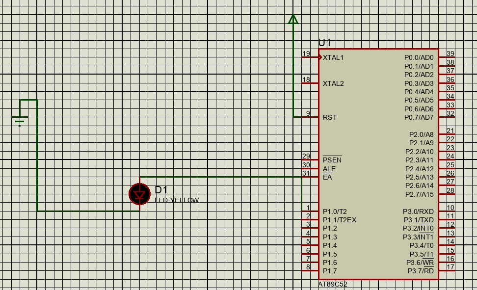

# proteus仿真

## 89C51

1.创建一个89c51的工程。

2.就会出现一个原理图，和一个代码框架。

3.加入一个接地和一个led，链接P1.0引脚。

4.可以看出，如果P1.0使用高电平时，则Led灯就会被点亮。

5.编写代码。

```c
#include<reg52.h>
void sleep()
{
   int i = 100;
   while(i)
      i--;
}
sbit led = P1^0;//sbit定义的引脚必须放到全局中定义，否则报错。

void main(void)
{
    
   // Write your code here
   while (1)
   {
      led = 0;
      sleep();
      led = 1;
      sleep();
   }
      
 }
```

6.让led灯循环的亮灭。

