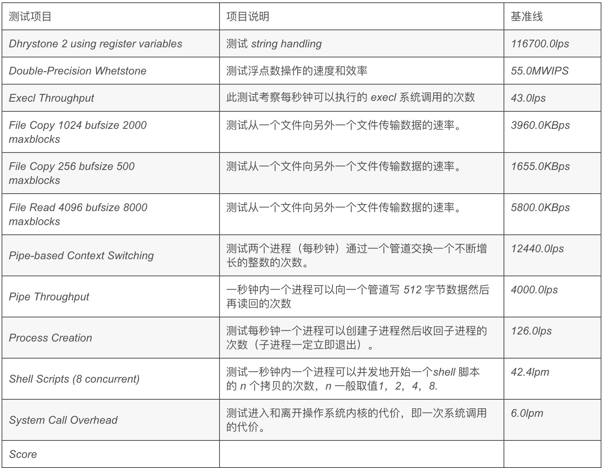
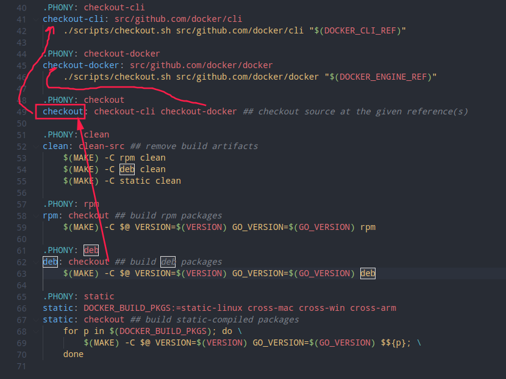

# 目录

[TOC]


# ===================

# 扫盲

## 1.实模式

CPU[复位](https://baike.baidu.com/item/复位/6156307)（reset）或加电（power on）的时候以实模式启动，处理器以实模式工作。在实模式下，内存寻址方式和8086相同，由16位段寄存器的内容乘以16（10H）当做段基地址，加上16位[偏移地址](https://baike.baidu.com/item/偏移地址/3108819)形成20位的物理地址，最大寻址空间1MB，最大分段64KB。可以使用32位指令。32位的x86 CPU用做高速的8086。在实模式下，所有的段都是可以读、写和可执行的。

## 2.Kconfig基本语法

menu <名字>  : 菜单的主目录.  目录名为后边的名字. 

```Kconfig
config 配置名:
	tristate "二级显示的信息"			#tristate为消息类型,menu下二级目录显示的信息.  也可为bool. 
	default y						 #默认选择.
	depends on A && B 	             #基于A模块和B模块,必须选择基准模块,才能显示该选项.
	select C					     #若选择该模块,则C模块也被选中.
```

数据类型介绍:

bool变量的值：   y和n

tristate变量的值： y、n和m

string变量的值：  字符串


## 3.内核地图:Kconfig和Makefile查找对应模块代码

## 4./dev,sysfs和/proc虚拟文件系统介绍

### 1.sysfs: 

sysfs是一个特殊的文件系统, 类似/proc, sysfs不仅像/proc一个允许用户空间访问内核的数据, 而且更结构化的方式向用户提供内核数据信息. sysfs是一种内存文件系统,它和kobject(内核对象)关系非常亲密.系统中的每一个kobject对应着sysfs中的一个目录,而每一个sysfs中的目录代表一个kobject对象,每个sysfs文件代表对应的kobject的属性.

   sysfs文件系统非常清晰的展示了设备驱动程序模型中各组件的层次关系. 其顶级目录包括block,device,bus,drivers,class,power,firmware等.


### 2. /proc:

Linux内核中的/proc文件系统是一种特殊的文件系统, 通过它可以在运行时访问内核的内部数据结构,改变内核设置,内核可以通过它向进程发送信息.应用程序可以通过/proc文件系统获取有关进程的有用信息,Linux中的ps,top命令就是通过读取/proc下的文件来获取它们需要的信息. 与其他文件系统不同,/proc主要存放由内核控制的状态信息,它存储于内存中而不是硬盘或其他存储设备上. /proc文件系统的根目录就是/proc. 对于系统中的任何一个进程来说,在proc的子目录都有一个同名的进程ID. 利用/proc文件系统可以获取进程信息,电源管理(APM)信息,CPU信息(cpuinfo),负载信息(loadavg),系统内存信息(meminfo)等等. 

### 3. /dev

设备文件目录

## 5.centos切换开机图形界面和控制台界面

CentOS7开机不进入图形界面设置
和cent6系列不同的是，不再是直接改文件中的5就可以了。

systemctl get-default  //获取当前的默认target

systemctl set-default multi-user.target
设置当前的target,可选值有graphical.target,multi-user.target，multi_user.target就是开机不进入图形界面的多用户模式。


# ===================

# Linux系统层次结构

一个完整的Linux发行版本大概可以分为以下四个层次结构:

Base System => X Protocol => Windows Manager => Application

如下图所示：

## **1. Base System**

  所谓Base System，也就是一个最小的基本系统，需要包含一些系统必备的开源组件，比如：kernel, filesystem, glibc, bash等。

  这个最小系统最终能达到的层次就是能够启动我们的命令行字符控制终端，也就是一个bash环境，这样一个最小系统可以精简、控制在几十M的大小以内。


## **2. X Protocol**

当我们构建完了最小的基本系统以后，这样一个系统只支持命令行字符终端模式，而无法支持图形化界面，如果想要使我们的Linux系统能够支持图形化界面，必须要有X Protocol的支持，基于这样的一个X协议，就可以在最小系统的层次上，构建Linux的窗口管理器。

X Protocol仅仅只是一个协议，对于这样一个协议，具体是由什么来实现的呢？在Linux早期的时候，是通过XFree86来实现X协议，经过多年的发展，XFree86已经更替为今天的X.Org项目。

不管是XFree86,  还是现在的X.Org，在实现X协议的时候，都是基于C/S架构，也就是X Server 和 X Client 的交互模式。关于X Server 和 X Client  之间的关系，在接下来的一节中将详细介绍。在这里大家只需明确：如果我们需要支持图形化界面，就需要有X相关的组件来作为一个沟通的桥梁。

当然，X 并不是唯一的桥梁，有像Wayland这样的新生替代品也已经面世，只是目前尚不成熟，也许在未来的某一天，Wayland将会全面代替现在的 X。


## **3. Windows Manager**

有了X层的支持以后，广大开源软件开发者或开发组织，就可以基于这样的一个接口，来开发上层的图形化窗口管理器，即Windows Manager, 比如我们熟知的KDE，Gnome， Xfce， Openbox等，这些图形化的桌面环境也就是对上面提到的X  Client的一个具体实现，来和 X Server进行交互通信。

在一下章节中，将具体讲解X Server, X Client， Xlib， QT， GTK， KDE， Gnome之间的关系。


## **4. Application**

Application也就是指我们的上层图形化应用程序，比如 Liberoffice办公套件，Firefox，Thunderbird，Pidgin等。

Linux系统中的大多数图形化应用程序都是基于QT或GTK+这两个开发套件来开发的，当然也有像Java， Python等编写的应用程序。


# ===================

# x86架构linux内核启动过程

参考博客:https://blog.csdn.net/GerryLee93/article/details/106474310

机器启动到linux初始化是一个比较复杂并且细节性较强的过程，大部分的实现都是由于历史遗留问题以及各种协议约定而来的，衔接性比较强，而且比较难跟踪，毕竟不是C语言那么简单，一个函数调用一个函数，整个脉络比较清晰明了。

这里主要是以linux-3.2.55版本内核为基础，将整个系统的初始化流程梳理了一下。

A、自摁下电源开关后，是由主板自动初始化处理器信息的，将CS、DS、ES、SS置为0xffff，而PC置为0x0000，由于初始化时，处理器处于实模式，那么也就是计算机执行的第一条指令在0xffff0这个位置。计算机执行的第一条指令是来自BIOS的，存储在ROM里面，通过ROM芯片译码以读取出来执行，该指令通常都是一条跳转指令，这是由于0xffff0距离可访问的内存结尾已经不远了，该指令可以用来跳转到具体的BIOS操作代码中；

B、BIOS开始执行后，做了不少事情，比如Power On Self Test（POST，开机自检），检查CPU寄存器、周边芯片的状态，以及针对动态内存、主板芯片组、显卡以及相关外围的寄存器做初始化设置，并检查能够正常工作，同时记录系统的设置值，最重要的就是将常驻程序库（可以理解为BIOS的库，基本上就是中断）放置在某段内存中，提供给操作系统或者应用程序调用，比如int 0x13等；

C、BIOS毕竟不是系统，完成了分内工作后，执行int 0x19（前面提到的BIOS的常驻程序库）将存储在磁盘0头0道1扇区的MBR读入到内存0x7c00中，然后BIOS通过跳转指令去到0x7c00去执行引导程序代码；

D、MBR的引导程序对不同的linux版本而言各有不同，最初0.11版本中，linux的/boot/bootsect.s自己实现了这个MBR引导程序，而如今3.2.55的linux内核版本自身已经不再实现MBR引导程序了，都是由GRUB的/stage1/stage1.S实现的，具体的引导程序历史可以参考linux内核中的/Documentation/x86/boot.txt；

E、Linux 0.11的引导过程就不谈了，关于这块的资料数不胜数，那么GRUB实现的引导，主要是给用户提供了系统引导选择和引导编辑等功能，核心的是它通过调用BIOS的常驻程序库去将linux内核映像加载到内存当中；

F、GRUB加载完了内核映像，将会跳转到内核的文件/arch/x86/boot/header.S里面的_start开始执行，其实_start也没什么好执行的，就跳转到start_of_setup去设置准备给实模式下main函数运行的环境；

G、开始进入main函数执行，该函数的实现在文件/arch/x86/boot/main.c里面，具体可以进入去分析里面的代码，其主要的莫过于一些参数的准备、堆的初始化、CPU的检测、BIOS的设置以及内存检测等工作（这里使用了一些BIOS中断，所以这些都是在实模式下的！！！），然后开始转入保护模式；

H、进入保护模式后，将会跳转去执行arch/x86/boot/compressed/head_32.S里面的startup_32，其主要设置一个基本的环境，如堆栈等；

I、再往下就是调用文件/arch/x86/boot/compressed/misc.c里面的decompress_kernel，用来解压内核，当内核被解压到内存中之后，就可以调用它了；

J、解压完内核，还要调用一个startup_32，这个不同于前面的那个，这个是位于文件/arch/x86/kernel/head_32.S里面的，主要工作是对页表进行初始化，并启动内存分页功能，初始化0号进程；

K、startup_32执行完了之后，最后进入内核的主题函数start_kernel，该函数位于文件/init/main.c，自此完成linux的最后初始化。

以上就是机器启动linux的整个过程，主要是梳理了初始化实现的一个线索，暂时不深入分析。


# ===================

# input子系统

​    输入输出是用户和产品交互的手段，因此输入驱动开发在Linux驱动开发中很常见。同时，input子系统的分层架构思想在Linux驱动设计中极具代表性和先进性，因此对Linux input子系统进行深入分析很有意义。

## 1.Linux如何查看所有注册的输入子系统

### 1. /dev/input目录

/dev/input目录下的事件都是在驱动中调用input_register_device(struct input_dev *dev)产生的。

如我的uos中显示：


### 2. 与event对应的设备信息。

位于/proc/bus/input/devices,例子如下:

### 3. 写测试程序读取鼠标和键盘的上报信息。

代码如下：

```c
#include <linux/input.h>
#include <unistd.h>
#include <sys/types.h>
#include <sys/stat.h>
#include <fcntl.h>
#include <stdio.h>
//具体哪个event要通过设备信息来看。
#define  INPUT_MOUSE    "/dev/input/event6"    /* 我电脑的鼠标*/
#define  INPUT_KEY      "/dev/input/event1"    
#define  INPUT_MOUSE1     "/dev/input/mouse0"   
int main(void)
{
    int fd = -1, ret = -1;
    struct input_event ev;
    fd = open(INPUT_MOUSE , O_RDONLY);    /* 打开鼠标的设备文件 */
    if(fd < 0)
    {
        perror("open");
        return -1;
    }
    while(1)
    {
        memset(&ev, 0, sizeof(struct input_event));    
        ret = read(fd, &ev, sizeof(struct input_event));    /* 读鼠标（会阻塞） */
        if(ret != sizeof(struct input_event))
        {
            perror("read");
            close(fd);
            return -1;
        }
        /* 打印读到的键值 */
        printf("--------------------\n");
        printf("type = %u.\n", ev.type);
        printf("code = %u.\n", ev.code);
        printf("value = %u.\n", ev.value);
    }
    return 0;
}
```

执行效果：鼠标移动就会打印数据。 


### 4.字符设备和input子系统处理流程对比

input子系统本质: 将字符设备驱动进行封装.

字符设备(按键举例):中断触发->延后机制->字符设备->文件操作接口->提供给应用层

input子系统(按键举例) :中断触发->延后机制->input子系统专用的API函数->提供给应用层

## 2. input子系统结构图

input子系统由下面3部分组成:

驱动层(Drivers)

输入子系统核心层(Input Core)

事件处理层(Event Handler)


## 3. input子系统介绍

Linux input  子系统将一个输入设备的输入过程分成了设备驱动(input device driver)和事件驱动（input  event  driver）两个层。前者负责从底层硬件采集数据；后者负责与用户程序接口，将采集到的数据分发给不同的用户接口。通过这样的设计，将千差万别的设备统一到了为数不多的几种驱动接口上。同一种事件驱动可以用来处理多个同类设备；同一个设备也可以和多种事件驱动相衔接。而事件驱动和设备驱动则由输入核心层进行连接，匹配。而事件驱动是系统已经定义好的, 再写设备驱动时需要哪种类型的事件驱动就去做匹配就可以了. 

**设备驱动(input device driver)**:    

​		自己写的,比如 drivers/hid/usbhid/usbmouse.c

**事件驱动(input  event  driver)**:	

​		系统已经开发好了 drivers/input/evdev.c

​		专门处理输入设备产生的按键(Event)事件: evdev

​		鼠标事件:mousedev

上：输入事件驱动层         （打包数据，面向应用）

中：输入核心层                 （向下提供注册接口，向上给具体的hander发送数据）

下：输入设备驱动层         （底层驱动，面向硬件）    


## 4. input子系统工作过程

以鼠标按键为例说明input子系统的工作过程：

鼠标按下－＞出发中断（中断是已经注册好的）－＞中断处理函数－＞在函数中就会读硬件寄存器来判断按下的是哪个按键和状态－＞将按键信息上报给input core层－＞input core层处理完成后会上报给input event层，input event层会将我们的输入事件封装成一个input_event结构体放入一个缓冲区中－＞应用层read就会将将缓冲区中的数据读取出去．

## 5.重要结构

**Input_device**: 代表着具体的输入设备，它直接从硬件中读取数据，并以事件的形式转发

**Hanler**: 代表接收某一类事件的上层接口，对应于一类事件设备文件

**Handle** : 用于将input_device 和 handler 连接起来，对应于某1个具体的设备文件

**Client**: 对应于用户程序对文件的访问接口，每open一次事件驱动，就创建一个client


input子系统的核心层维护着两条链表

```c
static LIST_HEAD(input_dev_list);         //记录所有的输入设备
static LIST_HEAD(input_handler_list);     //记录所有的事件驱动
```

每当有新设备或者新的事件驱动被系统加载(调用input_register_device()或者input_register_driver()),都会扫描整个链表，并调用函数input_match_device(struct input_handler *handler, struct input_dev *dev)尝试配对工作．input_handler->id_table记录了需要匹配的特征．

id_table中有bitmap来控制匹配.


## 6.事件驱动

事件驱动注册程序分析：


## 7.设备驱动

## 8.输入子系统核心层


# ===================

# USB驱动

usb设备基础概念：https://blog.csdn.net/zqixiao_09/article/details/50984074

## USB设备基础

USB设备是非常复杂的，它由许多不同的逻辑单元组成，这些逻辑单元之间的关系可以简单地描述如下：

1. 设备通常具有一个或者多个配置
2. 配置经常具有一个或者多个接口
3. 接口通常具有一个或者多个设置
4. 接口没有或者具有一个以上的端点


## USB鼠标驱动代码详解

```c
/*
 *  Copyright (c) 1999-2001 Vojtech Pavlik
 *
 *  USB HIDBP Mouse support
 */

/*
 * This program is free software; you can redistribute it and/or modify
 * it under the terms of the GNU General Public License as published by
 * the Free Software Foundation; either version 2 of the License, or
 * (at your option) any later version.
 *
 * This program is distributed in the hope that it will be useful,
 * but WITHOUT ANY WARRANTY; without even the implied warranty of
 * MERCHANTABILITY or FITNESS FOR A PARTICULAR PURPOSE.  See the
 * GNU General Public License for more details.
 *
 * You should have received a copy of the GNU General Public License
 * along with this program; if not, write to the Free Software
 * Foundation, Inc., 59 Temple Place, Suite 330, Boston, MA 02111-1307 USA
 *
 * Should you need to contact me, the author, you can do so either by
 * e-mail - mail your message to <vojtech@ucw.cz>, or by paper mail:
 * Vojtech Pavlik, Simunkova 1594, Prague 8, 182 00 Czech Republic
 */

#include <linux/kernel.h>
#include <linux/slab.h>
#include <linux/module.h>
#include <linux/init.h>
#include <linux/usb/input.h>
#include <linux/hid.h>

/* for apple IDs */
#ifdef CONFIG_USB_HID_MODULE
#include "../hid-ids.h"
#endif

/*
 * Version Information
 */
#define DRIVER_VERSION "v1.6"
#define DRIVER_AUTHOR "Vojtech Pavlik <vojtech@ucw.cz>"
#define DRIVER_DESC "USB HID Boot Protocol mouse driver"

MODULE_AUTHOR(DRIVER_AUTHOR);
MODULE_DESCRIPTION(DRIVER_DESC);
MODULE_LICENSE("GPL");

/*  
 * 鼠标结构体，用于描述鼠标设备。  
 */
struct usb_mouse {
	char name[128]; /* 鼠标设备的名称，包括生产厂商、产品类别、产品等信息 */
	char phys[64]; /* 设备节点名称 */
	struct usb_device *
		usbdev; /* USB 鼠标是一种 USB 设备，需要内嵌一个 USB 设备结构体来描述其 USB 属性 */
	struct input_dev *
		dev; /* USB 鼠标同时又是一种输入设备，需要内嵌一个输入设备结构体来描述其输入设备的属性 */
	struct urb *irq; /* URB 请求包结构体，用于传送数据 */

	signed char *data; /* 普通传输用的地址 */
	dma_addr_t data_dma; /* 普通传输用的地址 */
};
/*  
 * urb 回调函数，在完成提交 urb 后，urb 回调函数将被调用。  
 * 此函数作为 usb_fill_int_urb 函数的形参，为构建的 urb 制定的回调函数。  
 */
static void usb_mouse_irq(struct urb *urb)
{
	/*  
     * urb 中的 context 指针用于为 USB 驱动程序保存一些数据。比如在这个回调函数的形参没有传递在 probe中为 mouse 结构体分配的那块内存的地址指针，而又需要用到那块内存区域中的数据，context 指针则帮了大忙了！ 
     * 在填充 urb 时将 context 指针指向 mouse 结构体数据区，在这又创建一个局部 mouse 指针指向在 probe函数中为 mouse 申请的那块内存，那块内存保存着非常重要数据。 
     * 当 urb 通过 USB core 提交给 hc 之后，如果结果正常，mouse->data 指向的内存区域将保存着鼠标的按键和移动坐标信息，系统则依靠这些信息对鼠标的行为作出反应。  
     * mouse 中内嵌的 dev 指针，指向 input_dev 所属于的内存区域。 
     */
	struct usb_mouse *mouse = urb->context;
	signed char *data = mouse->data;
	struct input_dev *dev = mouse->dev;
	int status;
	/*  
     * status 值为 0 表示 urb 成功返回，直接跳出循环把鼠标事件报告给输入子系统。  

     * ECONNRESET 出错信息表示 urb 被 usb_unlink_urb 函数给 unlink 了，ENOENT 出错信息表示 urb 被usb_kill_urb 函数给 kill 了。usb_kill_urb 表示彻底结束 urb 的生命周期，而 usb_unlink_urb 则是停止 urb，这个函数不等 urb 完全终止就会返回给回调函数。这在运行中断处理程序时或者等待某自旋锁时非常有用，在这两种情况下是不能睡眠的，而等待一个 urb 完全停止很可能会出现睡眠的情况。 
     * ESHUTDOWN 这种错误表示 USB 主控制器驱动程序发生了严重的错误，或者提交完 urb 的一瞬间设备被拔出。 
     * 遇见除了以上三种错误以外的错误，将申请重传 urb。  
     */
	switch (urb->status) {
	case 0: /* success */
		break;
	case -ECONNRESET: /* unlink */
	case -ENOENT:
	case -ESHUTDOWN:
		return;
	/* -EPIPE:  should clear the halt */
	default: /* error */
		goto resubmit;
	}
	/*  
     * 向输入子系统汇报鼠标事件情况，以便作出反应。  
     * data 数组的第0个字节：bit 0、1、2、3、4分别代表左、右、中、SIDE、EXTRA键的按下情况；  
     * data 数组的第1个字节：表示鼠标的水平位移；  
     * data 数组的第2个字节：表示鼠标的垂直位移；  
     * data 数组的第3个字节：REL_WHEEL位移。  
     */
	input_report_key(dev, BTN_LEFT, data[0] & 0x01);
	input_report_key(dev, BTN_RIGHT, data[0] & 0x02);
	input_report_key(dev, BTN_MIDDLE, data[0] & 0x04);
	input_report_key(dev, BTN_SIDE, data[0] & 0x08);
	input_report_key(dev, BTN_EXTRA, data[0] & 0x10);

	input_report_rel(dev, REL_X, data[1]);
	input_report_rel(dev, REL_Y, data[2]);
	input_report_rel(dev, REL_WHEEL, data[3]);
	/*  
     * 这里是用于事件同步。上面几行是一次完整的鼠标事件，包括按键信息、绝对坐标信息和滚轮信息，输入子系统正是通过这个同步信号来在多个完整事件报告中区分每一次完整事件报告。示意如下： 
     * 按键信息 坐标位移信息 滚轮信息 EV_SYC | 按键信息 坐标位移信息 滚轮信息 EV_SYC ...  
     */
	input_sync(dev);
	/*  
     * 系统需要周期性不断地获取鼠标的事件信息，因此在 urb 回调函数的末尾再次提交 urb 请求块，这样又会  
     * 调用新的回调函数，周而复始。  
     * 在回调函数中提交 urb 一定只能是 GFP_ATOMIC 优先级的，因为 urb 回调函数运行于中断上下文中，在提交 urb 过程中可能会需要申请内存、保持信号量，这些操作或许会导致 USB core 睡眠，一切导致睡眠的行为都是不允许的。 
     */
resubmit:
	status = usb_submit_urb(urb,
				GFP_ATOMIC); //提交到USB核心，以发送到USB设备。
	if (status)
		dev_err(&mouse->usbdev->dev,
			"can't resubmit intr, %s-%s/input0, status %d\n",
			mouse->usbdev->bus->bus_name, mouse->usbdev->devpath,
			status);
}

/*  
 * 打开鼠标设备时，开始提交在 probe 函数中构建的 urb，进入 urb 周期。  
 */
static int usb_mouse_open(struct input_dev *dev)
{
	struct usb_mouse *mouse = input_get_drvdata(dev);

	mouse->irq->dev = mouse->usbdev;
	if (usb_submit_urb(mouse->irq, GFP_KERNEL))
		return -EIO;

	return 0;
}
/*  
 * 关闭鼠标设备时，结束 urb 生命周期。  
 */
static void usb_mouse_close(struct input_dev *dev)
{
	struct usb_mouse *mouse = input_get_drvdata(dev);

	usb_kill_urb(mouse->irq);
}
/*  
 * 驱动程序的探测函数  
 */
static int usb_mouse_probe(struct usb_interface *intf,
			   const struct usb_device_id *id)
{
	/*   
     * 接口结构体包含于设备结构体中，interface_to_usbdev 是通过接口结构体获得它的设备结构体。 
     * usb_host_interface 是用于描述接口设置的结构体，内嵌在接口结构体 usb_interface 中。  
     * usb_endpoint_descriptor 是端点描述符结构体，内嵌在端点结构体 usb_host_endpoint 中，而端点结构体内嵌在接口设置结构体中。 
     */
	struct usb_device *dev =
		interface_to_usbdev(intf); //根据usb接口获取动态创建的usb_device
	struct usb_host_interface *interface;
	struct usb_endpoint_descriptor *endpoint;
	struct usb_mouse *mouse;
	struct input_dev *input_dev;
	int pipe, maxp;
	int error = -ENOMEM;

	interface = intf->cur_altsetting;
	/* 鼠标仅有一个 interrupt 类型的 in 端点，不满足此要求的设备均报错 */
	if (interface->desc.bNumEndpoints != 1)
		return -ENODEV;

	endpoint = &interface->endpoint[0].desc;
	if (!usb_endpoint_is_int_in(endpoint))
		return -ENODEV;
	/*  
     * 返回对应端点能够传输的最大的数据包，鼠标的返回的最大数据包为4个字节，数据包具体内容在 urb  
     * 回调函数中有详细说明。  
     */
	pipe = usb_rcvintpipe(dev, endpoint->bEndpointAddress);
	/* 
	 * bEndpointAddress这是这个特定端点的 USB 地址. 还包含在这个 8-位 值的是端点的方向. 位掩码 USB_DIR_OUT 和 USB_DIR_IN 可用来和这个成员比对, 
	 * 来决定给这个端点的数据是到设备还是到主机.
	 * pipe,要访问的端点所对应的管道，使用usb_sndintpipe()或usb_rcvintpipe()创建
	 */
	maxp = usb_maxpacket(dev, pipe, usb_pipeout(pipe));
	/* 为 mouse 设备结构体分配内存 */
	mouse = kzalloc(sizeof(struct usb_mouse), GFP_KERNEL);
	input_dev = input_allocate_device();
	if (!mouse || !input_dev)
		goto fail1;
	/*  
     * 申请内存空间用于数据传输，data 为指向该空间的地址，data_dma 则是这块内存空间的 dma 映射，即这块内存空间对应的 dma 地址。
	 * 在使用 dma 传输的情况下，则使用 data_dma 指向的 dma 区域，否则使用 data 指向的普通内存区域进行传输。 
	 * GFP_ATOMIC 表示不等待，GFP_KERNEL 是普通的优先级，可以睡眠等待，由于鼠标使用中断传输方式，不允许睡眠状态，
	 * data 又是周期性获取鼠标事件的存储区，因此使用 GFP_ATOMIC 优先级，如果不能分配到内存则立即返回 0。 
     */
	mouse->data = usb_alloc_coherent(dev, 8, GFP_ATOMIC, &mouse->data_dma);
	if (!mouse->data)
		goto fail1;
	/*  
     * 为 urb 结构体申请内存空间，第一个参数表示等时传输时需要传送包的数量，其它传输方式则为0。申请的内存将通过下面即将见到的 usb_fill_int_urb 函数进行填充。
	 */
	mouse->irq = usb_alloc_urb(0, GFP_KERNEL);
	if (!mouse->irq)
		goto fail2;
	/* 填充 usb 设备结构体和输入设备结构体 */
	mouse->usbdev = dev;
	mouse->dev = input_dev;
	/* 获取鼠标设备的名称 */
	if (dev->manufacturer)
		strlcpy(mouse->name, dev->manufacturer, sizeof(mouse->name));

	if (dev->product) {
		if (dev->manufacturer)
			strlcat(mouse->name, " ", sizeof(mouse->name));
		strlcat(mouse->name, dev->product, sizeof(mouse->name));
	}

	if (!strlen(mouse->name))
		snprintf(mouse->name, sizeof(mouse->name),
			 "USB HIDBP Mouse %04x:%04x",
			 le16_to_cpu(dev->descriptor.idVendor),
			 le16_to_cpu(dev->descriptor.idProduct));
	/*  
     * 填充鼠标设备结构体中的节点名。usb_make_path 用来获取 USB 设备在 Sysfs 中的路径，格式  
     * 为：usb-usb 总线号-路径名。  
     */
	usb_make_path(dev, mouse->phys, sizeof(mouse->phys));
	strlcat(mouse->phys, "/input0", sizeof(mouse->phys));
	/* 将鼠标设备的名称赋给鼠标设备内嵌的输入子系统结构体 */
	input_dev->name = mouse->name;
	/* 将鼠标设备的设备节点名赋给鼠标设备内嵌的输入子系统结构体 */
	input_dev->phys = mouse->phys;
	/*  
     * input_dev 中的 input_id 结构体，用来存储厂商、设备类型和设备的编号，这个函数是将设备描述符中的编号赋给内嵌的输入子系统结构体  
     */
	usb_to_input_id(dev, &input_dev->id);
	/* cdev 是设备所属类别（class device） */
	input_dev->dev.parent = &intf->dev;

	/* evbit 用来描述事件，EV_KEY 是按键事件，EV_REL 是相对坐标事件 */
	input_dev->evbit[0] = BIT_MASK(EV_KEY) | BIT_MASK(EV_REL);
	/* keybit 表示键值，包括左键、右键和中键 */
	input_dev->keybit[BIT_WORD(BTN_MOUSE)] =
		BIT_MASK(BTN_LEFT) | BIT_MASK(BTN_RIGHT) | BIT_MASK(BTN_MIDDLE);
	/* relbit 用于表示相对坐标值 */
	input_dev->relbit[0] = BIT_MASK(REL_X) | BIT_MASK(REL_Y);
	/* 有的鼠标还有其它按键 */
	input_dev->keybit[BIT_WORD(BTN_MOUSE)] |=
		BIT_MASK(BTN_SIDE) | BIT_MASK(BTN_EXTRA);
	/* 中键滚轮的滚动值 */
	input_dev->relbit[0] |= BIT_MASK(REL_WHEEL);

	input_set_drvdata(input_dev, mouse);

	input_dev->open = usb_mouse_open;
	input_dev->close = usb_mouse_close;
	/*  
     * 填充构建 urb，将刚才填充好的 mouse 结构体的数据填充进 urb 结构体中，在 open 中递交 urb。  
     * 当 urb 包含一个即将传输的 DMA 缓冲区时应该设置URB_NO_TRANSFER_DMA_MAP。USB核心使用  
     * transfer_dma变量所指向的缓冲区，而不是transfer_buffer变量所指向的。  
     * URB_NO_SETUP_DMA_MAP 用于 Setup 包，URB_NO_TRANSFER_DMA_MAP 用于所有 Data 包。  
     */
	usb_fill_int_urb(mouse->irq, dev, pipe, mouse->data,
			 (maxp > 8 ? 8 : maxp), usb_mouse_irq, mouse,
			 endpoint->bInterval);
	mouse->irq->transfer_dma = mouse->data_dma;
	mouse->irq->transfer_flags |= URB_NO_TRANSFER_DMA_MAP;
	/* 向系统注册输入设备 */
	error = input_register_device(mouse->dev);
	if (error)
		goto fail3;
	/*  
     * 一般在 probe 函数中，都需要将设备相关信息保存在一个 usb_interface 结构体中，以便以后通过  
     * usb_get_intfdata 获取使用。这里鼠标设备结构体信息将保存在 intf 接口结构体内嵌的设备结构体中的 driver_data 数据成员中，即 intf->dev->dirver_data = mouse。
	 */
	usb_set_intfdata(intf, mouse);
	return 0;

fail3:
	usb_free_urb(mouse->irq);
fail2:
	usb_free_coherent(dev, 8, mouse->data, mouse->data_dma);
fail1:
	input_free_device(input_dev);
	kfree(mouse);
	return error;
}

/*  
 * 鼠标设备拔出时的处理函数  
 */ 
static void usb_mouse_disconnect(struct usb_interface *intf)
{
	/* 获取鼠标设备结构体 */ 
	struct usb_mouse *mouse = usb_get_intfdata(intf);
	/* intf->dev->dirver_data = NULL，将接口结构体中的鼠标设备指针置空。*/
	usb_set_intfdata(intf, NULL);
	if (mouse) {
		/* 结束 urb 生命周期 */
		usb_kill_urb(mouse->irq);
		/* 将鼠标设备从输入子系统中注销 */  
		input_unregister_device(mouse->dev);
		/* 释放 urb 存储空间 */ 
		usb_free_urb(mouse->irq);
		/* 释放存放鼠标事件的 data 存储空间 */
		usb_free_coherent(interface_to_usbdev(intf), 8, mouse->data,
				  mouse->data_dma);
		/* 释放存放鼠标结构体的存储空间 */ 
		kfree(mouse);
	}
}
/*  
 * usb_device_id 结构体用于表示该驱动程序所支持的设备，USB_INTERFACE_INFO 可以用来匹配特定类型的接口， 
 * 这个宏的参数意思为 (类别, 子类别, 协议)。  
 * USB_INTERFACE_CLASS_HID 表示是一种 HID (Human Interface Device)，即人机交互设备类别； 
 * USB_INTERFACE_SUBCLASS_BOOT 是子类别，表示是一种 boot 阶段使用的 HID； 
 * USB_INTERFACE_PROTOCOL_MOUSE 表示是鼠标设备，遵循鼠标的协议。 
 */
/**
    #define USB_INTERFACE_INFO(cl,sc,pr)\
            match_flags = USB_DEVICE_ID_MATCH_DEV_INFO,\
            bDeviceClass = (cl),\  //设备的类型
            bDeviceSubclass = (src),\//设备的子类型
            bDeviceProtocol = (pr)//设备使用的协议
    这个宏用来创建要给struct usb_device_id结构体，这个结构体存储了设备的类型和协议信息     
*/
static const struct usb_device_id usb_mouse_id_table[] = {
	//设备的类型是 人机交互类设备，子类型是一种boot设备 ，遵循鼠标协议
	{ USB_INTERFACE_INFO(USB_INTERFACE_CLASS_HID,
			     USB_INTERFACE_SUBCLASS_BOOT,
			     USB_INTERFACE_PROTOCOL_MOUSE) },
	{} /* Terminating entry */
};
/*  
 * 这个宏用来让运行在用户空间的程序知道这个驱动程序能够支持的设备，对于 USB 驱动程序来说，第一个参数必须  
 * 是 usb。  
 */ 
MODULE_DEVICE_TABLE(usb, usb_mouse_id_table);

/*  
 * 鼠标驱动程序结构体  
 */
//匹配成功后会调用驱动提供的probe函数
static struct usb_driver usb_mouse_driver = {
	.name = "usbmouse",
	.probe = usb_mouse_probe,
	.disconnect = usb_mouse_disconnect,
	.id_table = usb_mouse_id_table,
};

module_usb_driver(usb_mouse_driver);
```


# ===================

# pipe管道内核源码分析

## 1.代码中出现的语法层面分析

* 1.__cplusplus

```c
#ifdef __cplusplus  　　//该字段是c++编译器中特有的,用来区分编译器是gcc还是g++
#define CPP_ASMLINKAGE extern "C"
#else
#define CPP_ASMLINKAGE
#endif
```

* 2.SYSCALL_DEFINE*宏定义介绍

表示宏内定义的函数为系统调用，*处所写的数字代表的是该系统调用所使用的参数个数。

系统调用的具体用法请看第八章－>自定义系统调用。

* 3.fs_initcall(init_pipe_fs);

  给系统内核添加一个功能函数。　　个人理解：文件系统类模块的初始化函数。

* 4.struct inode

  inode是VFS使用的一个对象，用于存放内核在操作文件或目录时所需要的全部信息。

## 2.代码分析

* 1.入口函数

```c
SYSCALL_DEFINE2(pipe2, int __user *, fildes, int, flags)
{
	return do_pipe2(fildes, flags);
}

SYSCALL_DEFINE1(pipe, int __user *, fildes)
{
	return do_pipe2(fildes, 0);
}
```


# ===================

# 内核调试技术

## 一、使用GDB调试内核方法

### 1.ARM

1. sudo apt-get install qemu libncurses5-dev gcc-arm-linux-gnueabi buildessent  安装编译需要的工具包。

2. 下载linux源码，和下载busybox工具包：https://busybox.net/downloads/busybox-1.24.0.tar.bz2

3. 利用busybox编译最小文件系统：

```sh
   cd busybox
   export ARCH=arm
   export CROSS_COMPILE=arm-linux-gnueabi-
   make menuconfig
```

   进入menuconfig后，配置成静态编译。

   Busybox Settings ----> Build Options -----> [*]Build BusyBox as a static binary (no shared libs)

4. 然后make install 编译完成，在busybox跟目录会生成一个__install的目录，该目录是编译好的文件系统需要的一些命令集合。

5. 下载linux内核源码。 把_install目录复制到linux源码目录下。然后进入__install目录。

   ```sh
   mkdir etc
   mkdir dev
   mkdir mnt
   mkdir -p etc/init.d/
   ```

6. 创建etc,dev等目录。

7. 在__install /etc/init.d/目录下创建rcS文件，写入如下内容,并赋予可执行权限。

   ```sh
   mkdir -p /proc
   mkdir -p /tmp
   mkdir -p /sys
   mkdir -p /mnt
   /bin/mount -a
   mkdir -p /dev/pts
   mount -t devpts devpts /dev/pts
   echo /sbin/mdev > /proc/sys/kernel/hotplug
   mdev -s
   ```

8. 在__install/etc目录下创建一个fstab文件，并写入如下内容。 

   ```sh
   proc /proc proc defaults 0 0
   tmpfs /tmp tmpfs defaults 0 0
   sysfs /sys sysfs defaults 0 0
   tmpfs /dev tmpfs defaults 0 0
   debugfs /sys/kernel/debug debugfs defaults 0 0
   ```

9. 在__install/etc下创建一个inittab文件，并写入如下内容。

   ```sh
   ::sysint:/etc/init.d/rcS
   ::respawn:-/bin/sh
   ::askfirst:-/bin/sh
   ::ctrlaltdel:/bin/umount -a -r
   ```

10. 在__install/dev目录下创建如下设备节点，需要root权限。

    ```sh
    cd _install/dev
    sudo mknod console c 5 1
    sudo mknod null c 1 3
    ```

11. 编译内核

    ```sh
    cd linux-4.*.**
    export ARCH=arm
    export CROSS_COMPILE=arm-linux-gnueabi-
    make vexpress_defconfig
    make menuconfig
    ```

12. 配置如下所示：

    

13. 开始编译内核

    ```sh
    make bzImage -j4 ARCH=arm CROSS_COMPILE=arm-linux-gnueabi-
    make dtbs
    ```

14. 安装gdb调试工具。 

    ```sh
    sudo apt-get install gdb-arm-none-eabi
    ```

    发现UOS没有这个软件，但是有个新版本的。 叫gdb-multiarch,安装上述软件时会自动安装这个，应该是更新版。

15. 首先要确保编译的内核包含调试信息。Kernel haking-->Compile-time checks and compiler options --->[*]Compile the kernel with debug info。  勾选后重新编译内核。 然后启动内核：

    ```sh
    qemu-system-arm -nographic -M vexpress-a9 -m 1024M -kernel arch/arm/boot/zImage -append "rdinit=/linuxrc console=ttyAMA0 loglevel=8" -dtb arch/arm/boot/dts/vexpress-v2p-ca9.dtb -S -s
    ```

    重新启动一个控制台，运行gdb-multiarch vmlinux，进入控制台，开始打断点并执行，命令如下：

    ```sh
    target remote localhost:1234      	#通过1234端口远程连接到QEMU平台
    b start_kernel  					#在start_kernel处打一个断点。 
    b sort_main_extable    				#在sort_main_extable函数处打一个断点。
    c 									#开始让内核运行。
    ```

    如下图所示：

    

    完全运行时，进入系统后显示如下图所示：

### 2.X86

X86使用的qemu和arm不同，x86使用的是qemu-system-x86_64

1. sudo apt-get install qemu libncurses5-dev gcc-arm-linux-gnueabi buildessent  qemu-system-x86_64安装编译需要的工具包。

2. 下载linux源码，和下载busybox工具包：https://busybox.net/downloads/busybox-1.24.0.tar.bz2

3. 编译linux的x86_64内核。

   编译之前需要打开内核调试功能：Kernel hacking --> Compile-time checks and compiler options --> Compile the kernel with debug info

   ```sh
   make x86_64_defconfig    #生成x86_64版本配置文件．
   make bzImage   #编译内核
   make modules   #编译内核模块
   ```

4. 启动内核．

   ```sh
   qemu-system-x86_64　-m 512M　-smp 4　-kernel ./bzImage
   ```

   上述命令假设编译好的 bzImage 内核文件就存放在当前目录下。不出意外的话，就可以在启动窗口中看到内核的启动日志了。在内核启动的最后，会出现一条 panic 日志：

   ```sh
   Kernel panic - not syncing: VFS: Unable to mount root fs on unknown-block(0, 0)
   ```

     从日志内容可以看出，内核启动到一定阶段后尝试加载根文件系统，但我们没有指定任何磁盘设备，所以无法挂载根文件系统。而且上一节中编译出来的内核模块现在也没有用上，内核模块也需要存放到文件系统中供内核需要的时候进行加载。所以，接下来需要制作一个磁盘镜像文件供内核作为根文件系统加载。

5. 创建磁盘镜像文件，使用 qemu-img创建一个 512M 的磁盘镜像文件：

   ```sh
   qemu-img create -f raw disk.raw 512M
   ```

   现在 disk.raw 文件就相当于一块磁盘，为了在里面存储文件，需要先进行格式化，创建文件系统。

   ```sh
   mkfs -t ext4 ./disk.raw
   ```

6. 挂载磁盘镜像文件。

   ```sh
   sudo mount -o loop ./disk.raw ./img
   ```

7. 安装内核模块。 将之前编译好的内核模块安装到磁盘镜像中，命令如下：

   ```sh
   sudo make modules_install INSTALL_MOD_PATH=./img  # 指定安装路径
   ```

   完成后会在./img/lib/modules/下看到安装好的内核模块。

8. 使用磁盘文件启动qemu：

   ```sh
   qemu-system-x86_64 -m 512M -smp 4 -kernel ./bzImage -drive format=raw,file=./disk.raw -append "root=/dev/sda"
   ```

   file=./disk.raw : 指定文件作为磁盘。   root=/dev/sda :内核启动参数，指定根文件系统所在设备。

   不出意外的话，会显示：

   ```sh
   Kernel panic - not syncing: No working init found. Try passing init= option to Kernel. See Linux Documentation/admin-guide/init.rst for guidance.
   ```

   说明启动参数里边没有指定init选项，磁盘镜像中也没有相应的init程序。

9. 编译busybox：

   ```sh
   make defconfig
   make menuconfig
   ```

   这里有一个重要的配置，因为 busybox 将被用作 init 程序，而且我们的磁盘镜像中没有任何其它库，所以 busybox 需要被静态编译成一个独立、无依赖的可执行文件，以免运行时发生链接错误。配置路径如下：

   ```sh
   Busybox Settings --->
          --- Build Options
          [*] Build BusyBox as a static binary (no shared libs)
   ```

   最后，编译并安装到磁盘镜像中：

   ```sh
   make
   make CONFIG_PREFIX=需要安装的文件夹路径 install
   ```

10. 加入init内核启动参数来指定busybox作为init进程，再次尝试启动。

    ```sh
    qemu-system-x86_64 -m 512M -smp 4 -kernel ./bzImage -drive format=raw,file=./disk.raw -append "init=/linuxrc root=/dev/sda"
    ```

    还是有问题，会出现：

    ```sh
    can't run '/etc/init.d/rcS': No such file or directory
    can't open /dev/tty3: No such file or directory
    can't open /dev/tty4: No such file or directory
    ```

    init进程执行报错，需要配置。 

11. init 启动后会扫描/etc/inittab配置文件，这个配置文件决定了init程序的行为。而busybox init再没有/etc/inittab文件的情况下也能工作，因为它有默认行为。它的默认行为相当于如下配置：

    ```sh
    ::sysinit:/etc/init.d/rcS
    ::askfirst:/bin/sh
    ::ctrlaltdel:/sbin/reboot
    ::shutdown:/sbin/swapoff -a
    ::shutdown:/bin/umount -a -r
    ::restart:/sbin/init
    tty2::askfirst:/bin/sh
    tty3::askfirst:/bin/sh
    tty4::askfirst:/bin/sh
    ```

    但是不能这样用，需要去掉后边的三行。 如下：

    ```sh
    ::sysinit:/etc/init.d/rcS
    ::askfirst:/bin/ash
    ::ctrlaltdel:/sbin/reboot
    ::shutdown:/sbin/swapoff -a
    ::shutdown:/bin/umount -a -r
    ::restart:/sbin/init
    ```

12. 创建可执行文件/etc/init.d/rcS 内容如下（暂时啥都不做，后边要加）：

    ```sh
    #!/bin/sh
    ```

    这次应该可以进入控制台。 但是/dev  这些都不能访问。

13. 创建并在脚本中挂载/dev,/proc, /sys 文件系统：

    ```sh
    mkdir ./img/dev ./img/proc ./img/sys
    ```

    并修改etc/init.d/rcS :

    ```sh
    #!/bin/sh
    mount -t proc proc /proc
    mount -t sysfs sysfs /sys
    ```

    重启系统，可以查看/dev,/proc,/sys挂载点都有了相应的内容。

14. 到此处qemu已经可以启动linux内核了， 下来介绍启动时使用GDB调试并打断点到方法。

    开始启动内核，并在启动时暂停：

    ```sh
    qemu-system-x86_64 -m 512M -smp 4 -kernel ./bzImage -drive format=raw,file=./disk.raw -append "init=/linuxrc root=/dev/sda nokaslr" -S -s
    ```

    nokaslr：不加nokaslr可能导致断点不生效。因为kernel address space layout randomation（内核地址空间布局随机化），这样内核地址不就不一致了，禁掉就好了。

    -S ：Do not start CPU at startup (you must type 'c' in the monitor).

    -s：Shorthand for -gdb tcp::1234, i.e. open a gdbserver on TCP port 1234(see [gdb_usage](http://qemu.weilnetz.de/qemu-doc.html#gdb_005fusage)). 

    qemu参数介绍参考文档：https://blog.csdn.net/wj_j2ee/article/details/7800647?utm_medium=distribute.pc_relevant.none-task-blog-BlogCommendFromMachineLearnPai2-2.channel_param&depth_1-utm_source=distribute.pc_relevant.none-task-blog-BlogCommendFromMachineLearnPai2-2.channel_param

15. 步骤14会在qemu启动时暂停，必须使用另一个终端启动gdb并加载未压缩内核（内核符号表），然后链接通过tcp链接本地1234端口，然后加断点，最后使用c，开始执行到断点处，后边使用和GDB调试相同，不做赘述。命令如下：

    ```sh
    sh> gdb vmlinux
    (gdb)target remote localhost:1234
    (gdb)b start_main
    (gdb)c
    ```

    断点调试效果如下图所示：

### 3.龙芯(Loogson)

因为QEMU不能虚拟出龙芯架构，也暂时没有龙芯机器，所以暂时没有调试方案，后期有龙芯机器可参考X86调试方法来调试龙芯机器。

## 二、其他调试方法

### 1.printk(): 

用法：printk(优先级宏"test -> %s %d\n", _ _FILE_ _, _ LINE_ _);

printk有八种优先级：

```c
KERN_EMERG:用于紧急事件消息，一般是系统崩溃之前的提示的消息。
KERN_ALERT:用于需要立即采取动作的情况。
KERN_CRIT:临界状态，通常涉及严重的硬件或软件操作失败。
KERN_ERR:用于报告错误状态。设备驱动程序会经常使用KERN_ERR来报告来自硬件的问题。
KERN_WARNING:对可能出现问题的情况进行警告，但这类情况通常不会对系统造成严重问题。
KERN_NOTICE：有必要进行提示的正常情况。 许多与安全相关的状况用这个级别进行汇报。
KERN_INFO:提示性信息。 许多驱动程序再启动的时候以这个级别来打印出它们找到的硬件信息。
KERN_DEBUG：用于调试信息。
```

注：要在终端初始化之后，调用。

### 2. 

## 三、特殊事件处理方法

### 1.输入事件监控

安装事件监控软件: 

```sh
sudo apt-get install evtest
```

查看输入设备事件的名字：

```sh
cat /sys/class/input/event2/device/name
```

查看ACPI的中断产生次数：

```sh
cat /proc/interrupts | grep acpi
```

运行监控程序，拦截输入事件：

```sh
sudo evtest --grab /dev/input/event2
```

### 2.

## 四、内核问题定位方法

1. 出现BUG。
2. 确认BUG出现的内核版本号，需要分析出这个BUG在哪个版本被引入。同步出现BUG的代码。
3. 找出该BUG复现方法。


## 其他

### 1. 打内核path

   例如：内核4.9.12内核源码编译时出现下图所示错误：

   这种情况就是版本代码不对应导致,需要打path，例如path文件名为path.diff.

* 将path文件合入当前版本代码中：

  ```sh
  diff --git include/linux/log2.h include/linux/log2.h
  ```

* 会提示输入两文件路径。依次输入：

  ```sh
  include/linux/log2.h
  tools/include/linux/log2.h
  ```


# ===================

#　内核性能分析总结

## 1.unixbench

### a.测试介绍

UnixBench源于1995 年，基线系统是“George”，一个工作站：SPARCstation 20‐61，128MB RAM，Solaris2.3，此系统的指数值被设定为10，所以，如果一个系统的最后结果分数为520，意思是指此系统比基线系统运行快52 倍。
UnixBench也支持多CPU系统的测试，默认的行为是测试两次，第一次是一个进程的测试，第二次是N份测试，N等于CPU个数。这样的设计是为了以下目标：
测试系统的单任务性能
测试系统的多任务性能
测试系统并行处理的能力
UnixBench一个基于系统的基准测试工具，不单纯是CPU 内存 或者磁盘测试工具。测试结果不仅仅取决于硬件，也取决于系统、开发库、甚至是编译器。


Dhrystone测试
测试聚焦在字符串处理，没有浮点运算操作。这个测试用于测试链接器编译、代码优化、内存缓存、等待状态、整数数据类型等，硬件和软件设计都会非常大的影响测试结果。

Whetstone 测试
这项测试项目用于测试浮点运算效率和速度。这项测试项目包含若干个科学计算的典型性能模块，包含大量的C语言函数,sin cos sqrt exp和日志以及使用整数和浮点的数学操作。包含数组访问、条件分支和过程调用。

Execl Throughput测试
（execl 吞吐，这里的execl是类unix系统非常重要的函数，非办公软件的excel）
这项测试测试每秒execl函数调用次数。execl是 exec函数家族的一部分，使用新的图形处理代替当前的图形处理。有许多命令和前端的execve()函数命令非常相似。

File Copy测试
这项测试衡量文件数据从一个文件被传输到另外一个，使用大量的缓存。包括文件的读、写、复制测试，测试指标是一定时间内（默认是10秒）被重写、读、复制的字符数量。

Pipe Throughput（管道吞吐）测试
pipe是简单的进程之间的通讯。管道吞吐测试是测试在一秒钟一个进程写512比特到一个管道中并且读回来的次数。管道吞吐测试和实际编程有差距。

Pipe-based Context Switching （基于管道的上下文交互）测试
这项测试衡量两个进程通过管道交换和整数倍的增加吞吐的次数。基于管道的上下文切换和真实程序很类似。测试程序产生一个双向管道通讯的子线程。

Process Creation(进程创建)测试
这项测试衡量一个进程能产生子线程并且立即退出的次数。新进程真的创建进程阻塞和内存占用，所以测试程序直接使用内存带宽。这项测试用于典型的比较大量的操作系统进程创建操作。

Shell Scripts测试
shell脚本测试用于衡量在一分钟内，一个进程可以启动并停止shell脚本的次数，通常会测试1，2， 3， 4， 8 个shell脚本的共同拷贝，shell脚本是一套转化数据文件的脚本。

System Call Overhead （系统调用消耗）测试
这项测试衡量进入和离开系统内核的消耗，例如，系统调用的消耗。程序简单重复的执行getpid调用（返回调用的进程id）。消耗的指标是调用进入和离开内核的执行时间。

### b.Run用法

Run [ -q | -v ] [-i <n> ] [-c <n> [-c <n> ...]] [test ...]

选项说明：

| -q         | 不显示测试过程                    |
| ---------- | --------------------------------- |
| -v         | 显示测试过程                      |
| -i <count> | 执行次数，最低3次，默认10         |
| -c <n>     | 每次测试并行n个copies（并行任务） |

备注：-c选项可以用来执行多次，如：

  Run -c 1 -c 4表示执行两次，第一次单个copies,第二次4个copies的测试任务。

 

对于多cpu系统的性能测试策略，需要统计单任务,多任务及其并行的性能增强。

以4个cpu的PC为例，需要测试两次，4个CPU就是要并行执行4个copies，

​    Run -q -c 1 -c 4

测试结果单个并行的任务的得分为171.3,4个并行任务的得分为395.7。对比测试时需要关注这个值。

### c.结果显示



 参考博客：https://www.cnblogs.com/chenshengkai/p/12761467.html

## 2.netperf网络性能

### a.安装

```sh
$ wget -c "https://codeload.github.com/HewlettPackard/netperf/tar.gz/netperf-2.5.0" -O netperf-2.5.0.tar.gz
$ tar xvf netperf-2.5.0.tar.gz 
$ cd netperf-netperf-2.5.0/
$ ./configure 
$ make && make install
$ netperf -h   #有输出说明安装成功
```

### b.使用

1.服务器的启动

```sh
$ netserver
Starting netserver with host 'IN(6)ADDR_ANY' port '12865' and family AF_UNSPEC
$ ss -lnt   #监听在12865端口

```

2.测试客户端的启动

```sh
$ netperf -H 192.168.1.180
MIGRATED TCP STREAM TEST from 0.0.0.0 (0.0.0.0) port 0 AF_INET to 192.168.1.180 (192.168.1.180) port 0 AF_INET
Recv   Send    Send                          
Socket Socket  Message  Elapsed              
Size   Size    Size     Time     Throughput  
bytes  bytes   bytes    secs.    10^6bits/sec  

 87380  16384  16384    10.47      86.40  
```

吞吐量：86.4 * 10^6 bits/sec

换算一下就是 10Mbit/s（86.40/8=10.8*1000000bps=10Mbit/s）

# ===================

# 

# LINUX设备驱动程序

## 1.最简单的字符设备驱动

### 1.需要先创建设备节点

```sh
mknod /dev/xxx c 111 0
```

创建一个名字为xxx的字符设备， c表示字符设备，  主设备号是111， 此设备号是0。

### 2. 驱动程序

```c
#include <linux/fs.h>
#include <linux/init.h>
#include <linux/module.h>

static int first_drv_open(struct inode *inodep, struct file *filep)
{
    printk("open\n");
    return 0;
}

static ssize_t first_drv_write(struct file *filep, const char __user *buf,size_t len, loff_t *ppos)
{
    printk("write\n");
    return 0;
}

static const struct file_operations first_drv_file_operation = {
    .owner = THIS_MODULE,
    .open = first_drv_open,
    .write = first_drv_write,
};

static int __init first_drv_init(void)
{
    register_chrdev(111,"first_drv", &first_drv_file_operation);
    printk("first_drv_init\n");
    return 0;
}

static void __exit first_drv_exit(void)
{
    //注册字符设备 主设备号是111.从设备号因为我们驱动程序没指定所以，默认是0.
    unregister_chrdev(111,"first_drv_exit"); 
    printk("first_drv_exit\n");
}

module_init(first_drv_init);
module_exit(first_drv_exit);
MODULE_LICENSE("GPL");
```

### 3. 应用程序，调用驱动程序

```c
#include <stdio.h>
#include <sys/types.h>
#include <sys/stat.h>
#include <fcntl.h>
#include <unistd.h>

int main(void)
{
    char buf[10];
    /* 以可读可写方式打开/dev/目录下的xxx设备,open的返回值是一个文件描述符 */
    int fd = open("/dev/xxx", O_RDWR);    
    if(fd < 0)        /* 文件描述符小于0表示打开文件失败 */
    {   
        printf("open /dev/xxx fail\n");
        return -1; 
    }   
 
    /* 该文件中写入5个字节,写入的内容是buf中的前五个字节 */
    write(fd, buf, 5); 
    
    return 0;
}
```

### 4.测试效果

测试效果需要使用sudo dmesg来查看. 如下图所示:

## 2.


# ===================

# 操作系统桌面环境介绍

wiki百科：https://zh.wikipedia.org/wiki/%E6%A1%8C%E9%9D%A2%E7%8E%AF%E5%A2%83

桌面环境是由很多软件包构成的，不同的桌面环境需要的软件包相差很大，就算两个不同的桌面环境需要的软件包相同，但是需要的版本也不一样，由于Linux存在软件依赖这一特殊情况，所以并不是所有桌面环境都可以共存。

- 深度桌面环境：深度科技团队基于Qt和GO开发的全新桌面环境。
- Gnome Shell：世界最为流行、基于GTK图形库开发的桌面环境。
- KDE：世界最为流行、基于QT图形库开发的桌面环境。
- Unity：ubuntu团队基于Gnome Shell开发的桌面环境。
- Xfce：轻巧优美的Xfce桌面环境。
- LXDE：极度简洁的LXDE桌面环境。
- Gnome2：已经失去支持的Gnome2桌面环境。
- MATE:Linux Mint发行版基于Gnome2的开发的桌面环境。
- Cinnamon:Linux Mint发行版基于Gnome Shell的开发的桌面环境。
- Razor-qt：基于QT开发的桌面环境.

## 1.gnome桌面环境

GNOME 是 the GNU Network Object Model Environment 的缩写，中文译为“GNU网络对象模型环境”。

GNOME 于 1999 年首次发布，现已成为许多Linux发行版默认的桌面环境（不过用得最多的是 Red Hat Linux）。

GNOME 的特点是简洁、运行速度快，但是没有太多的定制选项，用户需要安装第三方工具来实现。

GNOME 甚至不包括一些简单的调整选项，比如更改主题、更改字体等，就这两种基本的调整而言，用户都需要安装第三方工具。所以，GONME 适合那些不需要高度定制界面的用户。

GNOME 被用作 Fedora 中的默认桌面环境，提供在几款流行的 Linux 发行版中，比如 Ubuntu、Debian、OpenSUSE 等。

2011 年，GNOME 3 进行了重大更新，不再采用传统的 Windows 风格的界面，而是进行了全新的设计，惊艳了很多用户。GNOME 3 的这种行为也导致部分用户和开发人员不满，他们又开发了多款其他的桌面环境，比如 MATE 和 Cinnamon。

对 GNOME 优缺点的总结：

- 优点：简单易用，可通过插件来扩展功能。
- 缺点：对插件的管理能力比较差，也缺少其它桌面环境拥有的许多功能。


## 2.deepin桌面环境

深度科技团队基于Qt和GO开发的全新桌面环境。

优缺点：整天都在用uos,自己感觉。


## 3.KDE桌面环境

KDE 是 K Desktop Environment 的缩写，中文译为“K桌面环境”。

KDE 是基于大名鼎鼎的 [Qt](http://c.biancheng.net/qt/) 的，最初于 1996 年作为开源项目公布，并在 1998 年发布了第一个版本，现在 KDE 几乎是排名第一的桌面环境了。

许多流行的 Linux 发行版都提供了 KDE 桌面环境，比如 Ubuntu、Linux Mint、OpenSUSE、Fedora、Kubuntu、PC Linux OS 等。

KDE 和 Windows 比较类似，各位初学者相信都是 Windows 的用户，所以切换到 KDE 也不会有太大的障碍。

KDE 允许你把应用程序图标和文件图标放置在桌面的特定位置上。单击应用程序图标，Linux 系统就会运行该应用程序。单击文件图标，KDE 桌面就会确定使用哪种应用程序来处理该文件。

KDE 是所有桌面环境中最容易定制的。在其他桌面环境中，你需要几个插件、窗口组件和调整工具才可以定制环境，KDE 将所有工具和窗口组件都塞入到系统设置中。借助先进的设置管理器，可以控制一切，不需要任何第三方工具，就可以根据用户的喜好和要求来美化及调整桌面。

KDE 项目组还还发了大量的可运行在 KDE 环境中的应用程序，包括 Dolphin（文件管理工具）、Konsole（终端）、Kate（文本编辑工具）、Gwenview（图片查看工具）、Okular（文档及PDF查看工具）、Digikam（照片编辑和整理工具）、KMail（电子邮件客户软件）、Quassel（IRC客户软件）、K3b（DVD刻录程序）、Krunner（启动器）等，它们都是默认安装的。

对 KDE 优缺点的总结：

- 优点：KDE 几乎是最先进最强大的桌面环境，它外观优美、高度可定制、兼容比较旧的硬件设备
- 缺点：Kmail 等一些组件的配置对新手来说过于复杂。


## 4.Unity桌面环境

Unity 是由 Ubuntu 的母公司 Canonical 开发的一款外壳。之所以说它是外壳，是因为 Unity 运行在 GNOME 桌面环境之上，使用了所有 GNOME 的核心应用程序。

2010 年，Unity 第一个版本发布，此后经过数次改进，如今和其它的桌面环境一样，也可以安装到其它的 Linux 发行版上了。

Unity 使用了不同的界面风格，如果你用的是 Ubuntu Linux 发行版，你会注意到 Unity 与 KDE 和 GNOME 桌面环境有些不一样。

Unity 在左边有一个启动器，位于启动器顶部的是搜索图标，又叫“Dash”。在 Dash 上搜索文件时，不仅会给出来自硬盘的搜索结果，还会给出来自在线来源的搜索结果，比如 Google Drive、Facebook、Picasa、Flick 及其他。

Unity 还提供了隐藏启动器、触摸侧边栏就显示的选项，用户还可以调高/调低显示启动器菜单的灵敏度。

Unity 很简单、运行速度快，但 Unity 在系统设置下却没有定制桌面的太多选项，要想安装主题或者定制另外不同的选项，比如系统菜单是否应该总是可见，或者“从启动器图标一次点击最小化”，用户需要安装第三方工具。

> CCSM 和 Unity Tweak Tool 是面向 Unity 桌面环境的非常流行的定制工具。

对 Unity 优缺点的总结：

- 优点：界面简洁直观，可以通过第三方工具来深度定制，而且使用了平视显示器（HUD）等新技术。
- 缺点：默认的定制功能比较差劲，通知机制一般。


## 5.MATE桌面环境

上面我们提到，GNOME 3 进行了全新的界面设计，这招致一些用户的不满，他们推出了其它的桌面环境，MATE 就是其中之一。

MATE 是一种从现在无人维护的 GNOME 2 代码库派生出来的桌面环境。

MATE 让人觉得在使用旧的桌面环境，但是结合了历年来界面方面的诸多改进。MATE 还非常适用于低配计算机，所以如果你有一台旧的或速度较慢的计算机，可以使用 MATE。

MATE 还是许多流行的 Linux 发行版随带的，比如 Ubuntu、Linux Mint、Mageia、Debian 及另外更多发行版。Ubuntu MATE 头一回是官方版本。

“欢迎首次发布的 Ubuntu MATE 官方版本。现在，用户将更容易更新软件，因为所有组件现在都在 Ubuntu 软件库中。”

MATE 自带的应用程序包括 Caja（文件管理工具）、Pluma（文本编辑工具）、Atril（文档查看工具）、Eye of MATE（图像查看工具）等，如果用户不需要其他功能完备的桌面环境的所有额外功能，那么 MATE 对他们来说是一款简单的轻量级桌面环境。

对 META 优缺点的总结：

- 优点：轻量级的桌面环境，能够兼容教旧的硬件设备。
- 缺点：我也不知道有什么明显的缺点，欢迎读者留言告知。


## 6.Cinnamon桌面环境

与 MATE 类似，Cinnamon 是由 Linux Mint 团队因为不满 Gnome 3 的改进而开发的另一种桌面环境。但 Cinnamon 与 MATE 不同之处在于，Cinnamon 建立在 Gnome 3 的基础上。Cinnamon 是新的，而且在积极开发之中，但这款出色的桌面环境没有因新颖而在功能方面有所减弱。

Cinnamon 拥有 GNOME 和 Unity 等其它桌面环境所没有的种种功能。Cinnamon 是高度可定制的桌面环境，不需要任何外部插件、窗口组件和调整工具来定制桌面。Cinnamon 甚至可以通过设置管理器本身来下载并安装主题，甚至不需要打开互联网浏览器。

由于种种出色的所需功能，Cinnamon 对任何刚接触 Linux 的新用户来说都非常方便。许多用户放弃使用 Linux，是因为他们并不了解 Linux 的工作方式，但是我强烈建议新手应从 Cinnamon 桌面环境开始入手。

许多流行的 Linux 发行版提供了各自版本的 Cinnamon，比如 Ubuntu、Fedora、OpenSUSE、Gentoo、Arch Linux 等。Cinnamon 还是 Linux Mint 的默认桌面环境。

对 Cinnamon 优缺点的总结：

- 优点：成熟完美，高度可性质，适合 Linux 新手。
- 缺点：有时候可能会有软件错误。


## 5.查看桌面环境

```sh
echo $DESKTOP_SESSION
```


参考博客：http://c.biancheng.net/view/2912.html

# ===================

# 30天自制操作系统

## 必备知识

### 1.c程序编译的步骤


### 2.环境安装

windowsXP之后版本。

toolset包。

### 3.内存分布图

| start                       | end      | size                          | type                                 | description                            |
| :-------------------------- | :------- | :---------------------------- | :----------------------------------- | :------------------------------------- |
| Low Memory (the first MiB)  |          |                               |                                      |                                        |
| 00000000                    | 000003FF | 400 (1 KiB)                   | RAM - partially unusable (see above) | Real Mode IVT (Interrupt Vector Table) |
| 00000400                    | 000004FF | 100                           | RAM - partially unusable (see above) | BDA (BIOS data area)                   |
| 00000500                    | 00007BFF | 7700 (almost 30 KiB)          | RAM (guaranteed free for use)        | Conventional memory                    |
| 00007C00 (typical location) | 00007DFF | 200                           | RAM - partially unusable (see above) | Your OS BootSector                     |
| 00007E00                    | 0007FFFF | 7FB00 (481 KiB)               | RAM (guaranteed free for use)        | Conventional memory                    |
| 00080000                    | 0009FBFF | 1FC00 (approximately 120 KiB) | RAM (free for use, **if it exists**) | Conventional memory                    |
| 0009FC00 (typical location) | 0009FFFF | 400                           | RAM (unusable)                       | EBDA (Extended BIOS Data Area)         |
| 000A0000                    | 000FFFFF | 60000                         | various (unusable)                   | ROM Area (384 KiB)                     |

参考博客：https://blog.csdn.net/huangkangying/article/details/8495163

## 第一天：

因为咱们的目的是为了研究操作系统的组成，所以暂时略过bootloader的启动部分。　直接从系统启动的第二阶段的主引导记录开始。

前提是将编译工具放在该文件目录的同级目录下，该工具为日本人川合秀实自制的编译程序，优化过的nasm编译工具。

工具下载地址(内网)：http://10.7.11.84/my_os_source/tolset/z_tools/

写入以下汇编代码生成img文件，然后使用qemu虚拟机启动。

```assembly
; hello-os
; TAB=4

	DB 0xeb, 0x4e, 0x90
	DB "HELLOIPL"			;必须是8个字节
	DW 512					;一个扇区的大小
	DB 1
	DW 1					;fat的起始位置
	DB 2					;fat的个数，必须为2
	DW 224
	DW 2880
	DB 0xf0
	DW 9
	dw 18
	dw 2
	dd 0
	dd 2880
	db 0,0,0x29
	dd 0xffffffff
	db "HELLO-OS   "		;必须是11字节，磁盘的名称
	db "FAT12   "			;必须是8字节	磁盘格式名称
	resb 18
; 程序主体
	DB		0xb8, 0x00, 0x00, 0x8e, 0xd0, 0xbc, 0x00, 0x7c
	DB		0x8e, 0xd8, 0x8e, 0xc0, 0xbe, 0x74, 0x7c, 0x8a
	DB		0x04, 0x83, 0xc6, 0x01, 0x3c, 0x00, 0x74, 0x09
	DB		0xb4, 0x0e, 0xbb, 0x0f, 0x00, 0xcd, 0x10, 0xeb
	DB		0xee, 0xf4, 0xeb, 0xfd
	
; 信息显示部分
	db 0x0a, 0x0a 	;两个换行
	db "hello, uos"
	db 0x0a
	db 0
	
	resb 0x1fe-$	;$:表示前面已经输出多少个字节， 这里的$等于132
	db 0x55,0xaa
	
; 以下是启动区以外部分的输出

	DB		0xf0, 0xff, 0xff, 0x00, 0x00, 0x00, 0x00, 0x00
	RESB	4600
	DB		0xf0, 0xff, 0xff, 0x00, 0x00, 0x00, 0x00, 0x00
	RESB	1469432
```

启动运行脚本:

```powershell
..\z_tools\nask.exe helloos.nas helloos.img
copy helloos.img ..\z_tools\qemu\fdimage0.bin
..\z_tools\make.exe -C ..\z_tools\qemu
```


## 第二天：

### 1.将扇区加载到指定内存中。

在第一天的基础上进行代码的加工，第二天给程序中加入将引导扇区读入指定内存地址:0x7c00处，并使用软中断显示字符。

出现了一个问题，发现0扇区内出现莫名其妙的数据，经过分析，是编译器自己写入的启动数据。

优化后的代码为：

```assembly
; hello-os
; TAB=4

		ORG		0x7c00			; このプログラムがどこに読み込まれるのか
		JMP		entry
entry:
		MOV		AX,0			; 初始化寄存器
		MOV		SS,AX
		MOV		SP,0x7c00		;这一句啥意思？　没搞懂，注释后直接卡死了。上边不是已经有ORG 0x7c00了。
		MOV		DS,AX
		MOV		ES,AX

		MOV		SI,msg
putloop:
		MOV		AL,[SI]
		ADD		SI,1			
		CMP		AL,0
		JE		fin
		MOV		AH,0x0e			; ?示一个文字
		MOV		BX,15			; 指定字符?色，不知道???色没?， 有知道的大?告?我下。
		INT		0x10			; ?用??bios，可以理解??用了一个接口。
		JMP		putloop
fin:
		HLT						; ?cpu停止防止cpu空?，等待指令，只要外部?生?化，比如按下??，移?鼠?，cpu就会醒?来???行。
		JMP		fin				; 死循?。

msg:
		DB		0x0a, 0x0a		; 改行を2つ
		DB		"hello, uos1"
		DB		0x0a			; 改行
		DB		0

		RESB	0x7dfe-$		

		DB		0x55, 0xaa

; 以下はブートセクタ以外の部分の記述

		DB		0xf0, 0xff, 0xff, 0x00, 0x00, 0x00, 0x00, 0x00
		RESB	4600
		DB		0xf0, 0xff, 0xff, 0x00, 0x00, 0x00, 0x00, 0x00
		RESB	1469432
```

经过下面命令编译后，生成helloos.img打开后如图所示,出现了一些代码中未实现的数据。

```powershell
..\z_tools\nask.exe helloos.nas helloos.img
```


后来经过屏蔽代码，显示如图，证明是编译器写入的初始数据。


费了好长时间再调这个问题，请大佬们不要鄙视。

为什么是0x7c00处呢，这是bios规定的。0x00007c00-0x00007dff为启动区内容的装载地址

执行结果如图：


### 2.完善工程架构

去掉helloos.nas中55aa后边占字符的所有代码，只留下引导扇区内容。

```assembly
; hello-os
; TAB=4

		ORG		0x7c00			; このプログラムがどこに読み込まれるのか

; 以下は標準的なFAT12フォーマットフロッピーディスクのための記述

		JMP		entry
		DB		0x90
		DB		"HELLOIPL"		; ブートセクタの名前を自由に書いてよい（8バイト）
		DW		512				; 1セクタの大きさ（512にしなければいけない）
		DB		1				; クラスタの大きさ（1セクタにしなければいけない）
		DW		1				; FATがどこから始まるか（普通は1セクタ目からにする）
		DB		2				; FATの個数（2にしなければいけない）
		DW		224				; ルートディレクトリ領域の大きさ（普通は224エントリにする）
		DW		2880			; このドライブの大きさ（2880セクタにしなければいけない）
		DB		0xf0			; メディアのタイプ（0xf0にしなければいけない）
		DW		9				; FAT領域の長さ（9セクタにしなければいけない）
		DW		18				; 1トラックにいくつのセクタがあるか（18にしなければいけない）
		DW		2				; ヘッドの数（2にしなければいけない）
		DD		0				; パーティションを使ってないのでここは必ず0
		DD		2880			; このドライブ大きさをもう一度書く
		DB		0,0,0x29		; よくわからないけどこの値にしておくといいらしい
		DD		0xffffffff		; たぶんボリュームシリアル番号
		DB		"HELLO-OS   "	; ディスクの名前（11バイト）
		DB		"FAT12   "		; フォーマットの名前（8バイト）
		RESB	18				; とりあえず18バイトあけておく

; プログラム本体

entry:
		MOV		AX,0			; レジスタ初期化
		MOV		SS,AX
		MOV		SP,0x7c00
		MOV		DS,AX
		MOV		ES,AX

		MOV		SI,msg
putloop:
		MOV		AL,[SI]
		ADD		SI,1			; SIに1を足す
		CMP		AL,0
		JE		fin
		MOV		AH,0x0e			; 一文字表示ファンクション
		MOV		BX,15			; カラーコード
		INT		0x10			; ビデオBIOS呼び出し
		JMP		putloop
fin:
		HLT						; 何かあるまでCPUを停止させる
		JMP		fin				; 無限ループ

msg:
		DB		0x0a, 0x0a		; 改行を2つ
		DB		"hello, uos  "
		DB		0x0a			; 改行
		DB		0

		RESB	0x7dfe-$		; 0x7dfeまでを0x00で埋める命令

		DB		0x55, 0xaa

```

将文件名改为ipl.nas,因为要将程序逐渐修改成一个ipl（Initial program loader）

加入makefile文件,和makefile的执行批处理文件。

Makefile:    makefile的编写规则，自己学习，这是基础就不讲了。

```makefile
# 默认行为

default :
	../z_tools/make.exe img

# 文件生成规则

ipl.bin : ipl.nas Makefile
	../z_tools/nask.exe ipl.nas ipl.bin ipl.lst

helloos.img : ipl.bin Makefile
	../z_tools/edimg.exe   imgin:../z_tools/fdimg0at.tek \
		wbinimg src:ipl.bin len:512 from:0 to:0   imgout:helloos.img

# 命令

asm :
	../z_tools/make.exe -r ipl.bin

img :
	../z_tools/make.exe -r helloos.img

run :
	../z_tools/make.exe img
	copy helloos.img ..\z_tools\qemu\fdimage0.bin
	../z_tools/make.exe -C ../z_tools/qemu

install :
	../z_tools/make.exe img
	../z_tools/imgtol.com w a: helloos.img

clean :
	-del ipl.bin
	-del ipl.lst

src_only :
	../z_tools/make.exe clean
	-del helloos.img

```

make.bat:		这是批处理文件的编写规则，和linux下的shell类似，不讲了，自己学习。

```powershell
..\z_tools\make.exe %1 %2 %3 %4 %5 %6 %7 %8 %9
```

使用make run编译代码，生成ipl.bin二进制文件，并生成空img，然后将ipl.bin写入空img中,最后运行。

其实只用ipl.bin放入qemu中启动也是可以的。ipl.bin只是一个启动扇区。

结果如下图所示：


遗留问题：jmp开始直接跳过那段代码，为啥还不能删除？

实验证明可以删除，只是会影响他自己写的这个程序生成img文件而已。不影响。


## 第三天：系统引导完成

对第二天代码进行了修改，只打印hello ,uos没一点意思。

读取磁盘上10个柱面的1-18个扇区，（目前ssd已经没有柱面这个概念了）。读出来的数据放入内存0x8200起始的地方。

启动区放在0x8000内存扇区中。为什么要放在0x8000以后的内存中的呢？　只是因为这块内存没有用而已。

为什么要将启动程序(img的0扇区)放在0x7c00处？　这是ibm规定的。

向一个空软盘保存文件时：

​	1.文件名会写在0x002600以后的地方。

​	2.文件内容会写在0x004200以后的地方。

所以若想启动位于0x004200的程序，就得让引导程序运行完成后跳转到0x8000+0x4200＝0xc200处。

作者这一块写的很混乱啊，咱们整理一下为啥是0xc200地址，看下图：


bios会把磁盘0位置的内容拷贝到内存0x7c00这个位置然后跳过去执行，
也就是把A拷贝到了内存，然后执行A
A会把磁盘后面的内容从内存0x8200开始拷贝
这样的话磁盘0x4200位置就会对应到内存0xC200
一个扇区512字节，十六进制表示就是0x200

**程序的执行情况：**

1.bios读取磁盘0扇区到0x7c00处。

2.bios跳转到0x7c00处开始执行,该处为ipl10.nas程序，该程序功能为加载磁盘[1-最后]扇区到内存的0x8200处。并跳转到0xc200处执行。

3.0xc200处为asmhead.nas程序，该程序功能为，调用显卡bios，设置画面模式，调用操作系统代码。

4.操作系统代码目前就一个功能就是让cpu睡眠，开始进入c程序。


下面根据功能修改代码：

### 1.修改ipl.nas

ipl10.nas：

```assembly
; haribote-ipl
; TAB=4

CYLS	EQU		10				; 声明CYLS=10

		ORG		0x7c00			; 指明程序装载地址

; 标准FAT12格式软盘专用的代码 Stand FAT12 format floppy code

		JMP		entry
		DB		0x90
		DB		"HARIBOTE"		; 启动扇区名称（8字节）
		DW		512				; 每个扇区（sector）大小（必须512字节）
		DB		1				; 簇（cluster）大小（必须为1个扇区）
		DW		1				; FAT起始位置（一般为第一个扇区）
		DB		2				; FAT个数（必须为2）
		DW		224				; 根目录大小（一般为224项）
		DW		2880			; 该磁盘大小（必须为2880扇区1440*1024/512）
		DB		0xf0			; 磁盘类型（必须为0xf0）
		DW		9				; FAT的长度（必??9扇区）
		DW		18				; 一个磁道（track）有几个扇区（必须为18）
		DW		2				; 磁头数（必??2）
		DD		0				; 不使用分区，必须是0
		DD		2880			; 重写一次磁盘大小
		DB		0,0,0x29		; 意义不明（固定）
		DD		0xffffffff		; （可能是）卷标号码
		DB		"HARIBOTEOS "	; 磁盘的名称（必须为11字?，不足填空格）
		DB		"FAT12   "		; 磁盘格式名称（必??8字?，不足填空格）
		RESB	18				; 先空出18字节

; 程序主体

entry:
		MOV		AX,0			; 初始化寄存器
		MOV		SS,AX
		MOV		SP,0x7c00
		MOV		DS,AX

; 读取磁盘

		MOV		AX,0x0820
		MOV		ES,AX
		MOV		CH,0			; 柱面0
		MOV		DH,0			; 磁头0
		MOV		CL,2			; 扇区2

readloop:
		MOV		SI,0			; 记录失败次数寄存器

retry:
		MOV		AH,0x02			; AH=0x02 : 读入磁盘
		MOV		AL,1			; 1个扇区
		MOV		BX,0
		MOV		DL,0x00			; A驱动器
		INT		0x13			; 调用磁盘BIOS
		JNC		next			; 没出错则跳转到next
		ADD		SI,1			; 往SI加1
		CMP		SI,5			; 比较SI与5
		JAE		error			; SI >= 5 跳转到error
		MOV		AH,0x00
		MOV		DL,0x00			; A驱动器
		INT		0x13			; 重置驱动器
		JMP		retry
next:
		MOV		AX,ES			; 把内存地址后移0x200（512/16十六进制转换）
		ADD		AX,0x0020
		MOV		ES,AX			; ADD ES,0x020因为没有ADD ES，只能通过AX进行
		ADD		CL,1			; 往CL里面加1
		CMP		CL,18			; 比较CL与18
		JBE		readloop		; CL <= 18 跳转到readloop
		MOV		CL,1
		ADD		DH,1
		CMP		DH,2
		JB		readloop		; DH < 2 跳转到readloop
		MOV		DH,0
		ADD		CH,1
		CMP		CH,CYLS
		JB		readloop		; CH < CYLS 跳转到readloop

; 读取完毕，跳转到haribote.sys执行！
		MOV		[0x0ff0],CH		; 记下IPL读到哪里了
		JMP		0xc200

error:
		MOV		SI,msg

putloop:
		MOV		AL,[SI]
		ADD		SI,1			; 给SI加1
		CMP		AL,0
		JE		fin
		MOV		AH,0x0e			; 显示一个文字
		MOV		BX,15			; 指定字符颜色
		INT		0x10			; 调用显卡BIOS
		JMP		putloop

fin:
		HLT						; 让CPU停止，等待指令
		JMP		fin				; 无限循环

msg:
		DB		0x0a, 0x0a		; 换行两次
		DB		"load error"
		DB		0x0a			; 换行
		DB		0

		RESB	0x7dfe-$		; 填写0x00直到0x001fe

		DB		0x55, 0xaa

```

我们在使用段寄存器时，以ES:BX这种方式表示地址，写成"MOV AL, [ES:BX]"她代表ES×16+BX内存地址。

### 2.修改asmhead.nas

```assembly
; haribote-os boot asm
; TAB=4

;一些定义
BOTPAK	EQU		0x00280000		; bootpack�̃��[�h��
DSKCAC	EQU		0x00100000		; �f�B�X�N�L���b�V���̏ꏊ
DSKCAC0	EQU		0x00008000		; �f�B�X�N�L���b�V���̏ꏊ�i���A�����[�h�j

; 有关BOOT_INFO
CYLS	EQU		0x0ff0			; 设定启动区
LEDS	EQU		0x0ff1
VMODE	EQU		0x0ff2			; 该位置保存颜色数目的信息，颜色的位数。
SCRNX	EQU		0x0ff4			; 该位置保存 分辨率的x
SCRNY	EQU		0x0ff6			; 该位置保存 分辨率的y
VRAM	EQU		0x0ff8			; 图像缓冲区的开始地址。

		ORG		0xc200			; 这个程序需要装载到内存的什么地方呢。

; 画面设定

		MOV		AL,0x13			; VGA显卡，320*320*8位彩色，调色板模式。
		MOV		AH,0x00
		INT		0x10			;调用显卡bios的函数，切换显示模式。
		MOV		BYTE [VMODE],8	; 将画面模式信息保存到这些内存地址中。
		MOV		WORD [SCRNX],320
		MOV		WORD [SCRNY],200
		MOV		DWORD [VRAM],0x000a0000		
;VRAM指的时显卡内存，也就是用来显示画面的内存。这一块内存地址都对应着画面上的像素。
;VRAM在0xa0000~0xaffff之间的64kb。 VRAM分布在内存分布图中的好几个不同的地方。

; 用bios取得键盘上各种led灯的状态。

		MOV		AH,0x02
		INT		0x16 			; keyboard BIOS
		MOV		[LEDS],AL

;=====================================后边的留以后再看,这块时调用bootpack.c程序的======================
; 防止PIC接受所有中断
;	AT兼容机的规范、PIC初始化
;	然后之前在CLI不做任何事就挂起
;	PIC在同意后初始化

		MOV		AL,0xff
		OUT		0x21,AL
		NOP						; ; 不断执行OUT指令
		OUT		0xa1,AL

		CLI						;进一步中断CPU

; ; 让CPU支持1M以上内存、设置A20GATE

		CALL	waitkbdout
		MOV		AL,0xd1
		OUT		0x64,AL
		CALL	waitkbdout
		MOV		AL,0xdf			; enable A20
		OUT		0x60,AL
		CALL	waitkbdout

; 保护模式转换

[INSTRSET "i486p"]				; 说明使用486指令

		LGDT	[GDTR0]			;设置临时GDT
		MOV		EAX,CR0
		AND		EAX,0x7fffffff	; 使用bit31（禁用分页）
		OR		EAX,0x00000001	; bit0到1转换（保护模式过渡）
		MOV		CR0,EAX
		JMP		pipelineflush
pipelineflush:
		MOV		AX,1*8			;  写32bit的段
		MOV		DS,AX
		MOV		ES,AX
		MOV		FS,AX
		MOV		GS,AX
		MOV		SS,AX

;bootpack传递

		MOV		ESI,bootpack	; 源
		MOV		EDI,BOTPAK		; 目标
		MOV		ECX,512*1024/4
		CALL	memcpy

; 传输磁盘数据

; 从引导区开始

		MOV		ESI,0x7c00		; 源
		MOV		EDI,DSKCAC		; 目标
		MOV		ECX,512/4
		CALL	memcpy

; 剩余的全部

		MOV		ESI,DSKCAC0+512	; 源
		MOV		EDI,DSKCAC+512	; 目标
		MOV		ECX,0
		MOV		CL,BYTE [CYLS]
		IMUL	ECX,512*18*2/4	; 除以4得到字节数
		SUB		ECX,512/4		; IPL偏移量
		CALL	memcpy

; 由于还需要asmhead才能完成
; 完成其余的bootpack任务

; bootpack启动

		MOV		EBX,BOTPAK
		MOV		ECX,[EBX+16]
		ADD		ECX,3			; ECX += 3;
		SHR		ECX,2			; ECX /= 4;
		JZ		skip			; 传输完成
		MOV		ESI,[EBX+20]	; 源
		ADD		ESI,EBX
		MOV		EDI,[EBX+12]	; 目标
		CALL	memcpy
skip:
		MOV		ESP,[EBX+12]	; 堆栈的初始化
		JMP		DWORD 2*8:0x0000001b

waitkbdout:
		IN		 AL,0x64
		AND		 AL,0x02
		JNZ		waitkbdout		; AND结果不为0跳转到waitkbdout
		RET

memcpy:
		MOV		EAX,[ESI]
		ADD		ESI,4
		MOV		[EDI],EAX
		ADD		EDI,4
		SUB		ECX,1
		JNZ		memcpy			; 运算结果不为0跳转到memcpy
		RET
; memcpy地址前缀大小

		ALIGNB	16
GDT0:
		RESB	8				; 初始值
		DW		0xffff,0x0000,0x9200,0x00cf	; 写32bit位段寄存器
		DW		0xffff,0x0000,0x9a28,0x0047	; 可执行的文件的32bit寄存器（bootpack用）

		DW		0
GDTR0:
		DW		8*3-1
		DD		GDT0

		ALIGNB	16
bootpack:

```

### 3.加入bootpack.c操作系统代码

这个操作系统实现了一个最简单的功能：让cpu睡眠

```c
void io_hlt(void);


void HariMain(void)
{

fin:
	io_hlt(); /* 执行naskfunc.nas里边的_io_hlt()函数。 */
	goto fin;

}

```

### 4.加入naskfunc.nas

加入这个文件是因为c程序不能调用HLT指令，所以使用c程序调用汇编程序，在汇编程序中用HLT让cpu睡眠。

```assembly
; naskfunc
; TAB=4

[FORMAT "WCOFF"]				; 制作目标文件的模式	
[BITS 32]						; 制作32位模式用的机器语言


; 制作目标文件的信息。
[FILE "naskfunc.nas"]			; 源文件名信息

		GLOBAL	_io_hlt			; 程序中包含的函数名


;实际的函数

[SECTION .text]		;目标中间中写了这些之后再写程序

_io_hlt:	; void io_hlt(void); 这个函数只执行了一个HLT命令，让cpu睡眠。
		HLT
		RET

```

### 5.运行结果


## 第四天：操作系统界面绘制

OUT:让cpu给设备发送电信号．

IN:让cpu从设备获取电信号．

为了区别不同的设备，要使用设备号码，用port表示．

pushad: 将所有的32位通用寄存器压入堆栈

pusha:将所有的16位通用寄存器压入堆栈

pushfd:然后将32位标志寄存器EFLAGS压入堆栈

pushf::将的16位标志寄存器EFLAGS压入堆栈

popad:将所有的32位通用寄存器取出堆栈

popa:将所有的16位通用寄存器取出堆栈

popfd:将32位标志寄存器EFLAGS取出堆栈

popf:将16位标志寄存器EFLAGS取出堆栈

今天比较简单是在第三天基础上扩充c语言进行画图的．

### 1.对内存写入数据

改写bootpack.c代码如下：

VRAM:保存的是0xa0000,指的是显卡内存．这块内存可以像一般的内存一样存储数据，也可以保存画面上的像素．利用这一点可以在画面上显示不同的图像．

```c
void io_hlt(void);

void HariMain(void)
{
	int i; /*i为DWORD４个字节*/
	char *p; /* p用于byte类型地址 */

	p = (char *) 0xa0000; /*  */

	for (i = 0; i <= 0xffff; i++) {
		*(p + i) = i & 0x0f;				//这样对内存进行赋值以后就会显示出图案了．
	}

	for (;;) {
		io_hlt();
	}
}
```

显示如下：


### 2.色号设定

　　rgb表示一个像素颜色时需要6位十六进制数，也就是24位来指定颜色．　而我们显示这个虚拟显示屏只有320*200的8位颜色模式．也就是只能使用0-255的数．　　　

　　这个8位彩色模式，是由程序员随意指定0-255的数字所对应的颜色的，比如25号颜色对应#ffffff,26号颜色对应#123456等，这种方式就叫做调色板．　　

　　目前需要这16种颜色就够了．　

```c
static unsigned char table_rgb[16 * 3] = {
		0x00, 0x00, 0x00,	/*  0:黑 */
		0xff, 0x00, 0x00,	/*  1:亮红*/
		0x00, 0xff, 0x00,	/*  2:亮绿*/
		0xff, 0xff, 0x00,	/*  3:亮黄*/
		0x00, 0x00, 0xff,	/*  4:亮蓝*/
		0xff, 0x00, 0xff,	/*  5:亮紫 */
		0x00, 0xff, 0xff,	/*  6:浅亮蓝*/
		0xff, 0xff, 0xff,	/*  7:白*/
		0xc6, 0xc6, 0xc6,	/*  8:亮灰*/
		0x84, 0x00, 0x00,	/*  9:暗红*/
		0x00, 0x84, 0x00,	/* 10:暗绿*/
		0x84, 0x84, 0x00,	/* 11:暗黄*/
		0x00, 0x00, 0x84,	/* 12:暗青*/
		0x84, 0x00, 0x84,	/* 13:暗紫*/
		0x00, 0x84, 0x84,	/* 14:浅暗紫*/
		0x84, 0x84, 0x84	/* 15:暗灰*/
	};
```

　　这个调色模式在上一节中已经说明，调用bios函数切换显示模式，

```assembly
int 0x10 ，
ah=0x00 设置显卡模式，
al=模式，
0x03：16色字符模式，80×25（最基础）  
0x12: VGA图形模式，640×480×4位彩色模式，独特的4面存储模式.
0x13：VGA图形模式，320×200×8位彩色模式，调色板模式.
0x6a: 扩展vga图形模式，800x600x4位彩色模式，独特的4面存储模式．
返回值：无
```

本系统采用0x13。8位彩色模式，就是有程序员随意指定0~255的数字所对应的颜色。如25号颜色对应#ffffff，26号对应#123456，这种方式叫做调色板palette。

调色板的访问步骤：

（1）首先在一连串的访问中屏蔽中断（比如CLI）。

（2）将想要设定的调色板号码写入0x03c8端口，紧接着，按RGB的顺序写入0x03c9。若还想继续设定下个调色板，就省略调色板的号码，再按RGB的顺序写入0x03c9就行了。

（3）若想读出当前调色板的状态，首先要将调色板的号码写入0x03c7，再从0x03c9中读取3次，顺序为RGB。若要继续读下一个，则省略调色板号码设定，继续按RGB读出。

（4）若开始执行了CLI，则最后执行STI。

调色板设置代码如下：

```c
void set_palette(int start, int end, unsigned char *rgb)
{
	int i, eflags;
	eflags = io_load_eflags();	/* 保存EFLAGS寄存器的值 */
	io_cli(); 					/*禁止中断*/
	io_out8(0x03c8, start);
	for (i = start; i <= end; i++) {
		io_out8(0x03c9, rgb[0] / 4);	//往指定装置里传送数据的函数
		io_out8(0x03c9, rgb[1] / 4);
		io_out8(0x03c9, rgb[2] / 4);
		rgb += 3;
	}
	io_store_eflags(eflags);	/* 恢复EFLAGS寄存器的值 */
	return;
}
```

c程序中调用的汇编函数如下：

```assembly
_io_out8:	; void io_out8(int port, int data);
		MOV		EDX,[ESP+4]		; port  DX寄存器通常被称为数据寄存器。常用来存放双字长数据的高16位，或存放外设端口地址。
		MOV		AL,[ESP+8]		; data
		OUT		DX,AL
		RET
_io_hlt:	; void io_hlt(void);
		HLT
		RET
		
_io_cli:	; void io_cli(void);
		CLI			;禁止中断发生
		RET

_io_sti:	; void io_sti(void);
		STI			;允许中断发生
		RET
		
_io_load_eflags:	; int io_load_eflags(void);
		PUSHFD		; PUSH EFLAGS 
		POP		EAX
		RET

_io_store_eflags:	; void io_store_eflags(int eflags);
		MOV		EAX,[ESP+4]
		PUSH	EAX
		POPFD		; POP EFLAGS 
		RET
```

### 3.绘制矩形

颜色配好了，现在开始画，在画面模式中，画面上有320x200=64000个像素，假设坐上角坐标是(0,0),右下角坐标是(319x199)，(书里为什么是319x319不明白)，那么像素坐标(x,y)对应的VRAM地址应该是

0xa0000+x+y*320

画矩形框函数如下：

```c
void boxfill8(unsigned char *vram, int xsize, unsigned char c, int x0, int y0, int x1, int y1)
{
	int x, y;
	for (y = y0; y <= y1; y++) {
		for (x = x0; x <= x1; x++)
			vram[y * xsize + x] = c; //将某个像素点设置成某个颜色．
	}
	return;
}
```

### 4.画出系统界面的大概轮廓

```c
void HariMain(void)
{
	char *vram;
	int xsize, ysize;

	init_palette();		//设定调色板
	vram = (char *) 0xa0000;
	xsize = 320;
	ysize = 200;

	boxfill8(vram, xsize, COL8_008484,  0,         0,          xsize -  1, ysize - 29);
	boxfill8(vram, xsize, COL8_C6C6C6,  0,         ysize - 28, xsize -  1, ysize - 28);
	boxfill8(vram, xsize, COL8_FFFFFF,  0,         ysize - 27, xsize -  1, ysize - 27);
	boxfill8(vram, xsize, COL8_C6C6C6,  0,         ysize - 26, xsize -  1, ysize -  1);

	boxfill8(vram, xsize, COL8_FFFFFF,  3,         ysize - 24, 59,         ysize - 24);
	boxfill8(vram, xsize, COL8_FFFFFF,  2,         ysize - 24,  2,         ysize -  4);
	boxfill8(vram, xsize, COL8_848484,  3,         ysize -  4, 59,         ysize -  4);
	boxfill8(vram, xsize, COL8_848484, 59,         ysize - 23, 59,         ysize -  5);
	boxfill8(vram, xsize, COL8_000000,  2,         ysize -  3, 59,         ysize -  3);
	boxfill8(vram, xsize, COL8_000000, 60,         ysize - 24, 60,         ysize -  3);

	boxfill8(vram, xsize, COL8_848484, xsize - 47, ysize - 24, xsize -  4, ysize - 24);
	boxfill8(vram, xsize, COL8_848484, xsize - 47, ysize - 23, xsize - 47, ysize -  4);
	boxfill8(vram, xsize, COL8_FFFFFF, xsize - 47, ysize -  3, xsize -  4, ysize -  3);
	boxfill8(vram, xsize, COL8_FFFFFF, xsize -  3, ysize - 24, xsize -  3, ysize -  3);

	for (;;) {
		io_hlt();
	}
}
```

执行效果如下：


## 第五天:文字显示与GDT/IDT初始化

### 1.从内存中读出保存的值.

昨天程序中300x200都是直接写入程序,本来应该从asmhead.nas先前保存的值中取,不然当画面模式改变时,系统就挂了.

所以得修改bootpack.c文件代码从asmhead.nas写入的内存中取值.

### 2.显示字符

原理:将每一个bit当成一个黑点,那么,字符a就可以当成下图所示:


那么字符a要显示赋值给显卡的话,用字符数组表示就变成:

```c
static char font_A[16]=
	{0x00,0x18, 0x18, 0x18, 0x18, 
	 0x24, 0x24, 0x24, 0x24, 0x7e,
     0x42, 0x42,0x42, 0xe7, 0x00, 0x00
    };
```

### 3.增加字体

作者自己写了一个字体生成小工具,可以将图像字符转成16进制数据.


这个很简单,有c语言基础的一看就知道这个工具是怎么写的了. 

生成的字体数据存到hankaku[4096]数组中,后边程序会调用.


### 4.显示鼠标指针

将鼠标大小定为16x16,先准备16x16的内存,然后写入鼠标指针的数据.

```c
void init_mouse_cursor8(char *mouse, char bc)
/* 初始化鼠标*/
{
	static char cursor[16][16] = {
		"**************..",
		"*OOOOOOOOOOO*...",
		"*OOOOOOOOOO*....",
		"*OOOOOOOOO*.....",
		"*OOOOOOOO*......",
		"*OOOOOOO*.......",
		"*OOOOOOO*.......",
		"*OOOOOOOO*......",
		"*OOOO**OOO*.....",
		"*OOO*..*OOO*....",
		"*OO*....*OOO*...",
		"*O*......*OOO*..",
		"**........*OOO*.",
		"*..........*OOO*",
		"............*OO*",
		".............***"
	};
	int x, y;

	for (y = 0; y < 16; y++) {
		for (x = 0; x < 16; x++) {
			if (cursor[y][x] == '*') {
				mouse[y * 16 + x] = COL8_000000;
			}
			if (cursor[y][x] == 'O') {
				mouse[y * 16 + x] = COL8_FFFFFF;
			}
			if (cursor[y][x] == '.') {
				mouse[y * 16 + x] = bc;
			}
		}
	}
	return;
}
```

然后分别对* 0 . 进行颜色替换.

### 5.GDT和IDT初始化.

有分段,分页和中断的概念,自己百度吧.

**GDT**(全局段号记录表):

​	为了表示一个段,需要一下信息:

* 段的大小是多少.
* 段的起始地址在哪里. 
* 段的管理属性(禁止写入,禁止执行,系统专用等).

​	cpu 用8个字节(64位)来表示这些信息.  表示段的寄存器只有16位,而且由于cpu设计上的原因,段寄存器的低3位不能使用,因此只有13位,能够处理的就只有位于0~8191的区域了.  因此能够定义8192个段, 而设定8192个段需要8192x8=65536(64kb), 将这64kb存到内存中表示,就是GDT.

**IDT**(中断记录表):

​	idt记录了0~255的中断号码与调用函数的对应关系.

```c
struct SEGMENT_DESCRIPTOR {
	short limit_low, base_low;
	char base_mid, access_right;
	char limit_high, base_high;
};

struct GATE_DESCRIPTOR {
	short offset_low, selector;
	char dw_count, access_right;
	short offset_high;
};


//初始化<全局段号记录表><中断记录表>.
void init_gdtidt(void)
{
    //随便选了内存地址0x00270000~0x0027ffff设为GDT.只是因为未被使用.
	struct SEGMENT_DESCRIPTOR *gdt = (struct SEGMENT_DESCRIPTOR *) 0x00270000; 
	struct GATE_DESCRIPTOR    *idt = (struct GATE_DESCRIPTOR    *) 0x0026f800;
	int i;

	/* GDT的初始化 */
	for (i = 0; i < 8192; i++) {
		set_segmdesc(gdt + i, 0, 0, 0);
	}
    //段号为1的段的属性为0x4092 , 歧视地址是0, 大小是0xffffffff,刚好是4GB.表示cpu所能管理的全部内存.
	set_segmdesc(gdt + 1, 0xffffffff, 0x00000000, 0x4092); 
	set_segmdesc(gdt + 2, 0x0007ffff, 0x00280000, 0x409a); //段号为2的段的属性为0x409a
	//c语言不给能GDTR赋值.调用汇编给GDTR赋值.
    load_gdtr(0xffff, 0x00270000);

	/* IDT的初始化 */
	for (i = 0; i < 256; i++) {
		set_gatedesc(idt + i, 0, 0, 0);
	}
	load_idtr(0x7ff, 0x0026f800);

	return;
}
void set_segmdesc(struct SEGMENT_DESCRIPTOR *sd, unsigned int limit, int base, int ar)
{
	if (limit > 0xfffff) {
		ar |= 0x8000; /* G_bit = 1 */
		limit /= 0x1000;
	}
	sd->limit_low    = limit & 0xffff;
	sd->base_low     = base & 0xffff;
	sd->base_mid     = (base >> 16) & 0xff;
	sd->access_right = ar & 0xff;
	sd->limit_high   = ((limit >> 16) & 0x0f) | ((ar >> 8) & 0xf0);
	sd->base_high    = (base >> 24) & 0xff;
	return;
}

void set_gatedesc(struct GATE_DESCRIPTOR *gd, int offset, int selector, int ar)
{
	gd->offset_low   = offset & 0xffff;
	gd->selector     = selector;
	gd->dw_count     = (ar >> 8) & 0xff;
	gd->access_right = ar & 0xff;
	gd->offset_high  = (offset >> 16) & 0xffff;
	return;
}
```

### 6.至此,就把GDT和IDT写入到内存中. 执行结果如下:


# ===================

# 计算机是如何启动的?

从打开电源到开始操作，计算机的启动是一个非常复杂的过程。

**0、boot的含义**

先问一个问题，"启动"用英语怎么说？

回答是boot。可是，boot原来的意思是靴子，"启动"与靴子有什么关系呢？ 原来，这里的boot是bootstrap（鞋带）的缩写，它来自一句谚语：拽着鞋带把自己拉起来

必须想尽各种办法，把一小段程序装进内存，然后计算机才能正常运行。所以，工程师们把这个过程叫做"拉鞋带"，久而久之就简称为boot了。

计算机的整个启动过程分成四个阶段。

## **一、第一阶段：BIOS**

上个世纪70年代初，"只读内存"（read-only memory，缩写为ROM）发明，开机程序被刷入ROM芯片，计算机通电后，第一件事就是读取它。

这块芯片里的程序叫做"基本輸出輸入系統"（Basic Input/Output System），简称为[BIOS](http://en.wikipedia.org/wiki/BIOS)。

1.1 硬件自检

BIOS程序首先检查，计算机硬件能否满足运行的基本条件，这叫做"硬件自检"（Power-On Self-Test），缩写为[POST](http://en.wikipedia.org/wiki/Power-on_self-test)。

如果硬件出现问题，主板会发出不同含义的[蜂鸣](http://en.wikipedia.org/wiki/Power-on_self-test#Original_IBM_POST_beep_codes)，启动中止。如果没有问题，屏幕就会显示出CPU、内存、硬盘等信息。

1.2 启动顺序

硬件自检完成后，BIOS把控制权转交给下一阶段的启动程序。

这时，BIOS需要知道，"下一阶段的启动程序"具体存放在哪一个设备。也就是说，BIOS需要有一个外部储存设备的排序，排在前面的设备就是优先转交控制权的设备。这种排序叫做"启动顺序"（Boot Sequence）。

打开BIOS的操作界面，里面有一项就是"设定启动顺序"。

## **二、第二阶段：主引导记录**

BIOS按照"启动顺序"，把控制权转交给排在第一位的储存设备。

这时，计算机读取该设备的第一个扇区，也就是读取最前面的512个字节。如果这512个字节的最后两个字节是0x55和0xAA，表明这个设备可以用于启动；如果不是，表明设备不能用于启动，控制权于是被转交给"启动顺序"中的下一个设备。

这最前面的512个字节，就叫做["主引导记录"](http://en.wikipedia.org/wiki/Master_boot_record)（Master boot record，缩写为MBR）。

**2.1 主引导记录的结构**

"主引导记录"只有512个字节，放不了太多东西。它的主要作用是，告诉计算机到硬盘的哪一个位置去找操作系统。

主引导记录由三个部分组成：

```
　　（1） 第1-446字节：调用操作系统的机器码。

　　（2） 第447-510字节：分区表（Partition table）。

　　（3） 第511-512字节：主引导记录签名（0x55和0xAA）。
```

其中，第二部分"分区表"的作用，是将硬盘分成若干个区。

**2.2 分区表**

硬盘分区有很多[好处](http://en.wikipedia.org/wiki/Disk_partitioning#Benefits_of_multiple_partitions)。考虑到每个区可以安装不同的操作系统，"主引导记录"因此必须知道将控制权转交给哪个区。

分区表的长度只有64个字节，里面又分成四项，每项16个字节。所以，一个硬盘最多只能分四个一级分区，又叫做"主分区"。

每个主分区的16个字节，由6个部分组成：

```
	（1） 第1个字节：如果为0x80，就表示该主分区是激活分区，控制权要转交给这个分区。四个主分区里面只能有一个是激活的。

　　（2） 第2-4个字节：主分区第一个扇区的物理位置（柱面、磁头、扇区号等等）。

　　（3） 第5个字节：主分区类型。

　　（4） 第6-8个字节：主分区最后一个扇区的物理位置。

　　（5） 第9-12字节：该主分区第一个扇区的逻辑地址。

　　（6） 第13-16字节：主分区的扇区总数。
```

最后的四个字节（"主分区的扇区总数"），决定了这个主分区的长度。也就是说，一个主分区的扇区总数最多不超过2的32次方。

如果每个扇区为512个字节，就意味着单个分区最大不超过2TB。再考虑到扇区的逻辑地址也是32位，所以单个硬盘可利用的空间最大也不超过2TB。如果想使用更大的硬盘，只有2个方法：一是提高每个扇区的字节数，二是[增加扇区总数](http://en.wikipedia.org/wiki/GUID_Partition_Table)。

## **三、第三阶段：硬盘启动**

这时，计算机的控制权就要转交给硬盘的某个分区了，这里又分成三种情况。

**3.1 情况A：卷引导记录**

上一节提到，四个主分区里面，只有一个是激活的。计算机会读取激活分区的第一个扇区，叫做["卷引导记录](http://en.wikipedia.org/wiki/Volume_Boot_Record)"（Volume boot record，缩写为VBR）。

"卷引导记录"的主要作用是，告诉计算机，操作系统在这个分区里的位置。然后，计算机就会加载操作系统了。

**3.2 情况B：扩展分区和逻辑分区**

随着硬盘越来越大，四个主分区已经不够了，需要更多的分区。但是，分区表只有四项，因此规定有且仅有一个区可以被定义成"扩展分区"（Extended partition）。

所谓"扩展分区"，就是指这个区里面又分成多个区。这种分区里面的分区，就叫做"逻辑分区"（logical partition）。

计算机先读取扩展分区的第一个扇区，叫做["扩展引导记录"](http://en.wikipedia.org/wiki/Extended_partition)（Extended boot record，缩写为EBR）。它里面也包含一张64字节的分区表，但是最多只有两项（也就是两个逻辑分区）。

计算机接着读取第二个逻辑分区的第一个扇区，再从里面的分区表中找到第三个逻辑分区的位置，以此类推，直到某个逻辑分区的分区表只包含它自身为止（即只有一个分区项）。因此，扩展分区可以包含无数个逻辑分区。

但是，似乎很少通过这种方式启动操作系统。如果操作系统确实安装在扩展分区，一般采用下一种方式启动。

**3.3 情况C：启动管理器**

在这种情况下，计算机读取"主引导记录"前面446字节的机器码之后，不再把控制权转交给某一个分区，而是运行事先安装的["启动管理器"](http://en.wikipedia.org/wiki/Boot_loader#Modern_boot_loaders)（boot loader），由用户选择启动哪一个操作系统。

Linux环境中，目前最流行的启动管理器是[Grub](http://en.wikipedia.org/wiki/GNU_GRUB)。


## **四、第四阶段：操作系统**

控制权转交给操作系统后，操作系统的内核首先被载入内存。

以Linux系统为例，先载入/boot目录下面的kernel。内核加载成功后，第一个运行的程序是/sbin/init。它根据配置文件（Debian系统是/etc/initab）产生init进程。这是Linux启动后的第一个进程，pid进程编号为1，其他进程都是它的后代。

然后，init线程加载系统的各个模块，比如窗口程序和网络程序，直至执行/bin/login程序，跳出登录界面，等待用户输入用户名和密码。

至此，全部启动过程完成。

参考博客：http://www.ruanyifeng.com/blog/2013/02/booting.html


# ===================

# SELinux安全子系统

## 0.SELinux 与强制访问控制系统

SELinux 全称 Security Enhanced Linux (安全强化 Linux)，是 MAC (Mandatory Access Control，强制访问控制系统)的一个实现，目的在于**明确的指明某个进程可以访问哪些资源(文件、网络端口等)**。

强制访问控制系统的用途在于**增强系统抵御 0-Day 攻击(利用尚未公开的漏洞实现的攻击行为)的能力**。所以**它不是网络防火墙或 ACL 的替代品，在用途上也不重复**。

举例来说，系统上的 Apache 被发现存在一个漏洞，使得某远程用户可以访问系统上的敏感文件(比如 `/etc/passwd` 来获得系统已存在用户)，而修复该安全漏洞的 Apache 更新补丁尚未释出。此时 **SELinux 可以起到弥补该漏洞的缓和方案**。因为 /etc/passwd 不具有 Apache 的访问标签，所以 Apache 对于 `/etc/passwd` 的访问会被 SELinux 阻止。

相比其他强制性访问控制系统，SELinux 有如下优势：

- 控制策略是可查询而非程序不可见的。
- 可以**热更改策略**而无需重启或者停止服务。
- 可以从进程初始化、继承和程序执行三个方面通过策略进行控制。
- 控制范围**覆盖文件系统、目录、文件、文件启动描述符、端口、消息接口和网络接口**。

那么 SELinux 对于系统性能有什么样的影响呢？根据 [Phoronix 在 2009 年使用 Fedora 11 所做的横向比较](http://www.phoronix.com/scan.php?page=article&item=fedora_debug_selinux#=1)来看，**开启 SELinux 仅在少数情况下导致系统性能约 5% 的降低**。

SELinux 是不是会十分影响一般桌面应用及程序开发呢？原先是，因为 SELinux 的策略主要针对服务器环境。但随着 SELinux 8年来的广泛应用，目前 **SELinux 策略在一般桌面及程序开发环境下依然可以同时满足安全性及便利性的要求**。以刚刚发布的 Fedora 15 为例，笔者在搭建完整的娱乐(包含多款第三方原生 Linux 游戏及 Wine 游戏)及开发环境(Android SDK + Eclipse)过程中，只有 Wine 程序的首次运行时受到 SELinux 默认策略的阻拦，在图形化的“SELinux 故障排除程序”帮助下，点击一下按钮就解决了。


## 1. SELinux的工作原理

**主体**：selinux管理的主体为进程，而不是用户。

**目标**：selinux通过管理进程，来限制进程访问的目标，指文件。

**工作模式**：决定selinux机制的启动和关闭。

* enforcing:强制模式，selinux已经启动
* permissive:宽容模式，selinux已经启动，但不会禁止，只是会提出警告信息
* disabled:关闭模式。

**工作类型**：表示selinux具体的安全性策略

strict:每个进程都受到限制

targeted:默认类型为targeted，主要限制网络服务。

minimum:简化版的targetd,限制部分网络服务

msl:多级安全限制，较为严格

**安全上下文**：这个是我们主要修改的地方，进程必须和文件的安全上下文对应（不是必须一样）才能对其访问。

* ls -Z 文件名　#查看文件的安全上下文
* ps -eZ            #查看进程的安全上下文
* sestatus        #查看selinux的具体的工作状态

## 2. 获取和改变 SELinux 工作模式

获取：

```sh
getenforce
```

可能返回结果有三种：`Enforcing`、`Permissive` 和 `Disabled`。Disabled 代表 SELinux 被禁用，**Permissive 代表仅记录安全警告但不阻止可疑行为**，Enforcing 代表记录警告且阻止可疑行为。

目前常见发行版中，RHEL 和 Fedora 默认设置为 Enforcing，其余的如 openSUSE 等为 Permissive。

改变：

```sh
setenforce [ Enforcing | Permissive | 1 | 0 ]
```

该命令可以立刻改变 SELinux 运行状态，在 Enforcing 和 Permissive 之间切换，结果保持至关机。一个典型的用途是看看到底是不是 SELinux 导致某个服务或者程序无法运行。**若是在 setenforce 0 之后服务或者程序依然无法运行，那么就可以肯定不是 SELinux 导致的。**

若是想要**永久变更系统 SELinux 运行环境，可以通过更改配置文件 `/etc/sysconfig/selinux` 实现**。注意当从 Disabled 切换到 Permissive 或者 Enforcing 模式后需要重启计算机并为整个文件系统重新创建安全标签(`touch /.autorelabel && reboot`)。

从disabled切换到其他的模式时，系统重启需要花费很长的时间，因为需要为每个受管制的进程和文件写入安全上下文。

## 3. SELinux工作类型（运行策略）

#### 1.工作类型

配置文件 `/etc/sysconfig/selinux` 还包含了 SELinux 运行策略的信息，通过改变变量 `SELINUXTYPE` 的值实现，该值有两种可能：`targeted` 代表仅针对预制的几种网络服务和访问请求使用 SELinux 保护，`strict` 代表所有网络服务和访问请求都要经过 SELinux。

RHEL 和 Fedora 默认设置为 `targeted`，包含了对几乎所有常见网络服务的 SELinux 策略配置，已经默认安装并且可以无需修改直接使用。

若是想自己编辑 SELinux 策略，也提供了命令行下的策略编辑器 `seedit` 以及 Eclipse 下的编辑插件 `eclipse-slide` 

#### 2.工作类型下的各个规则

selinux下存在不同的规则，selinux根据不同的工作类型对这些规则打开或者关闭，然后通过规则的开启和关闭具体的限制不同进程对文件的读取。

```sh
getsebool -a	#查看所有布尔型规则

setsebool -P 规则名称 [0|1]	#修改当前工作类型下指定规则的开启和关闭，-P表示同时修改文件使永久生效。
```

## 4.安全上下文


## 5. coreutils 工具的 SELinux 模式

常见的属于 coreutils 的工具如 `ps`、`ls` 等等，可以通过增加 `Z` 选项的方式获知 SELinux 方面的信息。

如 `ps auxZ | grep lldpad`

```sh
system\_u:system\_r:initrc\_t:s0 root 1000 8.9 0.0 3040 668 ? Ss 21:01 6:08 /usr/sbin/lldpad -d
```

如 `ls -Z /usr/lib/xulrunner-2/libmozjs.so`

```sh
-rwxr-xr-x. root root system\_u:object\_r:lib\_t:s0 /usr/lib/xulrunner-2/libmozjs.so
```

以此类推，`Z` 选项可以应用在几乎全部 `coreutils` 工具里。

## 6.Apache SELinux 配置实例

### 1. 让 Apache 可以访问位于非默认目录下的网站文件

首先，用 `semanage fcontext -l | grep '/var/www'` 获知默认 `/var/www` 目录的 SELinux 上下文：

```sh
/var/www(/.*)? all files system\_u:object\_r:httpd\_sys\_content\_t:s0
```

从中可以看到 Apache 只能访问包含 `httpd\_sys\_content\_t` 标签的文件。

假设希望 Apache 使用 `/srv/www` 作为网站文件目录，那么就需要给这个目录下的文件增加 `httpd\_sys\_content\_t` 标签，分两步实现。

首先为 /srv/www 这个目录下的文件添加默认标签类型：`semanage fcontext -a -t httpd\_sys\_content\_t '/srv/www(/.*)?'`
然后用新的标签类型标注已有文件：`restorecon -Rv /srv/www`
之后 Apache 就可以使用该目录下的文件构建网站了。

其中 `restorecon `在 SELinux 管理中很常见，起到恢复文件默认标签的作用。比如当从用户主目录下将某个文件复制到 Apache 网站目录下时，Apache 默认是无法访问，因为用户主目录的下的文件标签是 `user\_home\_t`。此时就需要 `restorecon `将其恢复为可被 Apache 访问的 `httpd\_sys\_content\_t` 类型：

```sh
restorecon -v /srv/www/foo.com/html/file.html
restorecon reset /srv/www/foo.com/html/file.html context unconfined\_u:object\_r:user\_home\_t:s0->system\_u:object\_r:httpd\_sys\_content\_t:s0
```

### *2. 让 Apache 侦听非标准端口*

默认情况下 Apache 只侦听 80 和 443 两个端口，若是直接指定其侦听 888 端口的话，会在 `service httpd restart` 的时候报错：

```sh
Starting httpd: (13)Permission denied: make\_sock: could not bind to address [::]:888
(13)Permission denied: make\_sock: could not bind to address 0.0.0.0:888
no listening sockets available, shutting down
Unable to open logs
```

这个时候，若是在桌面环境下 **SELinux 故障排除工具**应该已经弹出来报错了。若是在终端下，可以通过查看 **/var/log/messages** 日志然后用 **sealert -l** 加编号的方式查看，或者直接使用 `sealert -b` 浏览。无论哪种方式，内容和以下会比较类似：

```sh
SELinux is preventing /usr/sbin/httpd from name\_bind access on the tcp\_socket port 888.
***** Plugin bind\_ports (92.2 confidence) suggests *************************
If you want to allow /usr/sbin/httpd to bind to network port 888
Then you need to modify the port type.
Do
# semanage port -a -t PORT\_TYPE -p tcp 888
where PORT\_TYPE is one of the following: ntop\_port\_t, http\_cache\_port\_t, http\_port\_t.
***** Plugin catchall\_boolean (7.83 confidence) suggests *******************
If you want to allow system to run with NIS
Then you must tell SELinux about this by enabling the 'allow\_ypbind' boolean.
Do
setsebool -P allow\_ypbind 1
***** Plugin catchall (1.41 confidence) suggests ***************************
If you believe that httpd should be allowed name\_bind access on the port 888 tcp\_socket by default.
Then you should report this as a bug.
You can generate a local policy module to allow this access.
Do
allow this access for now by executing:
# grep httpd /var/log/audit/audit.log | audit2allow -M mypol
# semodule -i mypol.pp
```

可以看出 SELinux 根据三种不同情况分别给出了对应的解决方法。在这里，第一种情况是我们想要的，于是按照其建议输入：

```sh
semanage port -a -t http\_port\_t -p tcp 888
```

之后再次启动 Apache 服务就不会有问题了。

这里又可以见到 `semanage` 这个 SELinux 管理配置工具。它第一个选项代表要更改的类型，然后紧跟所要进行操作。详细内容参考 [Man 手册](http://linux.die.net/man/8/semanage)

### *3. 允许 Apache 访问创建私人网站*

若是希望用户可以通过在 `~/public_html/` 放置文件的方式创建自己的个人网站的话，那么需要在 Apache 策略中允许该操作执行。使用：

```sh
setsebool httpd\_enable\_homedirs 1
```

`setsebool` 是用来切换由布尔值控制的 SELinux 策略的，当前布尔值策略的状态可以通过 `getsebool` 来获知。

默认情况下 setsebool 的设置只保留到下一次重启之前，若是想永久生效的话，需要添加 `-P` 参数，比如：

```sh
setsebool -P httpd\_enable\_homedirs 1
```

## 7.策略语法


# ===================

# centos下rpm包相关

参考博客：

https://www.cnblogs.com/michael-xiang/p/10480809.html

https://www.cnblogs.com/SQL888/p/5776442.html

## 一、rpm包制作

### 1.安装打包工具

```sh
yum install -y rpm-build
yum install redhat-rpm-config
```

### 2.打包文件的配置

安装完成后会在root目录下生成BUILD BUILDROOT RPMS SOURCES SPECS SRPMS五个文件夹，都是空的。

如果没有就手动创建

然后将程序源码包放在SOURCES文件夹中，打成tar包。

**下面总结一下运行rpm -ba filename.spec时,RPM都做些什么**

1)读取并解析 filename.spe文件

2)运行%prep部分来将源代码解包到一个临时目录,并应用所有的补丁程序

3)运行%build部分来编译代码

4)运行% install部分将代码安装到构建机器的目录中。读取9%fles部分的文件列表,收集文件并创建二进制和源RPM文件。源RPM文件简单地捆绑了spec文件和构建软件包用到的所有源文件和补丁文件。如果您选择分发它,则其他人可以很容易地用它重建您的软件。二进制RPM文件仅包含已绵译的软件和如何安装的信息

5)运行% clean部分来除去临时构建目录。


**文件头**

这个区域定义的 `Name`、`Version` 这些字段对应的值可以在后面通过 `%{name}`,`%{version}` 这样的方式来引用，类似于 C 语言中的宏

- `Summary`：用一句话概括该软件s包尽量多的信息。

- `Name`：软件包的名字，最终 rpm 软件包是用该名字与版本号（`Version`）、释出号(`Release`）及体系号来命名软件包的，后面可使用 `%{name}` 的方式引用

- `Version`：软件版本号。仅当软件包比以前有较大改变时才增加版本号，后面可使用`%{version}`引用

- `Release`：软件包释出号/发行号。一般我们对该软件包做了一些小的补丁的时候就应该把释出号加 1，后面可使用 `%{release}` 引用

- `Packager`：打包的人（一般喜欢写个人邮箱）

- `Vendor`：软件开发者的名字，发行商或打包组织的信息，例如`RedFlagCo,Ltd`

- `License`：软件授权方式，通常是GPL（自由软件）或GPLv2,BSD

- `Copyright`：软件包所采用的版权规则。具体有：`GPL（自由软件）`，`BSD`，`MIT`，`Public Domain（公共域）`，`Distributable（贡献）`，`commercial（商业）`，`Share（共享）`等，一般的开发都写 `GPL`。

- `Group`：软件包所属类别

  Development/System （开发/系统）

  System Environment/Daemons （系统环境/守护）

- `Source`：源程序软件包的名字/源代码包的名字，如 `stardict-2.0.tar.gz`。可以带多个用 `Source1`、`Source2` 等源，后面也可以用 `%{source1}`、`%{source2}` 引用

  ```cmake
  Source0: %{name}-boost-%{version}.tar.gz    ← 源码包名称(可以使用URL)，可以用SourceN指定多个，如配置文件
  #Patch0: some-bugs0.patch                    ← 如果需要打补丁，则依次填写
  #Patch1: some-bugs1.patch                    ← 如果需要打补丁，则依次填写
  ```

- `BuildRequires`: 制作过程中用到的软件包，构建依赖

- `Requires`: 安装时所需软件包和版本号．

  - `Requires(pre)`: 指定不同阶段的依赖

- `BuildRoot`: 这个是安装或编译时使用的「虚拟目录」，打包时会用到该目录下文件，可查看安装后文件路径，例如：`BuildRoot: %_topdir/BUILDROOT`。**这个必须加，否则make install 找不到安装地址．**

- `Prefix: %{_prefix}` 这个主要是为了解决今后安装 rpm 包时，并不一定把软件安装到 rpm 中打包的目录的情况。这样，必须在这里定义该标识，并在编写 `%install` 脚本的时候引用，才能实现 rpm 安装时重新指定位置的功能

- `BuildArch`: 指编译的目标处理器架构，`noarch` 标识不指定，但通常都是以 `/usr/lib/rpm/marcros` 中的内容为默认值

- `%description`：软件包详细说明，可写在多个行上。这样任何人使用 `rpm -qi`查询您的软件包时都可以看到它。您可以解释这个软件包做什么，描述任何警告或附加的配置指令，等等。

- `URL`：软件的主页


**文件头必选域：**

1.Name此域定义软件名。

2.Versio此域定义版本号。仅当软件较以前有较大改变时才增加版本号。注:版本号中不能含减号(-)字符

3.Release此域定义释出号。若软件较以前改变较小,则仅增加释出号,不改变版本号。注:释岀号中亦不能含减号(-)字符PM利用上述的Name(软件名) Version(版本号), Release(释出号)及体系号来命名软件包.

4.Summary此域定义软件包简介。

5.Group此域定义软件所属类别,本例的 Developmet/Tools表示本软件属”开发/工具"类

6.License此域定义软件适用的许可证或版权规则。该域也可用 Copyright(版权)来定义,二者同意。许可证具体有:GPL(通用公共许可证,自由软件适用, BSD. MIT, Public Domain(公共域, Distributable(贡献), Commercial(商业), Share(共享)等。

7.BuildRoot:这个是安装或编译时使用的「虚拟目录」，打包时会用到该目录下文件，可查看安装后文件路径，例如：`BuildRoot: %_topdir/BUILDROOT`。**这个必须加，否则make install 找不到安装地址．** 一般为：`%{_tmppath}/%{name}-%{version}-%{release}-root`

然后进入SPEC文件夹中，编写.spec文件，我写如下所示：

```SPARQL
Name:test			#程序名字
Version:0.0.1		#程序版本号
Release:        1%{?dist}	#发行版
Summary:        123			#概要
Requires:gcc<=1.1.1			#在rpm包安装时，gcc版本不符合要求就会安装失败．
Source0:        %{name}-%{version}.tar.gz	#放在SOURCES文件夹中的程序包名称
License: GPL	#必须得加，依据的什么规则
BuildRoot:%{_tmppath}/%{name}-%{version}-%{release}-root

%description
test


%prep			    #这个阶段是「预处理」，通常用来执行一些解开源程序包的命令，为下一步的编译安装作准备。
%setup -q          #宏的作用是解压并切换到目录
#%patch0 -p1       #如果需要打补丁，则依次写
#%patch1 -p1       #如果需要打补丁，则依次写

%build						#解包完成后编译的方式，可以用.configure先生成makefile后make ,也可以直接make, 也可以cmake ,　　我这个是自己写的Makefile，然后直接make就可以了。
make %{?_smp_mflags}


%install				#安装时执行的make命令。
make install DESTDIR=%{buildroot}	#安装的路径，buildroot为上边设置的路径．对应的程序中的Makefile也得加入DESTDIR字段．


%files
%doc
/usr/bin/main_test		#需要打包的文件


%changelog
```

Makefile实例：

```makefile
CC=gcc
prom=main_test
deps=
obj=test.o

$(prom):$(obj)
                $(CC) -o $(prom) $(obj)

%.o:%.c $(deps)
        $(CC) -c $< -o $@

clean:
        rm -rf $(obj) $(prom)

#必须加入DESTDIR字段．在spec文件中才能安装到临时虚拟root目录下．
install:
        test -d '$(DESTDIR)/usr/bin/' || mkdir -p '$(DESTDIR)/usr/bin/'
        cp ./main_test $(DESTDIR)/usr/bin/
```


### 3.spec文件编写完成后，就可以运行编译打包命令：

```sh
rpmbuild -ba /root/rpmbuild/SPECS/test.spec --nodebuginfo
```

--nodebuginfo:禁止使用调试信息，程序和这个应该对齐使用。　　不加这个就得在使用gcc/g++编译的时候加-g参数

### 4.生成rpm包。

生成的rpm包在RPMS文件夹中。

### 5.安装rpm包。

## 二、rpm打包实例

### 1.打包自己写的test程序

* 在SOURCES文件夹下创建test-0.0.1文件夹

* 在test-0.0.1文件夹下创建test.c,和Makefile文件,内容如下．

* ```makefile
  CC=gcc
  prom=main_test
  deps=
  obj=test.o
  
  $(prom):$(obj)
                  $(CC) -o $(prom) $(obj)
  
  %.o:%.c $(deps)
          $(CC) -c $< -o $@
  
  clean:
          rm -rf $(obj) $(prom)
  
  #必须加入DESTDIR字段．在spec文件中才能安装到临时虚拟root目录下．
  install:
          test -d '$(DESTDIR)/usr/bin/' || mkdir -p '$(DESTDIR)/usr/bin/'
          cp ./main_test $(DESTDIR)/usr/bin/
  ```

```
  
* ```c
  //test.c
  #include<stdio.h>
  
  void main()
  {
  	printf("hello rpm\n");
  }
```

* 打包该文件夹：tar czvf test-0.0.1.tar.gz ./test-0.0.1/

* 创建./SPECS/test.spec配置文件．

* ```SPARQL
  Name:test
  Version:0.0.1
  Release:        1%{?dist}
  Summary:        123
  
  Source0:        %{name}-%{version}.tar.gz			#源码文件名
  
  Requires:gcc>=1.1.1
  License: GPL
  
  BuildRoot:%{_tmppath}/%{name}-%{version}-%{release}-root
  
  %description
  test
  
  
  %prep
  %setup -q
  
  
  %build						#编译时需要执行什么命令．
  make %{?_smp_mflags}
  
  %install					#make install时需要执行什么命令
  make install DESTDIR=%{buildroot}
  
  
  %files						#打rpm包时哪些程序需要打包
  %doc
  /usr/bin/main_test
  ```

* 运行rpmbuild -ba /root/rpmbuild/SPECS/test.spec --nodebuginfo打包程序．

### 2.打包nginx程序

nginx更简单，不需要写程序的Makefile文件，其他步骤和上边一样．除了spec配置文件．

```SPARQL
Name:test				#需要修改程序名称
Version:0.0.1			#需要修改程序版本号
Release:        1%{?dist}
Summary:        123

Source0:        %{name}-%{version}.tar.gz

Requires:gcc>=1.1.1
License: GPL

%description
test


%prep
%setup -q


%build
./configure --without-http_rewrite_module --without-http_gzip_module
make %{?_smp_mflags}


%install
%make_install


%files
%doc
/usr/local/nginx/*					#需要查看Makefile查看程序将安装到哪个目录下，就将哪个目录下的文件打包．


%changelog
```


## 三、rpm安装相关命令汇总

### 1.rpm安装操作：

rpm -i 需要安装的包文件名

举例如下：

```sh
rpm -i example.rpm #安装 example.rpm 包；

rpm -iv example.rpm #安装 example.rpm 包并在安装过程中显示正在安装的文件信息；

rpm -ivh example.rpm #安装 example.rpm 包并在安装过程中显示正在安装的文件信息及安装进度；
```

### 2.rpm查询操作

命令：

rpm -q …

附加查询命令：

a 查询所有已经安装的包以下两个附加命令用于查询安装包的信息；

i 显示安装包的信息；

l 显示安装包中的所有文件被安装到哪些目录下；

s 显示安装版中的所有文件状态及被安装到哪些目录下；以下两个附加命令用于指定需要查询的是安装包还是已安装后的文件；

p 查询的是安装包的信息；

f 查询的是已安装的某文件信息；

举例如下：

```sh
rpm -qa | grep tomcat4 	#查看 tomcat4 是否被安装；

rpm -qip example.rpm 	#查看 example.rpm 安装包的信息；

rpm -qif /bin/df 		#查看/bin/df 文件所在安装包的信息；

rpm -qlf /bin/df 		#查看/bin/df 文件所在安装包中的各个文件分别被安装到哪个目录下；
```

### 3.rpm卸载操作

命令：

rpm -e 需要卸载的安装包

在卸载之前，通常需要使用rpm -q …命令查出需要卸载的安装包名称。

举例如下：

```sh
rpm -e tomcat4 #卸载 tomcat4 软件包
```

### 4.rpm升级操作

命令：

rpm -U 需要升级的包

举例如下：

rpm -Uvh example.rpm 升级 example.rpm 软件包

### 5.rpm 验证操作

命令：

rpm -V 需要验证的包

举例如下：

```sh
rpm -Vf /etc/tomcat4/tomcat4.conf
```

输出信息类似如下：

S.5....T c /etc/tomcat4/tomcat4.conf

其中，S 表示文件大小修改过，T 表示文件日期修改过。限于篇幅，更多的验证信息请您参考rpm 帮助文件：man rpm

RPM 的其他附加命令:

```sh
--force 强制操作 如强制安装删除等；

--requires 显示该包的依赖关系；

--nodeps 忽略依赖关系并继续操作；
```


# ===================

# Docker

## 0.docker组件和历史

[**[Docker](http://c.biancheng.net/docker/) 引擎**]是用来运行和管理容器的核心软件。通常人们会简单地将其代指为 Docker 或 Docker 平台。

如果你对 VMware 略知一二，那么可以将 Docker 引擎理解为 ESXi 的角色。

基于开放容器计划（OCI）相关标准的要求，Docker 引擎采用了模块化的设计原则，其组件是可替换的。

从多个角度来看，Docker 引擎就像汽车引擎——二者都是模块化的，并且由许多可交换的部件组成。

汽车引擎由许多专用的部件协同工作，从而使汽车可以行驶，例如进气管、节气门、气缸、火花塞、排气管等。

Docker 引擎由许多专用的工具协同工作，从而可以创建和运行容器，例如 API、执行驱动、运行时、shim 进程等。

Docker 引擎由如下主要的组件构成：Docker 客户端（Docker Client）、Docker 守护进程（Docker daemon）、containerd 以及 runc。它们共同负责容器的创建和运行。

总体逻辑如下图所示。


Docker 首次发布时，Docker 引擎由两个核心组件构成：LXC 和 Docker daemon。

Docker daemon 是单一的二进制文件，包含诸如 Docker 客户端、Docker API、容器运行时、镜像构建等。

LXC 提供了对诸如命名空间（Namespace）和控制组（CGroup）等基础工具的操作能力，它们是基于 Linux 内核的容器虚拟化技术。

下图阐释了在 Docker 旧版本中，Docker daemon、LXC 和操作系统之间的交互关系。


### 1.摆脱 LXC

对 LXC 的依赖自始至终都是个问题。

首先，LXC 是基于 Linux 的。这对于一个立志于跨平台的项目来说是个问题。

其次，如此核心的组件依赖于外部工具，这会给项目带来巨大风险，甚至影响其发展。

因此，Docker 公司开发了名为 Libcontainer 的自研工具，用于替代 LXC。

Libcontainer 的目标是成为与平台无关的工具，可基于不同内核为 Docker 上层提供必要的容器交互功能。

在 Docker 0.9 版本中，Libcontainer 取代 LXC 成为默认的执行驱动。

### 2.摒弃大而全的 Docker daemon

随着时间的推移，Docker daemon 的整体性带来了越来越多的问题。难于变更、运行越来越慢。这并非生态（或Docker公司）所期望的。

Docker 公司意识到了这些问题，开始努力着手拆解这个大而全的 Docker daemon 进程，并将其模块化。

这项任务的目标是尽可能拆解出其中的功能特性，并用小而专的工具来实现它。这些小工具可以是可替换的，也可以被第三方拿去用于构建其他工具。

这一计划遵循了在 UNIX 中得以实践并验证过的一种软件哲学：小而专的工具可以组装为大型工具。

这项拆解和重构 Docker 引擎的工作仍在进行中。不过，所有容器执行和容器运行时的代码已经完全从 daemon 中移除，并重构为小而专的工具。

目前 Docker 引擎的架构示意图如下图所示，图中有简要的描述。


### 3.开放容器计划(OCI)的影响

当 Docker 公司正在进行 Docker daemon 进程的拆解和重构的时候，OCI 也正在着手定义两个容器相关的规范（或者说标准）。

镜像规范和容器运行时规范，两个规范均于 2017 年 7 月发布了 1.0 版。

Docker 公司参与了这些规范的制定工作，并贡献了许多的代码。

从 Docker 1.11 版本（2016 年初）开始，Docker 引擎尽可能实现了 OCI 的规范。例如，Docker daemon 不再包含任何容器运行时的代码——所有的容器运行代码在一个单独的 OCI 兼容层中实现。

默认情况下，Docker 使用 runc 来实现这一点。runc 是 OCI 容器运行时标准的参考实现。

如上图中的 runc 容器运行时层。runc 项目的目标之一就是与 OCI 规范保持一致。

目前 OCI 规范均为 1.0 版本，我们不希望它们频繁地迭代，毕竟稳定胜于一切。

除此之外，Docker 引擎中的 containerd 组件确保了 Docker 镜像能够以正确的 OCI Bundle 的格式传递给 runc。

其实，在 OCI 规范以 1.0 版本正式发布之前，Docker 引擎就已经遵循该规范实现了部分功能。

### 4.runc

如前所述，runc 是 OCI 容器运行时规范的参考实现。Docker 公司参与了规范的制定以及 runc 的开发。

去粗取精，会发现 runc 实质上是一个轻量级的、针对 Libcontainer 进行了包装的命令行交互工具（Libcontainer 取代了早期 Docker 架构中的 LXC）。

runc 生来只有一个作用——创建容器，这一点它非常拿手，速度很快！不过它是一个 CLI 包装器，实质上就是一个独立的容器运行时工具。

因此直接下载它或基于源码编译二进制文件，即可拥有一个全功能的 runc。但它只是一个基础工具，并不提供类似 Docker 引擎所拥有的丰富功能。

有时也将 runc 所在的那一层称为“OCI 层”，如上图所示。关于 runc 的发布信息见 GitHub 中 opencontainers/runc 库的 release。

### 5.containerd

在对 Docker daemon 的功能进行拆解后，所有的容器执行逻辑被重构到一个新的名为 containerd（发音为 container-dee）的工具中。

它的主要任务是容器的生命周期管理——start | stop | pause | rm....

containerd 在 Linux 和 Windows 中以 daemon 的方式运行，从 1.11 版本之后 Docker 就开始在 Linux 上使用它。

Docker 引擎技术栈中，containerd 位于 daemon 和 runc 所在的 OCI 层之间。Kubernetes 也可以通过 cri-containerd 使用 containerd。

如前所述，containerd 最初被设计为轻量级的小型工具，仅用于容器的生命周期管理。然而，随着时间的推移，它被赋予了更多的功能，比如镜像管理。

其原因之一在于，这样便于在其他项目中使用它。比如，在 Kubernetes 中，containerd 就是一个很受欢迎的容器运行时。

然而在 Kubernetes 这样的项目中，如果 containerd 能够完成一些诸如 push 和 pull 镜像这样的操作就更好了。

因此，如今 containerd 还能够完成一些除容器生命周期管理之外的操作。不过，所有的额外功能都是模块化的、可选的，便于自行选择所需功能。

所以，Kubernetes 这样的项目在使用 containerd 时，可以仅包含所需的功能。

containerd 是由 Docker 公司开发的，并捐献给了云原生计算基金会（Cloud Native Computing Foundation, CNCF）。2017 年 12 月发布了 1.0 版本，具体的发布信息见 GitHub 中的 containerd/ containerd 库的 releases。

### 6.启动一个新的容器

现在我们对 Docker 引擎已经有了一个总体认识，也了解了一些历史，下面介绍一下创建新容器的过程。

常用的启动容器的方法就是使用 Docker 命令行工具。下面的`docker container run`命令会基于 alpine:latest 镜像启动一个新容器。

$ docker container run --name ctr1 -it alpine:latest sh

当使用 Docker 命令行工具执行如上命令时，Docker 客户端会将其转换为合适的 API 格式，并发送到正确的 API 端点。

API 是在 daemon 中实现的。这套功能丰富、基于版本的 REST API 已经成为 Docker 的标志，并且被行业接受成为事实上的容器 API。

一旦 daemon 接收到创建新容器的命令，它就会向 containerd 发出调用。daemon 已经不再包含任何创建容器的代码了！

daemon 使用一种 CRUD 风格的 API，通过 gRPC 与 containerd 进行通信。

虽然名叫 containerd，但是它并不负责创建容器，而是指挥 runc 去做。

containerd 将 Docker 镜像转换为 OCI bundle，并让 runc 基于此创建一个新的容器。

然后，runc 与操作系统内核接口进行通信，基于所有必要的工具（Namespace、CGroup等）来创建容器。容器进程作为 runc 的子进程启动，启动完毕后，runc 将会退出。

至此，容器启动完毕。整个过程如下图所示。


### 7.该模型的显著优势

将所有的用于启动、管理容器的逻辑和代码从 daemon 中移除，意味着容器运行时与 Docker daemon 是解耦的，有时称之为“无守护进程的容器（daemonless container）”，如此，对 Docker daemon 的维护和升级工作不会影响到运行中的容器。

在旧模型中，所有容器运行时的逻辑都在 daemon 中实现，启动和停止 daemon 会导致宿主机上所有运行中的容器被杀掉。

这在生产环境中是一个大问题——想一想新版 Docker 的发布频次吧！每次 daemon 的升级都会杀掉宿主机上所有的容器，这太糟了！

幸运的是，这已经不再是个问题。

### 8.shim

shim 是实现无 daemon 的容器（用于将运行中的容器与 daemon 解耦，以便进行 daemon 升级等操作）不可或缺的工具。

前面提到，containerd 指挥 runc 来创建新容器。事实上，每次创建容器时它都会 fork 一个新的 runc 实例。

不过，一旦容器创建完毕，对应的 runc 进程就会退出。因此，即使运行上百个容器，也无须保持上百个运行中的 runc 实例。

一旦容器进程的父进程 runc 退出，相关联的 containerd-shim 进程就会成为容器的父进程。作为容器的父进程，shim 的部分职责如下。

- 保持所有 STDIN 和 STDOUT 流是开启状态，从而当 daemon 重启的时候，容器不会因为管道（pipe）的关闭而终止。
- 将容器的退出状态反馈给 daemon。

### 9.在linux中的实现

在 Linux 系统中，前面谈到的组件由单独的二进制来实现，具体包括 dockerd(Docker daemon)、docker-containerd(containerd)、docker-containerd-shim (shim) 和 docker-runc (runc)。

通过在 Docker 宿主机的 Linux 系统中执行 ps 命令可以看到以上组件的进程。当然，有些进程只有在运行容器的时候才可见。

### 10.daemon的作用

当所有的执行逻辑和运行时代码都从 daemon 中剥离出来之后，问题出现了—— daemon 中还剩什么？

显然，随着越来越多的功能从 daemon 中拆解出来并被模块化，这一问题的答案也会发生变化。

不过，daemon 的主要功能包括镜像管理、镜像构建、REST API、身份验证、安全、核心网络以及编排。


## 1.moby,docker-ce和docker-ee的区别

moby、docker-ce与docker-ee
最早的时候docker就是一个开源项目，主要由docker公司维护。

2017年年初，docker公司将原先的docker项目改名为moby，并创建了docker-ce和docker-ee。

这三者的关系是：

moby是继承了原先的docker的项目，是社区维护的的开源项目，谁都可以在moby的基础打造自己的容器产品

docker-ce是docker公司维护的开源项目，是一个基于moby项目的免费的容器产品
docker-ee是docker公司维护的闭源产品，是docker公司的商业产品。

moby project由社区维护，docker-ce project是docker公司维护，docker-ee是闭源的。
要使用免费的docker，从网页docker-ce上获取。

要使用收费的docker，从网页docker-ee上获取。

docker-ce的发布计划
v1.13.1之后，发布计划更改为:

Edge: 月版本，每月发布一次，命名格式为YY.MM，维护到下个月的版本发布
Stable: 季度版本，每季度发布一次，命名格式为YY.MM，维护4个月
docker-ce的release计划跟随moby的release计划，可以使用下面的命令直接安装最新的docker-ce:

```sh
curl -fsSL https://get.docker.com/ | sh
```

## 2.moby和docker-ce的关系

moby遵循[Apache Licene 2.0 协议],允许代码修改再发布（作为商业或开源软件）．docker-ce基于moby.

docker以每月发布一个版本的节奏进行开发。命名规则为：年份-月份-ce，其中ce表示社区版本。

1.使用moby编译时,需要自己下载cli,等多个代码,进行一个一个的编译.

2.使用docker-ce编译时,只需要下载docker-ce代码,进行编译,docker-ce下包含cli代码.

## 3.docker-ce, containerd.io和docker-cli之间的关系

- containerd.io - daemon to interface with the OS API (in this case, LXC - Linux Containers), essentially decouples Docker from the OS, also provides container services for non-Docker container managers
- docker-ce - Docker daemon, this is the part that does all the management work, requires the other two on Linux
- docker-ce-cli - CLI tools to control the daemon, you can install them on their own if you want to control a remote Docker daemon

## 4.docker的安装和使用

**CentOS**
如果是centos，上面的安装命令会在系统上添加yum源:

```sh
/etc/yum.repos.d/docker-ce.repo
```


然后用yum安装:

```sh
yum install -y docker-ce
```


yum源文件和rpm包都在网页download.docker.com中，可以自己下载安装:

```sh
wget https://download.docker.com/linux/centos/docker-ce.repo
mv docker-ce.repo /etc/yum.repos.d
yum install -y docker-ce
```


或者直接下载rpm安装:

```sh
wget https://download.docker.com/linux/centos/7/x86_64/stable/Packages/docker-ce-17.09.0.ce-1.el7.centos.x86_64.rpm
yum localinstall docker-ce-17.09.0.ce-1.el7.centos.x86_64.rpm
```

**UOS**

统信官方给的安装教程:

https://blog.csdn.net/weixin_43855876/article/details/107227120

```sh
#容器
容器技术已经成为应用程序分装和交付的核心技术
容器技术内核组成（Cgroups-资源管理 NameSpace-进程隔离）
由于是在物理机器上实施隔离、启动一个容器、可以像启动一个进程一样快速

#docker
docker是完整的一套容器管理系统
Docker 可以让开发者打包他们的应用以及依赖包到一个轻量级、可移植的容器中，然后发布到任何流行的 Linux 机器上，也可以实现虚拟化。
容器是完全使用沙箱机制，相互之间不会有任何接口（类似 iPhone 的 app）,更重要的是容器性能开销极低。
#Docker 的优点
#1、简化程序：
Docker 让开发者可以打包他们的应用以及依赖包到一个可移植的容器中，然后发布到任何流行的 Linux 机器上，便可以实现虚拟化。Docker改变了虚拟化的方式，使开发者可以直接将自己的成果放入Docker中进行管理。方便快捷已经是 Docker的最大优势，过去需要用数天乃至数周的 任务，在Docker容器的处理下，只需要数秒就能完成。
#2、避免选择恐惧症：
如果你有选择恐惧症，还是资深患者。Docker 帮你 打包你的纠结！比如 Docker 镜像；Docker 镜像中包含了运行环境和配置，所以 Docker 可以简化部署多种应用实例工作。比如 Web 应用、后台应用、数据库应用、大数据应用比如 Hadoop 集群、消息队列等等都可以打包成一个镜像部署。
#3、节省开支：
一方面，云计算时代到来，使开发者不必为了追求效果而配置高额的硬件，Docker 改变了高性能必然高价格的思维定势。Docker 与云的结合，让云空间得到更充分的利用。不仅解决了硬件管理的问题，也改变了虚拟化的方式。
#Docker 架构
Docker 使用客户端-服务器 (C/S) 架构模式，使用远程API来管理和创建Docker容器。
Docker 容器通过 Docker 镜像来创建。

#实验-安装docker
apt update
apt install -y docker.io
systemctl restart docker
docker versionClient:
Version: 18.09.1
API version: 1.39
Go version: go1.11.6
Git commit: 4c52b90
Built: Tue, 03 Sep 2019 19:59:35 +0200
OS/Arch: linux/amd64
Experimental: false

Server:
Engine:
Version: 18.09.1
API version: 1.39 (minimum version 1.12)
Go version: go1.11.6
Git commit: 4c52b90
Built: Tue Sep 3 17:59:35 2019
OS/Arch: linux/amd64
Experimental: false

#实验-镜像的基本操作
docker镜像查询
docker search uos
docker pull uosproject/uos //下载镜像
docker images //查看镜像
docker push uosproject/uos //上传镜像
docker save uosproject/uos:latest -o uos.tar //导出uos镜像为uos.tar
docker load -i nginx.tar //倒入本地镜像
docker rmi nginx //删除镜像
docker run -it uosproject/uos bash //以bash环境启动镜像
docker ps -a //#不加-a只显示运行状态的docker进程，每次都随机创建容器名和容器ID
docker logs 597b8cd3ca55 //通过容器ID来查询日志
docker tag uosproject/uos:latest uosproject/txuos:v1 //修改镜像的名称和标签,默认标签为latest
docker inspect uosproject/uos //查看镜像的底层信息

#实验-容器命令
docker stop 597b8cd3ca55 //通过容器ID关闭容器
docker start 597b8cd3ca55 //启动容器
docker attach 597b8cd3ca55 //连接到容器
docker ps //查看容器以关闭
docker start 597b8cd3ca55
docker exec -it 597b8cd3ca55 bash
docker ps //容器不会关闭
docker top 597b8cd3ca55 //查看容器进程列表
//过滤mac地址和ip地址
docker inspect -f ‘{{.NetworkSettings.MacAddress}}’ 597b8cd3ca55
02:42:ac:11:00:02
docker inspect -f ‘{{.NetworkSettings.IPAddress}}’ 597b8cd3ca55
172.17.0.2

#实验-修改镜像内容
docker load -i nginx.tar
docker run -it nginx:latest bash
docker ps -a
docker start 9725ff87872e
docker exec -it 9725ff87872e bash
#echo ‘UOS web’ > /usr/local/nginx/html/index.html
#nginx
#exit

docker inspect 9725ff87872e
apt install -y curl
curl 172.17.0.2 //可以访问到容器提供的web页面

#实验-mysql
docker run -d -p 33060:3306 -e MYSQL_ROOT_PASSWORD=1q2w3e4r.A -v /mysql:/var/lib/mysql --name=mysql mysql:5.5
yum install -y mysql
mysql -h192.168.200.201 -P33060 -uroot -p1q2w3e4r.A
mysql -h172.17.0.2 -P3306 -uroot -p1q2w3e4r.A
create database wordpress;

#实验-wordpress
提前准备好数据库
docker run -d -p 80:80 --name=wordpress --link=mysql wordpress:4.9.4
docker ps -a
docker start 06e09e14660b
docker exec -it 06e09e14660b bash
docker inspect 06e09e14660b
firefox 172.17.0.2
```

**docker拉镜像特别慢，解决方法，配置加速**

```js
//docker配置加速器：
//添加文件：/etc/docker/daemon.json
//文件内容为：
{
"log-driver": "json-file",
"log-opts": {
    "max-size": "100m",
    "max-file": "3"
    },
"max-concurrent-downloads": 10,
"max-concurrent-uploads": 10,
"registry-mirrors": ["https://rce4gd7j.mirror.aliyuncs.com"]
}

```

修改完后，重启docker

```sh
systemctl daemon-reload  && systemctl restart docker
```

注：使用docker需要先启动服务器.

```sh
#centos下启动docker-daemon守护进程
systemctl daemon-reload
systemctl restart docker.service

#deb系下启动: 没试过.
service docker restart
```

## 5.docker-ce编译

### 一、环境搭建

docker的编译，需要在宿主机预先安装docker软件。因为编译docker的源码时，会构建一个docker镜像并运行，在这个容器里面进行build操作。由于这个容器已经包含了go语言环境，故宿主机无须额外安装golang。
宿主机系统：uos
宿主机docker版本：Docker version 19.03.8, build 1b4342cd4c

### 二、下载源码

docker的github官方网站为：https://github.com/docker/docker-ce/。
docker以每月发布一个版本的节奏进行开发。命名规则为：`年份-月份-ce`，其中ce表示社区版本。截至本文撰写时，最新版本为`v17.12.0-ce`，但下一版本`v18.01.0-ce-dev`已经处于开发阶段（带dev表示开发阶段），本文编译得到的版本即为`v18.01.0-ce-dev`。
发行版本下载地址：https://github.com/docker/docker-ce/releases。
本文在`/home/latelee/docker/dev`目录进行，请根据实际情况修改目录。
下载源码：

```sh
git clone https://github.com/docker/docker-ce
#或者
git clone https://gitee.com/ruog/docker-ce.git
```

进入docker-ce目录：

```sh
cd docker-ce
```

切换到最新的tag：

```sh
git checkout -b v18.01.0-ce
```

最后编译通过用的该命令: 

在/home/hao/docker_work/docker-ce文件夹下执行该命令:

```sh
make  VERSION=18.01.0-ce-dev ENGINE_DIR=/home/hao/docker_work/docker-ce/components/engine CLI_DIR=/home/hao/docker_work/docker-ce/components/cli deb

make  VERSION=18.01.0-ce-dev ENGINE_DIR=/root/docker-ce/components/engine CLI_DIR=/root/docker-ce/components/cli deb
```

如果编译不通过，试试make clean.

命令解释：
该命令指定了版本号和docker组件的目录（VERSION、ENGINE、CLI分别指版本号、docker引擎、docker命令行），同时指定了要编译的系统版本（deb指编译所有debian平台包,ubuntu16.04代号为xenial）.

大约经过半小时(github上下载速度为3m/s的情况下)，编译成功。最终生成的deb包位于：`components\packaging\deb\debbuild\ubuntu-xenial`

和其他各deb下的版本文件夹中.

编译参考博客:https://blog.csdn.net/subfate/article/details/97577018

## 6.编译出来的docker-ce安装

安装docker-ce的deb包时出现依赖库的问题,如下图所示:


从图说明containerd.io库需要>=1.4.1版本. 

```sh
containerd.io#在该地址找到ubuntu16.04的库, 16.04的代号为Xenial Xerus (好客的非洲地松鼠). 但这个最新只有1.3.7版本的.
https://download.docker.com/linux/ubuntu/dists/xenial/pool/stable/amd64/
#在提前体验包中发现1.4.1版本的.
https://download.docker.com/linux/ubuntu/dists/xenial/pool/nightly/amd64/
wget https://download.docker.com/linux/ubuntu/dists/xenial/pool/nightly/amd64/containerd.io_1.4.1-1_amd64.deb 

#containerd.io库1.4.1源码:  是containerd工程,不是containerd.io.
wget https://github.com/containerd/containerd/archive/v1.4.1.zip

#github上的地址
https://github.com/containerd/containerd/tree/v1.4.1
```


## 7.修改的目录

```sh
./components/packaging/plugins/app.installer
./components/packaging/plugins/buildx.installer
./components/engine/hack/dockerfile/install/proxy.installer
./components/engine/hack/dockerfile/install/runc.installer
./components/engine/hack/dockerfile/install/tini.installer
./components/engine/hack/dockerfile/install/gotestsum.installer
./components/engine/hack/dockerfile/install/tomlv.installer
./components/engine/hack/dockerfile/install/golangci_lint.installer
./components/engine/hack/dockerfile/install/rootlesskit.installer
./components/engine/hack/dockerfile/install/dockercli.installer
./components/engine/hack/dockerfile/install/containerd.installer
./components/engine/hack/dockerfile/install/vndr.installer
./components/engine/hack/dockerfile/install/shfmt.installer
```

最后直接编译二进制文件进行替换的.


## 8.Docker编译流程分析

### Docker整体编译打包教程

#### 环境搭建

docker的编译，需要在宿主机预先安装docker软件。因为编译docker的源码时，会构建一个docker镜像并运行，在这个容器里面进行build操作。由于这个容器已经包含了go语言环境，故宿主机无须额外安装golang。
宿主机系统：uos
宿主机docker版本：Docker version 19.03.8, build 1b4342cd4c

#### 下载编译源码

docker的github官方网站为：https://github.com/docker/docker-ce/。
docker以每月发布一个版本的节奏进行开发。命名规则为：`年份-月份-ce`，其中ce表示社区版本。截至本文撰写时，最新版本为`v17.12.0-ce`，但下一版本`v18.01.0-ce-dev`已经处于开发阶段（带dev表示开发阶段），本文编译得到的版本即为`v18.01.0-ce-dev`。
发行版本下载地址：https://github.com/docker/docker-ce/releases。
本文在`/home/latelee/docker/dev`目录进行，请根据实际情况修改目录。
下载源码：

```sh
git clone https://github.com/docker/docker-ce
##或者
git clone https://gitee.com/ruog/docker-ce.git
```

进入docker-ce目录：

```sh
cd docker-ce
```

切换到最新的tag：

```sh
git checkout -b v18.01.0-ce
```

最后编译通过用的该命令: 

在/home/hao/docker_work/docker-ce文件夹下执行该命令:

```sh
make  VERSION=18.01.0-ce-dev ENGINE_DIR=/home/hao/docker_work/docker-ce/components/engine CLI_DIR=/home/hao/docker_work/docker-ce/components/cli deb

make  VERSION=18.01.0-ce-dev ENGINE_DIR=/root/docker-ce/components/engine CLI_DIR=/root/docker-ce/components/cli deb
```

如果编译不通过，试试make clean.

命令解释：
该命令指定了版本号和docker组件的目录（VERSION、ENGINE、CLI分别指版本号、docker引擎、docker命令行），同时指定了要编译的系统版本（deb指编译所有debian平台包,ubuntu16.04代号为xenial）.

大约经过半小时(github上下载速度为3m/s的情况下)，编译成功。最终生成的deb包位于：`components\packaging\deb\debbuild\ubuntu-xenial`

和其他各deb下的版本文件夹中.

#### 若因为github下载速度太慢导致不能编译通过时

修改下列文件,将文件中的github代码替换成gitee代码库:

```sh
./components/packaging/plugins/app.installer
./components/packaging/plugins/buildx.installer
./components/engine/hack/dockerfile/install/proxy.installer
./components/engine/hack/dockerfile/install/runc.installer
./components/engine/hack/dockerfile/install/tini.installer
./components/engine/hack/dockerfile/install/gotestsum.installer
./components/engine/hack/dockerfile/install/tomlv.installer
./components/engine/hack/dockerfile/install/golangci_lint.installer
./components/engine/hack/dockerfile/install/rootlesskit.installer
./components/engine/hack/dockerfile/install/dockercli.installer
./components/engine/hack/dockerfile/install/containerd.installer
./components/engine/hack/dockerfile/install/vndr.installer
./components/engine/hack/dockerfile/install/shfmt.installer
```

以./components/packaging/plugins/app.installer 为例, 修改为如下图所示代码库:


### Docker-cli编译教程

下载docker-ce代码:

```sh
git clone https://github.com/docker/docker-ce
##或者
git clone https://gitee.com/ruog/docker-ce.git
```

进入docker-ce/components/cli/目录下执行下面命令,编译docker-cli的二进制文件.

```sh
make -f docker.Makefile binary
```

编译好的二进制文件在

```sh
docker-ce/components/cli/build/docker-linux-amd64
```

将docker-linux-amd64替换已经安装在/usr/bin/docker  再次运行docker就为新编译的docker程序.

可以使用docker version查看docker版本.


### Docker-ce编译流程分析

从主目录Makefile分析得, 编译deb包,会跳转到/components/packaging/下执行make deb

```makefile
PACKAGING_DIR:=$(CURDIR)/components/packaging
.PHONY: deb
deb: #### build deb packages
	$(MAKE) VERSION=$(VERSION) CLI_DIR=$(CLI_DIR) ENGINE_DIR=$(ENGINE_DIR) -C $(PACKAGING_DIR) deb
```

进入到components/packaging/下,查看Makefile, 发现检测cli和engine代码,同步分支.

创建src/github.com/docker/ 文件夹, 将components/cli拷贝到components/packaging/src/github.com/docker/下, 将components/engine/拷贝到components/packaging/src/github.com/docker/下,并改名成docker



然后进入到components/packaging/deb/下执行make deb

将components/packaging/src/github.com/docker/cli和engine打包成cli.tar.gz和engine.tar.gz放在components/packaging/deb/sources/下.

修改Dockerfile中github.com网站地址到gitee时,需要删除src/github.com/docker/文件夹下的docker.   和packaging/deb/sources/engine.tgz后,重新生成. 


```sh
##编译脚本流程梳理:
components/packaging/deb/
	Makefile    
		运行ubuntu-xenial/Dockerfile  构建docker给环境.
		运行docker run 启动镜像并挂载组件代码.
		运行同目录下 build-deb脚本.
		
		components/packaging/deb/common/rules:  override_dh_auto_build: 
			./hack/make.sh dynbinary
			ack/dockerfile/install/install.sh tini
			hack/dockerfile/install/install.sh proxy dynamic
			hack/dockerfile/install/install.sh rootlesskit dynamic
			运行engine下 ./hack/make.sh dynbinary
				运行engine/hack/install.sh 下的所有*.installer文件,安装组件.
		编译二进制并打包

```

​				

### 修改记录

1.修改docker-ce/components/packaging/deb/Makefile文件, 将在创建docker时加入挂载本地组件代码: 

```makefile
##该地址需要修改成自己代码放置的绝对地址.
UOS_base=/home/hao/docker_work/docker-ce/components/

UOS_tini=$(UOS_base)tini
UOS_containerd=$(UOS_base)containerd
UOS_app=$(UOS_base)app
UOS_buildx=$(UOS_base)buildx
UOS_libnetwork=$(UOS_base)libnetwork
UOS_rootlesskit=$(UOS_base)rootlesskit
UOS_tine=$(UOS_base)tini
UOS_runc=$(UOS_base)runc
UOS_sh=$(UOS_base)sh
UOS_toml=$(UOS_base)toml
UOS_vndr=$(UOS_base)vndr

## Additional flags may be necessary at some point
RUN_FLAGS=
RUN?=docker run --rm \
	-e PLATFORM \
	-e EPOCH='$(EPOCH)' \
	-e DEB_VERSION=$(word 1, $(GEN_DEB_VER)) \
	-e VERSION=$(word 2, $(GEN_DEB_VER)) \
	-e CLI_GITCOMMIT=$(CLI_GITCOMMIT) \
	-e ENGINE_GITCOMMIT=$(ENGINE_GITCOMMIT) \
	-v $(CURDIR)/debbuild/$@:/build \
	-v $(UOS_tini):/UOS_Tini \
	-v $(UOS_containerd):/UOS_containerd \
	-v $(UOS_app):/UOS_app \
	-v $(UOS_buildx):/UOS_buildx \
	-v $(UOS_libnetwork):/UOS_libnetwork \
	-v $(UOS_rootlesskit):/UOS_rootlesskit \
	-v $(UOS_tine):/UOS_tine \
	-v $(UOS_runc):/UOS_runc \
	-v $(UOS_sh):/UOS_sh \
	-v $(UOS_toml):/UOS_toml \
	-v $(UOS_vndr):/UOS_vndr \
	$(RUN_FLAGS) \
	debbuild-$@/$(ARCH)
```

2.修改engine/hack/docker/install/目录下的:

```sh
./components/packaging/plugins/app.installer
./components/packaging/plugins/buildx.installer
./components/engine/hack/dockerfile/install/proxy.installer
./components/engine/hack/dockerfile/install/runc.installer
./components/engine/hack/dockerfile/install/tini.installer
./components/engine/hack/dockerfile/install/gotestsum.installer
./components/engine/hack/dockerfile/install/tomlv.installer
./components/engine/hack/dockerfile/install/golangci_lint.installer
./components/engine/hack/dockerfile/install/rootlesskit.installer
./components/engine/hack/dockerfile/install/dockercli.installer
./components/engine/hack/dockerfile/install/containerd.installer
./components/engine/hack/dockerfile/install/vndr.installer
./components/engine/hack/dockerfile/install/shfmt.installer
```

和packaging/plugins/目录下:

```sh
./components/packaging/plugins/app.installer
./components/packaging/plugins/buildx.installer
```

修改上述文件中使用git下载代码的命令, 修改后使用挂载的本地组件:

以app.installer为例,修改代码如下,  需要将上述文件全部修改. 


## 9.Docker源码分析

### 1.Docker整体架构分析

总体架构图:


**DockerClient:** 

​	发起docker的管理请求,命令执行后,发送请求到Dokcer Daemon,然后接受返回的请求响应并做出简单处理,为一次完整的生命周期.

**DockerDaemon:**

​	1.Docker Server:监听和接收client发来的请求,然后解析请求,匹配相应的路由项,调用对应的Handler来处理,然后回复client响应.

​	2.Engine:管理大部分Job的执行,通过handler配置相应的job.

​	3.Job:类似内核中的进程,一个任务的抽象.

**Docker Registry:**

​	分为共有registry和私有registry, docker hub就是最大的共有registry.

​	docker运行过程中有3中情况可能与docker registry通信,分别为搜索镜像,下载镜像,上传镜像.对应的3个job名称分别为:search,pull和push. 

**Graph:**

​	统一管理docker镜像,支持多种不同的镜像存储方式,同一种类型的镜像被称为一个repository.

**Driver:**

​	1.graphdriver:主要完成容器镜像的管理.

​	2.networkdriver:主要的作用完成docker容器网络环境的配置.

​	3.execdricer:docker的执行驱动,负责创建容器运行时的命名空间,负责容器资源使用的统计与限制,负责容器内部进程的真正运行等.	

**libcontainer:**

​	提供一套接口来满足上层对容器管理的需求.   可以不依靠任何依赖,直接访问内核中与容器相关的系统调用. 

​	docker可以直接调用libcontainer,而最终操作容器的namespaces,cgroups,apparmor,网络设备以及防火墙规则等.

**Docker Container:**

​	docker服务交付的最终体验形式.


# ===================

# git

## 前提

1.在gitlab上申请账号并登陆。 

2.使用下边命令生成sshkey。

```powershell
ssh-keygen -t rsa -C "your_email@youremail.com"
```

3.添加sshkey到gitlab上，然后才能下载代码。


## git命令总结

### 1.命令集合

```sh
git format-patch HEAD^ 　　　　　　　　　　　　　   #生成最近的1次commit的patch

#git am 合并patch命令
git am
# 查看patch的情况
$ git apply --stat 0001-limit-log-function.patch   　　　　 

# 检查patch是否能够打上，如果没有任何输出，则说明无冲突，可以打上
$ git apply --check 0001-limit-log-function.patch   　　　  
#(注：git apply是另外一种打patch的命令，其与git am的区别是，git apply并不会将commit message等打上去，打完patch后需要重新git add和git commit，而git am会直接将patch的所有信息打上去，而且不用重新git add和git commit,author也是patch的author而不是打patch的人)

# 将名字为0001-limit-log-function.patch的patch打上
$ git am 0001-limit-log-function.patch

# 添加-s或者--signoff，还可以把自己的名字添加为signed off by信息，作用是注明打patch的人是谁，因为有时打patch的人并不是patch的作者
$ git am --signoff 0001-limit-log-function.patch                  

# 将路径~/patch-set/*.patch 按照先后顺序打上
$ git am ~/patch-set/*.patch　　　　　　

# 当git am失败时，用以将已经在am过程中打上的patch废弃掉(比如有三个patch，打到第三个patch时有冲突，那么这条命令会把打上的前两个patch丢弃掉，返回没有打patch的状态)
$ git am --abort                   

#当git am失败，解决完冲突后，这条命令会接着打patch
$ git am --resolved     


#Git回滚代码到某个commit
回退命令：
git reset --hard HEAD^ 回退到上个版本
git reset --hard HEAD~3 回退到前3次提交之前，以此类推，回退到n次提交之前
git reset --hard commit_id 退到/进到，指定commit的哈希码（这次提交之前或之后的提交都会回滚）
```

### 2.参考博客

git命令同步和提交代码

https://blog.csdn.net/u012302552/article/details/78975593

path命令详细介绍：

https://www.cnblogs.com/ArsenalfanInECNU/p/8931377.html

git冲突解决：

https://www.cnblogs.com/peterpanzsy/p/3791179.html

git回滚代码：

https://blog.csdn.net/xinzhifu1/article/details/92770108


### CVE内核patch检查更新方法

1. 再这个网站输入patch号，可以查找patch信息。 

   ```sh
   https://access.redhat.com/security/security-updates/#/cve?q=CVE-2019-12380&p=1&sort=cve_publicDate%20desc&rows=10&documentKind=Cve
   ```

2. 进入如下图中：

3. 再下图中找出上游patch或者Discussion。

4. 再patch或者discussion中找出不同，然后修改本地对应文件。如下图：

5. 上传基代码到github上任意账号下， 或者直接git init都可以。  然后在原来的基础上修改代码后使用

   ```sh
   git format-patch HEAD^
   ```

   生成一个patch文件。

### 一、下载代码

```sh
git clone 代码库地址
```

下载指定分支的某个版本代码：

```shell
git clone -b 分支名 代码库地址
```

### 二、查看代码分支

查看所有分支（结果列表中前面标*号的表示当前使用分支）

```shell
git branch -a
```

查看当前使用分支

```shell
git branch
```

切换分支

```shell
git checkout 分支名
```

### 三、更新、修改与提交代码


## git patch使用教程

git基本原理介绍：https://www.runoob.com/manual/git-guide/

git fetch: 相当于从远程获取最新版本的地址到本地。

### git format-patch打patch命令：

```sh
git format-patch HEAD^ 　　　　　　　　　　　　　   #生成最近的1次commit的patch
```

### git am 合并patch命令：

```sh
git am
## 查看patch的情况
$ git apply --stat 0001-limit-log-function.patch   　　　　 

## 检查patch是否能够打上，如果没有任何输出，则说明无冲突，可以打上
$ git apply --check 0001-limit-log-function.patch   　　　  
#(注：git apply是另外一种打patch的命令，其与git am的区别是，git apply并不会将commit message等打上去，打完patch后需要重新git add和git commit，而git am会直接将patch的所有信息打上去，而且不用重新git add和git commit,author也是patch的author而不是打patch的人)

## 将名字为0001-limit-log-function.patch的patch打上
$ git am 0001-limit-log-function.patch

## 添加-s或者--signoff，还可以把自己的名字添加为signed off by信息，作用是注明打patch的人是谁，因为有时打patch的人并不是patch的作者
$ git am --signoff 0001-limit-log-function.patch                  

## 将路径~/patch-set/*.patch 按照先后顺序打上
$ git am ~/patch-set/*.patch　　　　　　

## 当git am失败时，用以将已经在am过程中打上的patch废弃掉(比如有三个patch，打到第三个patch时有冲突，那么这条命令会把打上的前两个patch丢弃掉，返回没有打patch的状态)
$ git am --abort                   

##当git am失败，解决完冲突后，这条命令会接着打patch
$ git am --resolved                                                             
```

## Git回滚代码到某个commit

```sh
回退命令：
git reset --hard HEAD^ 回退到上个版本
git reset --hard HEAD~3 回退到前3次提交之前，以此类推，回退到n次提交之前
git reset --hard commit_id 退到/进到，指定commit的哈希码（这次提交之前或之后的提交都会回滚）
```

## 查看代码的修改状态

```sh
git status  
```

## git仓库使用命令

git remote -v 查看远程仓库名称

git fetch origin master 更新远程仓库的master分支到本地，在这之前，如果有为提交的，需要先提交。

git merge origin/master 与远程仓库比较


## CVE内核patch检查更新方法

1. 再这个网站输入patch号，可以查找patch信息。 

   ```sh
   https://access.redhat.com/security/security-updates/#/cve?q=CVE-2019-12380&p=1&sort=cve_publicDate%20desc&rows=10&documentKind=Cve
   ```

2. 进入如下图中：

3. 再下图中找出上游patch或者Discussion。

4. 再patch或者discussion中找出不同，然后修改本地对应文件。如下图：

5. 上传基代码到github上任意账号下， 或者直接git init都可以。  然后在原来的基础上修改代码后使用

   ```sh
   git format-patch HEAD^
   ```

   生成一个patch文件。


## 参考博客：

git命令同步和提交代码

https://blog.csdn.net/u012302552/article/details/78975593

path命令详细介绍：

https://www.cnblogs.com/ArsenalfanInECNU/p/8931377.html

git冲突解决：

https://www.cnblogs.com/peterpanzsy/p/3791179.html

git回滚代码：

https://blog.csdn.net/xinzhifu1/article/details/92770108


# ===================

# GO语言

## 1.基本语法(基本数据)

### 1.1变量定义

#### 1.1.1 标准格式 

Go 量声明格式为： 

var  	变量名	   变量类型 

变量声明 关键字 var 开头，后置变量类型，行尾无须分号。

```go
 var a 
 var b string 
 var c [] float32 
 var d func() bool 
 var e struct{ 
 x int 
 }
```

#### 1.1.2 批量格式 

```go
var ( 
a int 
b string 
c [] float32 
d func () bool 
e struct { 
x int 
}
)
```


### 1.2变量赋值

#### 1.2.1 标准格式

var 变量名类型＝表达式
例如：游戏中，玩家的血量初始值为 100 。可以这样写：

```go
var hp int = 100
```

#### 1.2.2 编译器推导类型的格式

var hp = 100 
等号右边的部分在编译原理里被称做“右值”。
下面是编译器根据右值推导变量类型完成初始化的例子

```go
 var attack = 40 
 
 var defence = 20 
 
 var damageRate float32 = 0 . 17 
 
 var damage= float32 (attack-defence) * damageRate 
 
 fmt.Println(damage)
```

#### 1.2.3 短变量声明并初始化

var 的变量声 明还有 种更为精简的写法，例如： 

hp := 100  

这是 Go 语言的推导声明写法，编译器会自动根据右值类型推断出左值的对应类型。

#### 1.2.4 匿名变量

在使用多重赋值时，如果不需要在左值中接收变量 可以使用匿名变量。 

```go
 func GetData() (int ，int) { 
 	return 100 , 200 
 } 
 
 a , _: = GetData() 
 
 _, b : = GetData() 
 
 fmt . Println(a , b)
```

### 1.3数据类型

Go 语言中有丰富的数据类型，除了基本的整型、浮点型、布尔型 字符串外，还有 

切片、结构体 函数、 map 通道（ channel ）等。 Go 语言的基本类型和其他语言大同小异，切片类型有着指针的便利性，但 比指针更为安全 很多高级语言都配有切片进行安全和高效率的内 存操作。 

结构体是 Go 语言基 的复杂类型之一，后面会用单独的一章进行讲解。 

函数也是 Go 语言的 种数据类型，可 对函数类型 变量进行赋值和获取，函数特 

性较多，将被放在独立章节讲解 。

map和切片是开发中常见的数据容器类型。

通道与并发息息相关 读者会在第 章了解通道的细节。

1. 整型。
2. 浮点型。
3. 布尔
4. 字符串
5. 字符
6. 切片-能动态分配的空间

切片是一个拥有相同类型元素的可变长度的序列 切片的声明方式如下： T是切片元素类型，可以使整型，浮点，切片，map，函数等。

```go
var name [] T 
```

```go
 a := make([]int , 3) 
 
 a [O] = 1 
 a [1] = 2 
 a [3] = 3
```

解释：1.创建类型为Int，容量为3的切片。

2. 给3个切片赋值。 

### 1.4数据类型转换

Go 语言使用类型前置加括号的方式进行类型转换 一般格式如下 ：

T（表达式）

代表要转换的类型。表达式包括变量、复杂算子和函数返回值等。

注意：类型转换 ，需要考虑两种类型的关系和范围，是否会发生数值截断等 。


### 1.5指针

指针概念在 Go 语言中被拆分为两个核 概念 

1.类型指针，允许对这个指针类型的数据进行修改。传递数据使用指针，而无须拷贝数据。类型指针不能进行偏移和运算。 

2.切片，由指向起始元素的原始指针、元素数量和容量组成。

ptr : = &v   

v的类型为 T, 

其中V代表被取地址的变量，被取地址V使用ptr变量进行接收， prt的类型就为"*T"， 

称做T的指针类型,"*"代表指针。

#### 1.5.1使用指针变量获取命令行的输入信息

#### 1.5.2创建指针的另外一种方法new()

	Go 还提供了另外 种方法来创建指针变 ，格式如下： 

new(类型 )

一般这样写： 

str := new(string)  

*str = "ninja"  

fmt.Println(*str)  

new （）函数可以创建一个对应类型的指针，创建过程会分配内存。被创建的指针指向的值为默认值。


### 1.6变量的声明周期

#### 1.6.1 栈空间

#### 1.6.2 堆空间


### 1.7 字符串

#### 1.7.1 保存格式

字符串一般utf-8保存， 一个汉字占用3个字符。

#### 1.7.2 遍历字符

以ascii打印字符。

```go
theme ：＝"狙击 start"
for i := O; i < len(theme) ; i++ { 
    fmt . Printf ("ascii %c %d\n ”， theme [i] , theme[i])
}
```

打印汉字的时候就乱码。

以unicode打印字符。 

```go
theme := "狙击 start"

for _,s := range theme{

	fmt.Printf("Unicode: %c %d\n",s,s)

} 
```

就会以正常汉字打印了。

#### 1.7.3 **总结：** 

**• ASCII 字符串遍历直接使用下标** 

**• Unicode 字符串遍历用 for range** 

#### 1.7.4 字符串拼接

```go
hammer "吃我一锤"
sickle "死吧”
//声明字节缓
var stringBuilder bytes.Buffer 
//把字符串写入缓冲
stringBuilder.WriteString(hammer) 
stringBuilder.WriteString(sickle) 
//将缓冲 字符串形式输出
fmt.Println(stringBuilder.String())
```

#### 1.7.5 格式化

预留

#### 1.7.6 base64 ini文件读取写入操作等

#### 1.7.7 别名


## **2.容器：存储和组织数据的方式**

本章将以实用为目的，详细介绍数组、切片、映射，以及列表的增加、删除、修改和遍 

历的使用方法

### 2.1 数组-固定大小的连续空间

#### 2.1.1 声明: 

*var 数组变量名［元素数量］T*

· 数组变量名 数组声明及使用时的变量名。 

· 元素数量 数组的元素数量。可以是一个表达式，但最终通过编译期计算的结果必须是整型数值。也就是说，元素数量不能含有到运行时才能确认大小的数值 

· T 可以是任意基本类型，包括 为数组本身。但类型为数组本身时，可以实现多维数组。

```go
var team [3]string  //将 team 明为包含3个元素的字符串数组。
```

#### 2.1.2 **初始化**

定义时初始化：

```go
var team [3]string{"hammer","soldier","mum"}
```

遍历初始化：

```go
var team [3]string
team[0] = "hammer"
team[1] = "soldier" 
team[2] = "mum" 

for k,v := range team { 
	fmt.Println(k , v) 
}
```

### 2.2 切片(slice)-动态分配大小的连续空间

### 2.3 映射(map)-建立食物关联的容器（无序的）

1. 一般用法

```go
//使用时， 需要手动使用 make创建。如果不创建使用map类型，会触发岩机错误。
scene := make(map[string]int)  
//向map中加入映射关系，写法和数组一样，key可以是除函数外的任意类型。
scene ["route"] = 66 
//查找map中的值。
fmt.Println(scene["route"])
//查找一个不存在的值，会返回ValueType的默认值
v := scene["route2"] 
fmt.Println(v)
```

2. 判断值是否在map中有固定用法：

```go
v,ok := scene ["route"]
```

在默认获取键值的基础上，多取了一个变量 ok 可以判断键 route 是否存在于 map 中。

3. 声明时填充内容的方式：

```go
m := map[string]string{
	"W":"forward", 
	"A":"left", 
	"D":"right", 
	"S":"backward",
}
```

这种情况可以不是用make。 

4. 遍历map。  

可是使用for range 


5. 需要在多进程或者多线程中使用的map——sync.Map

### 2.4 列表（list)-可以快速增删的非连续性空间的容器

1. 双链表支持从队列前方或后方插入元素，分 对应的方法是 PushFront和PushBack。
2. 初始化列表（定义）

通过container/list 包的New方法初始化list 

```go
变量名 := list.New()
```

通过声明初始化list 

```go
var 变量名 list.List
```

3. 添加元素

```go
//创建一个列表示例
l := list.New()
//将fist字符串插入到列表尾部，此时列表是空的，插入后只有一个元素。
l.PushBack("fist")
//将67放入列表，67将被放在fist的前面。
l.PushFront(67)
```

4. 还有很多方法后边研究。

## 3.流程控制


## 4.函数

### 4.1 声明形式

```go
func 函数名（参数列表）（返回参数列表）｛
	函数体
}

func foo ( a int, b string ) int
//参数类型简写， 返回int类型
func add (a,b int ）int { 
	return a + b 
}

//返回多个值
func swap(x, y string) (string, string) {
   return y, x
}        
```

### 4.2 函数变量

Go 语言中， 函数也是一种类型，可以和其他类型一样被保存在变量中。下面的代码定义了一个函数变量f,并将一个个函数名 fire()赋给函数变量f，这样调用函数变量f时，实际调用的就是fire()函数，代码如下：

```go
package main 

import (
	"fmt"
)

func fire() { 
	fmt.Println("fire") 
} 

func main() { 
	var f func() 
	f = fire 
	f () 
}
```

### 4.3 匿名函数

定义: 匿名函数就是没有名字的普通函数定义. 

```go
func (参数列表) (返回参数列表){
	函数体
}
```

4.3.1 在定义时直接调用匿名函数

```go
func(data init) { 
	fmt.Println (”hello”, data) 
} (100)
```

4.3.2 将匿名函数赋值给变量

```go
//将匿名函数体保存到f()中
f := func(data int){
    fmt.Println("hello",data)
}
//使用f()调用
f(100)
```

4.3.3 匿名函数作为回调函数

```go
//对切片进行遍历操作,遍历中访问每个元素的操作使用匿名函数来实现

//遍历切片的每个元素,通过给定函数进行元素访问
func visit(list []int, f func(int)){
    for _,v := range list{
        f(v)
    }
}

func main() {
    //使用匿名函数打印切片内容
    visit([]int{1,2,3,4}, func(v int){
        fmt.Println(v)
    })
}
```

4.3.4 使用匿名函数实现操作封装


### 5.函数类型实现接口


### 6.闭包

闭包＝函数＋引用环境

### 7.可变参数

```go
//v 为可变参数变量, 类型为[]T, 也就是拥有多个T元素的T类型切片.
//T为可变参数类型,当T为interface{}时,传入的可以是任意类型.
func 函数名 (固定参数列表, v ... T) (返回参数列表){
    函数体
}
```

7.1 所有参数都是可变参数:

```go
//打印函数定义如下:
func Println(a ... interface{}) (n int, err error){
    //略
}

//调用时,参数可以是任意类型.
fmt.Println(5,"hello". &struct{a int}{1}, true)
```

7.2 部分参数为可变参数

```go
func Printf(format string, a ...interface{}) (n int, err error){
    //略
}

//调用时,第一个参数必须为string
fmt.Printf("pure string\n")
fmt.Printf("value: %v %f\n",true, math.Pi)
```


### 8.延迟执行语句

​	Go 言的 defe 语句会将其后面跟随的语句进行延迟处理。在 defer 归属的函数即将返回时，将延迟处理的语句按 defer 的逆序进行执行，也就是说，先被 defer 的语句最后被执行，最后被 defer 的语旬，最先被执行。

（内心独白：好鸡肋的作用，按c语言编程习惯，这个就是个无用的东西．）

8.1使用延迟语句在函数退出时释放资源.

### 9.处理运行时发生的错误

### 10.宕机(panic)

10.1 手动触发宕机

```go
func main(){
    panic("crash")
}
//代码运行崩溃并输出如下:
panci: crash
goroutine 1 [running]:
main.main()
main.go:5 +0x6b
```

10.2 在运行依赖的必备资源时主动触发宕机

10.3 在宕机时触发延迟执行语句

```go
func main(){
    defer fmt.Println("宕机后要做的事情1")
    defer fmt.Println("宕机后要做的事情2")
    panic("宕机")
}
```

### 11.宕机恢复


## 5.结构体

定义: 一个复合类型.  没有类等面向对象的概念.

```go
type 类型名 struct{
    字段1   字段1的类型
    字段2   字段2的类型
    ...
}
```

#### 5.1 实例化结构体

```go
var test T
```

T为结构体类型.  test为结构体的实例.

5.1.1 创建指针类型的结构体


## 6.HTTP服务器

### 1.HTTP协议简介

超文本传输协议（英文：**H**yper**T**ext **T**ransfer **P**rotocol，缩写：HTTP）是一种用于分布式、协作式和超媒体信息系统的应用层协议。

就是常用的浏览器和服务器通信协议. 将tcp进行封装后的一种应用层协议.

### 2.HTTP工作原理

HTTP协议定义Web客户端如何从Web服务器请求Web页面，以及服务器如何把Web页面传送给客户端。HTTP协议采用了请求/响应模型。客户端向服务器发送一个请求报文，请求报文包含请求的方法、URL、协议版本、请求头部和请求数据。服务器以一个状态行作为响应，响应的内容包括协议的版本、成功或者错误代码、服务器信息、响应头部和响应数据。

以下是 HTTP 请求/响应的步骤：

1. 客户端连接到Web服务器
   一个HTTP客户端，通常是浏览器，与Web服务器的HTTP端口（默认为80）建立一个TCP套接字连接。例如，[http://www.baidu.com](http://www.baidu.com/)。  默认80端口是不显示的, 否则需要在域名后加入端口号.

2. 发送HTTP请求
   通过TCP套接字，客户端向Web服务器发送一个文本的请求报文，一个请求报文由请求行、请求头部、空行和请求数据4部分组成。

3. 服务器接受请求并返回HTTP响应
   Web服务器解析请求，定位请求资源。服务器将资源复本写到TCP套接字，由客户端读取。一个响应由状态行、响应头部、空行和响应数据4部分组成。

4. 释放连接TCP连接
   若connection 模式为close，则服务器主动关闭TCP连接，客户端被动关闭连接，释放TCP连接;若connection 模式为keepalive，则该连接会保持一段时间，在该时间内可以继续接收请求;

5. 客户端浏览器解析HTML内容
   客户端浏览器首先解析状态行，查看表明请求是否成功的状态代码。然后解析每一个响应头，响应头告知以下为若干字节的HTML文档和文档的字符集。客户端浏览器读取响应数据HTML，根据HTML的语法对其进行格式化，并在浏览器窗口中显示。

例如：在浏览器地址栏键入URL，按下回车之后会经历以下流程：

1. 浏览器向 DNS 服务器请求解析该 URL 中的域名所对应的 IP 地址;
2. 解析出 IP 地址后，根据该 IP 地址和默认端口 80，和服务器建立TCP连接;
3. 浏览器发出读取文件(URL 中域名后面部分对应的文件)的HTTP 请求，该请求报文作为 TCP 三次握手的第三个报文的数据发送给服务器;
4. 服务器对浏览器请求作出响应，并把对应的 html 文本发送给浏览器;
5. 释放 TCP连接;
6. 浏览器将该 html 文本解析并显示对应格式的内容; 

### 3.HTTP请求方法

HTTP/1.1协议中共定义了八种方法来以不同方式操作指定的资源：

GET

向指定的资源发出“显示”请求。使用GET方法应该只用在读取数据，而不应当被用于产生“副作用”的操作中，例如在Web Application中。其中一个原因是GET可能会被网络蜘蛛等随意访问。

HEAD

与GET方法一样，都是向服务器发出指定资源的请求。只不过服务器将不传回资源的本文部分。它的好处在于，使用这个方法可以在不必传输全部内容的情况下，就可以获取其中“关于该资源的信息”（元信息或称元数据）。

POST

向指定资源提交数据，请求服务器进行处理（例如提交表单或者上传文件）。数据被包含在请求本文中。这个请求可能会创建新的资源或修改现有资源，或二者皆有。

PUT

向指定资源位置上传其最新内容。

DELETE

请求服务器删除Request-URI所标识的资源。

TRACE

回显服务器收到的请求，主要用于测试或诊断。

OPTIONS

这个方法可使服务器传回该资源所支持的所有HTTP请求方法。用'*'来代替资源名称，向Web服务器发送OPTIONS请求，可以测试服务器功能是否正常运作。

CONNECT

HTTP/1.1协议中预留给能够将连接改为管道方式的代理服务器。通常用于SSL加密服务器的链接（经由非加密的HTTP代理服务器）。

### 4.HTTP请求格式


### 5.HTTP响应格式


### 6.HTTP路由转发

路由是处理url和函数关系的程序,配置一系列的url访问规则,提供对应url访问的模板.在go的原生net/http包中,浏览器发起http请求(post,get等请求),到服务器中,服务器根据发送的url查找对应的出来程序,此查找程序为路程转发程序.

### 7.HTTP状态码

所有HTTP响应的第一行都是状态行，依次是当前HTTP版本号，3位数字组成的状态代码，以及描述状态的短语，彼此由空格分隔。

状态代码的第一个数字代表当前响应的类型：

- 1xx消息——请求已被服务器接收，继续处理
- 2xx成功——请求已成功被服务器接收、理解、并接受
- 3xx重定向——需要后续操作才能完成这一请求
- 4xx请求错误——请求含有词法错误或者无法被执行
- 5xx服务器错误——服务器在处理某个正确请求时发生错误

有些是已经定义好的,比如200, 404等常见状态码,开发者也可以自行定义.

### 8.一个简单的HTTP服务器

```go
package main
 
import (
    "fmt"
    "net/http"
)
 
func IndexHandler(w http.ResponseWriter, r *http.Request) {
    fmt.Fprintln(w, "hello world")
}
 
func main() {
    http.HandleFunc("/", IndexHandler)
    http.ListenAndServe("127.0.0.0:8000", nil)
}
```

 上述代码中分析请求格式如下图所示:


可以看到上图,请求头,响应头,请求方法为GET, 响应状态码为200.

Content-Type: 传输的媒体类型.

Content-Length: HTTP消息长度.

等字段内容庞大,后续专门开一贴介绍.

### 9.HTTP和MYSQL开发登录功能

一个简单的登录页面,用户登录时填写的账号密码从数据库中读出,并做对比

index.html:  主页显示内容

```html
<!DOCTYPE html>
<html lang="en">
<head>
    <meta charset="UTF-8">
    <title>index</title>
</head>
<body>
欢迎访问golang搭建的HttpServer
</body>
</html>
```

login.html: 登录页面

```html
<!DOCTYPE html>
<html lang="en">
<head>
    <meta charset="UTF-8">
    <title>用户登录</title>
</head>
<body>
<form action="/loginForm" method="post">
    <span>{{.}}</span>
    username:<input type="text" name="username"/><br/>
    password:<input type="password" name="password"/><br/>
    <input type="submit" value="登录"/>&nbsp;&nbsp;
    <input type="reset" value="重置"/>
</form>
</body>
</html>
```

success.html: 登录成功页面

```html
<!DOCTYPE html>
<html lang="en">
<head>
    <meta charset="UTF-8">
    <title>首页</title>
</head>
<body>
欢迎访问golang搭建的HttpServer
</body>
</html>
```

main.go: 服务器主程序

```go
package main

import (
"database/sql"
"encoding/json"
"fmt"
_ "github.com/go-sql-driver/mysql"
"html/template"
"io/ioutil"
"net/http"
"strconv"
)

//数据库操作可以面向接口来设计，我这里只是简单写一下哈
var Db *sql.DB

func init() { //初始化db实例
	var err error
	dsn := "root:000000@tcp(127.0.0.1:3306)/test"
	Db, err = sql.Open("mysql", dsn)
	if err != nil {
		fmt.Printf("init db instance falied:%v\n", err)
		return
	}
}

type User struct {
	Id       int    `db:"id",json:"id"`
	Username string `db:"username",json:"username"` //sql.NullString
	Password string `db:"password",json:"password"` //sql.NullString
	Age      int    `db:"age",json:"age"`           //sql.NullInt64
	Sex      string `db:"sex",json:"sex"`           //sql.NullString
	Phone    string `db:"phone",json:"phone"`       //sql.NullString
}

/**
 *添加用户
 */
func addUser(user *User) int64 {
	sqlStr := "INSERT INTO user_tb(username,password,age,sex,phone) VALUES(?,?,?,?,?)"
	stmt, err := Db.Prepare(sqlStr)
	if err != nil {
		fmt.Printf("Prepare insert sql failed:%v\n", err)
		return -1
	}
	defer closeStmt(stmt)
	result, err := stmt.Exec(user.Username, user.Password, user.Age, user.Sex, user.Phone)
	if err != nil {
		fmt.Printf("exec sql failed:%v\n", err)
		return -1
	}
	lastId, err := result.LastInsertId()
	if err != nil {
		fmt.Printf("get lastId failed:%v\n", err)
		return -1
	}
	return lastId
}

//更新用户
func updateUser(u User) int64 {
	updateSql := "UPDATE user_tb SET username=?,password=?,age=?,sex=?,phone=? where id=?"
	stmt, err := Db.Prepare(updateSql)
	if err != nil {
		fmt.Printf("Prepare update sql failed:%v\n", err)
		return -1
	}
	defer closeStmt(stmt)
	result, err := stmt.Exec(u.Username, u.Password, u.Age, u.Sex, u.Phone, u.Id)
	if err != nil {
		fmt.Printf("exec sql failed:%v\n", err)
		return -1
	}
	affectedId, err := result.RowsAffected()
	if err != nil {
		fmt.Printf("get affected id failed:%v\n", err)
		return -1
	}
	return affectedId
}

//根据id删除用户对象
func delUser(id int) int64 {
	delSql := "DELETE FROM user_tb WHERE id=?"
	result, err := Db.Exec(delSql, id)
	if err != nil {
		fmt.Printf("exec del failed:%v\n", err)
		return -1
	}
	affectedId, err := result.RowsAffected()
	if err != nil {
		fmt.Printf("get affected id failed:%v\n", err)
		return -1
	}
	return affectedId
}

//根据用户名查询用户对象
func findUserByUsername(username string) (err error, user User) {
	sqlStr := "SELECT * FROM user_tb WHERE username=?"
	row := Db.QueryRow(sqlStr, username)
	err = row.Scan(&user.Id, &user.Username, &user.Password, &user.Age, &user.Sex, &user.Phone)
	if err != nil {
		return
	}
	return
}

//根据ID查询用户对象
func findUserById(id int) (err error, user User) {
	sqlStr := "SELECT * FROM user_tb WHERE id=?"
	stmt, err := Db.Prepare(sqlStr)
	defer closeStmt(stmt)
	row := stmt.QueryRow(id)
	err = row.Scan(&user.Id, &user.Username, &user.Password, &user.Age, &user.Sex, &user.Phone)
	if err != nil {
		return
	}
	return
}

//根据用户名和密码查询用户对象
func findUserByUsernameAndPassword(username string, password string) (err error, user User) {
	sqlStr := "SELECT * FROM user_tb WHERE username=? AND password=?"
	row := Db.QueryRow(sqlStr, username, password)
	err = row.Scan(&user.Id, &user.Username, &user.Password, &user.Age, &user.Sex, &user.Phone)
	if err != nil {
		return
	}
	return
}

//获取所有用户对象集
func findAllUsers() (err error, users []*User) {
	sqlStr := "SELECT * FROM user_tb"
	rows, err := Db.Query(sqlStr)
	if err != nil {
		fmt.Print("mysql is nul!\n")
		return
	}
	defer closeRow(rows)  //延迟调用
	for rows.Next() {
		var u User
		err = rows.Scan(&u.Id, &u.Username, &u.Password, &u.Age, &u.Sex, &u.Phone)
		fmt.Println(u.Id)
		fmt.Println(u.Username)
		//err = rows.Scan(&u.Id, &u.Username, &u.Password)
		if err != nil {
			fmt.Printf("err is nil\n")
			return
		}
		users = append(users, &u)
	}
	return
}

//关闭stmt连接
func closeStmt(stmt *sql.Stmt) {
	if stmt != nil {
		fmt.Printf("close stmt connection\n")
		stmt.Close()
	}
}

//关闭row连接
func closeRow(rows *sql.Rows) {
	if rows != nil {
		fmt.Printf("close rows connection\n")
		rows.Close()
	}
}

//处理http请求方法
var contentPath = "./static/"

func indexPage(w http.ResponseWriter, r *http.Request) {
	t, err := template.ParseFiles(contentPath + "index.html")
	if err != nil {
		fmt.Fprintf(w, "load index.html failed:%v\n", err)
		return
	}
	t.Execute(w, nil)
}

func login(w http.ResponseWriter, r *http.Request) {
	t, err := template.ParseFiles(contentPath + "login.html")
	if err != nil {
		fmt.Fprintf(w, "load login.html failed:%v\n", err)
		return
	}
	t.Execute(w, nil)
}
//处理登录请求
func loginForm(w http.ResponseWriter, r *http.Request) {
	method := r.Method
	if method == "POST" {
		r.ParseForm()
		//获取表单的中数据
		usernmae := r.FormValue("username")
		password := r.FormValue("password")
		err, user := findUserByUsernameAndPassword(usernmae, password)
		if err != nil {
			fmt.Printf("find user failed:%v\n", err)
			t, err := template.ParseFiles(contentPath + "login.html")
			if err != nil {
				fmt.Fprintf(w, "load login.html failed:%v", err)
				return
			}
			t.Execute(w, "用户名或密码不正确,请确认")
			return
		}
		t, err := template.ParseFiles(contentPath + "success.html")
		if err != nil {
			fmt.Fprintf(w, "load success.html failed:%v", err)
			return
		}
		t.Execute(w, user)

	}
}

//处理更新请求
func update(w http.ResponseWriter, r *http.Request) {
	r.Header.Add("Content-Type", "application/json")
	boday, err := ioutil.ReadAll(r.Body)
	if err != nil {
		fmt.Fprintf(w, "read body failed:%v", err)
		return
	}
	var user User
	err = json.Unmarshal(boday,&user)
	if err != nil {
		fmt.Fprintf(w,"{\"error\":\"%v\"}",err)
		return
	}
	fmt.Printf("%#v\n", user)
	rowId := updateUser(user)
	fmt.Fprintf(w, "{\"status\":\"ok\",\"affectedId\":\"%d\"}",rowId)
}

//处理添加用户请求
func add(w http.ResponseWriter, r *http.Request) {
	r.Header.Add("Content-Type", "application/json")
	boday, err := ioutil.ReadAll(r.Body) //读取body消息体
	if err != nil {
		fmt.Fprintf(w, "read body failed:%v", err)
		return
	}
	var user User
	err = json.Unmarshal(boday,&user) //反序列化成user对象
	if err != nil {
		fmt.Fprintf(w,"{\"error\":\"%v\"}",err)
		return
	}
	fmt.Printf("%#v\n", user)
	rowId := addUser(&user)
	fmt.Fprintf(w, "{\"status\":\"ok\",\"rowId\":\"%d\"}",rowId)
}

//处理查询请求
func findById(w http.ResponseWriter, r *http.Request){

	idStr  := r.URL.Query().Get("id")
	id,err := strconv.Atoi(idStr)
	if err != nil {
		fmt.Fprintf(w,"parse id string to int failed:%v",err)
		return
	}
	err,user := findUserById(id)
	if err != nil {
		fmt.Fprintf(w,"get user by %d failed:%v",id,err)
		return
	}

	data,err := json.Marshal(&user) //将user struct序列化成字节数组
	if err != nil {
		fmt.Fprintf(w,"parse user data struct failed:%v",err)
		return
	}
	fmt.Fprintf(w,string(data))
}

//处理查询请求
func findAll(w http.ResponseWriter, r *http.Request){

	err,user := findAllUsers()
	if err != nil {
		fmt.Fprintf(w,"get user failed:%v",err)
		return
	}
	data,err := json.Marshal(&user) //将user struct序列化成字节数组
	if err != nil {
		fmt.Fprintf(w,"parse user data struct failed:%v",err)
		return
	}
	fmt.Fprintf(w,string(data))
}

func main() {
	//添加路由
	http.HandleFunc("/", indexPage)
	http.HandleFunc("/index", indexPage)
	http.HandleFunc("/login", login)
	http.HandleFunc("/loginForm", loginForm)
	http.HandleFunc("/add", add)
	http.HandleFunc("/update", update)
	http.HandleFunc("/findById",findById)
	http.HandleFunc("/findAll",findAll)
	//启动服务端口监听
	err := http.ListenAndServe(":9090", nil)
	if err != nil {
		fmt.Printf("Listen 9090 port failed:%v\n", err)
		return
	}
}
```

