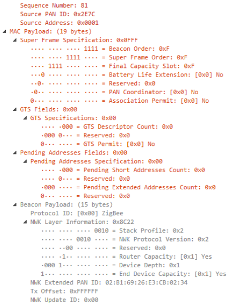
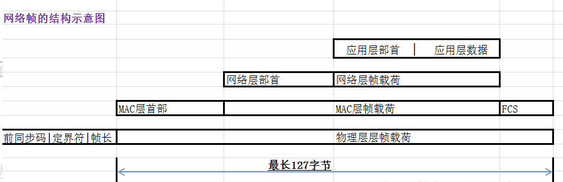
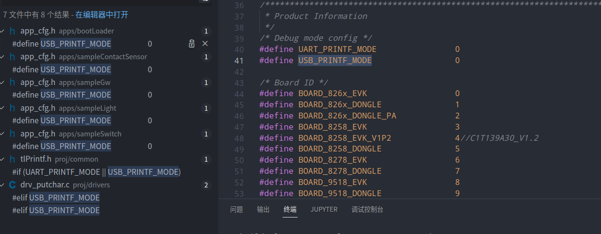
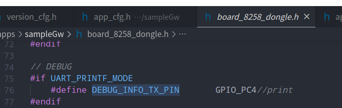
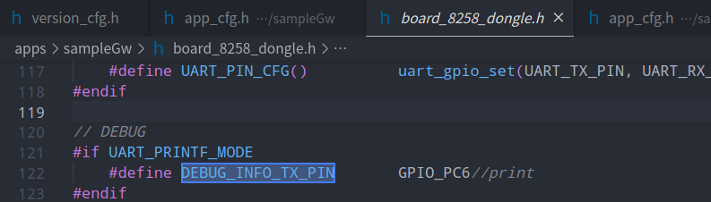

# zigbee3.0

## 协议层概念

### 1.建网与入网流程流程


Coordinator创建网络时，需要一个PAN ID，可以随机生成。

然后需要知道在哪个信道进行创建网络。

需要定义发射功率的大小。

Coordinator就可以创建一个网络。




1.新设备会广播一个beacon request的一个信号，查看都有哪些网络存在。

2.存在的网络会返回给他一个Beacon信号.

该信息中带有它所在网络的Pan ID, 和PanID中哪个设备给他回应的消息标记。   

还有这个设备是否为协调器(Coordinator)设备的标识。

Association Permit: 表示是否允许你附着在我身上的标记。

Router Capacity:  表示我这个设备是否还能容纳Router设备。

End Device Capacity: 表示我这个设备是否还能容纳节点设备。


### 2.zigbee网络帧结构




## TLSR8258 Zigbee_SDK代码解析

bdb_ ：基础设备行为. 代码bdb_开头的文件。

zb_：网络管理。

zcl_：zigbee Clusters层代码

### UART获取打印信息

目前只能读取TX端的值，不能交互。

1.打印使能（app_cfg.h）

在sampleLighe,sampleGw,等apps文件夹下的单独app如果需要调试信息的都需要修改。

```c
#define UART_PRINTF_MODE 1
```



如上图所示，可以修改打印模式。默认都为0,无打印数据。



如下图可以看到GW的打印引脚为 GPIO_PC4和GPIO_PC6。

```c
#elif defined DONGLE_8258_48 && (DONGLE_8258_48 == 1)
   ......
// DEBUG
#if UART_PRINTF_MODE
    #define    DEBUG_INFO_TX_PIN        GPIO_PC6//print
#endif
```

可以看到8258芯片为48引脚版本时，使用的是GPIO_PC6引脚读取printf()的内容。

## 基本概念

### 协议规范

**PAN ID**: 个域网标识，一个zigbee网络有且只有一个PAN ID。

**Channel**: zigbee的工作信道N为11-26,工作频点与信道的关系为：2405+(N-11)*5 MHz。

**Node**: 一个物理设备，具有全球唯一的IEEE地址，入网后在该PAN ID网络中具有唯一的短地址。

**Endpoint**: 应用端口，一个Node可以包含多个Endpoint。

```c
0: ZDO端口
1～240：APP端口
240～254：协议使用的端口
255：广播端口
```

**Cluster**：（簇）一个具体应用是由多个不同cluster组成，从而完成不同的行为。ZCL 定义了一系列cluster需要遵循的行为规范。

**Attribute**：(属性)ZCL除了定义了属性的值，还定义了属性值的操作权限。

### 协议概述


1. 物理层和MAC层由IEEE-802.15.4定义。物理层负责无线电管理，包括诸如调制/解调，信号强度检测等功能。MAC层负责单跳通信。
2. 网络层负责消息的发送和接收，设备维护，路由等。
3. 应用程序支持层（APS）负责端到端消息的传输。
4. 应用层留给用户设计。每个应用程序实例称为一个Endpoint。为管理功能保留了一个特殊的Endpoint，即Endpoint 0。我们也将此管理功能模型称为Zigbee设备对象（ZDO）。
5. 在APS层和网络层中，有一些安全功能可用于保护网络免遭黑客攻击。

#### 物理层

Zigbee在ISM频率上工作。通信信道定义如下：


Zigbee最常见的工作频率是2.4GHz。

##### 调制

物理层还处理数据原始数据的发送和接收。PHY层在868/915 MHz频带中使用二进制相移键控（BPSK），并在2.4 GHz下使用偏移正交相移键控（O-QPSK）。信息通过直接序列扩频（DSSS）编码到载波上，DSSS是一种固有的鲁棒方法，可通过信号处理增益来提高多径性能和接收机灵敏度。请注意，2.4 GHz是全球Zigbee通信最常用的频段。唯一官方Sub GHz的支持是英国的Smart Energy。

##### 输出功率

802.15.4是专为低功耗，低数据速率，低成本的网络设计的。这些通常称为PAN或个人局域网。它主要是为中小无线电范围的应用而设计，但是外接功率放大器也是可以的。在大多数国家中，允许获得大约+20 dBm的输出功率。在欧洲，最大发射功率被限制到+10 dBm左右。但是，这足以使您到达大约一到三公里的距离，这取决于您的链路预算，所使用的功率放大系数和/或所拥有的天线的类型。

##### 数据速率

使用2.4 GHz直接序列扩频Phy或DSSS，原始比特率为250 kb / s。在实际应用中，通常只有理论速率的四分之一或五分之一。预期的吞吐率与56k波特调制解调器相当。单跳链路上每秒约52700 kb。放入多跳效果后，传播所需的时间会更长一些。

##### 开阔场地的传输距离

对于2.4GHz的PHY，在视线可达的空间，传输距离大约可以达到2KM。这是在大部分地区的无线法规允许的范围内，经过放大发射功率来实现的。由于存在大量信道的缘故，你可以选择一个相对安静的信道来避免干扰，从而保证可靠的通信。如果你选择了一个嘈杂的信道，Zigbee的网络管理单元可以切换到一个新的信道，这就是被称为“frequency agility”的特性。工作在2.4GHz频段还有一个好处，因为这个频段在全球范围内都是可用的，这样可以让你的产品具有更广阔的应用空间。

##### 总结

物理层的功能包括：

- 物理无线和MAC层的接口
- 无线电开/关控制
- 调制与解调
- 信道选择
- 链接质量估算
- 能量检测

#### 媒体访问控制（MAC）层

MAC层的主要功能是确保可靠的单跳消息传递。以下是有关这些功能的更多详细信息。

##### CSMA-CA

802.15.4允许多个网络位于同一通道上。因此，需要采取某种方式来避免来自不同网络的数据包在空中碰撞而造成通信错误。MAC子层使用CSMA-CA（Carrier Sense Multiple Access/Collision Avoidance）控制对无线电的访问。避免碰撞是通过CCA（Clear Channel Assessment）完成的。在发送之前，每个节点必须检查电波是否可以正常发送（RSSI低于CCA阈值）。如果是，则节点应继续进行并在进行少量随机退避后进行传输。如果CCA没有通过，则该节点应等待多个退避周期，然后才能再次尝试该过程。随机退避允许多个节点交错传输，因此它们总是可以在某个时间点找到干净的无线空间来作数据传输。尽管比特率很低，因为数据包比较小（128 bytes），即使在非常嘈杂的信道上每一个节点也可以成功地完成数据传输。

##### 确认

MAC层还为节点提供了一种方法，该方法可通过确认得知节点已成功接收到1跳单播传输，并且已通过验证CRC保留了所传输消息的完整性。 多跳传输应在每个跳上进行确认。节点执行CCA检查并发送消息后，它会等待MAC确认。如果未收到消息，则该节点应尝试多次重发该消息，直到其最终成功或最大的重试次数已用尽。

##### MAC帧

下图演示了MAC帧格式：


在每个MAC帧的末尾，有两个字节的CRC用于验证数据包的完整性。在MAC标头中，有一个2个字节的“帧控制”字段。字段“帧控制”的0〜2位指示帧类型。有四种框架类型：

- 信标，用于扫描网络
- 数据，用于从更高层传输数据
- ACK，确认
- MAC命令，MAC层的控制命令，如MAC关联过程。

#### 网络层

在这里，我们将介绍Zigbee网络的一些基本概念，包括：

- 设备类型

- 网络地址
  
  - PAN ID
  - 扩展 PAN ID

- 设备地址
  
  - 节点编号
  - Eui64

##### 设备类型

IEEE-802.15.4定义了两种设备类型：

- FFD, 全功能设备，能够执行IEEE 802.15.4标准中描述的所有职责，并且可以在网络中担任任何角色。
- RFD, 剪裁功能设备，功能有限。

**注意:** RFD设备的处理能力和内存大小通常小于FFD设备。

在Zigbee中，存在三种设备类型：

- 协调器
- 路由设备
- 终端设备，包括睡眠终端设备和非睡眠终端设备。


| 设备类型 | 创建网络 | 路由  | 供电方式   | 作父节点 |                   |
|:---- |:---- |:--- |:------ |:---- |:----------------- |
| 协调器  | 是    | 是   | 主电源    | 是    | 网络中只有一个，且节点ID始终为0 |
| 路由设备 | 否    | 是   | 主电源    | 是    |                   |
| 终端设备 | 否    | 否   | 主电源或电池 | 否    | 必须有父节点            |

##### 网络地址

Zigbee使用PAN ID和扩展的PAN ID来识别网络。

###### PAN ID

PAN，又称个人区域网络，通过其PAN ID与其他网络分开。这是同一PAN中所有节点将共享的16位标识符。因此，这与以太网世界中的子网掩码类似，因为您通常只与本地网络内的设备通信，在这种情况下为PAN。**该标识符放置在每个传出数据包中的低层MAC层标头中，它使接收该数据包的设备可以过滤出与他们的网络无关的消息**。 他们可以将其与自己的PAN ID进行比较，并确定这是来自自己网络中某人的消息，还是来自恰好在此信道上的其他网络中的某人的消息，因此无需尝试解码或解密。


PAN ID由协调器在网络创建时选择。因为PAN ID是一个网络与另一个网络之间的区别因素，所以它应该是随机的以确保其唯一性。建议您为PAN ID选择一个随机的16位值，以防止您的网络与该区域中碰巧存在的任何其他网络重合。

现在，如果您碰巧选择了另一个网络已经使用的PAN ID，该怎么办？或者，如果您确实选择了一个与任何其他网络都没有冲突的随机PAN ID，但后来又有另一个网络与您的网络重叠，该怎么办？如果曾经发生过PAN ID冲突，则协议栈实际上可以检测到这种冲突并可以自动更新其PAN ID，并通知其网络中的所有节点都移至新的PAN ID，以便每个节点可以继续与原始网络中的节点进行通信，并排除冲突网络上的任何节点。如果PAN ID冲突，我们需要使用扩展的PAN ID来区分网络。

###### 扩展 PAN ID

扩展PAN ID是PAN中所有节点都知道的另一个网络标识符。

正常的短16位PAN ID由于简短，在空中传输的所有数据包中都有包含，但64位扩展PAN ID很少通过空中传输。扩展的PAN ID对于每个PAN也是唯一的，当16位PAN ID不足以始终将一个网络与另一个网络区分开时，它基本上用作备份标准。例如，当发生PAN ID冲突并且您要通知网络中的所有设备更新PAN ID时，将网络与冲突的网络区分开的方式是，网络中的这些设备都共享相同的扩展PAN ID。扩展PAN ID极不可能发生冲突，因为与短PAN ID中的16位相比，它具有64位。


扩展的PAN ID也由协调器在网络创建期间选择。仅在节点请求网络或进行PAN ID更新时，才通过无线发送以响应活动扫描。

这也是允许您选择网络的有用因素。如果您尝试加入一个网络而不是创建一个网络，那么您可能想知道如何判断哪些网络可用。网络之间可区分的方式不仅在PAN ID中，而且在扩展的PAN ID中。您可能想做一些特别的事情，决定只使用扩展PAN ID的特定子集，以便您可以将网络与其他网络区分开来，但不要太限制自己，因为您限制得越多您发生冲突的可能性就越大，并且如果您的扩展PAN ID曾经发生冲突，您实际上无能为力。它有点像WiFi SSID，不同之处在于WiFi网络之间的SSID可以相同，而Zigbee不同网络间的扩展PAN ID则不能相同。

##### 节点地址

除了其网络范围的标准外，一个节点还通过其单独的节点地址与另一个节点区分开。

节点具有短地址和长地址。长地址是IEEE分配的MAC地址或EUI-64。它是一个全球唯一的64位地址，这意味着世界上没有两个基于IEEE的无线电设备具有相同的EUI-64。通常在制造时分配。芯片在出厂之前，它们会被分配，并且它们永远不会改变。它用来区分不同的无线设备。但是因为64位是相对比较大的数据量，所以这个长地址不是经常通过空中发送的。


在大多数情况下，更短的16位地址是通过无线方式使用的。这被称为节点ID，在网络中是唯一的，类似于以太网世界中的IP地址。它是在节点进入网络时分配的，并且在该网络内应该是唯一的。可能有两个网络，每个网络都有一个具有相同节点ID的节点，但是因为它们位于不同的PAN中，所以没有关系。

请注意，两个节点在进入网络时可能选择了相同的随机节点ID。如果发生这种情况，就像PAN ID方案一样，有一种解决冲突的方法。当节点注意到冲突时，基于EUI-64信息作为后备，它们可以商定新地址。因此，如果需要，节点可以根据冲突在运行时更改地址。

#### 应用层

在应用层中，可以通过实现多个Endpoint将物理设备拆分为多个逻辑设备。

##### Endpoint

每个Endpoint代表一个逻辑设备。例如，如果我们有一个带有6个插座的智能插座适配器。我们可以使用6个Endpoint来实现它，以便我们可以分别打开/关闭每个插座。


Endpoint ID是一个8位的值，范围从0到255。

- Endpoint 0保留给Zigbee设备对象，主要用于管理目的。
- 用户应用程序可以使用Endpoint 1至239。
- Endpoint 240到254保留用于特殊应用。像Zigbee Green Power一样，使用专用Endpoint 242。
- Endpoint 255用于广播。

##### Clusters（簇）

在每个Endpoint中，我们可以配置几个Clusters。Zigbee Cluster实际上是一种通信模型。


它基于客户端/服务器模式，用于描述两个设备之间的应用协议。每个Cluster都有一个Cluster ID，该ID在Zigbee CLuster Library（ZCL）中定义。Cluster中可以定义多个属性和命令。

##### 例子

让我们看一个Cluster的示例，以便我们可以更好地理解它。 例如，我们需要实现一个带有两个灯泡的灯。


我们可以在其中定义两个Endpoint。每个Endpoint代表一个灯泡。

对于基本功能，例如打开/关闭，我们可以使用打开/关闭 Cluster。灯是服务器端，而开关是客户端。服务器端定义了一个属性“ on / off”，指示灯是打开还是关闭。还定义了诸如“打开”，“关闭”，“切换”之类的命令，这些命令应从客户端发送到服务器端。

如果我们需要更多功能，例如我们需要支持亮度级别控制。我们可以使用亮度级别控制Cluster。在此Cluster中，服务器端定义了一个属性“Level”，指示灯泡的亮度。还定义了诸如“逐渐变化亮度级别”之类的命令，这些命令应从客户端发送到服务器端。

而且，如果我们需要更多功能，例如需要支持颜色控制，则可以使用颜色控制Cluster。

#### 安全性

由于Zigbee是一种无线技术，因此安全性非常重要，因为黑客可以通过无线检测到这些数据包。想象您有一个智能门锁。如果黑客捕获了打开您的门的数据包，那么他可以重发该文件以打开您的门。那很危险。为了防止这种情况发生，Zigbee定义了许多安全功能。让我们简要介绍。

##### 网络层安全

###### 总览

看下面的图片。


它显示了如何在网络层中保护不安全的网络帧。
首先，网络有效负载将被加密。之后，将在加密的有效负载之前添加安全标头。然后根据网络标头，安全标头和加密的有效负载来计算哈希值。最后，将32位哈希值附加到帧的末尾。如果更改了网络标头，安全标头和加密的有效负载中的任何字节，则哈希值将不同。我们将此值称为MIC，是消息完整性检查的缩写。

网络加密使用对称加密算法（AES128），这意味着使用相同的密钥进行加密和解密。该密钥称为Network Key。由于它是一种对称加密算法，因此同一Zigbee网络中的所有设备都将使用相同的Network Key。

在网络安全标头中，添加了“帧计数器”的字段和加密信息节点的源Eui64，以防止重发攻击。还添加了密钥序列号以支持Network Key更新。

6.1.2. 逐跳安全
网络层安全性是逐跳安全性。


路由器节点需要解密该消息，然后对其进行加密，然后替换安全标头中的信息，再将其发送出去。如果解密失败，该消息将立即被丢弃。

这样的好处是可以尽快丢弃攻击消息。

###### Network Key

Network Key是一个16字节的八位位组。通常，它是在网络创建时由协调器随机生成的。当新设备加入网络时，它们必须获得Network Key的副本。

在Zigbee网络中，将Network Key分发给新设备的角色称为Trust Center。有两种典型的安全模型，即集中式安全网络和分布式安全网络。


在集中式安全网络中，只有一个Trust Center，通常是协调器。所有新设备将从协调器获取Network Key。
在分布式安全网络中，每个路由器都是一个Trust Center。新设备可以从每个路由器获取Network Key。

由于需要将Network Key从一个设备传输到另一台设备，因此在传输过程中需要对密钥值进行加密。此加密在应用程序层中完成。我们稍后再讨论。

###### 帧计数器

添加了帧计数器以防止重发攻击。让我们看看它是如何工作的。


首先，一个节点将记录接收到的帧的帧计数器和该节点的Eui64。来自同一节点的下一条消息的帧计数器必须大于记录的帧计数器。否则，该消息将被视为重发并将被丢弃。

为此，在发送方，每个节点将保存其传出帧计数器。在接收端，节点需要保存所有邻居的帧计数器。

由于帧计数器是一个32位值，因此如果设备长时间保持运行状态，它可能会自动溢出。
显然，如果帧计数器被覆盖，可能会出现问题。为防止这种情况发生，必须在溢出之前更新Network Key。如果更新了Network Key，帧计数器则可以再次从零开始。

##### APS层安全性

###### 总览

应用中对传输Network Key的消息进行了加密。让我们看看应用程序层的安全性。


它与网络安全性非常相似。还使用对称加密算法（AES128）。该密钥称为Link key。在大多数情况下，只有传输Network Key消息需要在应用层被加密，并且这仅在Trust Center和新设备之间发生。因此，在这种情况下，我们也将其称为Trust Center Link key。

APS层安全性是**端到端**安全性，因为只有参与通信的两个对等方才知道Link key。

网络中的设备可以使用相同的Link key或不同的Link key。如果设备使用相同的Link key，则此密钥是Global Link key。

在分布式模型中，由于每个路由器都可能是Trust Center，因此将使用Global Link key。在集中式模型中，还使用了特殊的Global Link key，即已知的Link key。这是字符串“ **ZigbeeAlliance09** ”。Zigbee 3.0之前的标准中使用了此功能，并保持了向后兼容性。

Trust Center Link key必须在设备上预先配置，以便它们可以加入并工作。如果他们使用已知的Link key，那将很容易。但是，如果他们需要使用其他Link key怎么办？

Zigbee定义了一种带外配置Link key的方法。这是Install Code。

###### Install Code


Install Code是16字节多项式+ 2字节CRC。

在设备出厂时，将在设备中编写Install Code。之后，在设备标签上还将记录设备的Install Code和Eui64。

当将要安装设备时，用户会从标签上获得Install Code和Eui64。然后在协调器上作相应配置，协调器从Install Code中获取Link key，并设置一个表以使用该特定设备的Link key。

之后，此Link key将用于在应用程序层中加密消息。

在设备方面，它从闪存读取Install Code，然后使用相同的算法得出Link key。此Link key应与协调器端的派生Link key相同。这样，即使消息已加密，他们也可以在应用程序层进行通信。

#### 加入过程

我们将讨论Zigbee网络的创建方式以及设备如何加入网络。

##### 创建网络

首先，由协调器创建一个网络，您必须准备4个参数：

- PAN ID
- 扩展 PAN ID
- 工作频道
- 发射功率

您需要指定这四个参数。如果您不这样做，协调器将随机选择一个PAN ID和一个扩展的PAN ID。如果您未指定频道，则协调器将扫描并选择一个相对安静的频道进行工作

##### 使用已知Link Key加入


网络创建后，新设备可以开始加入。

1. 新设备将开始查找可连接的网络。在此阶段，新设备将在每个通道上发送信标请求。
2. 路由器和协调器将使用信标帧中携带的网络信息来响应信标。这些信息包括PAN ID，扩展PAN ID以及路由器或协调器的其他一些属性，例如设备是否允许连接，设备是否具有允许新设备连接的能力。
3. 新设备可以从不同设备接收多个信标。它将选择信号质量最好的一个，并开始发送关联请求。在该关联请求中，将PAN ID设置为所选的PAN，并将目标节点ID设置为所选设备的节点ID。在此框架中，将继续使用新设备的功能。
4. 当路由器或协调器收到此关联请求时，它将为新设备选择一个节点ID，并以关联响应进行响应。然后，新设备获得了其节点ID，但由于未获得安全密钥而无法与其他节点通信。
5. 协调器会将当前的NWK密钥传输到新设备。**该传输消息在应用程序层中使用已知的Link key加密**。
6. 当新设备收到此消息时，**它将使用已知的Link key对消息解密并获取Network Key**。之后，该设备实际上已加入网络，并能够与网络中的所有其他节点通信。
7. 设备将发送一条通知消息，以通知网络的其他节点，以通知他们我已加入。

##### 使用Install Code派生的Link key加入


1. 在出厂之前，应该已经使用Install Code码对新设备进行了编程。
   在加入之前，用户需要获取新设备的Install Code和Eui64，然后在协调器上对其进行配置。
2. 然后，协调器从Install Code中获取Link key，并将协调器设置为使用此Link key来加密此新设备的传输NWK密钥消息。
3. 其余过程类似于使用众所周知的Link key进行连接的过程。当协调器开始将Network Key传输到新设备时，它将对消息进行加密并将其传输到新设备。当新设备收到此消息时，它将从闪存中读取Install Code并从中获取Link key，然后使用此密钥对消息进行解密并获取Network Key。

### 使用CC2531和Ubiqua对zigbee协议进行抓包
