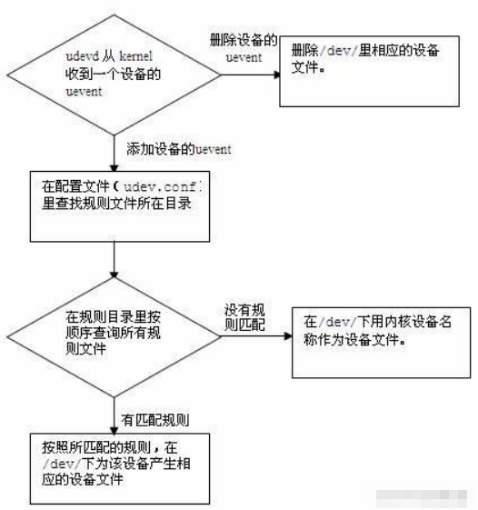

# udev介绍

​	linux默认的设备管理工具。udev以守护进程的形式运行，通过侦听内核发出来的uevent 来管理/dev目录下的设备文件。不像之前的设备管理工具，udev在用户空间(user space) 运行，而不在内核空间(kernel space) 运行。


动态管理：

​	当设备添加/ 删除时，udev的守护进程侦听来自内核的uevent，以此添加或者删除/dev下的设备文件，所以udev 只为已经连接的设备产生设备文件，而不会在/dev下产生大量虚无的设备文件。


自定义命名规则：

​	通过Linux 默认的规则文件，udev在/dev/ 里为所有的设备定义了内核设备名称，比如/dev/sda、/dev/hda、/dev/fd等等。由于udev 是在用户空间(user space) 运行，Linux用户可以通过自定义的规则文件，灵活地产生标识性强的设备文件名，比如/dev/boot_disk、/dev/root_disk、/dev/color_printer等等。


设定设备的权限和所有者/ 组：

udev可以按一定的条件来设置设备文件的权限和设备文件所有者/ 组。在不同的udev 版本中，实现的方法不同。


添加删除设备流程：




1.设备文件：由于本文以较通俗的方式讲解udev，所以设备文件是泛指在/dev/下，可被应用程序用来和设备驱动交互的文件。而不会特别地区分设备文件、设备节点或者设备特殊文件。


2.sysfs：sysfs是Linux 2.6 内核里的一个虚拟文件系统(/sys)。它把设备和驱动的信息从内核的设备模块导出到用户空间(userspace)。从该文件系统中，Linux用户可以获取很多设备的属性。


3.devpath：本文的devpath是指一个设备在sysfs文件系统(/sys)下的相对路径，该路径包含了该设备的属性文件。udev里的多数命令都是针对devpath操作的。例如：sda的devpath是/block/sda，sda2的devpath是/block/sda/sda2。


4.内核设备名称：设备在sysfs里的名称，是udev 默认使用的设备文件名。


udev配置文件位置：

/etc/udev/udev.conf 

但是uos存在类似这种文件夹下：

/snap/core20/904/usr/lib/udev/rules.d


# udev规则

​	udev按照规则文件名的字母顺序来查询全部规则文件，然后为匹配规则的设备管理其设备文件或文件链接。虽然udev不会因为一个设备匹配了一条规则而停止解析后面的规则文件，但是解析的顺序仍然很重要。通常情况下，建议让自己想要的规则文件最先被解析。比如，创建一个名为 /etc/udev/rules.d/10-myrule.rules的文件，并把你的规则写入该文件，这样udev就会在解析系统默认的规则文件之前解析到你的文件。

​	在规则文件里，除了以“#”开头的行（注释），所有的非空行都被视为一条规则，但是一条规则不能扩展到多行。规则都是由多个键值对（key-valuepairs）组成，并由逗号隔开，键值对可以分为条件匹配键值对(以下简称“匹配键”)和赋值键值对(以下简称“赋值键”)，一条规则可以有多条匹配键和多条赋值键。匹配键是匹配一个设备属性的所有条件，当一个设备的属性匹配了该规则里所有的匹配键，就认为这条规则生效，然后按照赋值键的内容，执行该规则的赋值。下面是一个简单的规则：

```sh
KERNEL=="sda",NAME="my_root_disk", MODE="0660"
```

KERNEL是匹配键，NAME和MODE是赋值键。这条规则的意思是：如果有一个设备的内核设备名称为sda，则该条件生效，执行后面的赋值：在/dev下产生一个名为my_root_disk的设备文件，并把设备文件的权限设为0660。

仅当操作符是“==”或者“!=”时，其为匹配键；若为其他操作符时，都是赋值键。


**udev规则的所有操作符:**

“==”：比较键、值，若等于，则该条件满足；

“!=”：比较键、值，若不等于，则该条件满足；

“=”：对一个键赋值；

“+=”：为一个表示多个条目的键赋值。

“:=”：对一个键赋值，并拒绝之后所有对该键的改动。目的是防止后面的规则文件对该键赋值。


**udev规则的匹配键**：

ACTION：事件 (uevent)的行为，例如：add(添加设备)、remove(删除设备)。

KERNEL：内核设备名称，例如：sda, cdrom。

DEVPATH：设备的devpath 路径。

SUBSYSTEM：设备的子系统名称，例如：sda 的子系统为block。

BUS：设备在 devpath 里的总线名称，例如：usb。

DRIVER：设备在 devpath 里的设备驱动名称，例如：ide-cdrom。

ID：设备在 devpath 里的识别号。

SYSFS{filename}：设备的 devpath 路径下，设备的属性文件“filename”里的内容。

例如：SYSFS{model}==“ST936701SS”表示：如果设备的型号为ST936701SS，则该设备匹配该匹配键。

在一条规则中，可以设定最多五条SYSFS 的匹配键。

ENV{key}：环境变量。在一条规则中，可以设定最多五条环境变量的匹配键。

PROGRAM：调用外部命令。

RESULT：外部命令 PROGRAM 的返回结果。例如：

PROGRAM=="/lib/udev/scsi_id -g -s $devpath", RESULT=="35000c50000a7ef67"

调用外部命令/lib/udev/scsi_id查询设备的SCSI ID，如果返回结果为35000c50000a7ef67，则该设备匹配该匹配键。


**udev** **的重要赋值键：**

NAME：在/dev下产生的设备文件名。只有第一次对某个设备的NAME 的赋值行为生效，之后匹配的规则再对该设备的NAME 赋值行为将被忽略。如果没有任何规则对设备的NAME 赋值，udev将使用内核设备名称来产生设备文件。

SYMLINK：为/dev/下的设备文件产生符号链接。由于udev 只能为某个设备产生一个设备文件，所以为了不覆盖系统默认的udev 规则所产生的文件，推荐使用符号链接。

OWNER, GROUP, MODE：为设备设定权限。

ENV{key}：导入一个环境变量。


**udev** **的值和可调用的替换操作符：**

在键值对中的键和操作符都介绍完了，最后是值(value)。Linux用户可以随意地定制udev 规则文件的值。例如：my_root_disk,my_printer。同时也可以引用下面的替换操作符：

$kernel, %k：设备的内核设备名称，例如：sda、cdrom。

$number, %n：设备的内核号码，例如：sda3的内核号码是3。

$devpath, %p：设备的devpath路径。

$id, %b：设备在devpath里的ID 号。

$sysfs{file}, %s{file}：设备的sysfs里file 的内容。其实就是设备的属性值。例如：$sysfs{size}表示该设备( 磁盘) 的大小。

$env{key}, %E{key}：一个环境变量的值。

$major, %M：设备的major 号。

$minor %m：设备的minor 号。

$result, %c：PROGRAM返回的结果。

$parent, %P：父设备的设备文件名。

$root, %r：udev_root的值，默认是/dev/。

$tempnode, %N：临时设备名。

%%：符号% 本身。

$$：符号$ 本身。

KERNEL=="sd*", PROGRAM="/lib/udev/scsi_id -g -s %p", \ RESULT=="35000c50000a7ef67", SYMLINK="%k_%c"

该规则的执行：如果有一个内核设备名称以sd 开头，且SCSI ID 为35000c50000a7ef67，则为设备文件产生一个符号链接“sda_35000c50000a7ef67”.


