# Dark Tree

组件概述

•性格和生活统计

•武器

•控制器动画

•库存和物品

•建筑系统

•教程和帮助

感谢您购买DTFPS。此游戏模板允许您轻松制作生存游戏原型。

在本手册中，我想对项目中使用的工具和方法以及一些

入门教程

该资产的主要目标是提供简单的设置体验和使射击游戏快速的能力

但请记住，您的游戏需要的工作远不止资产商店中的现成模板。 它会
不是自己为您制作游戏，而是会给您一个很好的起点。 有时你仍然需要工作
如果您想扩展包并使您的游戏真正独特和原创，请使用代码。 如果你熟悉
C# 并且可以编写自己的脚本 很容易开始使用 DTFPS 设置，但是您仍然可以使用
提供工具并根据需要自定义它而无需编写脚本

我希望你会喜欢它，这一堆工具和脚本会让你的开发过程更简单
并且更快。

**组件概览**
是时候从基础开始了。

 DTFPS 包含许多不同的脚本和游戏对象，但我们只能概述我们将在工作过程中使用的脚本。要开始使用该包，您需要将 GamePrefab 拖到您的场景中。 这是一个主要的游戏对象，包含玩家、库存、保存和加载系统等。

GamePrefab 

让我们来看看 GamePrefab 扩展的层次结构。

这里我们有 6 个游戏对象。 您可以通过他们调用的方式获得他们的功能。
Player –     是一个玩家控制器，可以行走、射击、收集物品和其他。 

库存画布 –     是放置在一堆画布对象上的完整库存系统 

Canvas Main –     主 UI 画布，包含玩家健康、十字线、武器等所有视觉界面 名称和弹药计数等。

WeaponManager&HitFXManager –     空的实用游戏对象，仅存储系统所需的组件
工作。
移动输入画布 –     是一个包含移动输入装备和其他移动设备的画布。
EventSystem –     处理 UI 事件所需的 Unity 标准对象。

此外，我们将重要组件存储在 GamePrefab 上。 看看下面的图片。

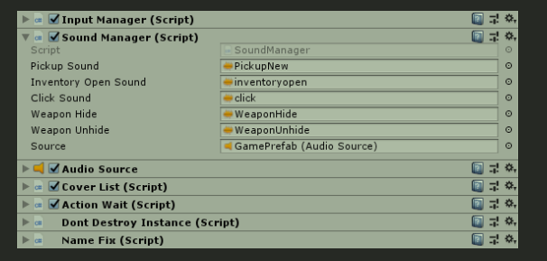

我们将概述我们有时需要使用的组件。 不需要设置的实用程序对象将被忽略

输入管理器 - 包含玩家操作键映射和移动输入工作切换的实用程序脚本

声音管理器 - 为玩家事件存储一些音频效果

Cover List 是 AI 演员的好帮手。 它存储场景中所有可用的封面，AI 从中获取封面。 无需在此处添加封面，因为它会自动工作

## WeaponManager&HitFXManager

**WeaponManager**：

    这是我们需要打开/关闭对象、隐藏/取消隐藏武器、装备/取消装备武器的组件。 不久，对于所有与武装武器状态共享的东西。

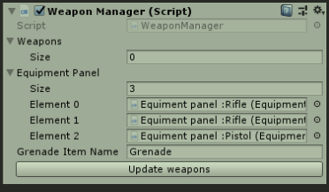

在这里，我们有可以打开/关闭的武器列表和库存设备面板。 每个交互式设备面板都必须放在此列表中，以便提供有关装备武器的信息。

**HitFXManager**  ：

    是为近战和子弹击中事件存储不同效果的组件。

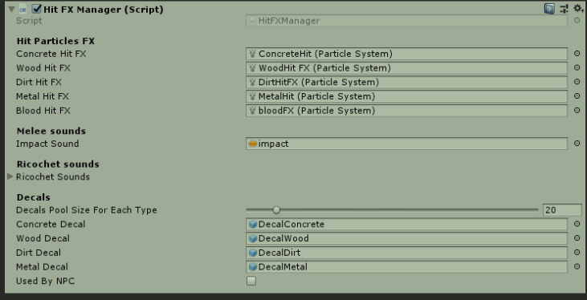

Hit Particles ：击中粒子按表面子弹击中的类型分开。

Impact sound：撞击声是在近战武器击中某物时播放的声音（将随着不同类型的表面也是）。

Ricochet sounds：弹跳声音在表面撞击上播放。

这里的贴花也适用于不同类型的表面。 您可以在此处控制贴花池并为每种贴花类型设置池大小。

Character
注意：在以前的版本中，角色是用刚体和胶囊对撞机制作的，但从 1.4 版物理切换到 CharacterController 组件。角色是包含所有武器、动画、玩家统计数据（健康、口渴、饥饿）和其他控制器逻辑（如运动）的游戏对象， 游泳和爬梯。

Player由不同的游戏对象组成，您可以在层次结构中找到它们

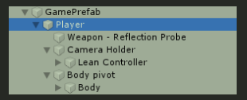

Player拥有 5 个组件，但我们对 FPS 控制器感兴趣和球员统计数据而已。 让我们来看看它们

Player holds 5 components but we interested in FPS Controller and Players Stats only. Let’s take a look at them.

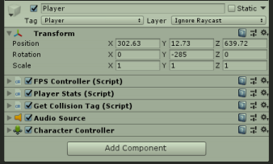

FPS Controller:

The most of fields are describe themselves 
with the name they has. I’ll describe only important fields here.

大多数字段都是描述自己
用他们的名字。 我将在这里只描述重要的领域。

 Lock Cursor – Is cursor should being disabled on start? 

Cam Holder – Is the object that contains camera child

Sensitivity – mouse sensitivity for each axis

Smoothing – smoothing coefficient for mouse axes

锁定光标 - 是否应在启动时禁用光标？

Cam Holder – 是包含相机子项的对象

灵敏度 - 每个轴的鼠标灵敏度

平滑 - 鼠标轴的平滑系数

Landing and air are settings for player air states

着陆和空中是玩家空中状态的设置

 Soft Landing Sound – sound being played when player hit the ground after jump if air time is not bigger than ‘HardLandingTime’ 

Hard Landing Sound – being played if ‘HardLandingTime’ is bigger than air time.

Gravity – gravity value applied to the player down force 

Distance To Wall Raise weapon – distance to wall when player should play weapon raise animation.

软着陆声音 - 如果飞行时间不大于“HardLandingTime”，则玩家跳跃后落地时播放的声音

Hard Landing Sound – 如果“HardLandingTime”大于播放时间，则播放。

Gravity – 施加到玩家下压力的重力值

Distance To Wall Raise Weapon – 当玩家应该播放武器抬起动画时与墙壁的距离。

**Player stats**

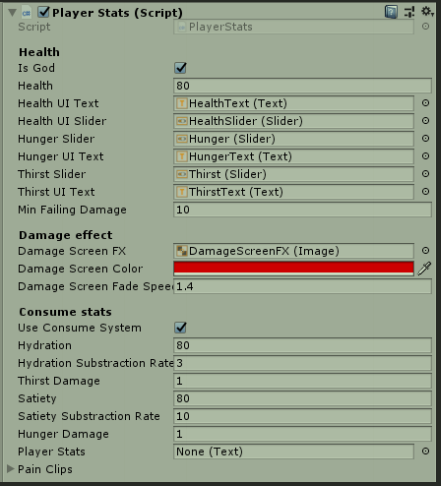

The script has player life stats, linked settings and objects.

该脚本具有玩家生命统计数据、链接设置和对象。

- Is God – player immortal if true

- Health – player health point (int)

- Health UI Text – a text to draw hp on the screen

- Health UI Slider – a slider to draw hp stripe

- 是上帝 - 如果为真，玩家将不朽

- 健康 - 玩家健康点（int）

- Health UI Text - 用于在屏幕上绘制 hp 的文本

- Health UI Slider - 用于绘制 hp 条纹的滑块

(All the same for hunger and thirst)

- Min Failing Damage – Minimal damage if player fallsfrom height
- Damage Screen FX – an UI image that will be shown if playerget damage
- Damage Screen Color – additional color to control fximage color.
- Damage Screen Fade Speed – how fast damage fxwill disappear
- Use Consume system – if true player’s life stats will decrease aftertime
- Hydration, satiety are survival live stats.
- Substraction rate – is a time to decrease one point of stat (in sec).
- Hunger/satiety damage – damage point to decrease player healthif stat is zero and subtraction time up to time.
- Pain Clips – Audioclips to play on player hurt (height failing, bullet hit etc.)

（饥饿和口渴都一样）

- 最小失败伤害 - 如果玩家从高处坠落，伤害最小
- 伤害屏幕 FX – 玩家受到伤害时会显示的 UI 图像
- 损坏屏幕颜色 - 控制 fximage 颜色的附加颜色。
- 伤害屏幕渐变速度 - 伤害效果消失的速度
- 使用消耗系统 - 如果真实玩家的生命统计数据会在之后减少
- 水合作用、饱腹感是生存实时统计数据。
- 减法率 - 是减少一个统计点的时间（以秒为单位）。
- 饥饿/饱腹感伤害 - 如果统计为零，则减少玩家健康的伤害点和减法时间。
- 疼痛剪辑 - 在玩家受伤时播放的音频剪辑（高度下降、子弹击中等）

Weapons

You can create any weapon with DTFPS. You can create rifle, pistol, sniper, rocket launcher, and any other firearmweapon with Weapon Wizard

您可以使用 DTFPS 创建任何武器。 您可以使用武器向导制作步枪、手枪、狙击手、火箭发射器和任何其他枪支武器

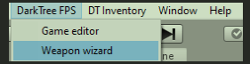

To start creating new weapon you need to apply your weapon model to weapon object field and press next

要开始创建新武器，您需要将武器模型应用于武器对象字段，然后按下一步

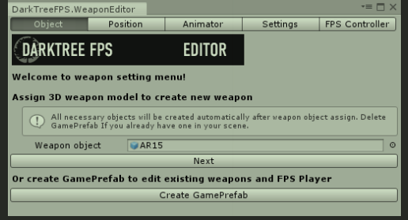

After that you need to create weapon helpers and set them up to correct position. Muzzle flash transform mustbe at the end of weapon barrel and shell transform must be at the place where shell are being ejected. Also setup yourweapon with the camera position and make sure that all weapon child are on ‘Weapon’ layer.

之后，您需要创建武器助手并将它们设置到正确的位置。 枪口闪光变换必须在武器枪管的末端，炮弹变换必须在炮弹被弹出的地方。 还要用相机位置设置你的武器，并确保所有武器孩子都在“武器”层上。

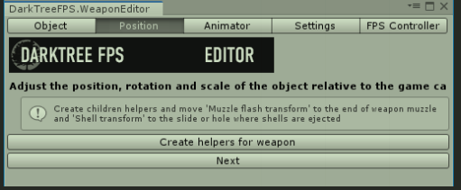

Next step is to set up animations for your new weapon. When you go to Animator tab you’ll probably see thismessage…

下一步是为您的新武器设置动画。 当您转到 Animator 选项卡时，您可能会看到此消息...

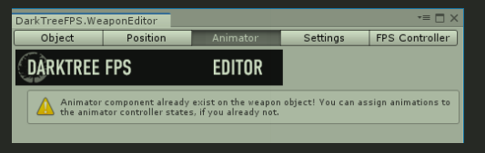

Often, unity generates animator component for each skinned meshes and now you have default animator on yourweapon object. Remove that.

通常，unity 会为每个蒙皮网格生成动画组件，现在您的武器对象上有了默认的动画组件。 去掉那个。

Now your Animator tab must look like the picture below.

Let’s see to fields we have there.

Only 4 animation clips required for weapon properwork. It is shot, idle, reload, aim animations. Otheranimation are additional and not required by default.

We can animate item take events. When player look atitem take begin animation will started then take loopanimation. 

And if you take item take animation will beplayed. It’s advanced item interaction animations.

Second shot and third shot animations are to makeshooting animation various.

After you done with animation clips setting press‘Create animator’ and go forward.

现在您的 Animator 选项卡必须如下图所示。

让我们看看我们在那里的领域。

武器正常工作只需要 4 个动画剪辑。 它是射击、空闲、重新加载、瞄准动画。 其他动画是额外的，默认情况下不需要。

我们可以为 item take 事件设置动画。 当玩家看到项目开始动画将开始然后循环动画。

如果你拿项目拿动画将被播放。 这是高级项目交互动画。

第二枪和第三枪动画是为了使拍摄动画多样化。

完成动画剪辑设置后，按“创建动画师”并继续。

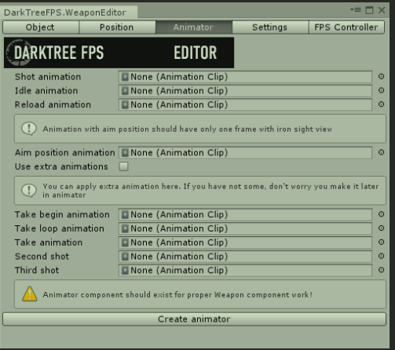

Weapon setting tab will ask you to create new weapon scriptable object. You need to click that button and after that you will see new weapon settings list

武器设置选项卡将要求您创建新的武器脚本对象。 您需要单击该按钮，然后您将看到新的武器设置列表

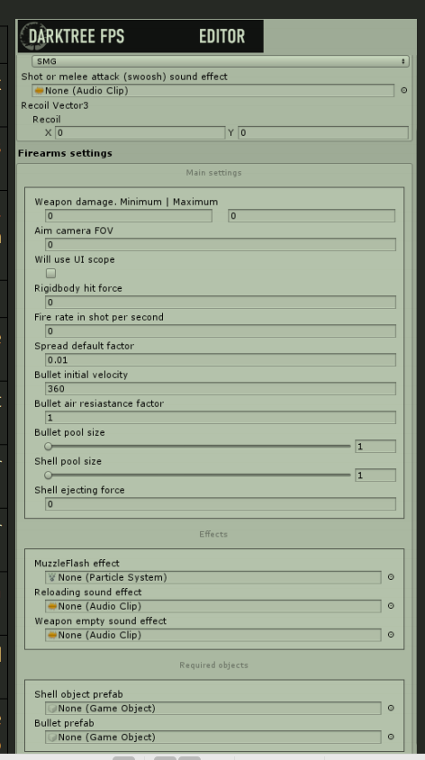

Weapon type :

​    First field is weapon type.

Shot or melee attack sound effect :

​    Second is weapon attack sound (shot, melee attackswoosh etc.)

Recoil Vector :

​    Recoil will move camera to some value on x or y axison shot.

Weapon damage:

​    Weapon damage value has min and max damage.Final damage calculates with random range betweenthese two values.

Aim camera FOV :

​    Aim camera FOV changes main camera FOV on aim

Will use UI scope :

​    Set will use UI scope if your weapon should useaiming with scope

Rigidbody hit force :

​    Rigidbody hit force value applied to rigidbody objecton hit

Fire rate in shot per second :

​    Fire rate in shot per seconds tells how fast yourweapon will shot bullets

Spread default factor:

​    Spread factor is value that applied to spread vectorfor bullet direction

Bullet initial velocity:

​    Bullet initial velocity in meter per seconds. You canset realistic bullet speed.

Bullet air resistance factor :

​    Air resistance factor influence on bullet speed andworks like air friction.

Bullet pool size/ Shell pool size:

​    And here is pools for bullets and shells. They areshould have the same value as weapon ammo capacity

Shell ejecting force :

​    Force will be applied to shell rigidbody on shot

Muzzle flash effect :

​    Particle system to play muzzle flash effect on shot. Will be spawned on muzzle flash transform

Reloading sounds effect:

​    Weapon empty sound effect Played if weapon has no ammo but player shooting

Shell object prefab:

​    Find in prefabs folder

Bullet prefab:

​    Find in prefabs folder

武器类型：

第一个字段是武器类型。

射击或近战攻击音效：

其次是武器攻击声（射击、近战攻击声等）

后坐力矢量：

Recoil 会将相机移动到 x 或 y 轴上的某个值。

武器伤害：

武器伤害值有最小和最大伤害。最终伤害计算在这两个值之间的随机范围内。

瞄准相机 FOV :

瞄准相机 FOV 在瞄准时改变主相机 FOV

将使用 UI 范围：

如果你的武器应该使用瞄准镜，Set 将使用 UI 瞄准镜

刚体撞击力：

Rigidbody hit force 施加到刚体对象上的击中力值

每秒射击的射速：

每秒射击的射速说明你的武器射出子弹的速度

点差默认系数：

散布系数是应用于子弹方向散布向量的值

子弹初速度：

子弹初速（米/秒）。您可以设置逼真的子弹速度。

子弹空气阻力系数：

空气阻力系数对子弹速度的影响，作用类似于空气摩擦。

子弹池大小/壳池大小：

​    这里是子弹和炮弹池。 它们应该与武器弹药容量具有相同的价值

脱壳力：

力将在射击时施加到壳刚体

枪口闪光效果：

粒子系统在射击时播放枪口闪光效果。 将在枪口闪光变换时产生

重装音效：

武器空音效在武器没有弹药但玩家射击时播放

壳对象预制件：

在 prefabs 文件夹中查找

子弹预制：

在 prefabs 文件夹中查找

After setting finish you need to turn off your weapon in inspector and create weapon item. You cant leave weaponsenabled due to inventory system limitations. All weapons must be associated with item objects and now we’ll createthis one.

设置完成后，您需要在检查器中关闭武器并创建武器项目。 由于库存系统限制，您不能启用武器。 所有武器都必须与物品对象相关联，现在我们将创建这个。

Go to DTInventory tab and click Create Item button

转到 DTInventory 选项卡并单击 Create Item 按钮

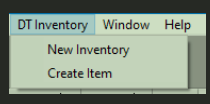

Drag your weapon model (without hands and animations) to itemmodel field. You can add rigidbody and collider to your object here but incollider will be generated only if your gameobject has meshfiltercomponent (gameobject is mesh). Usually, meshes grouped to emptygameobject and has no meshes on it, In this case you can create colliderby yourself. Now press next.

将您的武器模型（没有手和动画）拖到 itemmodel 字段。 您可以在此处向对象添加刚体和碰撞器，但只有当您的游戏对象具有网格过滤器组件（游戏对象是网格）时才会生成碰撞器。 通常，网格分组到空游戏对象并且上面没有网格，在这种情况下，您可以自己创建对撞机。 现在按下一步。

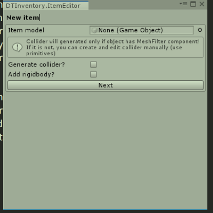

Your new item will be instantiated at your scene. Complete itemfields and continue. Make sure that item Type is the same as yourequipment panel allowed type. In other case, item will not be equippedand used in inventory! To learn more about item fields look atDTInventory manual

您的新项目将在您的场景中实例化。 完成项目字段并继续。 确保项目类型与您的设备面板允许的类型相同。 否则，物品将不会被装备和用于库存！ 要了解有关项目字段的更多信息，请查看 DTInventory 手册s

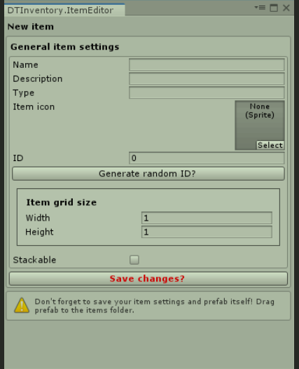

Controller animations

As you may already know, we use animations to make weapon walk bobbing, camera bobbing, animate weapon 
changing and some other. We need get to know the main components we use and animate in the system.

您可能已经知道，我们使用动画制作武器行走摆动、相机摆动、武器动画
改变和其他一些。 我们需要了解我们在系统中使用和制作动画的主要组件。

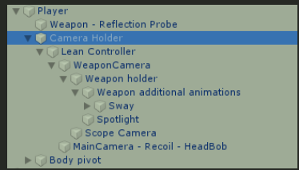

Lean controller is procedural transform that allows player to lean out of corners. It has special Lean script with  obstacle check so you won’t dive your head throughh the wall

精益控制器是程序变换，允许玩家倾斜出角落。 它具有带有障碍检查的特殊精益脚本，因此您不会将头穿过墙壁

Weapon holder is an animator of walking,running, crouching,jumping etc. Also there is an animations to show/hideweapon. To edit these animation you need to selectweapon holder and open animation window.

武器持有人是步行，跑步，蹲伏，跳跃等动画。还有一个动画显示/隐藏武器。 要编辑这些动画，您需要选择武器架并打开动画窗口。

Sway gameobject allows your weapons to sway when camera is moving.And last one is the MainCamera – Recoil – HeadBob. Here we have animator that animate camera bobbing. You  can examine animations with opening animator. It is the same process as for weapon holder.

摇摆游戏对象允许您的武器在相机移动时摇摆。最后一个是 MainCamera - Recoil - HeadBob。 在这里，我们有动画师可以为相机摆动设置动画。 您可以使用打开动画器检查动画。 这与武器持有人的过程相同。

**Inventory and Items**

You can learn about inventory and items in DTInventory manual. You can find it in DTFPS folder.But you need to know about specific components of DTFPS item system. And it is consume events script.We call this script events when use some item. There isalready events to add health, satiety, hydration.Action Wait Timer will freeze player for some time. Youcan set timer to zero if you do not want item use waiting.Action wait text will show what action player performingat this time. For example, we can use medkit and freeze playerfor healing time and show ‘healing’ text on screen.Also we can attach sfx for event action.

您可以在 DTInventory 手册中了解库存和物品。 你可以在DTFPS文件夹中找到它。但是你需要了解DTFPS项系统的具体组成部分。 它是消费事件脚本。我们在使用某些项目时调用此脚本事件。 已经有事件可以增加健康、饱腹感、水合作用。Action Wait Timer 会冻结玩家一段时间。 如果您不希望项目使用等待，您可以将计时器设置为零。动作等待文本将显示此时玩家正在执行的动作。 例如，我们可以使用 medkit 并冻结玩家的治疗时间并在屏幕上显示“治疗”文本。我们还可以附加 sfx 以进行事件操作。

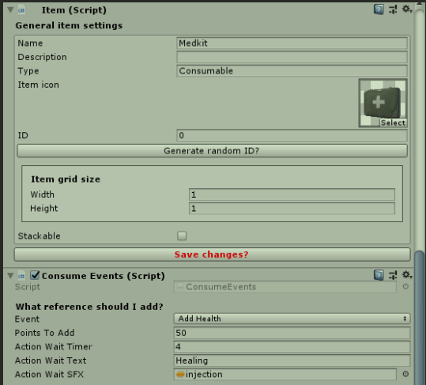

**Building system**

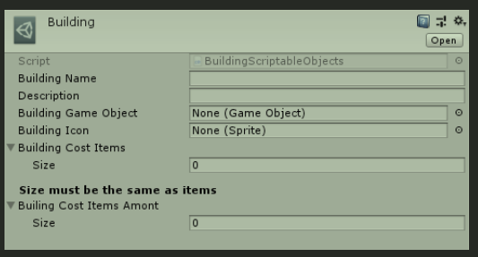

Building system allows you to create building using inventory items. For some people it looks complicated and hard but it’s very easy in fact.Let’s see how to create new building.We need to create new building scriptable object first. Right click in project view → create → building data.Let’s what we’ve got here…Building name will drawn in building select windowDescription is not used for now but will show buildingdescription in future.Building Game Object – it’s the next step. I will tell aboutit little bit later.Assign building iconAnd final building cost items. This array should containsingle items that we use for building. Cost Items array shouldcontain cost of each array item for building. Take a look at thepicture bellow.

建筑系统允许您使用库存项目创建建筑。 对有些人来说，看起来复杂难，其实很简单 在项目视图中右键单击 → 创建 → 建筑数据。让我们在这里得到什么......建筑名称将在建筑选择窗口中绘制现在不使用描述，但将来会显示建筑描述。建筑游戏对象 - 这是下一步。 稍后我会讲到。分配建筑图标和最终的建筑成本项目。 这个数组应该包含我们用于构建的单个项目。 Cost Items 数组应该包含每个数组项目的构建成本。 看看下面的图片。

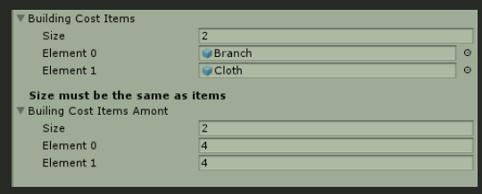

Here we have Branch and Cloth items which arerequired for shelter building. Cost for both items are 4. Itmeans we need to have 4 Branches and 4 Cloth items ininventory in order to build a shelter.We missed Building Game Object field. Do youremember? Now I will show you how to make it.This is firecamp building (you can find it in your assets folder). Pivot point of the building must be on ground because if your pivot somewhere at the middle, you object will fall through the ground in a half size. Object layer is  ‘Ignore Raycast’, set it for your own buildings too. Attach Object Place Utility script and set surface tag for placement.And we must have a collider for the object in order to touch the ground with it. Collider must be little bit lower of object pivot (bellow the ground little bit). Now drag you new object to prefabs folder and set it to scriptable object field.

在这里，我们有建造避难所所需的树枝和布料物品。 两个物品的成本都是 4。

这意味着我们需要有 4 个树枝和 4 个布料物品才能建造庇护所。

我们错过了建造游戏对象字段。 你还记得吗？ 现在我将向您展示如何制作它。

这是 firecamp 建筑（您可以在您的资产文件夹中找到它）。 

建筑物的枢轴点必须在地面上，因为如果您的枢轴位于中间的某个位置，您的物体将落入地面的一半大小。 

对象层是“忽略光线投射”，也为您自己的建筑物设置。 

附加对象放置实用程序脚本并为放置设置表面标记。

我们必须为对象设置一个碰撞器，以便用它接触地面。 

碰撞器必须稍微低于对象枢轴（稍微低于地面）。 

现在将您的新对象拖到预制文件夹并将其设置为可编写脚本的对象字段。

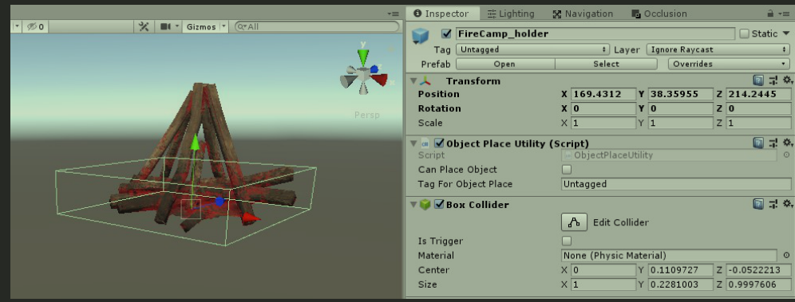

Last thing we have to do. Is to attach our new scriptable object to building manager list. Find it in the hierarchy

我们必须做的最后一件事。 是将我们新的可编写脚本的对象附加到建筑物管理器列表中。 在层次结构中找到它

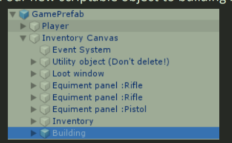

You will see Building Manager Script in the inspector. Drag and drop your new building scriptable object to 
buildings array. It’s all. Now you can build your own objects. Graphics data and UI will be automatically generated.

您将在检查器中看到 Building Manager Script。 将您的新建筑脚本对象拖放到
建筑物阵列。 这就是全部。 现在您可以构建自己的对象。 图形数据和 UI 将自动生成。

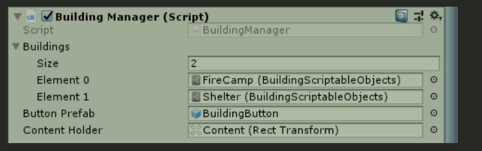

Tutorials and helpCheck out tutorials on YouTube chanel :https://www.youtube.com/channel/UCvn3YCMFoIj_nJ5hG4dGjfADiscord link :https://discord.gg/r6wRYA2

# user guide

内容

工作原理

清单向导入门

组件概述

基本脚本

常见问题解答

How it works

First of all, thank you for purchasing my asset! I sincerely hope that my work will help you to develop your games and save a lot of time for you. 

Inventory always was a sort of magic for me. There is almost no tutorials about how to make inventory with Diablo/S.T.A.L.K.E.R. grid placement. In this overview I want to give you a knowledge how this inventory works so that you understand what you are doing and there was no mystery left.Inventory is a collection of grid cells with X and Y indexes with free/occupied bool state. It’s all! When we trying toplace an item to the grid we ask inventory next questions. Do we have enough space to store item? Where we can placeitem with specified width and height?

这个怎么运作

首先感谢您购买我的资产！ 我真诚地希望我的工作能帮助您开发您的游戏并为您节省大量时间。 

库存(仓库的意思吧？)对我来说总是一种魔法。 几乎没有关于如何使用 Diablo/S.T.A.L.K.E.R. 制作库存的教程。 网格放置。 在本概述中，我想向您介绍此库存是如何工作的，以便您了解自己在做什么，并且没有什么神秘之处。库存是具有 X 和 Y 索引且具有空闲/占用布尔状态的网格单元的集合。 都是！ 当我们尝试将项目放置到网格时，我们会询问库存下一个问题。 我们有足够的空间来存放物品吗？ 我们可以在哪里放置具有指定宽度和高度的项目？

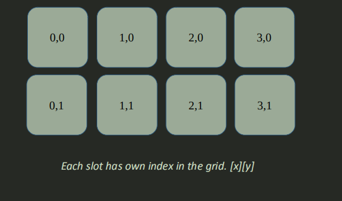

Each item has width and height. Width and height it is a space which item will take on a grid. 
Here we have an item with a size of width 3 andsize of height 1. Width 3 means that our item will take 3 
grid cells on horizontal and 1 on vertical for height. 
Since we know space required for item storing, wecan tell inventory to find suitable cell for us.Inventory find cells with this construction x+width, y+height.For example, if inventory will get slot 0,0 as a starting point, andslots 0,0;1,0;2,0 will be free, we can store that item on a grid.Otherwise, if one of the cells is occupied by another item then .
we will not be able to put the item there.And finally, if we place item to the grid, inventory marksx+width, y+height cells as occupied. If we start dragging item toother position, we just mark these cells as free and mark new ones as not.It’s a brief explanation of how DT Inventory works. Of course we have a lot of other different methods but it’s 
essential knowledge give you vision of inventory construction. You can meet with other utility methods in source code.

每个项目都有宽度和高度。宽度和高度是项目将在网格上占用的空间。
这里我们有一个宽度为 3 和高度为 1 的项目。宽度 3 表示我们的项目将占用 3
水平网格单元格和 1 垂直网格单元格高度。
由于我们知道物品存储所需的空间，我们可以告诉库存为我们找到合适的单元格。库存查找具有x+宽度，y+高度结构的单元格。例如，如果库存将获得槽位0,0作为起点，并且槽位0,0;1,0;2,0 将是空闲的，我们可以将该项目存储在网格上。否则，如果其中一个单元格被另一个项目占用，则 。
我们将无法将项目放在那里。最后，如果我们将项目放置到网格中，库存标记 x+宽度，y+高度单元格被占用。如果我们开始将 item 拖到其他位置，我们只需将这些单元格标记为空闲，并将新单元格标记为 not。这是对 DT Inventory 工作原理的简要说明。当然，我们有很多其他不同的方法，但它是
基本知识为您提供库存建设的愿景。您可以在源代码中使用其他实用方法。

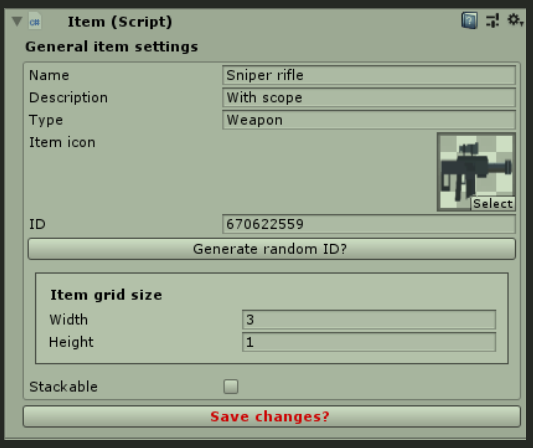

**Getting started with inventory wizard**

1) Open the Inventory Wizard with the toolbar at the top and press ‘New Inventory’
2) 使用顶部的工具栏打开库存向导，然后按“新建库存”

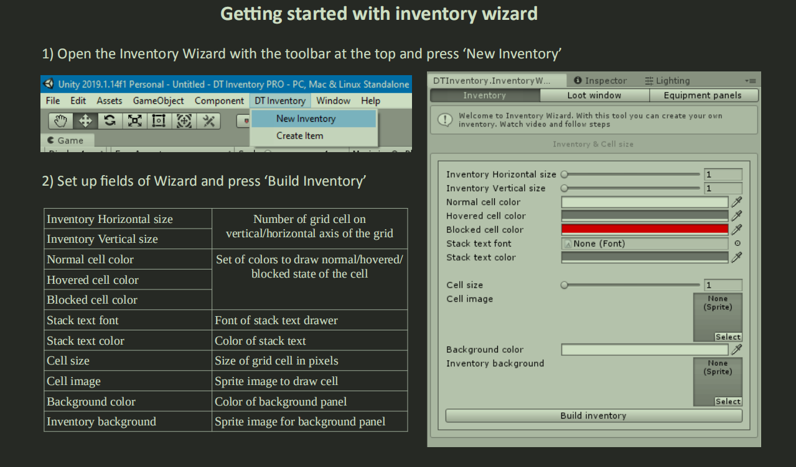

2) Set up fields of Wizard and press ‘Build Inventory’
3) 设置向导的字段并按“构建库存”

|                                 |                                                                |
| ------------------------------- | -------------------------------------------------------------- |
| Inventory Horizontal size库存水平尺寸 | Number of grid cell onvertical/horizontal axis of the grid     |
| Inventory Vertical size库存垂直尺寸   | Number of grid cell onvertical/horizontal axis of the grid     |
| Normal cell color正常细胞颜色         | Set of colors to draw normal/hovered/blocked state of the cell |
| Hovered cell color悬停单元格颜色       | Set of colors to draw normal/hovered/blocked state of the cell |
| Blocked cell color被阻止的单元格颜色     | Set of colors to draw normal/hovered/blocked state of the cell |
| Stack text font堆栈文本字体           | Font of stack text drawer                                      |
| Stack text color堆栈文本颜色          | Color of stack text                                            |
| Cell size                       | Size of grid cell in pixels                                    |
| Cell image                      | Sprite image to draw cell                                      |
| Background color                | Color of background panel背景面板颜色                                |
| Inventory background库存背景        | Sprite image for background panel背景面板的精灵图像                     |

After you’ve created a new inventory you can also create a loot window and equipment slots. I’ll tell about their functionality little bit later. So lets go on!

创建新库存后，您还可以创建战利品窗口和设备插槽。 稍后我将介绍它们的功能。 所以让我们继续吧！

**Loot window**

4) Click on ‘Loot window’ tab and complete fields. Click ‘Build Loot Window’ as you will done. Loot Horizontal size and Vertical size are the same with inventory settings. It’s an X and Y size of our grid. Set position of the window on screen.
5) 单击“Loot window”选项卡并填写字段。 完成后单击“构建战利品窗口”。 战利品水平尺寸和垂直尺寸与库存设置相同。 这是我们网格的 X 和 Y 尺寸。 设置窗口在屏幕上的位置。

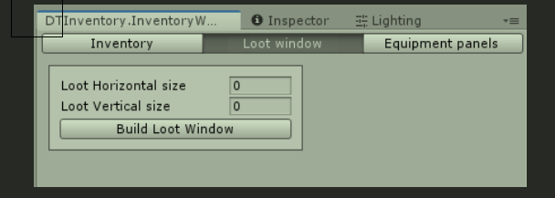

We made loot window but for a what? This window will be used as loot box/chest representation. It’s a     special  grid that will contain items from chest and provide control on ‘em for us. 

Congratulations! You’ve made your own inventory from blank in a few minutes. Inventory is fully functional right now and it’s working but who would to use equipment slots? Your game has armor and weapons? If yes you probably will be glad to know that equipment panels creation as simple as the actions above.

我们制作了战利品窗口，但为了什么？ 此窗口将用作战利品箱/箱子的表示。 这是一个特殊的网格，将包含来自胸部的物品并为我们提供对它们的控制。

恭喜！ 您已经在几分钟内从空白处制作了自己的库存。 库存现在功能齐全并且正在运行，但谁会使用设备插槽？ 你的游戏有盔甲和武器吗？ 如果是，您可能会很高兴知道设备面板的创建与上述操作一样简单。

**Equipment panels**

5) Click on ‘Equipment panels’ tab and complete fields. Press ‘Build panels’ and set position of the equipment panels on the screen.
6) 单击“设备面板”选项卡并填写字段。 按“构建面板”并在屏幕上设置设备面板的位置。

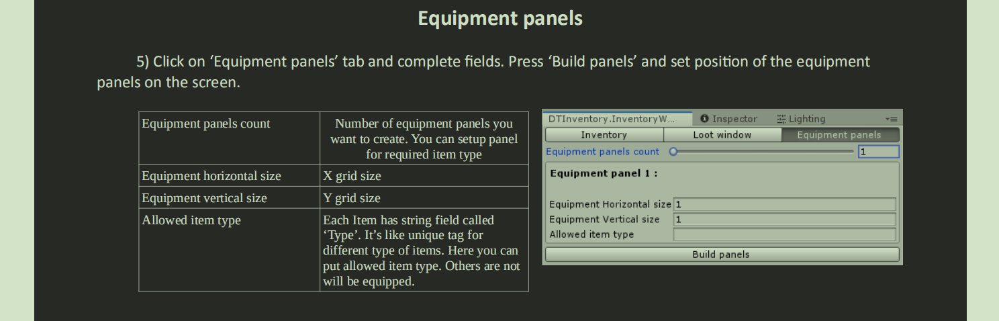

|                           |                                                                                                                                                                                                                                |
| ------------------------- | ------------------------------------------------------------------------------------------------------------------------------------------------------------------------------------------------------------------------------ |
| Equipment panels count    | Number of equipment panels you want to create. You can setup panel for required item type要创建的设备面板的数量。 您可以为所需的项目类型设置面板                                                                                                          |
| Equipment horizontal size | X grid size                                                                                                                                                                                                                    |
| Equipment vertical size   | Y grid size                                                                                                                                                                                                                    |
| Allowed item type         | Each Item has string field called ‘Type’. It’s like unique tag for different type of items. Here you can put allowed item type. Others are not will be equipped.每个项目都有名为“类型”的字符串字段。 这就像不同类型物品的唯一标签。 您可以在此处放置允许的项目类型。 其他的都不会装备。 |

Do you see similar picture on your screen?

你在屏幕上看到类似的图片吗？

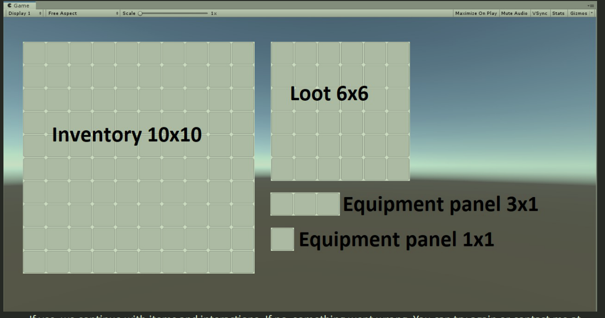

If yes, we continue with items and interactions. If no, something went wrong. You can try again or contact me at email below. Also look for video tutorial on YouTube.

如果是，我们继续项目和交互。 如果没有，就出问题了。 您可以再试一次或通过下面的电子邮件与我联系。 还可以在 YouTube 上查找视频教程。

**Items**

We can create items manually and with item wizard. Each item is a prefab with the Item.cs component. Item has to be created within scene and saved to prefab after.

我们可以手动和使用项目向导创建项目。 每个项目都是带有 Item.cs 组件的预制件。 项目必须在场景中创建并保存到预制件之后。

1) Open the Item Wizard with the toolbar at the top and press ‘Create item’
2) 使用顶部的工具栏打开项目向导，然后按“创建项目”

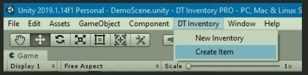

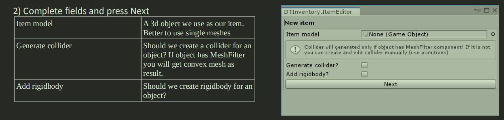

Item model:

A 3d object we use as our item. Better to use single meshes

Generate collider:

Should we create a collider for an object? If object has MeshFilter you will get convex mesh as result

Add rigidbody:

Should we create rigidbody for an object?

商品型号：

我们用作项目的 3d 对象。 最好使用单个网格

生成碰撞器：

我们应该为一个对象创建一个碰撞器吗？ 如果对象具有 MeshFilter，您将获得凸面网格

添加刚体：

我们应该为对象创建刚体吗？

3) After previous step you will have new instantiated item in your scene. Our object has “Item” tag, and Item component. Your items must have “Item” tag! Otherwise pickup will not work at all. Let’s take a look at the Item component
4) 在上一步之后，您的场景中将有新的实例化项目。 我们的对象有“Item”标签和Item组件。 您的物品必须有“物品”标签！ 否则取件根本不起作用。 我们来看看Item组件

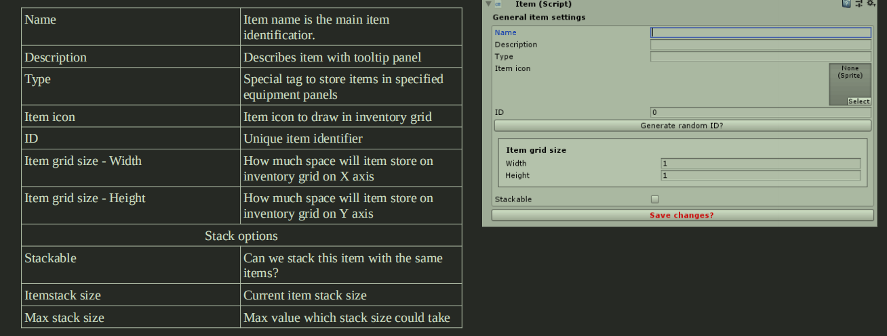

**Pickup system**

You can pickup items with special component which need to be assigned to the main camera. It’s PickupItems 
component. With this component you can provide interaction between player and items. The component is designed tointroduce pickup interaction by the most part and can write your own pickup methods if you need

您可以拾取需要分配给主相机的具有特殊组件的物品。 这是皮卡项目
成分。 使用此组件，您可以提供玩家和物品之间的交互。 该组件大部分旨在引入拾取交互，如果需要，可以编写自己的拾取方法

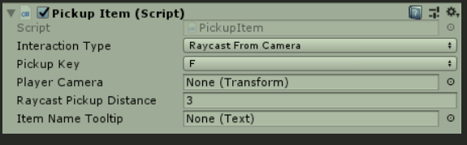

The component should be assigned to your player. Here you can choice interaction type. You can switch between 
Raycast from camera/Trigger pickup/Pickup by click. You can set pickup key with any other you want. You also need to set Player Camera field. Raycast Pickup distance controls distance for items pickup. And item name tooltip is the UI text field that we need to show item title if we looking to some item.

该组件应分配给您的播放器。 在这里您可以选择交互类型。 你可以在
通过单击从相机/触发拾取/拾取进行光线投射。 您可以设置任何其他您想要的拾音键。 您还需要设置 Player Camera 字段。 Raycast Pickup distance 控制物品拾取的距离。 项目名称工具提示是 UI 文本字段，如果我们查看某个项目，我们需要显示项目标题。

Now about interaction types more close.

现在关于交互类型更接近。

Raycast from Camera – it’s fps pickup style. You can pickup an item if you looking straight on it and distance 
between camera and item is equal or less to pickup distance.

来自相机的光线投射 - 这是 fps 拾取风格。 如果你直视它并保持距离，你可以捡起它
相机和物品之间的距离等于或小于拾取距离。

Trigger pickup – in this case you need to have trigger collider on object that store pickup item component. After that you will able to pickup all items which in collider radius with pickup key button.

触发拾取 - 在这种情况下，您需要在存储拾取项目组件的对象上触发碰撞器。 之后，您将能够使用拾取键按钮拾取对撞机半径内的所有物品。

And last one is Click to Pickup. In order to get this method work you need to assign Physics Raycaster component to your camera and also assign Touch Pickup Handler to each item prefab you have!

最后一个是 Click to Pickup。 为了使这种方法起作用，您需要将 Physics Raycaster 组件分配给您的相机，并将 Touch Pickup Handler 分配给您拥有的每个项目预制件！

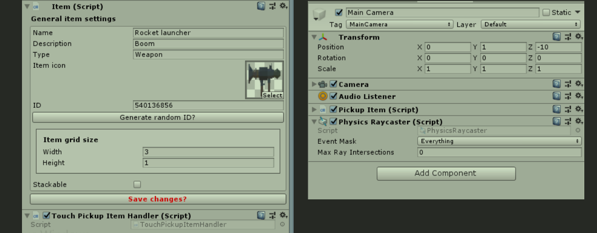

If you’ve done everything right you can pickup items with clicking ‘em with mouse or mobile input.

如果你做的一切都正确，你可以通过鼠标或移动输入点击它们来拾取物品。

**Save system**

DT Inventory support items persistence. It means that you can save and load scene state for 
items/inventory/lootboxes. Also you can save state of the scene you enter or leave. All items will be at the same place  in both cases. 

DT Inventory 支持物品持久化。 这意味着您可以保存和加载场景状态
物品/库存/战利品箱。 您也可以保存您进入或离开场景的状态。 在这两种情况下，所有项目都将位于同一位置。

To make save/load work we need to assign SaveData component to your player gameobject. Also drag inventory canvas to your player. After this step you should get something familiar with the picture.

为了使保存/加载工作，我们需要将 SaveData 组件分配给您的玩家游戏对象。 还将库存画布拖到您的播放器上。 在这一步之后，您应该对图片有所了解。

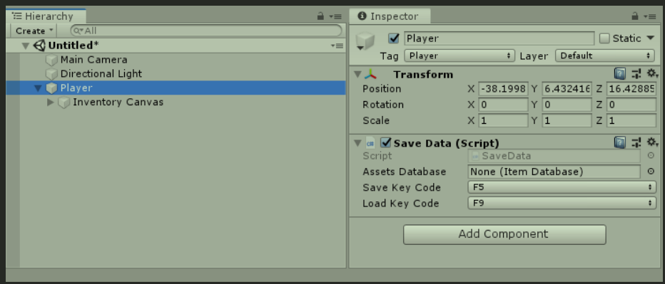

Now we need to create asset database that will store all item objects of your project. To do that click right button in project view and select ‘Item database’.

现在我们需要创建资产数据库来存储项目的所有项目对象。 为此，请在项目视图中单击右键并选择“项目数据库”。

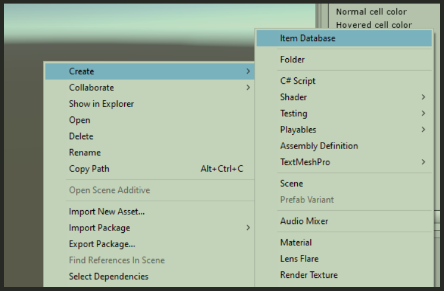

Now assign each item to Items list. If you missed item, you won’t be able to restore it on load methods and SaveData script will throw exception

现在将每个项目分配给项目列表。 如果您错过了项目，您将无法在加载方法中恢复它，并且保存数据脚本将抛出异常

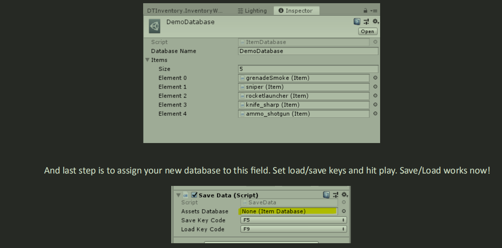

And last step is to assign your new database to this field. Set load/save keys and hit play. Save/Load works now!

最后一步是将您的新数据库分配给该字段。 设置加载/保存键并点击播放。 保存/加载现在工作！

P.S. For users of DTFPS 1.4. Inventory use own Assets Database script (see on GamePrefab)

附言 对于 DTFPS 1.4 的用户。 库存使用自己的资产数据库脚本（参见 GamePrefab）

**Persistence system**

Now we can touch persistence system… For example we have 2 scenes in our project ‘Scene A’ and ‘Scene B’, and we want to keep all items that we have with their last state. We don’t want to lost our scene state when we go from ‘Scene B’ to ‘Scene A’ and want our data to be persistent.

现在我们可以触摸持久化系统……例如，我们的项目“场景 A”和“场景 B”中有 2 个场景，我们希望保留所有项目的最后状态。当我们从“场景 B”转到“场景 A”并希望我们的数据持久化时，我们不想丢失场景状态。

First, our player gameobject must exist regardless of the current scene. Just attach DontDestroyInstance to your player and set player gameobject tag to ‘player’. Attach RegisterPlayerInstance script on player aswell. Now drag your inventroy to player hierarchy. Now your inventory and player are persistence and will not be destroyed during scene transition.

首先，无论当前场景如何，我们的玩家游戏对象都必须存在。只需将 DontDestroyInstance 附加到您的玩家并将玩家游戏对象标签设置为“玩家”。在播放器上附加 RegisterPlayerInstance 脚本。现在将您的库存拖到玩家层次结构中。现在你的库存和播放器是持久化的，不会在场景转换过程中被破坏。

To walk between the levels you have we need to set them in build settings.

Create cube and set its collider as trigger. Attach LevelTransition script and set scene index you want to go.

要在您拥有的级别之间行走，我们需要在构建设置中设置它们。

创建立方体并将其碰撞器设置为触发器。附加 LevelTransition 脚本并设置您想要去的场景索引。

Also we must have spawn points on the level. Create empty gameobject and attach LevelPoint script. Do it for second scene as well. Set Load Persistent Item On Scene Start if you want to leave items on the same place if you going from one level to another.

此外，我们必须在关卡上有重生点。创建空游戏对象并附加 LevelPoint 脚本。对第二个场景也这样做。如果您想在从一个级别转到另一个级别时将项目保留在同一位置，请设置在场景中加载持久项目开始。

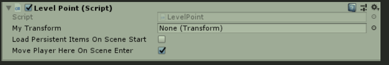

After some test iterations you will see that we still keep persistence information from other last sessions. To remove that find inventory script and press clear persistence data. It will remove all scene persistence information you have.

经过一些测试迭代后，您会看到我们仍然保留其他最后会话的持久性信息。 要删除该查找清单脚本并按清除持久性数据。 它将删除您拥有的所有场景持久性信息。
