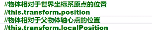
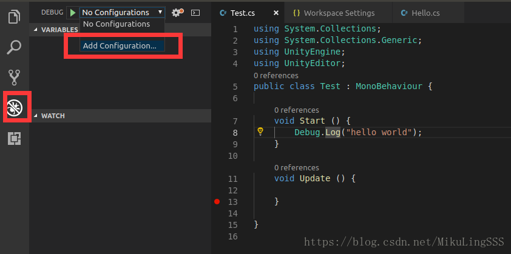

# unity3d学习笔记

## 1.基本概念

### 1.Scene


**顶点的吸附**：

按v然后选择哪个点后，出现小白方框，往另一个物体的顶点上贴。

**物体轴心点**：只有在Scene面板有用，在检视面板没影响。

**物体轴向**：切换物体自身坐标和世界坐标的。


**视图**：在Scene主界面点击切换。


坐标系:

### 2.游戏对象：


#### 1.组件：


#### 2.材质：


材质给有mesh renderer的物体才能直接拖过去赋予材质。

材质的渲染模式：

渲染模式总共有四种：

| 渲染模式        | 意思  | 适用对象举例 | 说明                                     |
| ----------- | --- | ------ | -------------------------------------- |
| Opaque      | 不透明 | 石头     | 适用于所有的不透明的物体                           |
| Cutout      | 镂空  | 破布     | *透明度不是\*0%\*就是\*100%\*，不存在半透明的区域。***** |
| Fade        | 隐现  | 物体隐去   | *与\*Transparent\*的区别为高光反射会随着透明度而消失。*** |
| Transparent | 透明  | 玻璃     | 适用于像彩色玻璃一样的半透明物体，高光反射不会随透明而消失。         |

材质的属性：


材质就是物体的质地，指色彩，纹理，光滑度，透明度，反射率，发光度等。实际就是Shader的实例。

Shader着色器： 专门用来渲染3D图形的技术，可以使纹理以某种方式展现。实际就是一段嵌入到渲染管线中的程序，可以控制GPU运算图像效果的算法。

Texture纹理：附加到物体表面的贴图。


Shader定义了该材质可以设置什么功能，Material定义了给Shader的功能设置具体的值。

## 物理着色器:

基于光学物理公式创建的着色器.


## 摄像机:


clear flags: 处理屏幕的空白部分,(没物体的都叫空白部分).

1.Skybox(天空盒):是个材质,围绕整个场景的包装器,用于模拟天空的材质.   

使用方法:


种类:    1.6sided : 6张图片拼成的天空盒.

​            2.procedural: 

2.Culling Mask(选择遮罩):

​    每一个游戏物体都有一个Layer层,和Tags标签.

​    而摄像机能选择看到哪些层的物体,或者标签的物体.

3.projection(投射):

​    正交模式:

​    perspective:  3d游戏一般的选择.

4.fileld of view:视野远近.

​    一般用来做狙击枪的镜.

5.clipping planes:剪裁面

最远能看多远,最近能看多近

​    far:设置哪些距离内的物体需要渲染.

​    near:  保持默认值, 从多远开始看.

6.viewport rect():

​    屏幕分屏, 可以用来做后视镜,小地图.

7.Depth(深度值):

​    摄像机深度值决定了渲染的层数,深度值越高显示越上边.

ctrl+shift+f: 将选中物体的transform值设置为目前所在位置的transform值.

## 基本概念

### 1.渲染管线

draw call(batches): 越大越消耗资源. 每帧调用显卡渲染物体的次数.

### 2.遮挡剔除

遮挡的部分不让渲染,节省资源.

使用一个插件进行遮挡剔除. [InstantOC]

### 3.多细节层次(LOD)

远距离时精细的模型会变模糊.


## p22课:烘焙

烘焙:将阴影编译成变成贴图贴到场景中,节省性能,但没有实时光照,移动影子还是会在地上. 只针对不动的物体.

让光属性变成baked.

烘焙的步骤:


## p23课: 背景音乐,场景音效.

## p24~p111课:都是c#程序教程

## p112~p148课: unity脚本教程

附加到游戏物体上的脚本类必须从MonoBehaviour类继承.

文件名与类名必须一致.

## p113: 修改脚本模板.

## p114:  脚本的生命周期.

特性:

SerializeField:序列化字段,在编辑器中显示私有变量. 

HideInInspector:在编译器中隐藏字段.

Range(0,100):让某个变量在0~100之间.

## p115:脚本的生命周期


Awake:不管脚本是否启动,都会执行. 

FixdUpdate():每个固定时间执行一次,


Update():每次渲染帧时执行一次. 执行间隔不固定.

## p116:输入事件


## p120:常用API:Component

Component(组件):

Transform():

GameObject(游戏对象):

Object:

Time:

getComponent<name> 可以查找所有组件.

## p122: Transform




rotate:


rotateAround:环绕旋转

```c#
this.transform.RotateAround(Vector3.zero, Vector3.up,1);//绕0点y轴绕1度.
//绕z轴:Vector3.forward
```

## p123:设置/获取父物体

```c#
//获取父物体变换组件
Transform parentTF = this.transform.parent;

//设置父父物体
public Transform tf;
this.transform.SetParent(tf);        //不写默认是true,视为世界坐标. 该物体位置不变
this.transform.SetParent(tf,false); //当前物体的位置,视为localPosition,该物体位置改变.
```

## p124:查找/设置子物体

```c#
//只能找子物体
Transform childTF = this.transorm.Find("子物体名称"); 

Transform childTF = this.transorm.Find("子物体名称/子物体名称"); 

//根据索引查找; 只能查找子物体
int count = this.transform.childCount;
for(int i=0;i<count; i++)
{
    Transform childTF = this.transfrom.GetChild(i);    
}

//所有对象解除父子关系
this.transform.DetachChildren();
//孩子解除父子关系
this.transform.SetParent(NULL);    

//一般不清楚层级时,使用递归查找,
```

Transform:查找(父,根,子(索引,名称))变换组件功能,改变位置,角度,大小功能.

## p125:gameObject、object

```c#
activeInHierarchy(); //游戏中的对象是否激活.
SetActive();//设置游戏启动/禁用

//任何组件都不能new好后直接挂到物体上,必须先用GameObject创建.
GameObject lightGo = new GameObject();
Light light = lightGO.AddComponent<Light>(); //给物体添加组件.  

//在场景中,根据名称查找物体(不建议使用)静态方法.
GameObject.Find("游戏对象名称");

//获取所有使用该标签的物体
GameObject[] allEnemy = GameObject.FindGameObjcetWithTag("Enemy");
//获取使用该标签的物体
GameObject playerGo = GameObject.FindWithTag("Player");
```


Object:

```c#
name//游戏物体名称

Destroy//删除游戏对象,组件或资源    必须Destroy(this.gameObject)只用this不能删除

DestroyImmediate//立即删除游戏obj,慎用 .

DontDestroyOnLoad//加载新场景时,某些物体不被清除. 

//根据类型查找对象
Object.FindObjectOfType<MeshRenderer>(); //找一个.
```

## p126:常用类总结

## p127:课后作业讲解

## p128:Time类

deltaTime:


```c#
public void Update()
{
    //每渲染一帧,旋转1度. 
    //帧多, 1秒旋转速度快.  根据Update的渲染更新速率,旋转速度也不同.
    //帧少,           慢
    this.transform.Totate(0,1,0);
}

speed = 100;
public void Update()
{
    //每渲染一帧,旋转1度.     
    this.transform.Totate(0,speed * Time.deltaTime,0); 
    //当 旋转速度 * 每帧消耗时间, 可以保证旋转速度不受机器性能 , 和渲染影响. 
}

//固定0.02秒执行一次,与渲染无关.
public void FixedUpdate()
{

}

//游戏运行时间
Time.time;

//游戏时间放慢
Time.timeScale = 0;  //暂停游戏
Time.timeScale = 1;  //恢复游戏

//游戏暂停,个别物体不受影响. 
Time.unscaledDeltaTime = 0;  
```

## p129: canvas上计时器实例

## p133:预制体


## p135 Animonation


## p137:英雄无敌工程

策划

需求分析

编码


## p148: 英雄无敌工程

## p149-p185: 三维数学

## p153: 虚拟按键


## p149:Input()类

## p150: 摄像机的拉近和拉远

## p186-227: 用户图形界面

地形碰撞器和任务刚体+碰撞器  组合会将人物碰撞倾斜， 需要锁定Y轴旋转，可以防止人物倾斜。
https://jingyan.baidu.com/article/b24f6c82e5a0f6c7bee5da5a.html

unity3d射线详解

https://www.jianshu.com/p/38f8e3f74e67

# EasyTouch5学习

## 一、脚本的使用

```c#
using System.Collections;
using System.Collections.Generic;
using UnityEngine;
using HedgehogTeam.EasyTouch;

public class operation : MonoBehaviour
{
    // Start is called before the first frame update
    void Start()
    {

    }

    // Update is called once per frame
    void Update()
    {
        Gesture currentGesture = EasyTouch.current;
        if(currentGesture != null && EasyTouch.EvtType.On_TouchStart == currentGesture.type)
        {
            OnTouchStart(currentGesture);
        }
        if(currentGesture != null && EasyTouch.EvtType.On_TouchUp == currentGesture.type)
        {
            OnTouchEnd(currentGesture);
        }
        if(currentGesture != null && EasyTouch.EvtType.On_Swipe == currentGesture.type)
        {
            OnSwipe(currentGesture);
        }
    }

    void OnTouchStart(Gesture gesture)
    {
        Debug.LogWarning("OnTouchStart");
    }

    void OnTouchEnd(Gesture gesture)
    {
        Debug.LogWarning("OnTouchEnd");
    }

    void OnSwipe(Gesture gesture)
    {
        Debug.LogWarning("OnSwipe");
    }
}
```

# 在debain系linux下unity3d开发

## 1.使用MonoDevelop调试

参考博客：

环境包：https://www.cnblogs.com/chendeqiang/p/12861518.html

unity3d for linux: https://forum.unity.com/threads/unity-on-linux-release-notes-and-known-issues.350256/

从unity3d for linux官网下载想要的版本.

安装2017版本会带有[MonoDevelop]编辑调试工具。

在linux下调试不好弄，这个工具是目前发现最好用的单步调试工具。

调试时注意自己的unity3d的进程号。

```shell
#环境包安装命令
sudo apt-get -y install gtk-sharp2
sudo apt-get -y install mono-runtime
sudo apt-get -y install mono-complete
sudo apt-get -y install monodevelop
sudo apt install apt-transport-https dirmngr
sudo apt-key adv --keyserver hkp://keyserver.ubuntu.com:80 --recv-keys 3FA7E0328081BFF6A14DA29AA6A19B38D3D831EF
echo "deb https://download.mono-project.com/repo/ubuntu vs-bionic main" | sudo tee /etc/apt/sources.list.d/mono-official-vs.list
sudo apt update
```

## 2.使用vscode调试

1.先下载.net核心包。

https://dotnet.microsoft.com/download

按照官方提示在进行安装。

2.安装vscode。

注意深度系统，uos系统，不能从商店直接下载进行安装，需要从官方网站上下载1.52版本。

使用uos提供的1.56+新版本，调试时会报错。

3.安装vscode插件。

```shell
Auto-Using for C#    自动添加引用
C#
C# XML Documentation Comments
Chinese    汉化
Debugger for Unity    调试unity
Unity Code Snippets    代码补全
Unity Tools   Unity工具
```

4.按f5出现调试，添加配置，选择unity Debugger.之后会出现一个launch.json的文件，那个是配置文件，详细解释 https://www.baidu.com 。之后我们点击开始调试按钮，在代码中打断点，点击unity3d运行。



# 一些心得集合

1.Unity3D中如何制作天空盒 :https://blog.csdn.net/weixin_38498942/article/details/90479835

**2.UnityEngine.Rendering.PostProcessing 不存在:**

这是因为插件没有安装引起的:      在包管理器中安装Post Processing 和Cinemachine 即可。

windows->Package Manager ->All packages(或者所注册的)

C#脚本 [System.Serializable]的作用:

​    前几天在做自己的塔防游戏的时候，建造了一个turrentData类，却无法显示在inspector上，百度别人对此问题的解决办法后，得到了用序列化存储的解决办法，在类前写上 [System.Serializable]就解决了问题，下面介绍一下 序列化的作用。

https://blog.csdn.net/qq_36946274/article/details/82054023


# DarkTree学习

## NPC.cs

功能： NPC总控制脚本。

### start:

初始化拿到各种组件。

lookPosition：眼睛朝向位置默认赋值为transform.forward，模型的前方。


### update:


### Shout():

```cs
public void Shout();
```

功能：队友互相发现功能，有其中一个发现目标，则同步给所有队友npc

1.friendsList: 所有队友的list。

2.遍历friendsList, 当自己的目标不为空 && 队友的目标为空时，将所有friendsList的攻击目标变成自己的目标。将所有的lookPosition赋值为目标位置。

## NPCVision.cs

功能：在这里我们寻找NPC周围的目标并计算最近的目标


### start:

npc：获取父物体及自身的NPC组件类。

player: 获取玩家的位置。从组件名称"Player"查找到的。

playerCollider： 获取主摄像机所在玩家的碰撞器。

### update:


## 常用组件介绍：

### Rigidbody

isKinematic:  如果启用了 isKinematic，则力、碰撞或关节将不再影响刚体。 刚体将由动画或脚本通过更改 transform.position 进行完全控制。


