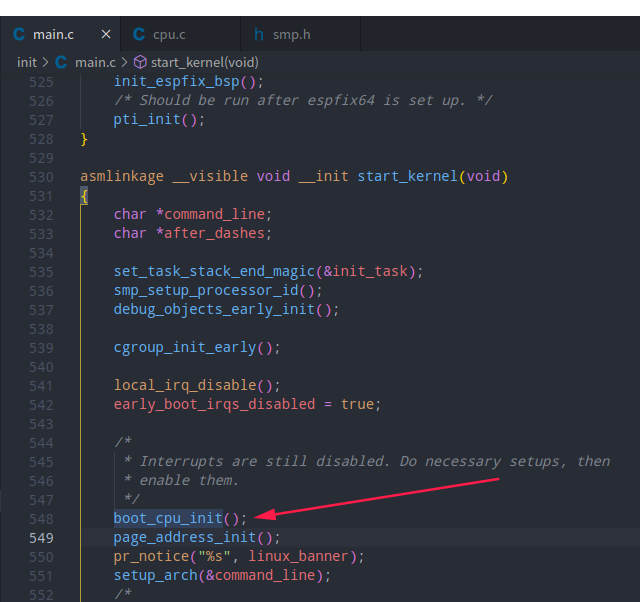

# 内核代码解析基于4.19.90


## cpu相关



如图可知，内核启动代码中，start_kernel()中的boot_cpu_init();

### 1.跳转到kernel/cpu.c文件中的boot_cpu_init();

```c
/*
 * Activate the first processor.
 */
void __init boot_cpu_init(void)
{
	int cpu = smp_processor_id();//获取当前执行cpu_id

	/* Mark the boot cpu "present", "online" etc for SMP and UP case 
	对于SMP和UP情况，将引导CPU标记为“存在”、“在线”等*/
	set_cpu_online(cpu, true);
	set_cpu_active(cpu, true);
	set_cpu_present(cpu, true);
	set_cpu_possible(cpu, true);

#ifdef CONFIG_SMP
	__boot_cpu_id = cpu;
#endif
}
```

### 2. 而smp_processor_id();   功能为一个宏定义。

```c
#ifdef CONFIG_DEBUG_PREEMPT
  extern unsigned int debug_smp_processor_id(void);
# define smp_processor_id() debug_smp_processor_id()
#else
# define smp_processor_id() raw_smp_processor_id()
#endif
```

#### 2.1 Linux内核配置项`CONFIG_DEBUG_PREEMPT`：

- 提示：调试抢占式内核
- 类型：布尔
- 取决于：`CONFIG_DEBUG_KERNEL && CONFIG_PREEMPTION && CONFIG_TRACE_IRQFLAGS_SUPPORT`
- 在[lib/Kconfig.debug中定义](https://github.com/torvalds/linux/tree/master/lib/Kconfig.debug)
- 在 Linux 内核中找到：2.6.11–2.6.39、3.0–3.19、4.0–4.20、5.0–5.17、5.18-rc+HEAD

#### 2.2 Linux内核配置项`CONFIG_DEBUG_KERNEL`有多种定义：

内核调试在发现`lib/Kconfig.debug`

配置项CONFIG_DEBUG_KERNEL：

- 提示：内核调试
- 类型：布尔
- 取决于：`(none)`
- 在[lib/Kconfig.debug中定义](https://github.com/torvalds/linux/tree/master/lib/Kconfig.debug)
- 在 Linux 内核中找到：2.6.9–2.6.39、3.0–3.19、4.0–4.20、5.0–5.17、5.18-rc+HEAD

2.3 CONFIG_PREEMPTION： 配置抢占

2.4 CONFIG_TRACE_IRQFLAGS_SUPPORT：配置跟踪IRQFLAGS支持


### 3.如果配置了内核调试的话，调用debug_smp_processor_id()函数。 

```c
notrace unsigned int debug_smp_processor_id(void)
{
	return check_preemption_disabled("smp_processor_id", "");//检查_抢占_禁用
}
EXPORT_SYMBOL(debug_smp_processor_id);
```

* notrace介绍

```c
#if defined(CC_USING_HOTPATCH) && !defined(__CHECKER__)
#define notrace			__attribute__((hotpatch(0, 0)))
#else
#define notrace			__attribute__((no_instrument_function))
#endif
```

CC_USING_HOTPATCH：内核热补丁

`__CHECKER__`是与`Sparse`相关的一个宏开关，从kernel顶层Makefile中可以看出，当指定参数C=1或C=2时会调用Sparse。Sparse是2004年由Linus创建的kernel代码静态检查工具。

### 4.check_preemption_disabled

```c
notrace static unsigned int check_preemption_disabled(const char *what1,
							const char *what2)
{
	int this_cpu = raw_smp_processor_id();
    //宏定义：架构相关代码，不同的架构该宏定义不同。
    //#define raw_smp_processor_id() (this_cpu_read(cpu_number))

	if (likely(preempt_count()))
		goto out;

	if (irqs_disabled())
		goto out;

	/*
	 * Kernel threads bound to a single CPU can safely use
	 * smp_processor_id():
	 */
	if (cpumask_equal(&current->cpus_allowed, cpumask_of(this_cpu)))
		goto out;

	/*
	 * It is valid to assume CPU-locality during early bootup:
	 */
	if (system_state < SYSTEM_SCHEDULING)
		goto out;

	/*
	 * Avoid recursion:
	 */
	preempt_disable_notrace();

	if (!printk_ratelimit())
		goto out_enable;

	printk(KERN_ERR "BUG: using %s%s() in preemptible [%08x] code: %s/%d\n",
		what1, what2, preempt_count() - 1, current->comm, current->pid);

	printk("caller is %pS\n", __builtin_return_address(0));
	dump_stack();

out_enable:
	preempt_enable_no_resched_notrace();
out:
	return this_cpu;
}
```

#### 4.1 raw_smp_processor_id() 

```c
//宏定义：架构相关代码，不同的架构该宏定义不同。
#define raw_smp_processor_id() (this_cpu_read(cpu_number))
```

4.1.1 宏定义中cpu_number,定义为：

```c
DECLARE_PER_CPU_READ_MOSTLY(int, cpu_number);

//宏展开后为
extern __percpu __attribute__((section(".data..percpu"))) \
    __attribute__((__model__ (__small__))) __typeof__(int) cpu_number
```

也分为两部分 ， 如果定义了虚拟化和内存加密功能，是一套定义（暂时不看）， 否则为：

```c
/*
 * Normal declaration and definition macros.
 普通声明和定义宏。
 */
#define DECLARE_PER_CPU_SECTION(type, name, sec)			\
	extern __PCPU_ATTRS(sec) __typeof__(type) name

#define DEFINE_PER_CPU_SECTION(type, name, sec)				\
	__PCPU_ATTRS(sec) PER_CPU_DEF_ATTRIBUTES			\
	__typeof__(type) name

//__PCPU_ATTRS
#define __PCPU_ATTRS(sec)						\
	__percpu __attribute__((section(PER_CPU_BASE_SECTION sec)))	\
	PER_CPU_ATTRIBUTES

//PER_CPU_BASE_SECTION
#ifndef PER_CPU_BASE_SECTION
#ifdef CONFIG_SMP  
//多处理和 PC SMP 架构:两个或多个同样的处理器通过一块共享内存彼此连接。
//每个处理器可同等地访问共享内存（具有相同的内存空间访问延迟）。
#define PER_CPU_BASE_SECTION ".data..percpu"
#else
#define PER_CPU_BASE_SECTION ".data"
#endif
#endif

//__typeof__
//检查一个变量是否存在


//__percpu
#ifdef __CHECKER__
	# define __percpu	__attribute__((noderef, address_space(3)))
#else
	# define __percpu
#endif
```

4.1.2 this_cpu_read()


### 5.set_cpu_online() ;set_cpu_active();set_cpu_present();set_cpu_possible();

```c
static inline void
set_cpu_online(unsigned int cpu, bool online)
{
	if (online)
		cpumask_set_cpu(cpu, &__cpu_online_mask);//设置__cpu_online_mask全局变量中对应 该cpu的标记位.
	else
		cpumask_clear_cpu(cpu, &__cpu_online_mask);
}
    
//1.__cpu_online_mask
struct cpumask __cpu_online_mask __read_mostly;
EXPORT_SYMBOL(__cpu_online_mask);

//cpumask
typedef struct cpumask { DECLARE_BITMAP(bits, NR_CPUS); } cpumask_t;
//扩展后为：
typedef struct cpumask 
{ 
    unsigned long bits[BITS_TO_LONGS(1)];
}cpumask_t;

typedef struct cpumask 
{ 
    unsigned long bits[(((1) + ((sizeof(long) * BITS_PER_BYTE)) - 1) / ((sizeof(long) * 8)))]; 
}cpumask_t;

//DECLARE_BITMAP(bits, NR_CPUS);
unsigned long bits[BITS_TO_LONGS(1)];


//相关宏定义
#define BITS_PER_TYPE(type) (sizeof(type) * 8)
#define BITS_TO_LONGS(nr)	DIV_ROUND_UP(nr, BITS_PER_TYPE(long))   
#define DIV_ROUND_UP(n,d) (((n) + (d) - 1) / (d))//n÷d向上取整

//2.cpumask_set_cpu
/**
 * cpumask_set_cpu - set a cpu in a cpumask
 * @cpu: cpu number (< nr_cpu_ids)
 * @dstp: the cpumask pointer
 */
static inline void cpumask_set_cpu(unsigned int cpu, struct cpumask *dstp)
{
	set_bit(cpumask_check(cpu), cpumask_bits(dstp));//设置该cpu对应的比特位.
}

```


