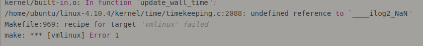
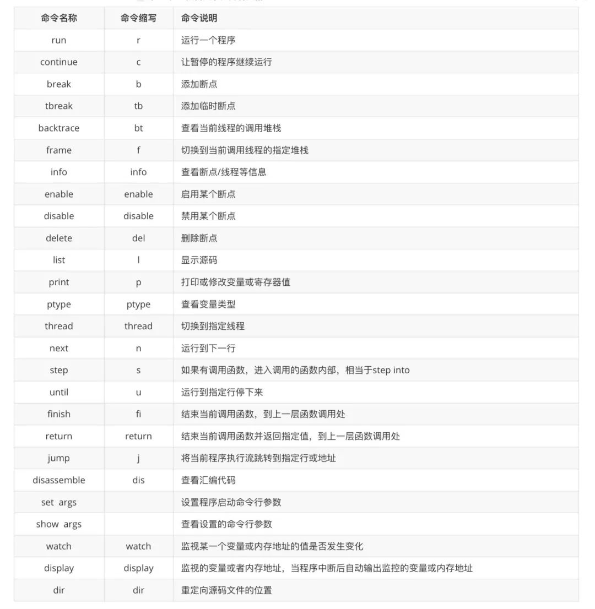
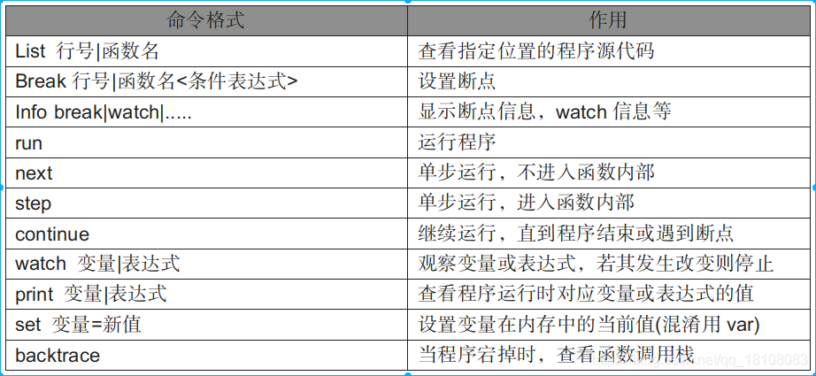
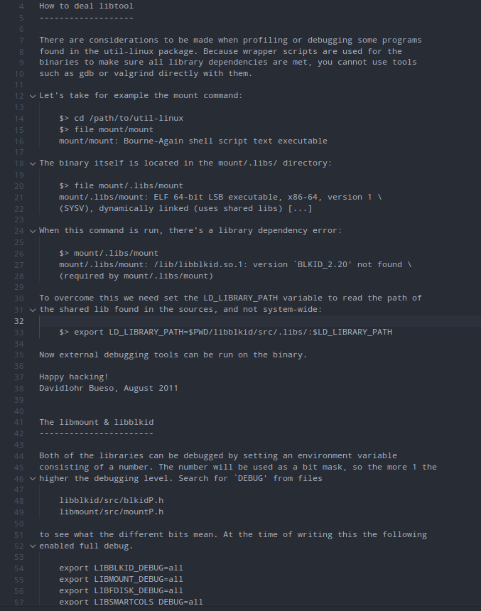
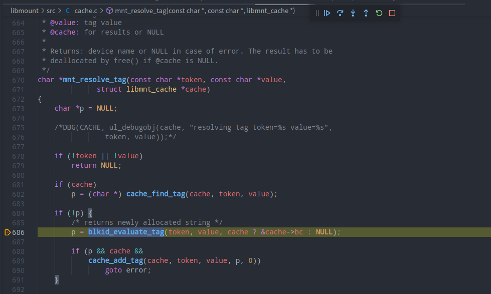
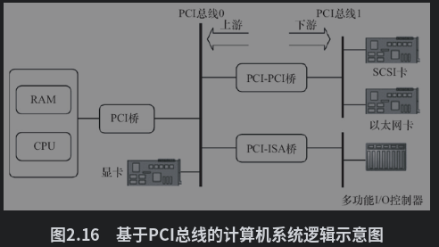
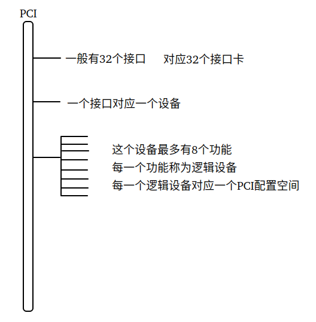
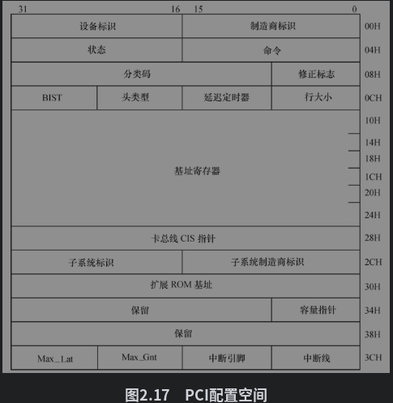
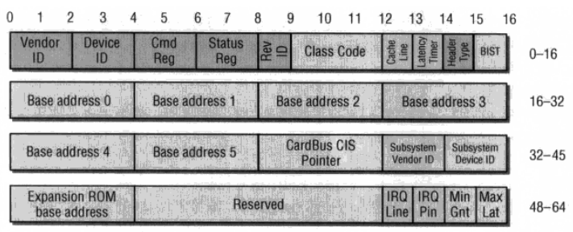

# 内核汇总

# 基础知识汇总

## 内核映像文件格式

1.vmlinux

    vmlinux是一个包含linux kernel的静态链接的可执行文件，文件类型是linux接受的可执行文件格式之一(ELF、COFF或a.out)。

2.vmlinuz

    vmlinuz是可引导的，压缩的linux内核，“vm”代表的“virtual memory”。vmlinuz是vmlinux经过gzip和objcopy(*)制作出来的压缩文件。vmlinuz不仅是一个压缩文件，而且在文件的开头部分内嵌有gzip解压缩代码。所以你不能用gunzip 或 gzip –dc解包vmlinuz。

vmlinuz是一个统称，有两种具体的表现形式：zImage和bzImage(**big zImage**)。

 zImage和bzImage的区别在于本身的大小和加载到内存的地址不同。zImage是0~640KB，bzImage是1M以上。如果内核比较小，那么可以采用zImage 或bzImage之一，两种方式引导的系统运行时是相同的。大的内核采用bzImage，不能采用zImage。

3.综述

总结起来就是如下的几句话：

vmlinux 是ELF文件，即编译出来的最原始的文件。   
vmlinuz应该是由ELF文件vmlinux经过OBJCOPY后，并经过压缩后的文件   
zImage是vmlinuz经过gzip压缩后的文件，适用于小内核  
bzImage是vmlinuz经过gzip压缩后的文件，适用于大内核  

一、Linux内核镜像格式   
 Linux内核有多种格式的镜像，包括vmlinux、Image、zImage、bzImage、uImage、xipImage、bootpImage等.  
(1)kernel镜像格式:vmlinux  
 vmlinuz是可引导的、可压缩的内核镜像，vm代表Virtual Memory.Linux支持虚拟内存，因此得名vm.它是由用户对内核源码编译得到，实质是elf格式的文件.也就是说，vmlinux是编译出来的最原始的内核文件，未压缩.这种格式的镜像文件多存放在PC机上.  
 【 attention】elf格式文件  
 ELF，Executable and Linkable Format，可执行可链接格式，是UNIX实验室作为应用程序二进制接口而发布的，扩展名为elf.可以简单的认为，在elf格式的文件中，除二进制代 码外，还包括该可执行文件的某些信息，比如符号表等.  
(2)kernel镜像格式:Image  
 Image是经过objcopy处理的只包含二进制数据的内核代码，它已经不是elf格式了，但这种格式的内核镜像还没有经过压缩.  
 【 attention】objcopy  
 GNU使用工具程序objcopy作用是拷贝一个目标文件的内容到另一个目标文件中，也就是说，可以将一种格式的目标文件转换成另一种格式的目标文件. 通过使用binary作为输出目标(-o binary)，可产生一个原始的二进制文件，实质上是将所有的符号和重定位信息都将被抛弃，只剩下二进制数据.  
(3)kernel镜像格式:zImage  
 zImage是ARM linux常用的一种压缩镜像文件，它是由vmlinux加上解压代码经gzip压缩而成，命令格式是

```shell
make zImage.
```

这种格式的Linux镜像文件多存放在NAND上.  
(4)kernel镜像格式:bzImage  
 bz表示big zImage,其格式与zImage类似，但采用了不同的压缩算法，注意，bzImage的压缩率更高.  
(5)kernel镜像格式:uImage  
 uImage是uboot专用的镜像文件，它是在zImage之前加上一个长度为0x40的头信息(tag)，在头信息内说明了该镜像文件的类型、加载 位置、生成时间、大小等信息.换句话说，若直接从uImage的0x40位置开始执行，则zImage和uImage没有任何区别.命令格式是#make uImage.这种格式的Linux镜像文件多存放在NAND上.  
(6)kernel镜像格式:xipImage  
 这种格式的Linux镜像文件多存放在NorFlash上，且运行时不需要拷贝到内存SDRAM中，可以直接在NorFlash中运行.  

二、Linux内核镜像的产生过程  
 在嵌入式Linux中，内核的启动过程分为两个阶段.其中，第一阶段启动代码放在arch/arm/kernel/head.S文件中，该文件与体系 结果相关，与用户的开发板无关，主要是初始化ARM内核等.第二阶段启动代码是init目录下的main.c.现以执行命令#make zImage为例来说明，arm-linux内核镜像的产生过程.  
(1)当用户对Linux内核源码进行编译时，kernel的第1/2阶段代码会生成可执行文件vmlinux，该文件是未被压缩的镜像文件，非常大，不能直接下载到NAND中，通常放在PC机上，这也是最原始的Linux镜像文件.试验时该文件约50M.  
(2)镜像文件vmlinux由于很大，肯定不能直接烧入NAND中，因此需要进行二进制化，即经过objcopy处理，使之只包含二进制数据的内核代 码，去除不需要的文件信息等，这样就制作成了image镜像文件.该镜像文件也是未压缩，只是经过了二进制化而变小.试验时该文件约5M.  
(3) 一般来说，内存SDRAM中的内核镜像是经过压缩的，只是在运行时再将其解压.所以，编译时会先使用gzip将镜像文件image进行压缩(压缩比约为 2:1),再将压缩后的镜像文件和源码中的两个文件arch/arm/boot/compressed/head.S、arch/arm/boot /compressed/misc.c一起链接生成压缩后的镜像文件compress/vmlinux.试验时该文件约为2.5M.注意，这两个源码文件 是解压程序，用于将内存SDRAM中的压缩镜像zImage进行解压.  
(4)压缩后的镜像文件compress/vmlinux经过二进制化，最终生成镜像文件zImage，试验时该文件约为2.5M.当然，在内存 SDRAM中运行压缩镜像文件zImage时，会首先调用两个解压程序arch/arm /boot/compressed/head.S、arch/arm/boot/compressed/misc.c将自身解压，然后再执行kernel 的第一阶段启动代码arch/arm/kernel/head.S.简而言之，在内存中运行内核时，kernel先自身解压，再执行第一阶段启动代码.试 验时运行在内存中的镜像文件约为5M，与image镜像文件大小相同.

## 制作一个启动软盘并用bochs模拟器启动

1.bximage创建软盘。

 选1

 默认[1.44M]

 起名boot.img

status=inserted表示已经插入该软盘

2.编译boot.asm汇编编写的引导程序。

使用nasm编译器进行编译。

-o 参数： nasm 文件名 -o 目标程序名

-o 和gcc一样表示输出文件。

编译命令：

```nasm
nasm boot.asm -o boot.bin
```

3.使用dd命令把引导程序强制写入到虚拟软盘的固定扇区内。

```nasm
dd if=boot.bin of=./boot.img bs=512 count=1 conv=notrunc
```

conv=notrunc: 写入数据后，不改变输出文件的尺寸大小。

4.配置bochs虚拟机配置文件。

```
# configuration file generated by Bochs
plugin_ctrl: unmapped=1, biosdev=1, speaker=1, extfpuirq=1, parallel=1, serial=1, iodebug=1
config_interface: textconfig
display_library: x
#memory: host=2048, guest=2048
romimage: file="/home/hao/work_pro/bin_bochs/share/bochs/BIOS-bochs-latest"
vgaromimage: file="/home/hao/work_pro/bin_bochs/share/bochs/VGABIOS-lgpl-latest"
boot: floppy
floppy_bootsig_check: disabled=0
floppya: type=1_44, 1_44="boot.img", status=inserted, write_protected=0
# no floppyb
ata0: enabled=1, ioaddr1=0x1f0, ioaddr2=0x3f0, irq=14
ata0-master: type=none
ata0-slave: type=none
ata1: enabled=1, ioaddr1=0x170, ioaddr2=0x370, irq=15
ata1-master: type=none
ata1-slave: type=none
ata2: enabled=0
ata3: enabled=0
pci: enabled=1, chipset=i440fx
vga: extension=vbe, update_freq=5

cpu: count=1:1:1, ips=4000000, quantum=16, model=corei7_haswell_4770, reset_on_triple_fault=1, cpuid_limit_winnt=0, ignore_bad_msrs=1, mwait_is_nop=0, msrs="msrs.def"

cpuid: x86_64=1,level=6, mmx=1, sep=1, simd=avx512, aes=1, movbe=1, xsave=1,apic=x2apic,sha=1,movbe=1,adx=1,xsaveopt=1,avx_f16c=1,avx_fma=1,bmi=bmi2,1g_pages=1,pcid=1,fsgsbase=1,smep=1,smap=1,mwait=1,vmx=1
cpuid: family=6, model=0x1a, stepping=5, vendor_string="GenuineIntel", brand_string="Intel(R) Core(TM) i7-4770 CPU (Haswell)"

print_timestamps: enabled=0
debugger_log: -
magic_break: enabled=0
port_e9_hack: enabled=0
private_colormap: enabled=0
clock: sync=none, time0=local, rtc_sync=0
# no cmosimage
# no loader
log: -
logprefix: %t%e%d
debug: action=ignore
info: action=report
error: action=report
panic: action=ask
keyboard: type=mf, serial_delay=250, paste_delay=100000, user_shortcut=none
mouse: type=ps2, enabled=0, toggle=ctrl+mbutton
speaker: enabled=1, mode=system
parport1: enabled=1, file=none
parport2: enabled=0
com1: enabled=1, mode=null
com2: enabled=0
com3: enabled=0
com4: enabled=0

megs: 2048
```

5.启动bochs。

```sh
bochs -f ./bochsrc
```

6.输入c进行继续执行。

7.报错情况

如果启动不起来，就需要看报错信息， 如果报错信息内容和提供的参考例子不符合，则可能是版本不兼容导致的，需要下载最新版本。

使用下面命令下载源上的最新版本：

```shell
sudo apt-get install bochs
sudo apt-get install bochs-x
```

bochs安装目录一般有示例文件:bochsrc-sample.txt文件。

该文件内有支持的硬件参数，以及可选的硬件型号,提供给用户进行配置。

比如cpu型号：

```js
#=======================================================================
# CPU:
# This defines cpu-related parameters inside Bochs:
#
#  MODEL:
#    Selects CPU configuration to emulate from pre-defined list of all
#    supported configurations. When this option is used, the CPUID option
#    has no effect anymore.
#
#  CPU configurations that can be selected:
# -----------------------------------------------------------------
#  pentium_mmx                Intel Pentium MMX
#  amd_k6_2_chomper           AMD-K6(tm) 3D processor (Chomper)
#  p2_klamath                 Intel Pentium II (Klamath)
#  p3_katmai                  Intel Pentium III (Katmai)
#  p4_willamette              Intel(R) Pentium(R) 4 (Willamette)
#  core_duo_t2400_yonah       Intel(R) Core(TM) Duo CPU T2400 (Yonah)
#  atom_n270                  Intel(R) Atom(TM) CPU N270
#  athlon64_clawhammer        AMD Athlon(tm) 64 Processor 2800+ (Clawhammer)
#  athlon64_venice            AMD Athlon(tm) 64 Processor 3000+ (Venice)
#  turion64_tyler             AMD Turion(tm) 64 X2 Mobile TL-60 (Tyler)
#  phenom_8650_toliman        AMD Phenom X3 8650 (Toliman)
#  p4_prescott_celeron_336    Intel(R) Celeron(R) 336 (Prescott)
#  core2_penryn_t9600         Intel Mobile Core 2 Duo T9600 (Penryn)
#  corei5_lynnfield_750       Intel(R) Core(TM) i5   750 (Lynnfield)
#  corei5_arrandale_m520      Intel(R) Core(TM) i5 M 520 (Arrandale)
#  corei7_sandy_bridge_2600k  Intel(R) Core(TM) i7-2600K (Sandy Bridge)
#  corei7_ivy_bridge_3770k    Intel(R) Core(TM) i7-3770K CPU (Ivy Bridge)
#
```

## 软raid创建和删除

### 1.软raid创建

```shell
#命令:mdadm
#参数：
--create   #新建RAID
--auto=yes   #决定新建后面接的团建磁盘阵列设备名，即/dev/md[0-9]
--raid-devices=N    #使用几个磁盘作为磁盘阵列的设备
--spare-devices=N   #使用几个磁盘作为备用设备
--level=【015】  #设置所借的那个磁盘阵列设备的详细信息

#1.创建磁盘阵列. 必须md开头，否则会让你在/dev/md/文件夹下可以创建任意名称设备，但是是软连接，连接到/dev/md***的块设备。
mdadm -C /dev/md1 -a yes -l 0 -n 2 /dev/sd{a,b}
#2.查看磁盘阵列信息.
mdadm --detail /dev/md1
#3.格式化与挂载使用硬盘
mkfs.ext4  /dev/md1
#4.yum安装hdparm，测试磁盘阵列读写速度
haparm -t /dev/md1
```

### 2.软raid删除

```sh
#1.先umount组建好的raid:umount /dev/md0
#2.停止raid设备：mdadm -S /dev/md0

#3.如果忘了raid名称，则使用
cat /proc/mdstat   #查看系统中的软raid信息

#4.删除raid里的所有硬盘：
mdadm --misc --zero-superblock /dev/sdc
mdadm --misc --zero-superblock /dev/sdd
mdadm --misc --zero-superblock /dev/sde
mdadm --misc --zero-superblock /dev/sdf
#有几块硬盘，就按格式删几次，注意最后面的硬盘名称。

#5.删除配置文件：
rm -f /etc/mdadm.conf

#6.如果之前将raid相关信息写入了/etc/fstab配置文件中，还需
vim /etc/fstab
#将raid相关的内容删除即可。
```

# 内核调试技术

## 一、使用GDB调试内核方法

### 1.ARM

1. sudo apt-get install qemu libncurses5-dev gcc-arm-linux-gnueabi buildessent  安装编译需要的工具包。

2. 下载linux源码，和下载busybox工具包：https://busybox.net/downloads/busybox-1.24.0.tar.bz2

3. 利用busybox编译最小文件系统：

```sh
   cd busybox
   export ARCH=arm
   export CROSS_COMPILE=arm-linux-gnueabi-
   make menuconfig
```

   进入menuconfig后，配置成静态编译。

   Busybox Settings ----> Build Options -----> [*]Build BusyBox as a static binary (no shared libs)

4. 然后make install 编译完成，在busybox跟目录会生成一个__install的目录，该目录是编译好的文件系统需要的一些命令集合。

5. 下载linux内核源码。 把_install目录复制到linux源码目录下。然后进入__install目录。
   
   ```sh
   mkdir etc
   mkdir dev
   mkdir mnt
   mkdir sys
   mkdir proc 
   mkdir tmp
   mkdir -p etc/init.d/
   ```

6. 创建etc,dev,等目录。

7. 在__install /etc/init.d/目录下创建rcS文件，写入如下内容,并赋予可执行权限。
   
   ```sh
   mkdir -p /proc
   mkdir -p /tmp
   mkdir -p /sys
   mkdir -p /mnt
   /bin/mount -a
   mkdir -p /dev/pts
   mount -t devpts devpts /dev/pts
   echo /sbin/mdev > /proc/sys/kernel/hotplug
   mdev -s
   ```

8. 在__install/etc目录下创建一个fstab文件，并写入如下内容。 
   
   ```sh
   proc /proc proc defaults 0 0
   tmpfs /tmp tmpfs defaults 0 0
   sysfs /sys sysfs defaults 0 0
   tmpfs /dev tmpfs defaults 0 0
   debugfs /sys/kernel/debug debugfs defaults 0 0
   ```

9. 在__install/etc下创建一个inittab文件，并写入如下内容。
   
   ```sh
   ::sysinit:/bin/chmod 777 /etc/init.d/rcS
   ::sysinit:/etc/init.d/rcS
   ::respawn:-/bin/sh
   ::askfirst:-/bin/sh
   ::ctrlaltdel:/bin/umount -a -r
   ```

10. 在__install/dev目录下创建如下设备节点，需要root权限。
    
    ```sh
    cd _install/dev
    sudo mknod console c 5 1
    sudo mknod null c 1 3
    ```

11. 编译内核
    
    ```sh
    cd linux-4.*.**
    export ARCH=arm
    export CROSS_COMPILE=arm-linux-gnueabi-
    make vexpress_defconfig
    make menuconfig
    ```

12. 配置如下所示：
    
    

13. 开始编译内核
    
    ```sh
    make bzImage -j4 ARCH=arm CROSS_COMPILE=arm-linux-gnueabi-
    make dtbs
    ```

14. 安装gdb调试工具。 
    
    ```sh
    sudo apt-get install gdb-arm-none-eabi
    ```
    
    发现UOS没有这个软件，但是有个新版本的。 叫gdb-multiarch,安装上述软件时会自动安装这个，应该是更新版。

15. 首先要确保编译的内核包含调试信息。Kernel haking-->Compile-time checks and compiler options --->[*]Compile the kernel with debug info。  勾选后重新编译内核。 然后启动内核：
    
    ```bash
    qemu-system-arm -nographic -M vexpress-a9 -m 1024M -kernel arch/arm/boot/zImage -append "rdinit=/linuxrc console=ttyAMA0 loglevel=8" -dtb arch/arm/boot/dts/vexpress-v2p-ca9.dtb -S -s
    
    #实验通过，使用-sd 指定硬盘时，需要在步骤12中删除_install所在文件夹，不将rootfs编译到内核中。
    #并使用使用dd命令创建文件，并格式化为ext4文件系统。
    dd if=/dev/zero of=rootfs.img bs=1M count=10
    mkfs.ext4 rootfs.img
    #创建用于挂载该镜像文件的目录fs，挂载后将_install/* 拷贝到./fs中
    #使用mount命令将rootfs.img挂载到fs目录，编译busybox并写入fs目录中。
    mkdir fs
    sudo mount -t ext4 -o loop rootfs.img ./fs
    sudo cp _install/* ./fs -rf
    #最后，卸载rootfs.img
    sudo umount fs
    #启动
    #qemu 使用console=ttyAMA0或者tty0时，需要在qemu中修改显示，为串口或者其他。
    qemu-system-arm -nographic -M vexpress-a9 -m 512M -kernel arch/arm/boot/zImage -append "root=/dev/mmcblk0 rw console=ttyAMA0" -dtb arch/arm/boot/dts/vexpress-v2p-ca9.dtb -sd rootfs_ext4.img
    ```

qemu得按ctrl+a，再按x退出。

```bash
#使用-sd 启动

qemu-system-arm -M vexpress-a9 -m 512M -kernel linux-4.4.76/arch/arm/boot/zImage -dtb linux-4.4.76/arch/arm/boot/dts/vexpress-v2p-ca9.dtb  -append "root=/dev/mmcblk0 rw console=tty0" -sd rootfs.ext3
```

重新启动一个控制台，运行gdb-multiarch vmlinux，进入控制台，开始打断点并执行，命令如下：

```sh
    target remote localhost:1234          #通过1234端口远程连接到QEMU平台
b start_kernel                      #在start_kernel处打一个断点。 
    b sort_main_extable                    #在sort_main_extable函数处打一个断点。
    c                                     #开始让内核运行。
```

如下图所示：


完全运行时，进入系统后显示如下图所示：

上述内容为使用qemu直接启动linux内核,没有使用u-boot引导.

若要使用u-boot进行引导,则下载uboot代码,进行对应平台的编译如下命令,然后qemu参数填写对应平台,填写u-boot位置,并启动.  启动后可以通过tftp下载内核,进行引导.

```bash
export ARCH=arm
export CROSS_COMPILE=arm-linux-gnueabi-
make  vexpress_ca9x4_defconfig
make -j4


qemu-system-arm -M vexpress-a9 -m 256 -kernel u-boot --nographic
```

16.如果出现根目录是只读的，则先查看自己的内核启动参数加“rw“。  

如果加了，看内核启动时报啥错，如果报什么必须加内核某个编译模块加入。 则make menuconfig加入该模块编译后，重新启动。

17.创建共享磁盘

先在本地创建共享文件夹mkdir ./mnt

qemu-system-arm启动内核时，后边加入参数：

```bash
--fsdev local,id=kmod_dev,path=$PWD/mnt,security_model=none -device virtio-9p-device,fsdev=kmod_dev,mount_tag=kmod_mount
```

说明加入一个fsdev，设置挂载标签为kmod_mount

修改文件系统中的/etc/fstab，或者进入到系统中手动挂载都可以。

加入一行,让系统启动时挂载.

```bash
kmod_mount /mnt 9p trans=virtio 0 0
```

最后命令为：

```bash
qemu-system-arm -nographic -M vexpress-a9 -m 512M -kernel zImage -append "root=/dev/mmcblk0 rw console=ttyAMA0" -dtb vexpress-v2p-ca9.dtb -sd rootfs_disk.img --fsdev local,id=kmod_dev,path=$PWD/kmodules,security_model=none -device virtio-9p-device,fsdev=kmod_dev,mount_tag=kmod_moun
```

### 2.X86

X86使用的qemu和arm不同，x86使用的是qemu-system-x86_64

1. sudo apt-get install qemu libncurses5-dev gcc-arm-linux-gnueabi buildessent  qemu-system-x86安装编译需要的工具包。

2. 下载linux源码，和下载busybox工具包：https://busybox.net/downloads/busybox-1.24.0.tar.bz2

3. 编译linux的x86_64内核。
   
   编译之前需要打开内核调试功能：Kernel hacking --> Compile-time checks and compiler options --> Compile the kernel with debug info
   
   ```bash
   make x86_64_defconfig    #生成x86_64版本配置文件．
   make bzImage   #编译内核
   make modules   #编译内核模块
   ```

4. 启动内核．
   
   ```bash
   qemu-system-x86_64　-m 512M　-smp 4　-kernel ./bzImage
   ```
   
   上述命令假设编译好的 bzImage 内核文件就存放在当前目录下。不出意外的话，就可以在启动窗口中看到内核的启动日志了。在内核启动的最后，会出现一条 panic 日志：
   
   ```sh
   Kernel panic - not syncing: VFS: Unable to mount root fs on unknown-block(0, 0)
   ```
   
     从日志内容可以看出，内核启动到一定阶段后尝试加载根文件系统，但我们没有指定任何磁盘设备，所以无法挂载根文件系统。而且上一节中编译出来的内核模块现在也没有用上，内核模块也需要存放到文件系统中供内核需要的时候进行加载。所以，接下来需要制作一个磁盘镜像文件供内核作为根文件系统加载。

5. 创建磁盘镜像文件，使用 qemu-img创建一个 512M 的磁盘镜像文件：
   
   ```bash
   qemu-img create -f raw disk.raw 512M
   ```
   
   现在 disk.raw 文件就相当于一块磁盘，为了在里面存储文件，需要先进行格式化，创建文件系统。
   
   ```bash
   mkfs -t ext4 ./disk.raw
   ```

6. 挂载磁盘镜像文件。
   
   ```bash
   sudo mount -o loop ./disk.raw ./img
   ```

7. 安装内核模块。 将之前编译好的内核模块安装到磁盘镜像中，命令如下：
   
   ```bash
   sudo make modules_install INSTALL_MOD_PATH=./img  # 指定安装路径
   ```
   
   完成后会在./img/lib/modules/下看到安装好的内核模块。

8. 使用磁盘文件启动qemu：
   
   ```bash
   qemu-system-x86_64 -m 512M -smp 4 -kernel ./arch/x86_64/boot/bzImage -drive format=raw,file=./disk.raw -append "root=/dev/sda"
   ```
   
   file=./disk.raw : 指定文件作为磁盘。   root=/dev/sda :内核启动参数，指定根文件系统所在设备。
   
   不出意外的话，会显示：
   
   ```bash
   Kernel panic - not syncing: No working init found. Try passing init= option to Kernel. See Linux Documentation/admin-guide/init.rst for guidance.
   ```
   
   说明启动参数里边没有指定init选项，磁盘镜像中也没有相应的init程序。

9. 编译busybox：
   
   ```bash
   make defconfig
   make menuconfig
   ```
   
   这里有一个重要的配置，因为 busybox 将被用作 init 程序，而且我们的磁盘镜像中没有任何其它库，所以 busybox 需要被静态编译成一个独立、无依赖的可执行文件，以免运行时发生链接错误。配置路径如下：
   
   ```bash
   Busybox Settings --->
          --- Build Options
          [*] Build BusyBox as a static binary (no shared libs)
   ```
   
   最后，编译并安装到磁盘镜像中：
   
   ```bash
   make
   make CONFIG_PREFIX=需要安装的文件夹路径 install
   ```

10. 加入init内核启动参数来指定busybox作为init进程，再次尝试启动。
    
    ```bash
    qemu-system-x86_64 -m 512M -smp 4 -kernel ./bzImage -drive format=raw,file=./disk.raw -append "init=/linuxrc root=/dev/sda"
    ```
    
    还是有问题，会出现：
    
    ```bash
    can't run '/etc/init.d/rcS': No such file or directory
    can't open /dev/tty3: No such file or directory
    can't open /dev/tty4: No such file or directory
    ```
    
    init进程执行报错，需要配置。 

11. init 启动后会扫描/etc/inittab配置文件，这个配置文件决定了init程序的行为。而busybox init再没有/etc/inittab文件的情况下也能工作，因为它有默认行为。它的默认行为相当于如下配置：
    
    ```bash
    ::sysinit:/etc/init.d/rcS
    ::askfirst:/bin/sh
    ::ctrlaltdel:/sbin/reboot
    ::shutdown:/sbin/swapoff -a
    ::shutdown:/bin/umount -a -r
    ::restart:/sbin/init
    tty2::askfirst:/bin/sh
    tty3::askfirst:/bin/sh
    tty4::askfirst:/bin/sh
    ```
    
    但是不能这样用，需要去掉后边的三行。 如下：
    
    ```bash
    ::sysinit:/etc/init.d/rcS
    ::askfirst:/bin/ash
    ::ctrlaltdel:/sbin/reboot
    ::shutdown:/sbin/swapoff -a
    ::shutdown:/bin/umount -a -r
    ::restart:/sbin/init
    ```

12. 创建可执行文件/etc/init.d/rcS 内容如下（暂时啥都不做，后边要加）：
    
    ```bash
    #!/bin/sh
    ```
    
    这次应该可以进入控制台。 但是/dev  这些都不能访问。

13. 创建并在脚本中挂载/dev,/proc, /sys 文件系统：
    
    ```bash
    mkdir ./img/dev ./img/proc ./img/sys
    ```
    
    并修改etc/init.d/rcS :
    
    ```bash
    #!/bin/sh
    mount -t proc proc /proc
    mount -t sysfs sysfs /sys
    ```
    
    重启系统，可以查看/dev,/proc,/sys挂载点都有了相应的内容。

14. 到此处qemu已经可以启动linux内核了， 下来介绍启动时使用GDB调试并打断点到方法。
    
    开始启动内核，并在启动时暂停：
    
    ```bash
    sudo umount /dev/loop0  #先将上面挂载的img文件夹卸载掉
    
    qemu-system-x86_64 -m 512M -smp 4 -kernel ./bzImage -drive format=raw,file=./disk.raw -append "init=/linuxrc rw root=/dev/sda nokaslr" -S -s
    ```
    
    nokaslr：不加nokaslr可能导致断点不生效。因为kernel address space layout randomation（内核地址空间布局随机化），这样内核地址不就不一致了，禁掉就好了。
    
    -S ：Do not start CPU at startup (you must type 'c' in the monitor).
    
    -s：Shorthand for -gdb tcp::1234, i.e. open a gdbserver on TCP port 1234(see [gdb_usage](http://qemu.weilnetz.de/qemu-doc.html#gdb_005fusage)). 
    
    <mark>qemu参数介绍参考文档</mark>：https://blog.csdn.net/wj_j2ee/article/details/7800647?utm_medium=distribute.pc_relevant.none-task-blog-BlogCommendFromMachineLearnPai2-2.channel_param&depth_1-utm_source=distribute.pc_relevant.none-task-blog-BlogCommendFromMachineLearnPai2-2.channel_param

15. 步骤14会在qemu启动时暂停，必须使用另一个终端启动gdb并加载未压缩内核（内核符号表），然后链接通过tcp链接本地1234端口，然后加断点，最后使用c，开始执行到断点处，后边使用和GDB调试相同，不做赘述。命令如下：
    
    ```bash
    sh> gdb vmlinux
    (gdb)target remote localhost:1234
    (gdb)b start_main
    (gdb)c
    ```
    
    断点调试效果如下图所示：

### 3.龙芯(Loogson)

[GCC - 龙芯开源社区](http://www.loongnix.cn/index.php/GCC)

现在龙芯开源社区下载交叉编译工具。

### vscode代替gdb调试

1.原理就是使用gdb调试。

2.vscode直接按f5配置gdb时，写入如下配置文件

```json
{
    // arm 
    // 悬停以查看现有属性的描述。
    // 欲了解更多信息，请访问: https://go.microsoft.com/fwlink/?linkid=830387
    "version": "0.2.0",
    "configurations": [
        {
            "name": "kernel-debug",
            "type": "cppdbg",
            "request": "launch",
            "miDebuggerServerAddress": "127.0.0.1:1234",
            "program": "${workspaceFolder}/vmlinux",
            "args": [],
            "stopAtEntry": true,
            "cwd": "${workspaceFolder}",
            "environment": [],
            "externalConsole": false,
            "MIMode": "gdb",
            "miDebuggerPath": "/usr/bin/gdb-multiarch",
            "setupCommands": [
                {
                    "description": "为 gdb 启用整齐打印",
                    "text": "-enable-pretty-printing",
                    "ignoreFailures": true
                },
                {
                    "description": "将反汇编风格设置为 Intel",
                    "text": "-gdb-set disassembly-flavor intel",
                    "ignoreFailures": true
                }
            ]
        }
    ]
}
```

x86:

```json
{
    "version": "0.2.0",
    "configurations": [
        {
            "name": "kernel-debug",
            "type": "cppdbg",
            "request": "launch",
            "miDebuggerServerAddress": "127.0.0.1:1234",
            "program": "${workspaceFolder}/vmlinux",
            "args": [],
            "stopAtEntry": true,
            "cwd": "${workspaceFolder}",
            "environment": [],
            "externalConsole": false,
            "logging": {
                "engineLogging": false
            },
            "MIMode": "gdb",
        }
    ]
} 
```

3.先启动qemu使用-S -s让启动时阻塞等待gdb链接。

4.vscode下按f5进入调试，可以看到系统已经跑起来了。

5.如果断点位置不准，需要关闭内核中的地址随机化。

```bash
Kernel hacking  ---> 
    [*] Kernel debugging
    Compile-time checks and compiler options  --->
        [*] Compile the kernel with debug info
        [*]   Provide GDB scripts for kernel debuggin


Processor type and features ---->
    [] Randomize the address of the kernel image (KASLR)
```

### qemu添加共享磁盘

有时候需要在宿主机和qemu虚拟机之间共享文件，添加一个共享磁盘将有助于该项工作。

创建64MB磁盘镜像文件，并格式化为ext4，作为共享磁盘备用。

```bash
$ dd if=/dev/zero of=ext4.img bs=512 count=131072

$ mkfs.ext4 ext4.img
```

修改qemu启动命令，使用-hdb增加一个磁盘。

```bash
qemu-system-x86_64 -kernel ~/linux-4.14.191/arch/x86_64/boot/bzImage  -hda ~/busybox-1.32.0/rootfs.img  -append "root=/dev/sda console=ttyS0" -s  -smp 1 -nographic -hdb ~/shadisk/ext4.img
```

进入qemu系统后使用mount命令挂载sdb到mnt目录。

在原系统中挂载ext4.img，实现qemu与原系统的文件共享。

```shell
$ sudo mount -t ext4 -o loop ext4.img ./share
```

## 二、其他调试方法

### 1.printk():

用法：printk(优先级宏"test -> %s %d\n", _ _FILE_ _, _ LINE_ _);

printk有八种优先级：

```c
KERN_EMERG:用于紧急事件消息，一般是系统崩溃之前的提示的消息。
KERN_ALERT:用于需要立即采取动作的情况。
KERN_CRIT:临界状态，通常涉及严重的硬件或软件操作失败。
KERN_ERR:用于报告错误状态。设备驱动程序会经常使用KERN_ERR来报告来自硬件的问题。
KERN_WARNING:对可能出现问题的情况进行警告，但这类情况通常不会对系统造成严重问题。
KERN_NOTICE：有必要进行提示的正常情况。 许多与安全相关的状况用这个级别进行汇报。
KERN_INFO:提示性信息。 许多驱动程序再启动的时候以这个级别来打印出它们找到的硬件信息。
KERN_DEBUG：用于调试信息。
```

注：要在终端初始化之后，调用。

### 2.

## 三、特殊事件处理方法

### 1.输入事件监控

安装事件监控软件: 

```sh
sudo apt-get install evtest
```

查看输入设备事件的名字：

```sh
cat /sys/class/input/event2/device/name
```

查看ACPI的中断产生次数：

```sh
cat /proc/interrupts | grep acpi
```

运行监控程序，拦截输入事件：

```sh
sudo evtest --grab /dev/input/event2
```

### 2.

## 四、内核问题定位方法

1. 出现BUG。
2. 确认BUG出现的内核版本号，需要分析出这个BUG在哪个版本被引入。同步出现BUG的代码。
3. 找出该BUG复现方法。

## 其他

### 1. 打内核path

   例如：内核4.9.12内核源码编译时出现下图所示错误：

   这种情况就是版本代码不对应导致,需要打path，例如path文件名为path.diff.

* 将path文件合入当前版本代码中：
  
  ```sh
  diff --git include/linux/log2.h include/linux/log2.h
  ```

* 会提示输入两文件路径。依次输入：
  
  ```sh
  include/linux/log2.h
  tools/include/linux/log2.h
  ```

# 内核性能分析总结

## 1.unixbench

### a.测试介绍

UnixBench源于1995 年，基线系统是“George”，一个工作站：SPARCstation 20‐61，128MB RAM，Solaris2.3，此系统的指数值被设定为10，所以，如果一个系统的最后结果分数为520，意思是指此系统比基线系统运行快52 倍。
UnixBench也支持多CPU系统的测试，默认的行为是测试两次，第一次是一个进程的测试，第二次是N份测试，N等于CPU个数。这样的设计是为了以下目标：
测试系统的单任务性能
测试系统的多任务性能
测试系统并行处理的能力
UnixBench一个基于系统的基准测试工具，不单纯是CPU 内存 或者磁盘测试工具。测试结果不仅仅取决于硬件，也取决于系统、开发库、甚至是编译器。

Dhrystone测试
测试聚焦在字符串处理，没有浮点运算操作。这个测试用于测试链接器编译、代码优化、内存缓存、等待状态、整数数据类型等，硬件和软件设计都会非常大的影响测试结果。

Whetstone 测试
这项测试项目用于测试浮点运算效率和速度。这项测试项目包含若干个科学计算的典型性能模块，包含大量的C语言函数,sin cos sqrt exp和日志以及使用整数和浮点的数学操作。包含数组访问、条件分支和过程调用。

Execl Throughput测试
（execl 吞吐，这里的execl是类unix系统非常重要的函数，非办公软件的excel）
这项测试测试每秒execl函数调用次数。execl是 exec函数家族的一部分，使用新的图形处理代替当前的图形处理。有许多命令和前端的execve()函数命令非常相似。

File Copy测试
这项测试衡量文件数据从一个文件被传输到另外一个，使用大量的缓存。包括文件的读、写、复制测试，测试指标是一定时间内（默认是10秒）被重写、读、复制的字符数量。

Pipe Throughput（管道吞吐）测试
pipe是简单的进程之间的通讯。管道吞吐测试是测试在一秒钟一个进程写512比特到一个管道中并且读回来的次数。管道吞吐测试和实际编程有差距。

Pipe-based Context Switching （基于管道的上下文交互）测试
这项测试衡量两个进程通过管道交换和整数倍的增加吞吐的次数。基于管道的上下文切换和真实程序很类似。测试程序产生一个双向管道通讯的子线程。

Process Creation(进程创建)测试
这项测试衡量一个进程能产生子线程并且立即退出的次数。新进程真的创建进程阻塞和内存占用，所以测试程序直接使用内存带宽。这项测试用于典型的比较大量的操作系统进程创建操作。

Shell Scripts测试
shell脚本测试用于衡量在一分钟内，一个进程可以启动并停止shell脚本的次数，通常会测试1，2， 3， 4， 8 个shell脚本的共同拷贝，shell脚本是一套转化数据文件的脚本。

System Call Overhead （系统调用消耗）测试
这项测试衡量进入和离开系统内核的消耗，例如，系统调用的消耗。程序简单重复的执行getpid调用（返回调用的进程id）。消耗的指标是调用进入和离开内核的执行时间。

### b.Run用法

Run [ -q | -v ] [-i ] [-c [-c ...]] [test ...]

选项说明：

| -q  | 不显示测试过程              |
| --- | -------------------- |
| -v  | 显示测试过程               |
| -i  | 执行次数，最低3次，默认10       |
| -c  | 每次测试并行n个copies（并行任务） |

备注：-c选项可以用来执行多次，如：

Run -c 1 -c 4表示执行两次，第一次单个copies,第二次4个copies的测试任务。

对于多cpu系统的性能测试策略，需要统计单任务,多任务及其并行的性能增强。

以4个cpu的PC为例，需要测试两次，4个CPU就是要并行执行4个copies，

 Run -q -c 1 -c 4

测试结果单个并行的任务的得分为171.3,4个并行任务的得分为395.7。对比测试时需要关注这个值。

### c.结果显示

参考博客：[Unixbench：简介及使用 - charseki - 博客园](https://www.cnblogs.com/chenshengkai/p/12761467.html)

## 2.netperf网络性能

### a.安装

```sh
$ wget -c "https://codeload.github.com/HewlettPackard/netperf/tar.gz/netperf-2.5.0" -O netperf-2.5.0.tar.gz
$ tar xvf netperf-2.5.0.tar.gz 
$ cd netperf-netperf-2.5.0/
$ ./configure 
$ make && make install
$ netperf -h   #有输出说明安装成功
```

### b.使用

1.服务器的启动

```sh
$ netserver
Starting netserver with host 'IN(6)ADDR_ANY' port '12865' and family AF_UNSPEC
$ ss -lnt   #监听在12865端口
```

2.测试客户端的启动

```sh
$ netperf -H 192.168.1.180
MIGRATED TCP STREAM TEST from 0.0.0.0 (0.0.0.0) port 0 AF_INET to 192.168.1.180 (192.168.1.180) port 0 AF_INET
Recv   Send    Send                          
Socket Socket  Message  Elapsed              
Size   Size    Size     Time     Throughput  
bytes  bytes   bytes    secs.    10^6bits/sec  

 87380  16384  16384    10.47      86.40  
```

吞吐量：86.4 * 10^6 bits/sec

换算一下就是 10Mbit/s（86.40/8=10.8*1000000bps=10Mbit/s）

# 内核中高级语法和特殊数据结构

## __attribute__

 GNU C 的一大特色就是__attribute__ 机制。__attribute__ 可以设置函数属性（Function Attribute ）、变量属性（Variable Attribute ）和类型属性（Type Attribute ）。

```c
//书写特征是：前后都有两个下划线，并切后面会紧跟一对原括弧，括弧里面是相应的__attribute__ 参数。
    __attribute__ 

//语法格式为：
    __attribute__ ((attribute-list))
```

示例代码：

https://github.com/qwe624758472/Learning_set/tree/master/Language/c%2B%2B/c

```c
static void __attribute__((constructor)) do_qemu_init_ ## function(void)    \
{                                                                           \
    register_module_init(function, type);                                   \
}
```

 如果函数被设定为constructor属性，则该函数会在main（）函数执行之前被自动的执行；

 若函数被设定为destructor属性，则该函数会在main（）函数执行之后或者exit（）被调用后被自动的执行。

解析：

 1.从

## __read_mostly的使用

定义：

```c
#define __read_mostly  __attribute__((__section__(".data..read_mostly")))
```

使用：

```c
static unsigned int d_hash_shift __read_mostly;
```

也就是说被__read_mostly 形容的数据别放入到了段. data.read_mostly 中

那这个段的作用是什么呢？

定义到这个段的数据，再 linux 内核被加载时，数据会自动被存放到 cache 中，以提高整个系统的执行效率。另一方面，如果所在的平台没有 cache，或者有 cache，但是并没有提供存放数据的接口 (也就是不允许人工放置数据在 cache 中)，这样定义为__ead_mostly 类型的数据将不能存放在 linux 内核中，甚至也不能被加载到系统内存去执行，将造成 linux 内核启动失败。

**当不能存放数据时，解决方法:**

1，修改 inclue/asm/cache.h 中的__read_mostly 定义为空的，如:__

```c
__define __read_mostly 
```

2，修改 arch/mips/kernel/vmlinux.s，将. data.read_mostly 段的位置定义到实际内存空间中去。

## c语言的可变参数

```c
int func(int, ... ) 
{
   .
   .
   .
}

int main()
{
   func(2, 2, 3);
   func(3, 2, 3, 4);
}
```

- 使用 **int** 参数和 **va_start** 宏来初始化 **va_list** 变量为一个参数列表。

- 使用 **va_arg** 宏和 **va_list** 变量来访问参数列表中的每个项。

- 使用宏 **va_end** 来清理赋予 **va_list** 变量的内存。

```c
#include <stdio.h>
#include <stdarg.h>

double average(int num,...)
{

    va_list valist;
    double sum = 0.0;
    int i;

    /* 为 num 个参数初始化 valist */
    va_start(valist, num);

    /* 访问所有赋给 valist 的参数 */
    for (i = 0; i < num; i++)
    {
       sum += va_arg(valist, int);
    }
    /* 清理为 valist 保留的内存 */
    va_end(valist);

    return sum/num;
}

int main()
{
   printf("Average of 2, 3, 4, 5 = %f\n", average(4, 2,3,4,5));
   printf("Average of 5, 10, 15 = %f\n", average(3, 5,10,15));
}
```

# 内核中数据结构及宏定义

## 哈希表（散列表）

1.概述

2.功能

3.构造方法

要计算简单， 地址分布均匀(散列)

4.处理冲突的方法

- 开放定址法：一旦发生冲突，寻找下一个空的散列地址。
  - 线性探测法：
  - 随机探测法：

## 红黑树

## list_head

在Linux内核中，提供了一个用来创建双向循环链表的结构 list_head。虽然linux内核是用C语言写的，但是list_head的引入，使得内核数据结构也可以拥有面向对象的特性，通过使用操作list_head 的通用接口很容易实现代码的重用，有点类似于C++的继承机制。下面就是kernel中的list_head结构定义：

struct list_head {

struct list_head *next, *prev;

};

#define LIST_HEAD_INIT(name) { &(name), &(name) }

需要注意的一点是，头结点head是不使用的，这点需要注意。

使用list_head组织的链表的结构如下图所示：

其实list_head不是拿来单独用的，它一般被嵌到其它结构中,container_of可以获取对应结构体的头指针。

## container_of

```c
#define container_of(ptr, type, member) __extension__ ({    \
    const __typeof__( ((type *)0)->member ) *__mptr = (ptr); \
    (type *)( (char *)__mptr - offsetof(type,member) );})
```

功能：已知结构体type的成员member的地址ptr，求解结构体type的起始地址。

## 宏定义中#和##

1.#是“字符串化”的意思。出现在宏定义中的#是把跟在后面的参数转换成一个字符串。

```c
//例如：
#define STRCPY(dst, src)   strcpy(dst, #src)
STRCPY(buff, abc)
//就是
strcpy(buff, "abc")
```

2.##是记号粘贴操作符。

```c
#define  FOO(arg)   my##arg
FOO(abc)
//就是
myabc
```

3.如果##后的参数本身也是一个宏的话，##会阻止这个宏的展开，也就是只替换一次。

```c
#define STRCPY(a, b)    strcpy(a ## _p, #b)
STRCPY(STRCPY(var1,var2),var2);
//则展开为
strcpy(STRCPY(var1,var2)_p,"var2")
```

4.##连接符

```c
#define A1(name, type)  type name_##type##_type

#define A2(name, type)  type name##_##type##_type

A1(a1, int);  /* 等价于: int name_int_type; */

A2(a1, int);  /* 等价于: int a1_int_type;   */
```

# 其他

## GFP_KERNEL

```c
//栗子：
struct data{
  int cout;
  char *name;
};
struct data da;
struct device *dev;
//申请内存,devm_kzalloc()函数自动释放内存
devm_kzalloc(dev, sizeof(struct stu), GFP_KERNEL);
//*************************************************************
//                 GFP_KERNEL的作用
//*************************************************************
//GFP_KERNEL是linux内存分配器的标志，标识着内存分配器将要采取的行为。
//分配器标志分为行为修饰符，区修饰符及类型。行为修饰符表示内核应当如何分配所需的内存。
//区修饰符表示内存区应当从何处分配。类型就是行为修饰符和区修饰符的合体。

//在include/linux/gfp.h中定义,GFP_KERNEL是内核内存分配时最常用的，无内存可用时可引起休眠.
#define GFP_KERNEL(__GFP_WAIT | __GFP_IO | __GFP_FS)
//__GFP_WAIT ： 缺内存页的时候可以睡眠;
//__GFP_IO ： 允许启动磁盘IO；
//__GFP_FS ： 允许启动文件系统IO。
```

# 内核模块

## 内核同步模块

自旋锁spin_lock、spin_lock_irq 和 spin_lock_irqsave

## Linux IDR机制

idr在linux内核中指的就是整数ID管理机制，从本质上来说，这就是一种将整数ID号和特定指针关联在一起的机制。

### 1. idr的使用场景

idr机制适用在那些需要把某个整数和特定指针关联在一起的地方。举个例子，在I2C总线中，每个设备都有自己的地址，要想在总线上找到特定的设备，就必须要先发送该设备的地址。如果我们的PC是一个I2C总线上的主节点，那么要访问总线上的其他设备，首先要知道他们的ID号，同时要在pc的驱动程序中建立一个用于描述该设备的结构体。

此时，问题来了，我们怎么才能将这个设备的ID号和他的设备结构体联系起来呢？最简单的方法当然是通过数组进行索引，但如果ID号的范围很大(比如32位的ID号)，则用数组索引显然不可能；第二种方法是用链表，但如果网络中实际存在的设备较多，则链表的查询效率会很低。遇到这种清况，我们就可以采用idr机制，该机制内部采用[radix树](http://liujunming.top/2018/03/20/%E6%95%B0%E6%8D%AE%E7%BB%93%E6%9E%84-%E6%A0%91%E7%9A%84%E5%BD%92%E7%BA%B3%E6%80%BB%E7%BB%93/#%E5%9F%BA%E6%95%B0%E6%A0%91-Radix-Tree)实现，可以很方便地将整数和指针关联起来，并且具有很高的搜索效率。

### 2. idr的使用方法

#### 2.1 获得idr

要在代码中使用idr，首先要包括`<linux/idr.h>`。接下来，我们要在代码中分配`idr`结构体，并初始化： `void idr_init(struct idr *idp)`;
其中idr定义如下：

```c
struct idr {
        struct idr_layer *top;
        struct idr_layer *id_free;
        int               layers;
        int               id_free_cnt;
        spinlock_t        lock;
};
```

`idr`是idr机制的核心结构体。

#### 2.2 为idr分配内存

`int idr_pre_get(struct idr *idp, unsigned int gfp_mask);` 每次通过idr获得ID号之前，需要先分配内存。
返回0表示错误，非零值代表正常

#### 2.3 分配ID号并将ID号和指针关联

```c
int idr_get_new(struct idr *idp, void *ptr, int *id);
int idr_get_new_above(struct idr *idp, void *ptr, int start_id, int *id);
```

idp: 之前通过idr_init初始化的idr指针
id: 由内核自动分配的ID号
ptr: 和ID号相关联的指针
start_id: 起始ID号。内核在分配ID号时，会从start_id开始。如果为I2C节点分配ID号，可以将设备地址作为start_id。
函数调用正常返回0，如果没有ID可以分配，则返回-ENOSPC
在实际中，上述函数常常采用如下方式使用：

```c
again:
  if (idr_pre_get(&my_idr, GFP_KERNEL) == 0) {
    /* No memory, give up entirely */
  }
  spin_lock(&my_lock);
  result = idr_get_new(&my_idr, &target, &id);
  if (result == -EAGAIN) {
    sigh();
    spin_unlock(&my_lock);
    goto again;
  }
```

#### 2.4 通过ID号搜索对应的指针

`void *idr_find(struct idr *idp, int id);` 返回值是和给定id相关联的指针，如果没有，则返回NULL

#### 2.5 删除ID

要删除一个ID，使用： `void idr_remove(struct idr *idp, int id);`

通过上面这些方法，内核代码可以为子设备，inode生成对应的ID号。

### 3. idr的使用示例

```c
<linux/idr.h>   /* idr头文件 */
...
static DEFINE_IDR(i2c_adapter_idr); /* 声明idr */
...
/* 
  采用动态总线号声明并注册一个i2c适配器(adapter)，可睡眠
  针对总线号可动态指定的设备，如基于USB的i2c设备或pci卡
 */
int i2c_add_adapter(struct i2c_adapter *adapter)
{
        int     id, res = 0;
retry:
        if (idr_pre_get(&i2c_adapter_idr, GFP_KERNEL) == 0)
                return -ENOMEM;
        mutex_lock(&core_lists);
        /* __i2c_first_dynamic_bus_num是当前系统允许的动态总线号的最大值 */
        res = idr_get_new_above(&i2c_adapter_idr, adapter,                 __i2c_first_dynamic_bus_num, &id);
        mutex_unlock(&core_lists);
        if (res < 0) {
                if (res == -EAGAIN)
                        goto retry;
                return res;
        }
        adapter->nr = id;
        return i2c_register_adapter(adapter);
}
EXPORT_SYMBOL(i2c_add_adapter);

/* 
  采用静态总线号声明并注册一个i2c适配器(adapter)
 */
int i2c_add_numbered_adapter(struct i2c_adapter *adap)
{
        int     id;
        int     status;
        if (adap->nr & ~MAX_ID_MASK)
                return -EINVAL;
retry:
        if (idr_pre_get(&i2c_adapter_idr, GFP_KERNEL) == 0)
                return -ENOMEM;
        mutex_lock(&core_lists);
        /* "above" here means "above or equal to", sigh;
         * we need the "equal to" result to force the result
         */
        status = idr_get_new_above(&i2c_adapter_idr, adap, adap->nr, &id);
        if (status == 0 && id != adap->nr) {
                status = -EBUSY;
                idr_remove(&i2c_adapter_idr, id);
        }
        mutex_unlock(&core_lists);
        if (status == -EAGAIN)
                goto retry;
        if (status == 0)
                status = i2c_register_adapter(adap);
        return status;
}
EXPORT_SYMBOL_GPL(i2c_add_numbered_adapter);

/* 注销一个i2c适配器 */
int i2c_del_adapter(struct i2c_adapter *adap)
{
  ...
  /* free bus id */
  idr_remove(&i2c_adapter_idr, adap->nr);
  ...
  return res;
}
EXPORT_SYMBOL(i2c_del_adapter);

/* 通过ID号获得i2c_adapter设备结构体 */
struct i2c_adapter* i2c_get_adapter(int id)
{
        struct i2c_adapter *adapter;
        mutex_lock(&core_lists);
        adapter = (struct i2c_adapter *)idr_find(&i2c_adapter_idr, id);
        if (adapter && !try_module_get(adapter->owner))
                adapter = NULL;
        mutex_unlock(&core_lists);
        return adapter;
}
EXPORT_SYMBOL(i2c_get_adapter);
```

## 等待队列 wait_queue_head_t

Linux内核的等待队列是以双循环链表为基础数据结构，与进程调度机制紧密结合，能够用于实现核心的异步事件通知机制。

它有两种数据结构：等待队列头（wait_queue_head_t）和等待队列项（wait_queue_t）。

等待队列头和等待队列项中都包含一个list_head类型的域作为”连接件”。

它通过一个双链表和等待task的头，和等待的进程列表链接起来。

在内核里面，等待队列是有很多用处的，尤其是在中断处理、进程同步、定时等场合。

可以使用等待队列在实现阻塞进程的唤醒。

它以队列为基础数据结构，与进程调度机制紧密结合，能够用于实现内核中的异步事件通知机制，同步对系统资源的访问等。

结构:

```c
struct __wait_queue_head {
  spinlock_t lock;
  struct list_head task_list;
};
typedef struct __wait_queue_head wait_queue_head_t;
```

| 成员        | 描述                                  |
| --------- | ----------------------------------- |
| lock      | 在对task_list与操作的过程中，使用该锁实现对等待队列的互斥访问 |
| task_list | 双向循环链表，存放等待的进程                      |

# 计算机是如何启动的?

从打开电源到开始操作，计算机的启动是一个非常复杂的过程。

**0、boot的含义**

先问一个问题，"启动"用英语怎么说？

回答是boot。可是，boot原来的意思是靴子，"启动"与靴子有什么关系呢？ 原来，这里的boot是bootstrap（鞋带）的缩写，它来自一句谚语：拽着鞋带把自己拉起来

必须想尽各种办法，把一小段程序装进内存，然后计算机才能正常运行。所以，工程师们把这个过程叫做"拉鞋带"，久而久之就简称为boot了。

计算机的整个启动过程分成四个阶段。

## **一、第一阶段：BIOS**

上个世纪70年代初，"只读内存"（read-only memory，缩写为ROM）发明，开机程序被刷入ROM芯片，计算机通电后，第一件事就是读取它。

这块芯片里的程序叫做"基本輸出輸入系統"（Basic Input/Output System），简称为[BIOS](http://en.wikipedia.org/wiki/BIOS)。

1.1 硬件自检

BIOS程序首先检查，计算机硬件能否满足运行的基本条件，这叫做"硬件自检"（Power-On Self-Test），缩写为[POST](http://en.wikipedia.org/wiki/Power-on_self-test)。

如果硬件出现问题，主板会发出不同含义的[蜂鸣](http://en.wikipedia.org/wiki/Power-on_self-test#Original_IBM_POST_beep_codes)，启动中止。如果没有问题，屏幕就会显示出CPU、内存、硬盘等信息。

1.2 启动顺序

硬件自检完成后，BIOS把控制权转交给下一阶段的启动程序。

这时，BIOS需要知道，"下一阶段的启动程序"具体存放在哪一个设备。也就是说，BIOS需要有一个外部储存设备的排序，排在前面的设备就是优先转交控制权的设备。这种排序叫做"启动顺序"（Boot Sequence）。

打开BIOS的操作界面，里面有一项就是"设定启动顺序"。

## **二、第二阶段：主引导记录**

BIOS按照"启动顺序"，把控制权转交给排在第一位的储存设备。

这时，计算机读取该设备的第一个扇区，也就是读取最前面的512个字节。如果这512个字节的最后两个字节是0x55和0xAA，表明这个设备可以用于启动；如果不是，表明设备不能用于启动，控制权于是被转交给"启动顺序"中的下一个设备。

这最前面的512个字节，就叫做["主引导记录"](http://en.wikipedia.org/wiki/Master_boot_record)（Master boot record，缩写为MBR）。

**2.1 主引导记录的结构**

"主引导记录"只有512个字节，放不了太多东西。它的主要作用是，告诉计算机到硬盘的哪一个位置去找操作系统。

主引导记录由三个部分组成：

```
　　（1） 第1-446字节：调用操作系统的机器码。

　　（2） 第447-510字节：分区表（Partition table）。

　　（3） 第511-512字节：主引导记录签名（0x55和0xAA）。
```

其中，第二部分"分区表"的作用，是将硬盘分成若干个区。

**2.2 分区表**

硬盘分区有很多[好处](http://en.wikipedia.org/wiki/Disk_partitioning#Benefits_of_multiple_partitions)。考虑到每个区可以安装不同的操作系统，"主引导记录"因此必须知道将控制权转交给哪个区。

分区表的长度只有64个字节，里面又分成四项，每项16个字节。所以，一个硬盘最多只能分四个一级分区，又叫做"主分区"。

每个主分区的16个字节，由6个部分组成：

```
    （1） 第1个字节：如果为0x80，就表示该主分区是激活分区，控制权要转交给这个分区。四个主分区里面只能有一个是激活的。

　　（2） 第2-4个字节：主分区第一个扇区的物理位置（柱面、磁头、扇区号等等）。

　　（3） 第5个字节：主分区类型。

　　（4） 第6-8个字节：主分区最后一个扇区的物理位置。

　　（5） 第9-12字节：该主分区第一个扇区的逻辑地址。

　　（6） 第13-16字节：主分区的扇区总数。
```

最后的四个字节（"主分区的扇区总数"），决定了这个主分区的长度。也就是说，一个主分区的扇区总数最多不超过2的32次方。

如果每个扇区为512个字节，就意味着单个分区最大不超过2TB。再考虑到扇区的逻辑地址也是32位，所以单个硬盘可利用的空间最大也不超过2TB。如果想使用更大的硬盘，只有2个方法：一是提高每个扇区的字节数，二是[增加扇区总数](http://en.wikipedia.org/wiki/GUID_Partition_Table)。

## **三、第三阶段：硬盘启动**

这时，计算机的控制权就要转交给硬盘的某个分区了，这里又分成三种情况。

**3.1 情况A：卷引导记录**

上一节提到，四个主分区里面，只有一个是激活的。计算机会读取激活分区的第一个扇区，叫做["卷引导记录](http://en.wikipedia.org/wiki/Volume_Boot_Record)"（Volume boot record，缩写为VBR）。

"卷引导记录"的主要作用是，告诉计算机，操作系统在这个分区里的位置。然后，计算机就会加载操作系统了。

**3.2 情况B：扩展分区和逻辑分区**

随着硬盘越来越大，四个主分区已经不够了，需要更多的分区。但是，分区表只有四项，因此规定有且仅有一个区可以被定义成"扩展分区"（Extended partition）。

所谓"扩展分区"，就是指这个区里面又分成多个区。这种分区里面的分区，就叫做"逻辑分区"（logical partition）。

计算机先读取扩展分区的第一个扇区，叫做["扩展引导记录"](http://en.wikipedia.org/wiki/Extended_partition)（Extended boot record，缩写为EBR）。它里面也包含一张64字节的分区表，但是最多只有两项（也就是两个逻辑分区）。

计算机接着读取第二个逻辑分区的第一个扇区，再从里面的分区表中找到第三个逻辑分区的位置，以此类推，直到某个逻辑分区的分区表只包含它自身为止（即只有一个分区项）。因此，扩展分区可以包含无数个逻辑分区。

但是，似乎很少通过这种方式启动操作系统。如果操作系统确实安装在扩展分区，一般采用下一种方式启动。

**3.3 情况C：启动管理器**

在这种情况下，计算机读取"主引导记录"前面446字节的机器码之后，不再把控制权转交给某一个分区，而是运行事先安装的["启动管理器"](http://en.wikipedia.org/wiki/Boot_loader#Modern_boot_loaders)（boot loader），由用户选择启动哪一个操作系统。

Linux环境中，目前最流行的启动管理器是[Grub](http://en.wikipedia.org/wiki/GNU_GRUB)。

## **四、第四阶段：操作系统**

控制权转交给操作系统后，操作系统的内核首先被载入内存。

以Linux系统为例，先载入/boot目录下面的kernel。内核加载成功后，第一个运行的程序是/sbin/init。它根据配置文件（Debian系统是/etc/initab）产生init进程。这是Linux启动后的第一个进程，pid进程编号为1，其他进程都是它的后代。

然后，init线程加载系统的各个模块，比如窗口程序和网络程序，直至执行/bin/login程序，跳出登录界面，等待用户输入用户名和密码。

至此，全部启动过程完成。

参考博客：[计算机是如何启动的？ - 阮一峰的网络日志](http://www.ruanyifeng.com/blog/2013/02/booting.html)

## Kconfig基本语法

menu <名字> : 菜单的主目录. 目录名为后边的名字.

```Kconfig
config 配置名:
    tristate "二级显示的信息"            #tristate为消息类型,menu下二级目录显示的信息.  也可为bool. 
    default y                         #默认选择.
    depends on A && B                  #基于A模块和B模块,必须选择基准模块,才能显示该选项.
    select C                         #若选择该模块,则C模块也被选中.
```

数据类型介绍:

bool变量的值： y和n

tristate变量的值： y、n和m

string变量的值： 字符串


# Linux设备驱动程序

## 1.最简单的字符设备驱动

### 1.需要先创建设备节点

```sh
mknod /dev/xxx c 111 0
```

创建一个名字为xxx的字符设备， c表示字符设备， 主设备号是111， 次设备号是0。

### 2. 驱动程序

```c
#include <linux/fs.h>
#include <linux/init.h>
#include <linux/module.h>

static int first_drv_open(struct inode *inodep, struct file *filep)
{
    printk("open\n");
    return 0;
}

static ssize_t first_drv_write(struct file *filep, const char __user *buf,size_t len, loff_t *ppos)
{
    printk("write\n");
    return 0;
}

static const struct file_operations first_drv_file_operation = {
    .owner = THIS_MODULE,
    .open = first_drv_open,
    .write = first_drv_write,
};

static int __init first_drv_init(void)
{
    register_chrdev(111,"first_drv", &first_drv_file_operation);
    printk("first_drv_init\n");
    return 0;
}

static void __exit first_drv_exit(void)
{
    //注册字符设备 主设备号是111.从设备号因为我们驱动程序没指定所以，默认是0.
    unregister_chrdev(111,"first_drv_exit"); 
    printk("first_drv_exit\n");
}

module_init(first_drv_init);
module_exit(first_drv_exit);
MODULE_LICENSE("GPL");
```

### 3. 应用程序，调用驱动程序

```c
#include <stdio.h>
#include <sys/types.h>
#include <sys/stat.h>
#include <fcntl.h>
#include <unistd.h>

int main(void)
{
    char buf[10];
    /* 以可读可写方式打开/dev/目录下的xxx设备,open的返回值是一个文件描述符 */
    int fd = open("/dev/xxx", O_RDWR);    
    if(fd < 0)        /* 文件描述符小于0表示打开文件失败 */
    {   
        printf("open /dev/xxx fail\n");
        return -1; 
    }   

    /* 该文件中写入5个字节,写入的内容是buf中的前五个字节 */
    write(fd, buf, 5); 

    return 0;
}
```

### 4.测试效果

测试效果需要使用sudo dmesg来查看. 如下图所示:


## 2.通过udev自动生成设备文件


## 3.proc和sysfs虚拟文件系统

proc和sys目录为linux系统中虚拟文件系统，

sys为系统设备，驱动，总线的信息。

proc为系统将进程等信息显示到用户空间。

这两个虚拟文件系统具体不做介绍，请自行取linux下查看。


#### 3.1 内核 seq_file 机制

    普通的文件没有一定的组织结构，文件可以从任意位置开始读写。有一种文件与普通文件不同，它包含一系列的记录，而这些记录按照相同的格式来组织，这种文件称为顺序文件，sqe_file是专门用来处理顺序文件的接口。

```c
//seq_file提供常用接口：
int seq_open(struct file *, const struct seq_operations *);
ssize_t seq_read(struct file *, char __user *, size_t, loff_t *);
loff_t seq_lseek(struct file *, loff_t, int);
int seq_release(struct inode *, struct file *);
int seq_write(struct seq_file *seq, const void *data, size_t len);

//示例：一般情况下，只需自己实现.open对应的函数，其他用标准函数seq_read,seq_lseek等。
//具体看 single_open()函数介绍。
static const struct file_operations md_seq_fops = {
	.owner		= THIS_MODULE,
	.open           = md_seq_open,
	.read           = seq_read,
	.llseek         = seq_lseek,
	.release	= seq_release,
	.poll		= mdstat_poll,
};
```

以上函数可以直接赋值给file_operations文件操作结构的成员。seq_file结构通常保存在file结构的private_data中。

seq_open(): 参数sqe_operations结构是seq_file机制中需要实现的操作函数，需要用户自己去实现。

```c
struct seq_operations {
	void * (*start) (struct seq_file *m, loff_t *pos);
	void (*stop) (struct seq_file *m, void *v);
	void * (*next) (struct seq_file *m, void *v, loff_t *pos);
	int (*show) (struct seq_file *m, void *v);
};

//示例：
static const struct seq_operations md_seq_ops = {
	.start  = md_seq_start,
	.next   = md_seq_next,
	.stop   = md_seq_stop,
	.show   = md_seq_show,
};
```

### 3.2 single_open

为了更进一步简化内核接口的实现，封装了该函数，这样我们不用实现整个 `seq_operations` 结构体，驱动开发者只需要传入 `show` 即可，其他回调都使用内核实现的一个简单版本，它的代码如下所示：

```c
int single_open(struct file *file, int (*show)(struct seq_file *, void *),
        void *data)
{
    struct seq_operations *op = kmalloc(sizeof(*op), GFP_KERNEL_ACCOUNT);
    int res = -ENOMEM;

    if (op) {
        op->start = single_start;
        op->next = single_next;
        op->stop = single_stop;
        op->show = show;
        res = seq_open(file, op);
        if (!res)
            ((struct seq_file *)file->private_data)->private = data;
        else
            kfree(op);
    }
    return res;
}


//......省略
//以下为只实现show()函数的版本。
static int seq_file_demo_show(struct seq_file *seq, void *v)
{
    seq_printf(seq, "Hello World\n");
    return 0;
}
//file_operations 结构体的open回调。
static int seq_file_demo_open(struct inode *inode, struct file *file)
{
    return single_open(file, &seq_file_demo_show, NULL);
}
```


# GDB常用命令





保存断点信息：

save b ./gdb.info

在gdb已经加载进程的过程中，是不能够读取断点文件的，必须在gdb加载文件的命令中指定断点文件，具体就是使用-x参数.

gdb ./demo -x ./gdb.info

# util-linux开源项目

## vscode单步调试时环境变量配置：

根据Documentation/howto-debug.txt中说的如何调试程序，需要配置环境变量，而编译好的程序在.libs/findmnt   或者.libs/blkid  等等。

而本地文件夹下的findmnt是一个shell脚本，该脚本就是检测必要文件，和配置环境变量的。原文如下：



vscode调试配置示例:

```json
{
    // 使用 IntelliSense 了解相关属性。 
    // 悬停以查看现有属性的描述。
    // 欲了解更多信息，请访问: https://go.microsoft.com/fwlink/?linkid=830387
    "version": "0.2.0",
    "configurations": [
        {
            "name": "blkid",
            "type": "cppdbg",
            "request": "launch",
            "program": "${workspaceFolder}/.libs/blkid",
            "args": [],
            "stopAtEntry": false,
            "cwd": "${fileDirname}",
            "environment": [{"name": "LIBBLKID_DEBUG","value": "all" , "name": "LIBMOUNT_DEBUG","value": "all", "name": "LIBFDISK_DEBUG","value": "all" ,  "name": "LIBSMARTCOLS_DEBUG","value": "all",  "name": "LD_LIBRARY_PATH","value": "/home/hao/util-linux-master/.libs/"}],
            "externalConsole": false,
            "MIMode": "gdb",
            "setupCommands": [
                {
                    "description": "为 gdb 启用整齐打印",
                    "text": "-enable-pretty-printing",
                    "ignoreFailures": true
                },
                {
                    "description":  "将反汇编风格设置为 Intel",
                    "text": "-gdb-set disassembly-flavor intel",
                    "ignoreFailures": true
                }
            ]
        },
        {
            "name": "findmnt",
            "type": "cppdbg",
            "request": "launch",
            "program": "${workspaceFolder}/.libs/findmnt",
            "args": ["--fstab","--evaluate","--json"],
            "stopAtEntry": false,
            "cwd": "${fileDirname}",
            "environment": [{"name": "LIBBLKID_DEBUG","value": "all" , "name": "LIBMOUNT_DEBUG","value": "all", "name": "LIBFDISK_DEBUG","value": "all" ,  "name": "LIBSMARTCOLS_DEBUG","value": "all",  "name": "LD_LIBRARY_PATH","value": "/home/hao/util-linux-master/.libs/"}],
            "externalConsole": false,
            "MIMode": "gdb",
            "setupCommands": [
                {
                    "description": "为 gdb 启用整齐打印",
                    "text": "-enable-pretty-printing",
                    "ignoreFailures": true
                }
            ]
        }
    ]
}
```



上边文件为findmnt命令在libmount调用libblkid接口。

# PCI

PCI（外围部件互连）是由Intel于1991年推出的一种局部总线，作为一种通用的总线接口标准，它在目前的计算机系统中得到了非常广泛应用。PCI总线具有如下特点。

·数据总线为32位，可扩充到64位。

·可进行突发（Burst）模式传输。突发方式传输是指取得总线控制权后连续进行多个数据的传输。突发传输时，只需要给出目的地的首地址，访问第1个数据后，第2~n个数据会在首地址的基础上按一定规则自动寻址和传输。与突发方式对应的是单周期方式，它在1个总线周期只传送1个数据。

·总线操作与处理器—存储器子系统操作并行。

·采用中央集中式总线仲裁。

·支持全自动配置、资源分配，PCI卡内有设备信息寄存器组为系统提供卡的信息，可实现即插即用。

·PCI总线规范独立于微处理器，通用性好。

·PCI设备可以完全作为主控设备控制总线。

    图2.16给出了一个典型的基于PCI总线的计算机系统逻辑示意图，系统的各个部分通过PCI总线和PCI-PCI桥连接在一起。CPU和RAM通过PCI桥连接到PCI总线0（即主PCI总线），而具有PCI接口的显卡则可以直接连接到主PCI总线上。PCI-PCI桥是一个特殊的PCI设备，它负责将PCI总线0和PCI总线1（即从PCI主线）连接在一起，通常PCI总线1称为PCI-PCI桥的下游（Downstream），而PCI总线0则称为PCI-PCI桥的上游（Upstream）。为了兼容旧的ISA总线标准，PCI总线还可以通过PCI-ISA桥来连接ISA总线，从而支持以前的ISA设备。



    一条PCI总线一般有32个接口，即可以连接32个PCI接口卡，而一个接口卡对应一个外部设备，注意这里的外部设备可以有多个功能（最多八个），每一个功能称为逻辑设备。每一个逻辑设备对应一个PCI配置空间。对于逻辑设备后面还会详细解释，这里先说配置空间的问题。PCI配置空间可以说是记录了关于此设备的详细信息。PCI配置空间最大256个字节，其中起先的64个字节的格式是预定义好的。当然并非所有的项都必须填充，位置是固定了，没有用到可以填充0。而前16个字节的格式是一定的。包含头部的类型、设备的总类、设备的性质以及制造商等。



    当PCI卡刚加电时，卡上配置空间即可以被访问。PCI配置空间保存着该卡工作时所需的所有信息，如厂家、卡功能、资源要求、处理能力、功能模块数量、主控卡能力等。通过对这个空间信息的读取与编程，可完成对PCI卡的配置。如图2.17所示，PCI配置空间共为256字节，主要包括如下信息。

·制造商标识（Vendor ID）：由PCI组织分配给厂家。

·设备标识（Device ID）：按产品分类给本卡的编号。

·分类码（Class Code）：本卡功能的分类码，如图卡、显示卡、解压卡等。具体分类码可以在github的lshw项目代码中找到pci.lds文件。

·申请存储器空间：PCI卡内有存储器或以存储器编址的寄存器和I/O空间，为使驱动程序和应用程序能访问它们，需申请CPU的一段存储区域以进行定位。配置空间的基地址寄存器用于此目的。

·申请I/O空间：配置空间中的基地址寄存器用来进行系统I/O空间的申请。

·中断资源申请：配置空间中的中断引脚和中断线用来向系统申请中断资源。偏移3Dh处为中断引脚寄存器，其值表明PCI设备使用了哪一个中断引脚，对应关系为1—INTA#、2—INTB#、3—INTC#、4—INTD#。



PCI配置空间以字节形式显示：



<mark>ClassCode </mark>用于将设备分到具体的功能组，该字段分为两部分，前8个bit表示基类即大类别，后8个比特表示基类的一个子类。比如PCI_BASE_CLASS_STORAGE表示大类大容量存储器，而PCI_CLASS_STORAGE_IDE表明这个IDE控制器。

<mark>HeaderType</mark>表明头部类型。一般区分为0型头部（PCI设备）1型头部（PCI桥），注意不同头部的配置空间格式有差异。这里我们主要先描述0型头部即普通PCi设备的配置空间。

PCI HeaderType为一个字节的大小，最高位为0表示单功能，最高位为1表示多功能（即前面描述的逻辑设备），单功能情况下一个PCI设备就是一个逻辑设备。低7位表示头部类型。

PCI-E（PCI Express）是Intel公司提出的新一代的总线接口，PCI Express采用了目前业内流行的点对点串行连接，比起PCI以及更早的计算机总线的共享并行架构，每个设备都有自己的专用连接，采用串行方式传输数据，不需要向整个总线请求带宽，并可以把数据传输率提高到一个很高的频率，达到PCI所不能提供的高带宽。PCI Express在软件层面上兼容目前的PCI技术和设备，支持PCI设备和内存模组的初始化，也就是说无须推倒目前的驱动程序、操作系统，就可以支持PCI Express设备。

pci设备划分为域()16位)，总线（8位），设备（5位），和功能（3位）时：

则0x00a0表示0000:00:14.0.

a0 = 0b10100000, 切成pci划分时为: 0b0000000000000000|00000000|10100|000

就是：0000:00:14.0. 其中10100=0x14
