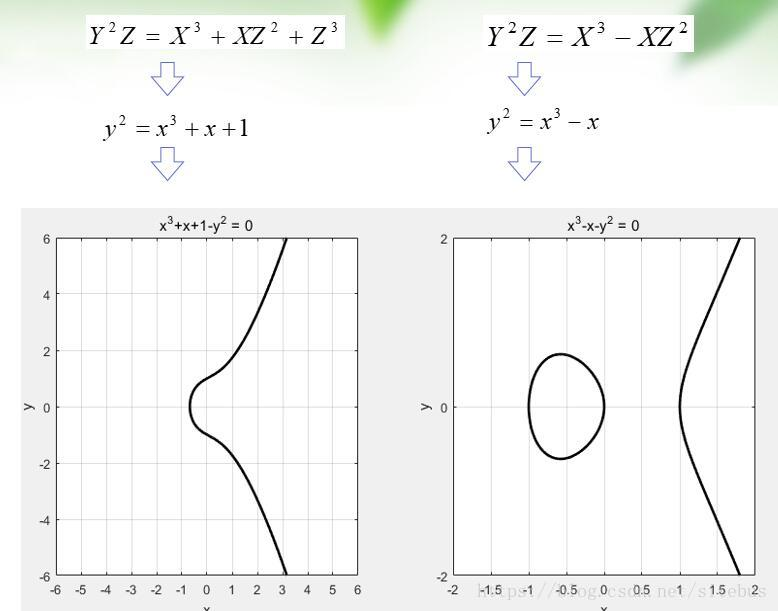
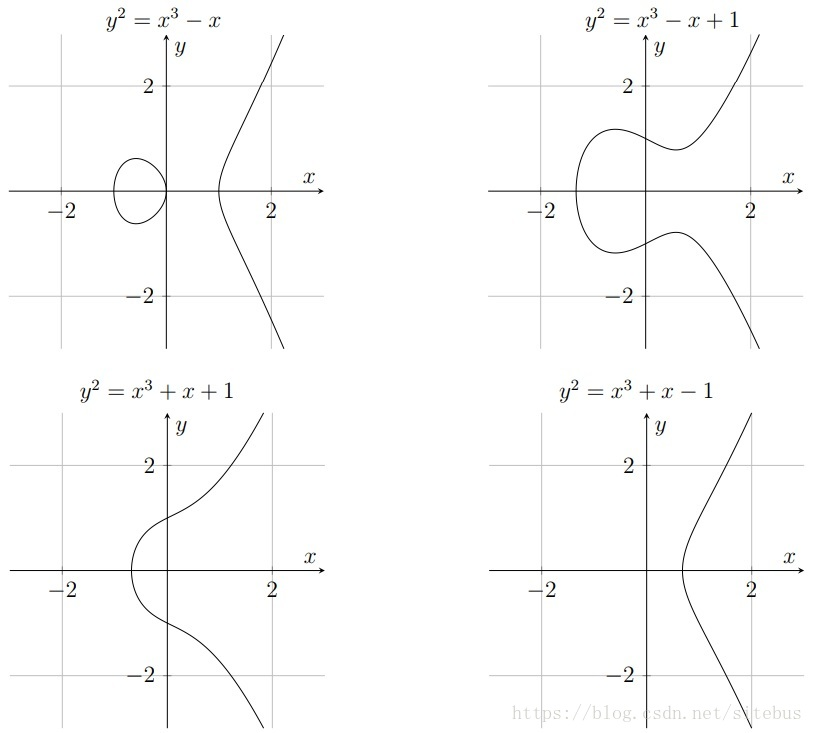
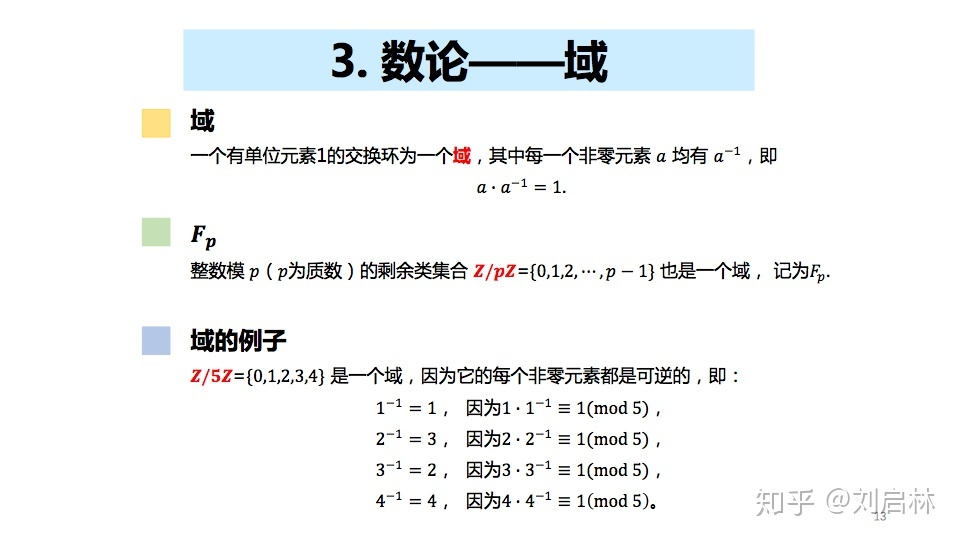
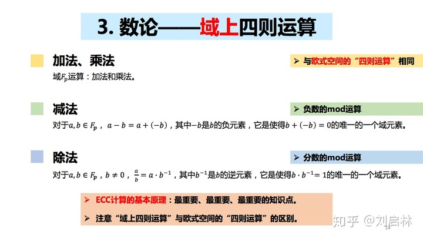
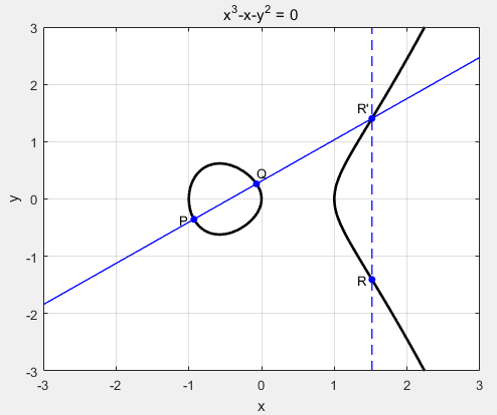
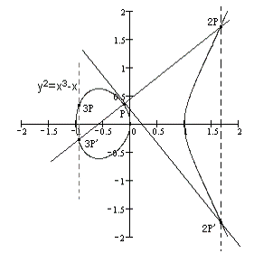
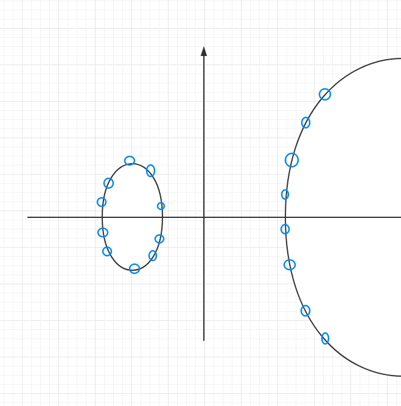

# 椭圆曲线加密数学原理及示例

## 实数椭圆曲线

什么是椭圆曲线，想必大家都会首先想到的是高中时学到的标准椭圆曲线方程。
$$
\frac{x^2} {a^2}+\frac {y^2}{b^2}=1(a>b，焦点在x轴，a<b，焦点在y轴)
$$
其实本文提到的椭圆曲线，跟这个高中时代的椭圆曲线方程基本无关。椭圆曲线的椭圆一词来源于椭圆周长积分公式。

一条椭圆曲线是在射影平面上满足威尔斯特拉斯方程（Weierstrass）所有点的集合，

简化版的Weierstrass方程：
$$
\sum :y^2=x^2+ax+b
$$
(1)
$$
Δ=−16(4a 3 +27b) !=0用来保证曲线是光滑的，即曲线的所有点都没有两个或者两个以上的不同的切线。
$$
(2)
$$
a , b ∈ K , K 为 E 的 基 础 域 。 a,b\in K, K为E的基础域。a,b∈K
$$
(3)
$$
点 O ∞ 是曲线的唯一的无穷远点。
$$


## 椭圆曲线实例




## 什么是阿贝尔群？

如果集合G有一个乘法运算·(+),且此运算具有性质:

(1)结合率:(a·b)·c=a·(b·c);

(2)单位元的存在性:e·a=a·e=a

(3)逆元的存在性:a·a^-1=a^-1·a=e;

则称G为一个乘法(加法)群.

如果G的乘法(加法)再满足交换律a·b=b·α,则G称为阿贝尔群(可交换群)

## 域



## 域上的四则运算




## 曲线上点的加法

任意取椭圆曲线上两点P、Q（若P、Q两点重合，则作P点的切线），作直线交于椭圆曲线的另一点R'，过R'做y轴的平行线交于R，定义P+Q=R。这样，加法的和也在椭圆曲线上，并同样具备加法的交换律、结合律



同点加法

若有k个相同的点P相加，记作kP

P+P+P=2P+P=3P




## 有限域椭圆曲线

椭圆曲线是连续的，并不适合用于加密；所以，我们必须把椭圆曲线变成离散的点，我们要把椭圆曲线定义在有限域上。
我们给出一个有限域Fp

- Fp中有p（p为质数）个元素0,1,2,…, p-2,p-1
- Fp的加法是a+b≡c(mod p)
- Fp的乘法是a×b≡c(mod p)
- Fp的除法是a÷b≡c(mod p)，即 a×b^(-1)≡c (mod p)，b-1也是一个0到p-1之间的整数，但满足b×b-1≡1 (mod p)
- Fp的单位元是1，零元是 0
- Fp域内运算满足交换律、结合律、分配律

椭圆曲线Ep(a,b)，p为质数，x,y∈[0,p-1]
$$
y2=x3+ax+b(modp)
$$
选择两个满足下列约束条件的小于p的非负整数a、b
$$
4a3+27b2≠0(modp)
$$
加上限制域之后，椭圆曲线变成一些符合公式的点。  图为简单示例：



## 有限域椭圆曲线点的阶

如果椭圆曲线上一点P，存在最小的正整数n使得数乘nP=O∞ ,则将n称为P的阶
若n不存在，则P是无限阶的


## 椭圆曲线加密数学依据

考虑K=kG ，其中K、G为椭圆曲线Ep(a,b)上的点，n为G的阶（nG=O∞ ），k为小于n的整数。则给定k和G，根据加法法则，计算K很容易但反过来，给定K和G，求k就非常困难。因为实际使用中的ECC原则上把p取得相当大，n也相当大，要把n个解点逐一算出来列成上表是不可能的。

这就是椭圆曲线加密算法的数学依据。

点G称为基点（base point）

k（k<n）为私有密钥（privte key）

K为公开密钥（public key)

## ECC保密通信算法

1.Alice选定一条椭圆曲线E，并取椭圆曲线上一点作为基点G 假设选定E29(4,20)，基点G(13,23) , 基点G的阶数n=37

2.Alice选择一个私有密钥p（p<n），并生成公开密钥K=pG 比如25, K= pG = 25G = (14,6）`

3.Alice将E和点K、G传给Bob

4.Bob收到信息后，将待传输的明文编码到上的一点M（编码方法略），并产生一个随机整数r（r<n,n为G的阶数） 假设r=6 要加密的信息为3,因为M也要在E29(4,20) 所以M=(3,28)

5.Bob计算点C1=M+rK和C2=rG C1= M+6K = (3,28)+6*(14,6)=(3,28)+(27,27)=(6,12) C2= 6G =(5,7)

6.Bob将C1、C2传给Alice

7.Alice收到信息后，计算C1-kC2，结果就应该是点M C1-kC2 =(6,12)-25C2 =(6,12)-25*6G =(6,12)-2G =(6,12)-(27,27) =(6,12)+(27,2) =(3,28)

数学原来上能解密是因为:C1-kC2=M+rK-krG=M+rkG-krG-M

## ECC椭圆曲线初始化原理

通常将Fp上的一条椭圆曲线描述为T=(p,a,b,G,n,h)，p、a、b确定一条椭圆曲线（p为质数，(mod p)运算）G为基点，n为点G的阶，h是椭圆曲线上所有点的个数m与n相除的商的整数部分。

在openssl中n用order表示，如下代码中 *order。

因此在openssl中进行ecc的自定义曲线为：

```c
/* Create the curve */
    if (NULL == (curve = EC_GROUP_new_curve_GFp(p, a, b, ctx)))
        handleErrors(__LINE__);
```

全部创建曲线实例：  参考openssl官方wiki:https://wiki.openssl.org/index.php/Elliptic_Curve_Cryptography

```c
EC_GROUP *create_curve(void)
{
    BN_CTX *ctx;
    EC_GROUP *curve;
    BIGNUM *a, *b, *p, *order, *x, *y;
    EC_POINT *generator;

    /* Binary data for the curve parameters */
    unsigned char a_bin[28] =
        {0xFF,0xFF,0xFF,0xFF,0xFF,0xFF,0xFF,0xFF,0xFF,0xFF,
            0xFF,0xFF,0xFF,0xFF,0xFF,0xFE,0xFF,0xFF,0xFF,0xFF,
            0xFF,0xFF,0xFF,0xFF,0xFF,0xFF,0xFF,0xFE};
    unsigned char b_bin[28] =
        {0xB4,0x05,0x0A,0x85,0x0C,0x04,0xB3,0xAB,0xF5,0x41,
            0x32,0x56,0x50,0x44,0xB0,0xB7,0xD7,0xBF,0xD8,0xBA,
            0x27,0x0B,0x39,0x43,0x23,0x55,0xFF,0xB4};
    unsigned char p_bin[28] =
        {0xFF,0xFF,0xFF,0xFF,0xFF,0xFF,0xFF,0xFF,0xFF,0xFF,
            0xFF,0xFF,0xFF,0xFF,0xFF,0xFF,0x00,0x00,0x00,0x00,
            0x00,0x00,0x00,0x00,0x00,0x00,0x00,0x01};
    unsigned char order_bin[28] =
        {0xFF,0xFF,0xFF,0xFF,0xFF,0xFF,0xFF,0xFF,0xFF,0xFF,
            0xFF,0xFF,0xFF,0xFF,0x16,0xA2,0xE0,0xB8,0xF0,0x3E,
            0x13,0xDD,0x29,0x45,0x5C,0x5C,0x2A,0x3D };
    unsigned char x_bin[28] =
        {0xB7,0x0E,0x0C,0xBD,0x6B,0xB4,0xBF,0x7F,0x32,0x13,
            0x90,0xB9,0x4A,0x03,0xC1,0xD3,0x56,0xC2,0x11,0x22,
            0x34,0x32,0x80,0xD6,0x11,0x5C,0x1D,0x21};
    unsigned char y_bin[28] =
        {0xbd,0x37,0x63,0x88,0xb5,0xf7,0x23,0xfb,0x4c,0x22,
            0xdf,0xe6,0xcd,0x43,0x75,0xa0,0x5a,0x07,0x47,0x64,
            0x44,0xd5,0x81,0x99,0x85,0x00,0x7e,0x34};

    /* Set up the BN_CTX */
    if(NULL == (ctx = BN_CTX_new())) handleErrors();

    /* Set the values for the various parameters */
    if(NULL == (a = BN_bin2bn(a_bin, 28, NULL))) handleErrors();
    if(NULL == (b = BN_bin2bn(b_bin, 28, NULL))) handleErrors();
    if(NULL == (p = BN_bin2bn(p_bin, 28, NULL))) handleErrors();
    if(NULL == (order = BN_bin2bn(order_bin, 28, NULL))) handleErrors();
    if(NULL == (x = BN_bin2bn(x_bin, 28, NULL))) handleErrors();
    if(NULL == (y = BN_bin2bn(y_bin, 28, NULL))) handleErrors();

    /* Create the curve */
    if(NULL == (curve = EC_GROUP_new_curve_GFp(p, a, b, ctx))) handleErrors();

    /* Create the generator */
    if(NULL == (generator = EC_POINT_new(curve))) handleErrors();
    if(1 != EC_POINT_set_affine_coordinates_GFp(curve, generator, x, y, ctx))
        handleErrors();

    /* Set the generator and the order */
    if(1 != EC_GROUP_set_generator(curve, generator, order, NULL))
        handleErrors();

    EC_POINT_free(generator);
    BN_free(y);
    BN_free(x);
    BN_free(order);
    BN_free(p);
    BN_free(b);
    BN_free(a);
    BN_CTX_free(ctx); 

    return curve;
}
```


