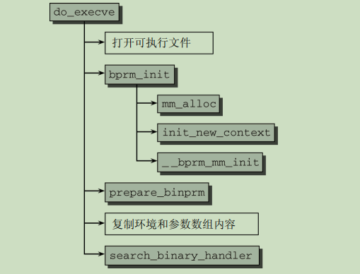
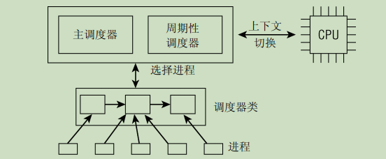

# 深入linux内核架构

## Linux进程管理子系统

### 一、进程的表现形式

#### 1.进程生命周期

运行：该进程此刻正在执行。

等待：进程能够运行，但没有得到许可，因为CPU分配给另一个进程。调度器可以在下一次
任务切换时选择该进程。

睡眠：进程正在睡眠无法运行，因为它在等待一个外部事件。调度器无法在下一次任务切换
时选择该进程。


#### 2.进程表示

include/linux/sched.h中有结构体struct task_struct;表示了进程的所有信息。

```c
struct task_struct { 
    volatile long state; /* -1表示不可运行，0表示可运行，>0表示停止 */ 
    void *stack; 
    atomic_t usage; 
    unsigned long flags; /* 每进程标志，下文定义 */ 
    unsigned long ptrace; 
    int lock_depth; /* 大内核锁深度 */ 
    int prio, static_prio, normal_prio; 
    struct list_head run_list; 
    const struct sched_class *sched_class; 
    struct sched_entity se; 
    unsigned short ioprio; 
    unsigned long policy; 
    cpumask_t cpus_allowed; 
    unsigned int time_slice; 
    #if defined(CONFIG_SCHEDSTATS) || defined(CONFIG_TASK_DELAY_ACCT) 
    struct sched_info sched_info; 
    #endif 
    struct list_head tasks; 
    /* 
    * ptrace_list/ptrace_children链表是ptrace能够看到的当前进程的子进程列表。
    */ 
    struct list_head ptrace_children; 
    struct list_head ptrace_list; 
    struct mm_struct *mm, *active_mm; 
    /* 进程状态 */ 
    struct linux_binfmt *binfmt; 
    long exit_state; 
    int exit_code, exit_signal; 
    int pdeath_signal; /* 在父进程终止时发送的信号 */ 
    unsigned int personality; 
    unsigned did_exec:1; 
    pid_t pid; 
    pid_t tgid; 
    /* 
    * 分别是指向（原）父进程、最年轻的子进程、年幼的兄弟进程、年长的兄弟进程的指针。
    *（p->father可以替换为p->parent->pid）
    */ 
    struct task_struct *real_parent; /* 真正的父进程（在被调试的情况下） */ 
    struct task_struct *parent; /* 父进程 */ 
    /* 
    * children/sibling链表外加当前调试的进程，构成了当前进程的所有子进程
    */ 
    struct list_head children; /* 子进程链表 */ 
    struct list_head sibling; /* 连接到父进程的子进程链表 */ 
    struct task_struct *group_leader; /* 线程组组长 */ 
    /* PID与PID散列表的联系。 */ 
    struct pid_link pids[PIDTYPE_MAX]; 
    struct list_head thread_group; 
    struct completion *vfork_done; /* 用于vfork() */ 
    int __user *set_child_tid; /* CLONE_CHILD_SETTID */ 
    int __user *clear_child_tid; /* CLONE_CHILD_CLEARTID */ 
    unsigned long rt_priority; 
    cputime_t utime, stime, utimescaled, stimescaled; 
    unsigned long nvcsw, nivcsw; /* 上下文切换计数 */ 
    struct timespec start_time; /* 单调时间 */ 
    struct timespec real_start_time; /* 启动以来的时间 */ 
    /* 内存管理器失效和页交换信息，这个有一点争论。它既可以看作是特定于内存管理器的，
    也可以看作是特定于线程的 */ 
    unsigned long min_flt, maj_flt; 
    cputime_t it_prof_expires, it_virt_expires; 
    unsigned long long it_sched_expires; 
    struct list_head cpu_timers[3]; 
    /* 进程身份凭据 */ 
    uid_t uid,euid,suid,fsuid; 
    gid_t gid,egid,sgid,fsgid; 
    struct group_info *group_info; 
    kernel_cap_t cap_effective, cap_inheritable, cap_permitted; 
    unsigned keep_capabilities:1; 
    struct user_struct *user; 
    char comm[TASK_COMM_LEN]; /* 除去路径后的可执行文件名称
     -用[gs]et_task_comm访问（其中用task_lock()锁定它）
     -通常由flush_old_exec初始化 */ 
    /* 文件系统信息 */ 
    int link_count, total_link_count; 
    /* ipc相关 */ 
    struct sysv_sem sysvsem; 
    /* 当前进程特定于CPU的状态信息 */ 
    struct thread_struct thread; 
    /* 文件系统信息 */ 
    struct fs_struct *fs; 
    /* 打开文件信息 */ 
    struct files_struct *files; 
    /* 命名空间 */ 
    struct nsproxy *nsproxy; 
    /* 信号处理程序 */ 
    struct signal_struct *signal; 
    struct sighand_struct *sighand; 
    sigset_t blocked, real_blocked; 
    sigset_t saved_sigmask; /* 用TIF_RESTORE_SIGMASK恢复 */ 
    struct sigpending pending; 
    unsigned long sas_ss_sp; 
    size_t sas_ss_size; 
    int (*notifier)(void *priv); 
    void *notifier_data; 
    sigset_t *notifier_mask; 
    #ifdef CONFIG_SECURITY 
    void *security; 
    #endif 
    /* 线程组跟踪 */ 
    u32 parent_exec_id; 
    u32 self_exec_id; 
    /* 日志文件系统信息 */ 
    void *journal_info; 
    /* 虚拟内存状态 */ 
    struct reclaim_state *reclaim_state; 
    struct backing_dev_info *backing_dev_info; 
    struct io_context *io_context; 
    unsigned long ptrace_message; 
    siginfo_t *last_siginfo; /* 由ptrace使用。*/ 
    ... 
};
```


进程限制：

```sh
RLIMIT_CPU #按毫秒计算的最大CPU时间
RLIMIT_FSIZE #允许的最大文件长度
RLIMIT_DATA #数据段的最大长度
RLIMIT_STACK #（用户状态）栈的最大长度
RLIMIT_CORE #内存转储文件的最大长度
RLIMIT_RSS #常驻内存的最大尺寸。换句话说，进程使用页帧的最大数目。目前未使用
RLIMIT_NPROC #与进程真正UID关联的用户可以拥有的进程的最大数目
RLIMIT_NOFILE #打开文件的最大数目
RLIMIT_MEMLOCK #不可换出页的最大数目
RLIMIT_AS #进程占用的虚拟地址空间的最大尺寸
RLIMIT_LOCKS #文件锁的最大数目
RLIMIT_SIGPENDING #待决信号的最大数目
RLIMIT_MSGQUEUE #信息队列的最大数目
RLIMIT_NICE #非实时进程的优先级（nice level）
RLIMIT_RTPRIO #最大的实时优先级
```


##### 命名空间：

概念：就是c++命名空间的意思，隔离资源。

创建：

1.用fork或者clone系统调用创建新进程时，有特定的选项可以控制使用使用新命名空间或者使用父命名空间。

2.unshare系统调用将进程的某些部分与父进程分离，包括命名空间。


进程类中命名空间结构体：

```c
struct nsproxy {
	atomic_t count;
	struct uts_namespace *uts_ns;
	struct ipc_namespace *ipc_ns;
	struct mnt_namespace *mnt_ns;
	struct pid_namespace *pid_ns;
	struct net 	     *net_ns;
};
```

* UTS命名空间：
* ipc命名空间：
* mnt命名空间：
* pid命名空间：
* net命名空间：


##### 进程id号：

​	UNIX进程总是会分配一个号码用于在其命名空间中唯一地标识它们。该号码被称作进程ID号，
简称PID。用fork或clone产生的每个进程都由内核自动地分配了一个新的唯一的PID值。


#### 3.进程的系统调用

fork->sys_fork     }

vfork->sys_vfork  }---->do_fork

clone->sys_clone }

```c
//arch/x86/kernel/process_32.c 
asmlinkage int sys_clone(struct pt_regs regs) 
{ 
	unsigned long clone_flags; 
	unsigned long newsp; 
	int __user *parent_tidptr, *child_tidptr; 
	clone_flags = regs.ebx; 
	newsp = regs.ecx; 
	parent_tidptr = (int __user *)regs.edx; 
	child_tidptr = (int __user *)regs.edi; 
	if (!newsp) 
		newsp = regs.esp; 
	return do_fork(clone_flags, newsp, &regs, 0, parent_tidptr, child_tidptr); 
}

asmlinkage int sys_fork(long r10, long r11, long r12, long r13, long mof, long srp,struct pt_regs *regs)
{
    //SIGCHLD:子进程结束后，发送SIGCHLD信号给父进程。
	return do_fork(SIGCHLD, rdusp(), regs, 0, NULL, NULL);
}
```

```c

//kernel/fork.c 
long do_fork(unsigned long clone_flags, 
	unsigned long stack_start,
	struct pt_regs *regs, 
	unsigned long stack_size, 
	int __user *parent_tidptr, 
	int __user *child_tidptr)
   
/*
* clone_flags:
	是一个标志集合，用来指定控制复制过程的一些属性。最低字节指定了在子进程终止时被发给父进程的信号号码。其余的高位字节保存了各种常数，下文会分别讨论。
* stack_start:
	是用户状态下栈的起始地址。
* regs:
	是一个指向寄存器集合的指针，其中以原始形式保存了调用参数。该参数使用的数据类型是特定于体系结构的struct pt_regs，其中按照系统调用执行时寄存器在内核栈上的存储顺序，保存了所有的寄存器（更详细的信息，请参考附录A）。
* stack_size:
	是用户状态下栈的大小。该参数通常是不必要的，设置为0
* parent_tidptr和child_tidptr:
	是指向用户空间中地址的两个指针，分别指向父子进程的PID。NPTL（Native Posix Threads Library）库的线程实现需要这两个参数。我将在下文讨论其语义。
*/
```

##### do_fork()的实现：


* copy_process生成新进程并根据传入的参数重用父进程的数据。

* fork要返回新进程的PID，因此必须获得PID。如果设置了CLONE_NEWPID标志，fork操作可能创建了新的PID命名空间。如果是这样，则需要调用task_pid_nr_ns获取在父命名空间中为新进程选择的PID，即发出fork调用的进程所在的命名空间。如果PID命名空间没有改变，调用task_pid_vnr获取局部PID即可，因为新旧进程都在同一个
  命名空间中。

```c
//kernel/fork.c
nr = (clone_flags & CLONE_NEWPID) ?
	task_pid_nr_ns(p, current->nsproxy->pid_ns) : 
		task_pid_vnr(p);
```

* 如果将要使用Ptrace监控新的进程，那么在创建新进程后会立即向其发送SIGSTOP信号，以便附接的调试器检查其数据。

* wake_up_new_task将子进程task_struct添加到调度器队列。调度器对该进程有特别的处理，让齐有高几率尽快运行。
* 启动子进程的完成（completions mechanism）机制。由图里那个宏来标记。  **完成机制后边在详细看。**

##### copy_process()的实现：


1.检查标志

2.dup_task_struct

3.检查资源限制

4.初始化task_struct

5.sched_fork

6.复制/共享进程的各个部分。

* copy_semundo:
* copy_files:
* copy_fs:
* copy_sighand:
* copy_signal:
* copy_mm:
* copy_namespaces:
* copy_thread:

7.设置各个进程id，进程关系，等等。


1.在复制进程的时候很多参数是无意义的。比如你要请求新命名空间(CLONE_NEWS),并且还要与父进程共享文件系统信息(CLONE_FS). 第一步会检查标识是否合法。


##### 内核线程：

​	是由内核本身启动的进程。将内核函数让独立的进程执行，和其他进程并行执行。也并行于内核自身的执行。

1.周期性的将修改的内存页与页来源块设备同步。

2.如果内存页很少，则写入交换区。

3.管理延时动作。

一般分为两种：

1.线程启动时一直等待，直到内核请求线程做出某一动作。

2.线程启动后，周期性间隔运行，检测特定资源的使用，在用量超过或者低于预期时执行某一动作。


##### 启动新程序：



```c
//kernel/exec.c 
int do_execve(char * filename, 
char __user *__user *argv, 
char __user *__user *envp, 
struct pt_regs * regs)
```


##### 退出程序：

进程必须用exit系统调用终止。这使得内核有机会将该进程使用的资源释放回系统。

该调用的入口点是sys_exit函数，需要一个错误码作为其参数，以便退出进程。

其定义是体系结构无关的，见kernel/exit.c。我们对其实现没什么兴趣，因为它很快将工作委托给do_exit。
简而言之，该函数的实现就是将各个引用计数器减1，如果引用计数器归0而没有进程再使用对应的结构，那么将相应的内存区域返还给内存管理模块。


### 二、调度器的实现

分为两部分：1.调度策略 2.上下文的切换。


实时进程：需要立即响应的进程。（完全公平调度器。暂不讨论此进程）

完全公平调度器只考虑进程的等待时间，即进程在就绪队列（run-queue）中已经等待了多长时间。对CPU时间需求最严格的进程被调度执行。


所有的可运行进程都按时间在一个红黑树中排序，所谓时间即其等待时间。

虚拟时钟：


1.周期性检测是否需要切换进程。

2.程序主动放弃cpu。

上述两个组件叫通用调度器（也叫核心调度器）




调度器类用来进行选择下来是哪一个进程执行。（根据调度策略来决定：完全公平调度、实时调度、空闲时调度空闲进程）

在调度器被调用时，它会查询调度器类，查看下一个执行的是哪个进程。

每个进程属于某一个调度类，各个调度类管理所属的进程，通过调度器完全不涉及进程管理，其工作都委托给调度器类。


