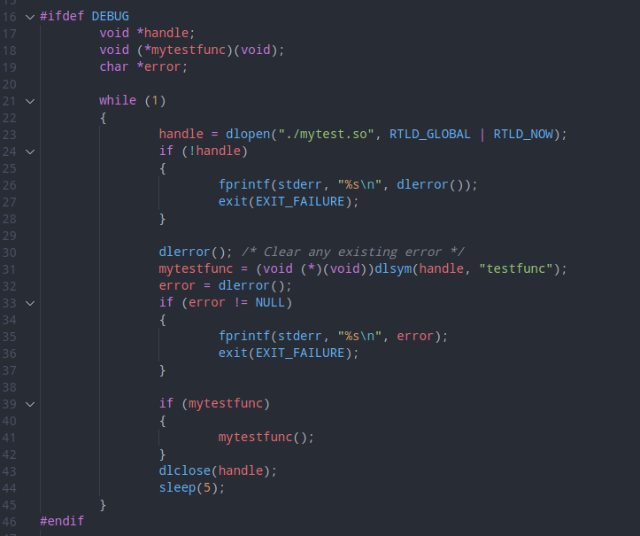
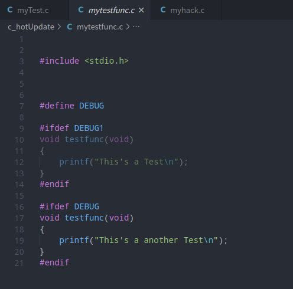
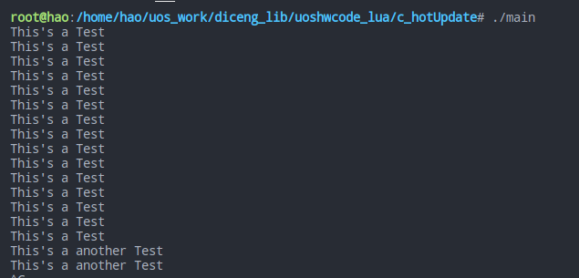
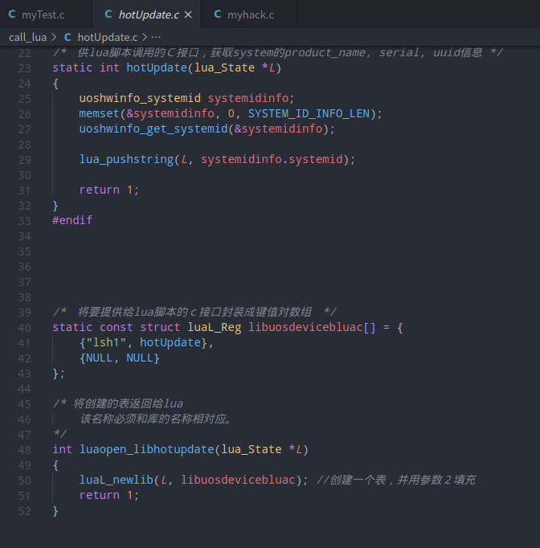
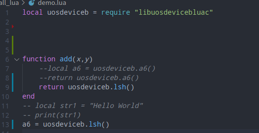

# c/c++的热更新方法

## 一、第一种方式

用LD_PRELOAD进行热更新。

1.写出主函数。

2.写出钩子函数

3.将myhack.c编译成.so文件。库在编译好后，需要进行配置，配置与运行命令如下：

LD_PRELOAD=./myhack.so ./main

4.

LD_PRELOAD是一个环境变量，用来加载动态库时寻找所需符号的路径，而且是优先级最高的寻找路径。

换句话说，如我们代码需要加载动态库里面函数，众所周知，系统一般会去LD_LIBRARY_PATH下寻找，

但如果使用了这个变量，系统会优先去这个路径下寻找，如果找到了就返回，不在往下找了，

顺便提下，动态库的加载顺序为LD_PRELOAD>LD_LIBRARY_PATH>/etc/ld.so.cache>/lib>/usr/lib。

## 二、第二种方式

使用代码中加载动态库进行热更新。

1.使用myTest.c做为主程序，本地调用动态库mytest.so

2.使用dlopen加载动态库，使用dlsym定位到函数指针。

3.对库进行替换后，函数也进行了替换。

替换前后调用的函数相同，但是打印结果不同，

显示如图：

## 三、第三种

借用lua c进行程序热更新

1.使用c调lua脚本，lua脚本调用.so库的方式进行热更新。

2.将热更新代码编译成可被lua调用的方式。并编译成.so库。

3.在更新时从服务器下发，lua脚本和.so文件。

4.客户端直接调用lua c库获取全局变量a6的值。 则更新的脚本可以对a6的赋值函数进行重定向。

## 四、第四种

也是最难的。 需要更改程序运行时的代码段。
1.手动实现链接器那一套东西。
2.加载.o文件，重定位内存位置。
3.mprotect函数更改内存的使用权限，并修改代码段。