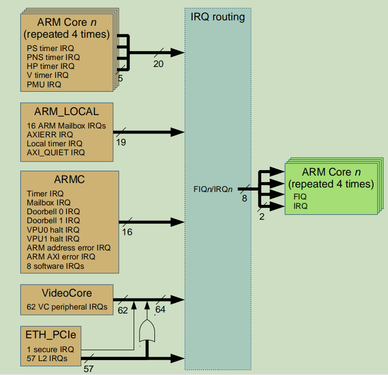
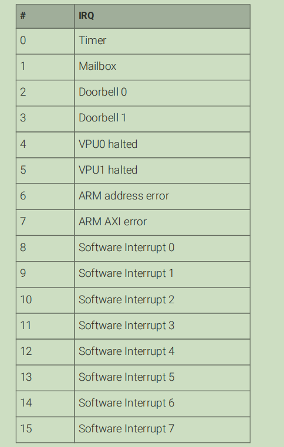
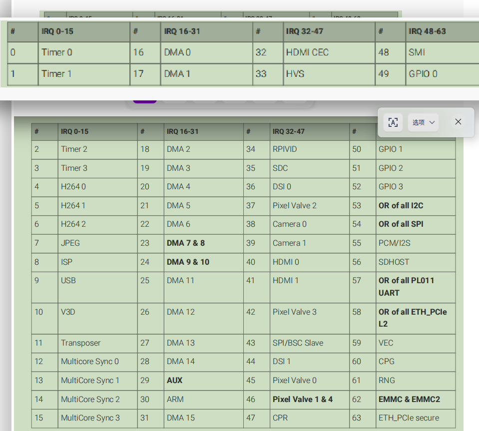
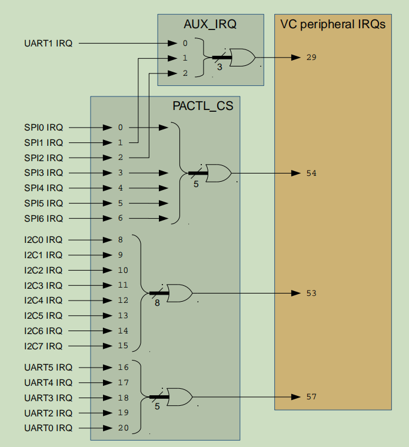

# bcm2711用户手册

## 目录

版权. 
法律免责声明.

1. 简介. 
   1.1 概述 .
   1.2 地址图.
   
       1.2.1 图解概述.
       1.2.2 完整的 35 位地址映射.
       1.2.3 ARM 物理地址.
       1.2.4 旧版主地址. 
   
   1.3 外设访问预防措施，以确保正确的内存排序. 

2. 辅助设备：UART1, SPI1 & SPI2 . 
   2.1.概述 .
   
       2.1.1.辅助寄存器. 
   
   2.2.迷你UART. 
   
       2.2.1. Mini UART 实现细节. 
       2.2.2.微型 UART 寄存器详细信息.
   
   2.3.通用 SPI 主控 (2x).
   
       2.3.1. SPI 实现细节.
       2.3.2.中断.
       2.3.3.长比特流. 
       2.3.4. SPI 寄存器详细信息. 

3. BSC(博通串行控制.应该是i2c)
   3.1.概述 .
   3.2.注册查看.
   3.3. 10 位寻址. 
   
       3.3.1.写作 . 
       3.3.2.阅读 .

4. DMA 控制器.
   4.1.概述 .
   4.2. DMA 控制器寄存器.
   
       4.2.1. DMA 通道寄存器地址映射.
            4.2.1.1.控制块数据结构. 
            4.2.1.2.注册地图.
            4.2.1.3.外设 DREQ 信号. 
   
   4.3. AXI 突发.
   4.4.错误处理.
   4.5. DMA LITE 引擎.
   4.6. DMA4 引擎.

5. 通用 I/O (GPIO).
   5.1.概述 .
   5.2.注册查看.
   5.3.替代功能分配.
   5.4.通用 GPIO 时钟.
   
       5.4.1.工作频率 . 
       5.4.2.注册定义.

6. 中断. 
   6.1.概述 .
   6.2.中断源.
   
        6.2.1. ARM Core n 中断.
       6.2.2. ARM_LOCAL 中断.
       6.2.3. ARMC 中断.
       6.2.4. VideoCore 中断.
       6.2.5. ETH_PCIe 中断. 
   
   6.3. GIC-400 中断控制器.
   
   6.4 传统中断控制器. 
   
   6.5.寄存器.
   
       6.5.1. GIC-400. 
       6.5.2. ARM_LOCAL .
       6.5.3. ARMC . 

7. PCM/I2S 音频.
   7.1.概述 . 
   7.2.框图.
   7.3.典型时序.
   7.4.手术 . 
   7.5.软件操作.
      7.5.1.在轮询模式下运行.
      7.5.2.在中断模式下运行.
      7.5.3. DMA.  
   7.6.错误处理.     
   7.7. PDM 输入模式操作.
   7.8.格雷码输入模式操作. 
   7.9. PCM 寄存器映射. 

8. 脉冲宽度调制器.
   8.1.概述 .
   8.2.框图.
   8.3. PWM 实现.  
   8.4.操作模式.
   8.5.快速参考 .
   8.6.控制和状态寄存器.

9. SPI .
   9.1.概述 .
   9.2. SPI 主模式.
      9.2.1.标准模式.
      9.2.2.双向模式.
   9.3. LoSSI 模式.
      9.3.1.命令写入.
      9.3.2.参数写入.
      9.3.3.字节读取命令. 
      9.3.4. 24 位读取命令.
      9.3.5. 32 位读取命令.
   9.4.框图.
   9.5. SPI 寄存器映射.
   9.6.软件操作.
      9.6.1.轮询.
      9.6.2.打断.
      9.6.3. DMA
      9.6.4.笔记

10. 系统定时器
    10.1.概述 
    10.2.系统定时器寄存器

11. UART
    11.1.概述 
    11.2. 16C650 UART 的变体
    11.3.主要 UART 输入和输出
    11.4. UART 中断
    11.5.注册查看

12. 定时器（ARM 端）
    12.1.概述
    12.2.定时器寄存器

13. ARM 邮箱(核间通信机制)
    13.1.概述
    13.2.寄存器

## 第 6 章 中断

## 6.1. Overview

    BCM2711 具有来自各种来源的大量中断，并且可以选择两个中断控制器。 默认情况下选择 GIC-400 中断控制器，但可以通过设置 inconfig.txt 选择旧式中断控制器 - 有关详细信息，请参阅 raspberrypi.com 文档。

    在图 5 中，橙色框显示了各种中断源模块，蓝色框覆盖了中断控制器路由（稍后解释），绿色框显示了最终的中断目的地。 每个斜线下方粗箭头下方的数字表示该箭头包含多少信号（没有数字的细箭头仅包含一个信号）。 橙色的“ARM Core n”块实际上与绿色的“ARM Core n”块相同，只是为了清楚起见，它们被绘制为单独的源块和目标块。 ARM_LOCAL 和 ARMC 是芯片内不同的硬件块，每个都有自己的一组寄存器； ARMC 对 VPU 和 CPU 都是可见的，但 ARM_LOCAL 只对 CPU 可见（对应第 1 章的“ARM 本地外设”）。

    每个中断控制器的最终输出是 8 个单独的信号 - 一个 FIQ（快速中断请求）和一个 IRQ（中断请求）用于 4 个 ARM 内核，即连接到 ARM 内核 0 的 FIQ0 和 IRQ0，连接到 ARM 内核 1 的 FIQ1 和 IRQ1 , FIQ2 和 IRQ2 连接到 ARM 内核 2，FIQ3 和 IRQ3 连接到 ARM 内核 3。为方便起见，本文将这 8 个信号称为 FIQn/IRQn。

    为避免混淆，请注意 ARM_LOCAL 块中的“ARM 邮箱 IRQ”与 ARMC 块中的“邮箱 IRQ”不同。 同样，ARM_LOCAL 块中的“本地定时器 IRQ”与 ARMC 块中的“定时器 IRQ”不同，它们都不同于“ARM Core n”块中的 4 个定时器 IRQ。 ARM_LOCAL 块中的“AXIERR IRQ”也不同于 ARMC 块中的“ARM AXI error IRQ”。

## 6.2. Interrupt sources

### 6.2.1. ARM Core n interrupts

    每个 ARM 内核都可以引发安全物理 (PS) 定时器中断、非安全物理 (PNS) 定时器中断、Hypervisor (HP) 定时器中断、虚拟 (V) 定时器中断和性能监控单元 (PMU) 中断 . 有关详细信息，请参阅 ARM 开发人员网站上的 ARM Cortex-A72 文档。

### 6.2.2. ARM_LOCAL interrupts

    有关 ARM 邮箱的更多信息，请参见第 13 章。如果收到错误响应，则 AXIERR 输出由 ARM 的 L2 缓存断言。 关于本地定时器和 AXI_QUIET 的更多信息可以在本章的寄存器部分找到。

### 6.2.3. ARMC interrupts

    表 101 中的 Timer 中断来自第 12 章中描述的“Timer（ARM 端）”。八个通用软件中断可以通过写入 SWIRQ_SET 寄存器来设置，通过写入 SWIRQ_CLEAR 寄存器来清除。

### 6.2.4. VideoCore interrupts

表 102 中的 4 个定时器中断来自第 10 章中描述的“系统定时器”。

    因为外设比可用的 VC 外设 IRQ 多，一些 VC 外设中断（在表 102 中以粗体突出显示）是多个外设中断的 OR-ed 版本。VC 外设 IRQ 29、53、54 的每个外设中断状态 & 57 可以依次从 AUX_IRQ（在第 2 章中记录）和 PACTL_CS（在地址 0x7E20 4E00）寄存器中读取。 图 6 显示了这是如何在逻辑上连接的，灰色框中的垂直对齐数字表示寄存器中的位位置

    例如，如果触发了 VC 外设 IRQ 53，那么您就知道至少有一个 I2C 外设导致了中断。 要准确找出哪些 I2C 外设有待处理的中断，您可以读取第 8 位到第 15 位，包括
PACTL_CS（或者，您可以简单地读取每个 I2C 外设的状态寄存器）。还有一些 VC 外设中断（23、24、46 和 62）是两个外设中断信号的 OR-ed 版本 - 如果这些中断 接收到的唯一选择是读取每个相关外设的状态寄存器。

### 6.2.5. ETH_PCIe interrupts

上表中未列出的任何 IRQ 编号均被保留。

    来自 ETH_PCIe 块的安全 IRQ 输出（仅对 VPU 而非 CPU 有用）被路由到 VCperipheral IRQ 63，所有 57 个 ETH_PCIe L2 IRQ 被 OR-ed 在一起并被路由到 VC 外设 IRQ 58 - 参见图 5 和表 102。
请注意，57 个单独的 ETH_PCIe 中断不会路由到传统中断控制器，只有 VC 外设 IRQ 58（OR-ed 版本）可用。

## 6.3. GIC-400 interrupt controller

    BCM2711 包含一个 ARM GIC-400 中断控制器，默认启用。 有关详细信息，请参阅 ARM 开发人员网站上的 ARM GIC-400 文档。

    图 7 显示了前面描述的中断源如何连接到 GIC。 当 GIC-400 被选为中断控制器时，8 个“GIC FIQn/IRQn”输出被路由到 ARM 内核的 FIQn/IRQn 输入注意，即使选择 GIC-400 作为中断控制器， 旧式中断控制器（稍后描述）可用作 GIC 中的 PPI。

    GIC-400 还连接到每个 ARM 内核的 VFIQ（虚拟 FIQ）和 VIRQ（虚拟 IRQ）输入，但为简洁起见，此处未显示这些信号。

## 6.4. Legacy interrupt controller

    BCM2711中的传统中断控制器与早期BCM283X芯片中使用的中断控制器有一些相似之处，但也有一些不同之处。当选择传统中断控制器时，八个“传统FIQn/IRQn”输出（如图9所示）被路由到ARM核心的FIQn/IRQn输入。

    直接来自每个ARM内核（PS定时器、PNS定时器、HP定时器、V定时器和PMU）的中断只能路由到它们所源自的内核的FIQ或IRQ。例如，来自核心3的PS定时器和PMU IRQ可以路由到FIQ3，来自核心2的PNS定时器IRQ可以被路由到IRQ2。ARM定时器IRQ的屏蔽由4个timer_CNTRL寄存器（每个核心一个）控制，PMU IRQs的屏蔽由PMU_CONTROL_SET和PMU_ CONTROL-CLR寄存器控制。

    分配16个ARM邮箱中断，以使四个到达每个核心-ARM邮箱IRQ 0到3被路由到ARM核心0上的四个邮箱IRQ，ARM邮箱IRQ 12到15被路由到ARM核心3上的四条邮箱IRQ，ARM邮箱IRQ只能路由到其预期的核心的FIQ或IRQ，例如，邮箱4和5 IRQ可以路由到FIQ1，邮箱10 IRQ可以被路由到IRQ2。ARM邮箱的IRQ的屏蔽由四个Mailbox_CNTRL寄存器（每个核心一个）控制。

    AXI_QUIET IRQ仅适用于ARM核心0上的IRQ输入，其屏蔽由AXI_ QUIET_TIMERGISTER控制。本地定时器和AXIERR IRQ可以路由到8个FIQn/IRQn信号中的任何一个。本地定时器IRQ的屏蔽由Local_timer_CONTROL和PERI_IRQ_ROUTE0寄存器控制。AXIERR IRQ的屏蔽由ARM_CONTROL和CORE_IRQ_CONTROL寄存器控制。

    “ARMC路由”块的未屏蔽输入可从IRQ_STATUS0、IRQ_ STATUS1和IRQ单元STATUS2寄存器读取。

    “ARMC路由”块内的屏蔽由SET_EN_0、SET_ EN_1、SET-EN_2、CLR_EN-0、CLR-EN-1和CLR-EN-2寄存器控制。对于八个FIQn/IRQn信号（总共48个寄存器）中的每一个，重复这些寄存器中的每个。一旦中断被屏蔽和路由，它们的状态可以从3个未决和1个源寄存器中读取（对于每个FIQn/IRQn信号重复8次，总共32个寄存器）。

    

    这些是“嵌套”状态寄存器，这意味着如果设置了源寄存器中的位8，则还需要读取PENDING2以查看设置了哪些位。如果设置了PENDING2寄存器中的位24，则还需要读取PENDING0以查看设置了哪些位。

    作为一个更完整的示例，如果中断路由和屏蔽被设置为使得来自UART4的中断触发到ARM核心3的FIQinterrupt，则顺序（在ARM核心上）为：

    1.输入FIQ处理程序

    2.读取FIQ_SOURCE3

    3.发现FIQ_SOURCE3[8]已设置，因此读取FIQ3_PENDING2

    4.发现设置了FIQ3_PENDING2[25]，因此读取FIQ3-PENDING1

    5.发现FIQ3_PENDING1[25]（即VC外围IRQ 57）已设置，因此读取PACTL_CS[20:16]（见图6）以查看是谁触发了它

    6.发现PACTL_CS[17]已设置，因此读取UART4_MIS以（最终）确定导致中断的原因

# armv8芯片手册

## 目录

内容
Arm 架构参考手册 Armv8，用于 Armv8-A 架构配置文件

前言
关于本手册
使用本手册
约定
补充阅读
反馈

**Part A Armv8架构介绍与概述**

第 A1 章 Armv8 架构介绍
A1.1 关于 Arm 架构 ................................................... ................................... A1-34
A1.2 架构配置文件 ................................................................ ..........................A1-36
A1.3 Armv8 架构概念 ................................................... ................................... A1-37
A1.4 支持的数据类型 ................................................... ................................... A1-40
A1.5 高级 SIMD 和浮点支持 ................................................... ................... A1-52
A1.6 Arm 内存模型 ................................................... ...................................... A1-59

第 A2 章 Armv8-A 架构扩展

A2.1 Armv8 架构扩展 .................................................... ............... A2-62
A2.2 Armv8.0 架构中的架构特性.......................... ...... A2-65
A2.3 Armv8 加密扩展 .................................................... ...................... A2-68
A2.4 Armv8.1 架构扩展.......................... ...................... A2-69
A2.5 Armv8.2 架构扩展.......................... ...................... A2-72
A2.6 Armv8.3 架构扩展.......................... ...................... A2-81
A2.7 Armv8.4 架构扩展.......................... ...................... A2-85
A2.8 Armv8.5 架构扩展.......................... ...................... A2-90

A2.9 Armv8.6 架构扩展 .................................................... ...................... A2-94
A2.10 可靠性、可用性和可维护性扩展（RAS 扩展）........ A2-97
A2.11 统计分析扩展 (SPE) ................................... ..................... A2-98
A2.12 可伸缩向量扩展 (SVE) ................................... ......................... A2-99
A2.13 活动监视器扩展 ................................................... ............................. A2-100
A2.14 内存分区和监控 (MPAM) 扩展.......................... A2-101

**Part B AArch64 应用层架构**
第 B1 章 AArch64 应用级程序员模型
B1.1 关于应用程序级程序员模型 ................................................... ...... B1-106
B1.2 AArch64 执行状态的寄存器.......................... ..................... B1-107
B1.3 软件控制特性和 EL0 ................................................... ...................... B1-112

第 B2 章 AArch64 应用级内存模型
B2.1 关于 Arm 内存模型 ................................... ................................... B2-116
B2.2 Arm 架构中的原子性 ................................................... ...................... B2-118
B2.3 Armv8 内存模型的定义 .................................................... ..................... B2-123
B2.4 高速缓存和内存层次结构.......................................... ................... B2-143
B2.5 对齐支持 ................................... ................................... B2- 148
B2.6 字节序支持 ................................................... ............................. B2-150
B2.7 内存类型和属性 ................................................... ................... B2-153
B2.8 不匹配的内存属性 ................................................... ...................... B2-164
B2.9 同步和信号量 ................................................... ......................... B2-167

**C 部分 AArch64 指令集**
C1 A64指令集
C1.1 关于 A64 指令集 ................................................... ................................ C1-182
C1.2 A64 汇编语言的结构 ................................................... ............. C1-183
C1.3 地址生成 ................................................... ................................... C1-189
C1.4 指令别名 ................................................... ................................... C1- 192

C2章关于A64指令说明
C2.1 理解 A64 指令说明 ................................................... ...... C2-194
C2.2 关于 A64 指令描述的一般信息 ................... C2-197

第 C3 章 A64 指令集概述
C3.1 分支、异常生成和系统指令 .................................... C3-202
C3.2 加载和存储 ................................... ..................................................... .C3-209
C3.3 数据处理 - 即时 ................................................... ............................. C3-226
C3.4 数据处理 - 寄存器 ................................................... ................................... C3-231
C3.5 数据处理 - SIMD 和浮点 .................................................... ................... C3-239

C4 A64指令集编码
C4.1 A64 指令集编码 .................................................... ................................ C4-268

C5 A64系统指令类
C5.1 系统指令类编码空间 ................................................... ......... C5-376
C5.2 专用寄存器.......................... ................................... C5-389
C5.3 A64 用于缓存维护的系统指令.......................... ..... C5-475
C5.4 A64 用于地址转换的系统指令 ................................................... ...... C5-536
C5.5 A64 TLB 维护的系统说明 ................................................... ........ C5-561
C5.6 A64 预测限制的系统指令................................................................ .... C5-760

第 C6 章 A64 基本指令说明
C6.1 关于 A64 基本指令 ................................................... ........................ C6-772
C6.2 A64 基本指令按字母顺序排列的列表 ............................................... C6-775
第 C7 章 A64 高级 SIMD 和浮点指令说明
C7.1 关于 A64 SIMD 和浮点指令 ................................................... .. C7-1398
C7.2 A64 高级 SIMD 和浮点指令的字母顺序列表............ C7-1400

**D 部分 AArch64 系统级架构**
第 D1 章 AArch64 系统级程序员模型
D1.1 例外级别 ................................................... .. D1 -2314
D1.2 异常术语.......................... ............................. D1-2315
D1.3 执行状态 ....................................................... . D1-2317
D1.4 安全状态 ....................................................... ... D1-2318
D1.5 虚拟化 ................................................... ...... D1-2320
D1.6 用于指令处理和异常处理的寄存器.......................... D1-2323
D1.7 过程状态，PSTATE .......................................  D1-2330
D1.8 程序计数器和堆栈指针对齐 ..................................... D1-2333
D1.9 重置 .................................................... ...................... D1-2335
D1.10 异常条目.......................... ........................................... D1-2339
D1.11 异常返回 ................................... ................................... D1 -2350
D1.12 同步异常类型、路由和优先级 ................................... D1 -2354
D1.13 异步异常类型、路由、屏蔽和优先级 ...................... D1-2363
D1.14 可配置指令启用和禁用，以及陷阱控制 ................... D1-2373
D1.15 系统调用 ............................................................... ..... D1-2396
D1.16 进入低功耗状态的机制 ............................................... D1-2397
D1.17 自托管调试 ................................................... .............. D1- 2403
D1.18 事件监视器 ................................... ............................. .D1-2405
D1.19 交互处理 ........................................................ D1-2406
D1.20 实现选择对程序员模型的影响 .................... D1-2419

第 D2 章 AArch64 自托管调试
D2.1 关于自托管调试 ................................... ............................. D2-2424
D2.2 调试异常使能控制 ................................................... ................... D2-2428
D2.3 路由调试异常 ................................................... ................................... D2-2429
D2.4 从当前异常级别启用调试异常.......................... D2-2431
D2.5 掉电对调试异常的影响 .................................................... ....... D2-2433
D2.6 调试异常的路由和启用总结.......................... D2-2434
D2.7 调试异常的伪代码描述 ................................................... ....... D2-2436
D2.8 断点指令异常 ................................................... ...................... D2-2437
D2.9 断点异常 ................................................... ................................... D2-2439
D2.10 观察点异常 ................................................... ............................. D2-2457
D2.11 向量捕获异常 ................................................... ...................... D2-2471
D2.12 软件步骤异常 ................................................... ................................... D2-2472
D2.13 同步和调试异常 ................................................... ............. D2-2485

第 D3 章 AArch64 自托管 Trace
D3.1 关于自托管跟踪 ................................................... ................................... D3-2488
D3.2 自托管跟踪中的禁止区域.......................... ..................... D3-2489
D3.3 自托管跟踪时间戳.......................... ................................ D3-2491
D3.4 自托管跟踪中的同步 ................................................... ...................... D3-2493

第 D4 章 AArch64 系统级内存模型
D4.1 关于内存系统架构 ................................................... ................... D4-2496
D4.2 地址空间 ................................................... ..................................................... . D4-2497
D4.3 混合端支持.......................... ............................. D4-2498

D4.4 缓存支持 ................................... ..................................................... .. D4-2499
D4.5 外部中止 ................................................... ..................................................... . D4-2524
D4.6 内存屏障指令 ................................................... ................................ D4-2526
D4.7 通用内存系统指令的伪代码描述 ................... D4-2527

第 D5 章 AArch64 虚拟内存系统架构
D5.1 关于虚拟内存系统架构 (VMSA) ................................... D5-2532
D5.2 VMSAv8-64 地址转换系统.......................... .......... D5-2540
D5.3 VMSAv8-64 转换表格式描述符 ................................................... ..... D5-2593
D5.4 内存访问控制 ................................................... ............................. D5-2606
D5.5 内存区域属性 ................................................... ..................... D5-2628
D5.6 虚拟化主机扩展 ................................................... ............................. D5-2638
D5.7 嵌套虚拟化 ................................................... ................................... D5-2644
D5.8 VMSAv8-64 内存中止 ................................... ................................ D5-2652
D5.9 翻译后备缓冲区 (TLB) .................................................... ..................... D5-2662
D5.10 TLB 维护要求和 TLB 维护说明......... D5-2668
D5.11 VMSAv8-64 实现中的缓存 ................................................................ ............. D5-2685

第 D6 章 Armv8.5 内存标记扩展
D6.1 简介 ................................................... ..................................................... ..... D6-2690
D6.2 分配标签 ................................................... ..................................................... . D6-2691
D6.3 标签检查 ................................... ..................................................... .... D6-2692
D6.4 加标签和未加标签的地址 ................................................... ...................... D6-2693
D6.5 PE 访问分配标签 ................................................... ................................ D6-2694
D6.6 启用内存标记扩展 ................................................... ............. D6-2695
D6.7 标签检查故障的 PE 处理 ................................... ............................. D6-2696
D6.8 PE 生成 Tag Checked 和 Tag Unchecked 访问 ................... D6-2697

第 D7 章性能监视器扩展
D7.1 关于性能监视器 ................................................... ......................... D7-2700
D7.2 性能监控器的准确性 ................................................... ................... D7-2703
D7.3 溢出行为.......................... ................................... D7-2705
D7.4 可归因性.......................... ..................................................... .... D7-2707
D7.5 禁止事件计数 ................................................... ................................... D7-2709
D7.6 多线程实现 ................................................... ...................... D7-2710
D7.7 事件过滤 ................................................... ..................................................... ... D7-2711
D7.8 性能监视器和调试状态.......................... ............. D7-2713
D7.9 计数器使能 ................................... ................................... D7 -2714
D7.10 柜台访问 ................................................... ..................................................... D7-2715
D7.11 PMU 事件和事件编号 ................................... ...................... D7-2716
D7.12 性能监视器扩展寄存器 ................................... .......... D7-2772

第 D8 章活动监视器扩展
D8.1 关于活动监视器扩展 ................................................... ................... D8-2774
D8.2 活动监视器的属性和行为 ................................................... ..... D8-2775
D8.3 AMU 事件和事件编号 ................................... ...................... D8-2777

第 D9 章统计分析扩展
D9.1 关于统计分析扩展 ................................................... ............. D9-2780
D9.2 定义样本总体 ................................................... ............................. D9-2782
D9.3 控制何时对操作进行采样.......................... ............. D9-2784
D9.4 启用剖析 ................................................... ................................... D9- 2787
D9.5 过滤样本记录.......................... ................................... D9-2789
D9.6 剖析数据 ................................................... ................................... D9- 2790
D9.7 分析缓冲区 ............................................. ............................. D9-2799
D9.8 分析缓冲区管理 ................................................... ................................ D9-2803
D9.9 同步和统计分析 ................................................... ............. D9-2807

第 D10 章统计分析扩展样本记录规范
D10.1 关于统计分析扩展样本记录.......................... D10-2810
D10.2 按字母顺序排列的 Statistical Profiling Extension 数据包列表.............. D10-2813

第 D11 章 AArch64 状态下的通用定时器
D11.1 关于通用计时器 ................................................... ..................... D11-2838
D11.2 通用计时器的 AArch64 视图 ................................................... ............. D11-2842

D12 AArch64系统寄存器编码
D12.1 系统寄存器编码空间.......................... .................... D12-2850
D12.2 op0==0b10，移入和移出调试和跟踪系统寄存器 ................... D12-2851
D12.3 op0==0b11，移入和移出非调试系统寄存器，专用寄存器......D12-2853

第 D13 章 AArch64 系统寄存器说明
D13.1 关于 AArch64 系统寄存器 ................................... .................... D13-2868
D13.2 通用系统控制寄存器 ................................................... ...................... D13-2876
D13.3 调试寄存器 ................................................... ................................... D13- 3560
D13.4 性能监视器寄存器 ................................................... ...................... D13-3663
D13.5 活动监视器寄存器 ................................................... ................................ D13-3724
D13.6 统计分析扩展寄存器 ................................................... ............. D13-3755
D13.7 RAS 寄存器 ................................................... ............................... . D13-3801
D13.8 通用定时器寄存器 ................................................... ............................. D13-3839

**E 部分 AArch32 应用层架构**
第 E1 章 AArch32 应用程序级程序员模型
E1.1 关于应用程序级程序员的模型 ................................... .... E1-3948
E1.2 AArch32 状态下的应用程序级程序员模型.......................... E1-3949
E1.3 高级 SIMD 和浮点指令 ................................................... ....... E1-3960
E1.4 关于 AArch32 系统注册接口 .................................................... ........ E1-3971
E1.5 例外情况.......................... ..................................................... ...... E1-3972

第 E2 章 AArch32 应用级内存模型
E2.1 关于 Arm 内存模型 ................................... ............................. E2-3974
E2.2 Arm 架构中的原子性 ................................................... ...................... E2-3976
E2.3 Armv8 内存模型的定义 .................................................... ............. E2-3980
E2.4 转换表遍历的排序 ................................................... ...................... E2-3998
E2.5 高速缓存和内存层次 ................................................... ............................. E2-3999
E2.6 对齐支持 ................................... .............................. E2-4004
E2.7 字节序支持 ................................... ..................................................... .E2-4006
E2.8 内存类型和属性 ................................... ................................ E2-4010
E2.9 不匹配的内存属性 ................................... ...................... E2-4020
E2.10 同步和信号量 ................................................... ...................... E2-4023

**F 部分 AArch32 指令集**
第 F1 章 AArch32 指令集概述
F1.1 支持不同版本的 Arm 架构中的指令 .................... F1-4036
F1.2 统一汇编语言 ................................................... ............................. F1-4037
F1.3 分支指令 ................................................... ................................................ F1-4039
F1.4 数据处理指令 ................................................... ................................... F1-4040
F1.5 PSTATE 和 banked 寄存器访问指令 ................................................... .. F1-4048
F1.6 加载/存储指令 ................................................... ................................................ F1-4049
F1.7 加载/存储多条指令.......................... ............................. F1-4052
F1.8 杂项说明 ................................................... .................................. F1-4053

F1.9 异常产生和异常处理指令 ................................ F1-4055
F1.10 系统寄存器访问指令.......................... ...................... F1-4057
F1.11 高级 SIMD 和浮点加载/存储指令 ................................... F1-4058
F1.12 高级 SIMD 和浮点寄存器传输指令 ................... F1-4060
F1.13 高级 SIMD 数据处理指令 ................................................... ......... F1-4061
F1.14 浮点数据处理指令.......................... ............. F1-4072

F2章关于T32和A32指令说明
F2.1 指令说明的格式 ................................................... ......................... F2-4076
F2.2 标准汇编语法字段.......................... ......................... F2-4080
F2.3 条件执行 ................................................... ................................... F2-4081
F2.4 应用于寄存器的移位 ......................................... F2-4083
F2.5 内存访问 ................................................... ................................................ F2-4085
F2.6 通用寄存器列表和 PC 的编码 ................... F2-4086
F2.7 关于 T32 和 A32 指令描述的一般信息 .................... F2-4087
F2.8 对指令描述的附加伪代码支持 ................... F2-4100
F2.9 有关高级 SIMD 和浮点指令的附加信息 .. F2-4101

F3 T32指令集编码
F3.1 T32 指令集编码 .................................................... ................................... F3-4108
F3.2 关于 T32 高级 SIMD 和浮点指令及其编码 F3-4178

第 F4 章 A32 指令集编码
F4.1 A32 指令集编码 .................................................... ................................... F4-4180
F4.2 关于 A32 高级 SIMD 和浮点指令及其编码 F4-4240

第 F5 章 T32 和 A32 基本指令集指令说明
F5.1 T32 和 A32 基本指令集指令按字母顺序排列的列表 ................... F5-4242
F5.2 分组寄存器传输指令的编码和使用 ................................... F5-4951

第 F6 章 T32 和 A32 高级 SIMD 和浮点指令说明
F6.1 高级 SIMD 和浮点指令按字母顺序排列的列表 ................... F6-4956

**Part G AArch32 系统级架构**
第 G1 章 AArch32 系统级程序员模型
G1.1 关于 AArch32 系统级程序员模型 ................................... G1-5672
G1.2 例外级别 ................................................... .................................................. G1 -5673
G1.3 异常术语 ................................................... ............................. G1-5674
G1.4 执行状态 ................................................... ..................................................... . G1-5676
G1.5 指令集状态.......................... ................................................ G1-5678
G1.6 安全状态 ................................................... ..................................................... ... G1-5679
G1.7 安全状态、异常级别和 AArch32 执行权限 ................... G1-5682
G1.8 虚拟化 ................................................... ..................................................... .... G1-5684
G1.9 AArch32 状态 PE 模式，以及通用和专用寄存器 G1-5686
G1.10 过程状态，PSTATE ................................... ............................. G1-5695
G1.11 指令集状态 ................................................... ...................................... G1-5701
G1.12 使用 AArch32 处理被带到异常级别的异常...... G1-5703
G1.13 采取 AArch32 状态的中止路由 ................................................... ............. G1-5722
G1.14 使用 AArch32 将异常返回到异常级别 .................................... G1-5725
G1.15 从 AArch32 状态获取的异常的异步异常行为。 G1-5730
G1.16 AArch32 状态异常说明 ................................................... .................... G1-5738
G1.17 重置为 AArch32 状态 ................................................... ............................. G1-5760
G1.18 进入低功耗状态的机制 ................................... ............. G1-5764
G1.19 AArch32 系统寄存器接口.......................... ................. G1-5769
G1.20 高级 SIMD 和浮点支持 ................................... ............. G1-5772
G1.21 可配置指令启用和禁用，以及陷阱控制 ................... G1-5778

第 G2 章 AArch32 自托管调试
G2.1 关于自托管调试 ................................................... ............................. G2-5814
G2.2 调试异常使能控制 ................................... ................... G2-5818
G2.3 路由调试异常 ................................... ................................... G2-5819
G2.4 从当前特权级别和安全状态启用调试异常 G2-5821
G2.5 掉电对调试异常的影响.......................... ....... G2-5823
G2.6 允许的路由和调试异常启用的总结 .................... G2-5824
G2.7 调试异常的伪代码描述.......................... ....... G2-5826
G2.8 断点指令异常 ................................................... ..................... G2-5827
G2.9 断点异常 ................................................... ...................................... G2-5830
G2.10 观察点异常 ................................................... ...................................... G2-5855
G2.11 向量捕获异常 ................................... ............................. G2-5869
G2.12 同步和调试异常 ................................................... ............. G2-5876

第 G3 章 AArch32 自托管 Trace
G3.1 关于自托管跟踪 ................................................... ......................................... G3-5880
G3.2 自托管跟踪中的禁止区域 ................................... ..................... G3-5881
G3.3 自托管跟踪时间戳.......................... ................................ G3-5882
G3.4 自托管跟踪中的同步 ................................... ...................... G3-5883

第 G4 章 AArch32 系统级内存模型
G4.1 关于内存系统架构 ................................................... ................. G4-5886
G4.2 地址空间 ................................................... ..................................................... .G4-5887
G4.3 混合端支持.......................... ...................................... G4-5888
G4.4 AArch32 缓存和分支预测器支持 ................................... ........ G4-5889
G4.5 系统寄存器支持实现定义的内存功能 G4-5913
G4.6 外部中止 ................................................... ..................................................... .G4-5914
G4.7 内存屏障指令.......................... ................................ G4-5916
G4.8 通用内存系统指令的伪代码描述 ................... G4-5917

第 G5 章 AArch32 虚拟内存系统架构
G5.1 关于 VMSAv8-32 ................................................... ................................... G5- 5922
G5.2 禁用地址转换阶段对 VMSAv8-32 行为的影响 G5-5930
G5.3 转换表 ................................................... ................................................ G5-5934
G5.4 VMSAv8-32 短描述符转换表格式.......................... G5-5939
G5.5 VMSAv8-32 长描述符转换表格式.......................... G5-5948
G5.6 内存访问控制 ................................... ...................................... G5-5968
G5.7 内存区域属性 ................................................... ..................................... G5-5979
G5.8 翻译后备缓冲区 (TLB) ................................... ..................... G5-5991
G5.9 TLB 维护要求 ................................................... ...................... G5-5995
VMSAv8-32 中的 G5.10 缓存 ................................... ...................................... G5-6009
G5.11 VMSAv8-32 内存中止 ................................... ..................... G5-6012
G5.12 VMSAv8-32 实现中的异常报告.......................................... G5- 6024
G5.13 地址转换指令.......................... ...................... G5-6043
G5.14 VMSAv8-32 内存系统操作的伪代码描述.......................... G5-6050
G5.15 关于 VMSAv8-32 的系统寄存器 ................................................... ............. G5-6052
G5.16 VMSAv8-32 系统寄存器的功能分组.......................... G5- 6058

第 G6 章 AArch32 状态下的通用定时器
G6.1 关于 AArch32 状态下的通用定时器 ................................................... ............. G6-6060
G6.2 通用定时器的 AArch32 视图 .................................................... ................. G6-6064

第 G7 章 AArch32 系统寄存器编码
G7.1 AArch32 系统寄存器编码空间 ................................... ...... G7-6074
G7.2 VMSAv8-32 (coproc==0b1110) 编码空间中寄存器的组织 G7-6075
G7.3 VMSAv8-32 (coproc==0b1111) 编码空间中寄存器的组织 G7-6078

第 G8 章 AArch32 系统寄存器说明
G8.1 关于 AArch32 系统寄存器 ................................... ..................... G8-6096
G8.2 通用系统控制寄存器 ................................... ...................... G8-6111
G8.3 调试寄存器 ................................................... ............................................. G8-6586
G8.4 性能监视器寄存器 ................................................... ...................... G8-6694
G8.5 活动监视器寄存器 ................................................... ................................... G8-6759
G8.6 RAS 寄存器 ................................................... ........................................... ... G8-6792
G8.7 通用定时器寄存器 .................................................................................. G8-6840

**H 部分外部调试**
H1 外部调试
H1.1 外部调试简介 ................................................... ............................. H1-6922
H1.2 外部调试 ................................................... ..................................................... .H1-6923
H1.3 所需的调试验证 ................................................... ...................... H1-6924

H2 调试状态
H2.1 关于调试状态.......................... ................................................ H2-6926
H2.2 在调试事件中停止 PE ................................................... ............................. H2-6927
H2.3 进入调试状态.......................... ...................................... H2-6933
H2.4 调试状态下的行为 ................................................... ............................. H2-6936
H2.5 退出调试状态.......................... ............................................. H2-6963

第 H3 章停止调试事件
H3.1 停止调试事件简介 ................................................... ..................... H3-6966
H3.2 停止步骤调试事件.......................... ................................... H3-6968
H3.3 暂停指令调试事件.......................... ............................. H3-6978
H3.4 异常捕获调试事件.......................... ............................. H3-6979
H3.5 外部调试请求调试事件.......................... ................. H3-6983
H3.6 OS Unlock Catch 调试事件.......................... ............................. H3-6984
H3.7 重置 Catch 调试事件.......................... ................................... H3-6985
H3.8 软件访问调试事件.......................... ............................. H3-6986
H3.9 同步和停止调试事件 ................................................... ............ H3-6987

H4 调试通信通道和指令传输寄存器
H4.1 简介 ................................................... ..................................................... ..... H4-6990
H4.2 DCC 和 ITR 寄存器 ................................................... ......................................... H4-6991
H4.3 DCC 和 ITR 访问模式 ................................................... .................................. H4-6994
H4.4 DCC 和 ITR 寄存器的流控制 ................................................... ............. H4-6998
H4.5 DCC 和 ITR 访问的同步 ................................................... ............ H4-7002
H4.6 DCC 的中断驱动使用 ................................................... ............................. H4-7008
H4.7 DCC 和 ITR 寄存器操作的伪代码描述............ H4-7009

H5 嵌入式交叉触发接口
H5.1 关于嵌入式交叉触发 (ECT) ................................... ............. H5-7012
H5.2 ECT 的基本操作 ................................................... .................................. H5-7014
H5.3 Armv8 实现中 PE 上的交叉触发器 ................................... . H5-7018
H5.4 CTI 触发器的描述和分配 .................................................... ............. H5-7019
H5.5 CTI 寄存器编程模型 ................................................... ...................... H5-7023
H5.6 示例 ................................................... ..................................................... ........ H5-7024

第 H6 章调试复位和掉电支持
H6.1 关于 Debug over powerdown ...................................................... H6-7028
H6.2 电源域和调试 ................................................... .................................. H6-7029
H6.3 核心电源域电源状态.......................... ...................... H6-7030
H6.4 上电请求机制 ................................................... ............................. H6-7032
H6.5 模拟低功耗状态 ................................................... .................................. H6-7033

H6.6 调试 OS 保存和恢复序列 ................................... ............. H6-7035
H6.7 复位和调试 .................................................... .................................................. H6 -7041

第 H7 章基于 PC 样本的分析扩展
H7.1 关于 PC Sample-based Profiling Extension ............................................. ..... H7-7044

H8 外部调试寄存器
H8.1 外部调试与系统寄存器的关系.......................... H8-7048
H8.2 字节序和支持的访问大小 ................................................... ............. H8-7049
H8.3 对外部调试寄存器的更改同步.......................... H8-7050
H8.4 对外部调试接口的内存映射访问.......................... H8-7054
H8.5 外部调试接口寄存器访问权限.......................... H8-7057
H8.6 外部调试接口寄存器 ................................................... ..................... H8-7061
H8.7 交叉触发接口寄存器.......................... ...................... H8-7068
H8.8 外部调试寄存器复位 ................................................... ............................. H8-7070
H9 外部调试寄存器说明
H9.1 关于调试寄存器 ................................................... ..................................... H9-7074
H9.2 外部调试寄存器 ................................................... ............................. H9-7075
H9.3 交叉触发接口寄存器 ................................................... ...................... H9-7177

**i Armv8 架构的内存映射组件**
第 I1 章内存映射组件的要求
I1.1 支持的访问大小 ................................................... ............................. I1-7224
I1.2 内存映射寄存器的同步 ................................................... ......... I1-7226
I1.3 保留和未分配寄存器的访问要求.......................... I1-7228

第 I2 章通用定时器的系统级实现
I2.1 关于通用定时器规范 ................................................... ..................... I2-7230
I2.2 内存映射计数器模块 ................................... ...................... I2-7232
I2.3 内存映射定时器组件 ................................................... ...................... I2-7236

第 I3 章推荐的性能监视器外部接口
I3.1 关于性能监视器寄存器的外部接口 ................... I3-7242

第 I4 章 活动监视器的推荐外部接口
I4.1 关于 Activity Monitors Extension 寄存器的外部接口 .... I4-7248

第 I5 章外部系统控制寄存器说明
I5.1 关于外部系统控制寄存器说明 ................................... I5-7250
I5.2 外部性能监视器寄存器摘要 ................................................................ I5-7252
I5.3 性能监视器外部寄存器说明.......................................... I5- 7255
I5.4 外部活动监视器扩展寄存器摘要 ................................... I5-7328
I5.5 活动监视器外部寄存器说明 ................................................... ....... I5-7330
I5.6 通用定时器存储器映射寄存器概述 ................................................... .I5-7365
I5.7 通用定时器存储器映射寄存器描述 .................................................... I5- 7366
I5.8 RAS 寄存器 ................................................... ..................................... .... I5-7410

**J 部分架构伪代码**
第 J1 章 Armv8 伪代码
J1.1 用于 AArch64 操作的伪代码 ................................................... ...................... J1-7508
J1.2 AArch32 操作的伪代码.......................... ...................... J1-7627
J1.3 共享伪代码 ................................................... ................................... J1-7705

**K 部分附录**
附录 K1 对不可预测行为的架构约束
K1.1 AArch32 受约束的不可预测的行为 .................................... K1-7830
K1.2 AArch64 受约束的不可预测的行为 .................................... K1-7855

附录 K2 推荐的外部调试接口
K2.1 关于推荐的外部调试接口 ................................................... K2-7874
K2.2 PMUEVENT 总线 .................................................... ................................... K2- 7878
K2.3 推荐的鉴权接口 ................................................... ............. K2-7879
K2.4 管理寄存器和 CoreSight 合规性 ............................................. K2 -7881

附录 K3 对性能监视器事件编号的建议
实现定义的事件
K3.1 实施定义事件编号的 Arm 建议 .... K3-7894
K3.2 使用 AArch64 K3-7909 将异常处理到异常级别的事件摘要

附录 K4 报告互连上的内存属性的建议
K4.1 Arm 建议报告互连上的内存属性... K4-7912

附录 K5 通用定时器实现的附加信息
K5.1 在系统级实现中提供一整套功能............ K5-7914
K5.2 用于定时器分配方案的灰色计数方案 ................................................... .... K5-7916

附录 K6 AArch32 指令集的传统指令语法
K6.1 传统指令语法 ............................................. ................................... K6-7918

附录 K7 地址转换示例
K7.1 AArch64 地址转换示例 ................................................... ............. K7-7926
K7.2 AArch32 地址转换示例 .................................................... ............. K7-7938

附录 K8 示例 OS 保存和恢复序列
K8.1 保存调试寄存器 ................................................... ...................................... K8-7948
K8.2 恢复调试寄存器 ................................................... ..................................... K8-7950

附录 K9 推荐的外部调试上传和下载流程
K9.1 在 AArch64 状态下使用内存访问模式.......................... ........ K9-7954

附录 K10 软件使用示例
K10.1 高级 SIMD 复数指令的使用 .................................... K10-7958
K10.2 将 Armv8.2 扩展用于加密扩展 ................... K10-7960

附录 K11 障碍石蕊测试
K11.1 简介 ................................................... ..................................................... ... K11-7968
K11.2 Load-Acquire、Store-Release 和屏障 .................................... ............. K11-7971
K11.3 Load-Acquire Exclusive、Store-Release Exclusive 和障碍 .................... K11-7975
K11.4 使用邮箱发送中断 ................................................... ..................... K11-7980
K11.5 缓存和 TLB 维护说明和屏障 .................................... K11-7981
K11.6 Armv7 兼容的订购方法，使用 DMB 和 DSB 屏障.. K11-7993

附录 K12 随机数生成
K12.1 生成的随机数的性质 ................................................... ....... K12-8008

附录 K13 Arm 伪代码定义
K13.1 关于 Arm 伪代码 ................................... ............................. K13-8010

K13.2 指令描述的伪代码 ................................... ............. K13-8011
K13.3 数据类型 ................................................... ........................................ ...... K13-8013
K13.4 运算符 ................................................... .......................................... ...... K13-8018
K13.5 语句和控制结构 ................................................... ..................... K13-8024
K13.6 内置函数 ............................................. .................................................. K13 -8029
K13.7 杂项辅助程序和功能 ................................................... . K13-8032
K13.8 Arm 伪代码定义索引 ................................................... ..................... K13-8034

附录 K14 寄存器索引
K14.1 介绍和注册消歧 .................................................... ............ K14-8038
K14.2 AArch64 寄存器和系统指令的字母索引 ...... K14-8043
K14.3 AArch64 寄存器和系统指令的功能索引 ................... K14-8058
K14.4 AArch32 寄存器和系统指令的字母索引 .................... K14-8074
K14.5 AArch32 寄存器和系统指令的功能索引 .................... K14-8084
K14.6 内存映射寄存器的字母索引 ................................................... .. K14-8096
K14.7 内存映射寄存器的功能索引 ................................................... ..... K14-8103
词汇表
