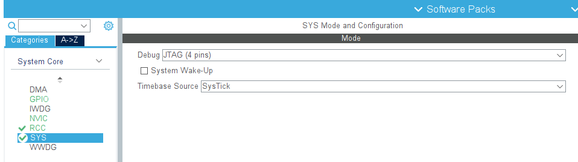
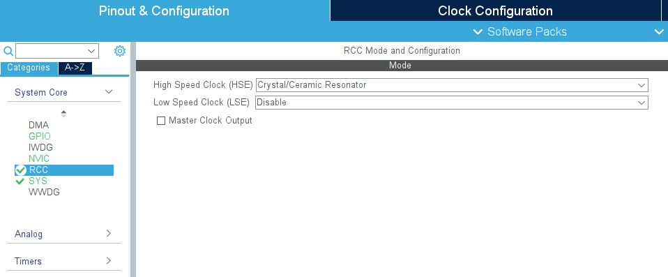
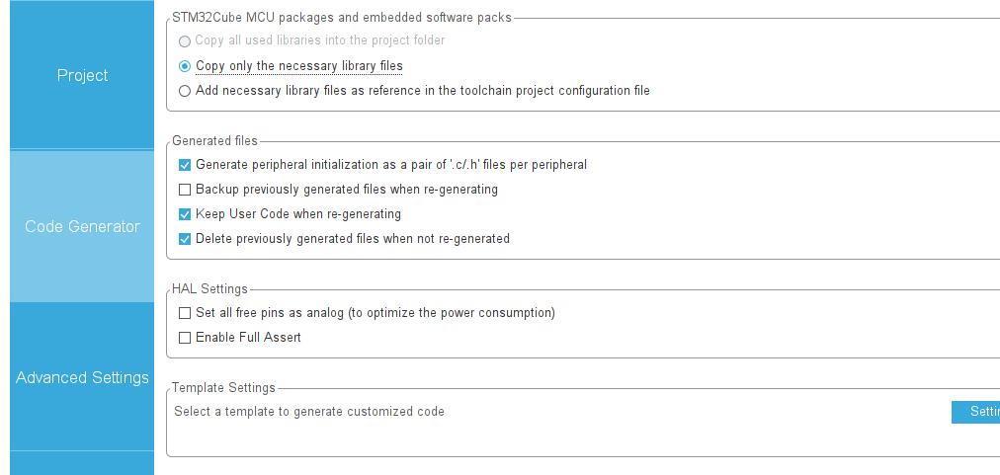
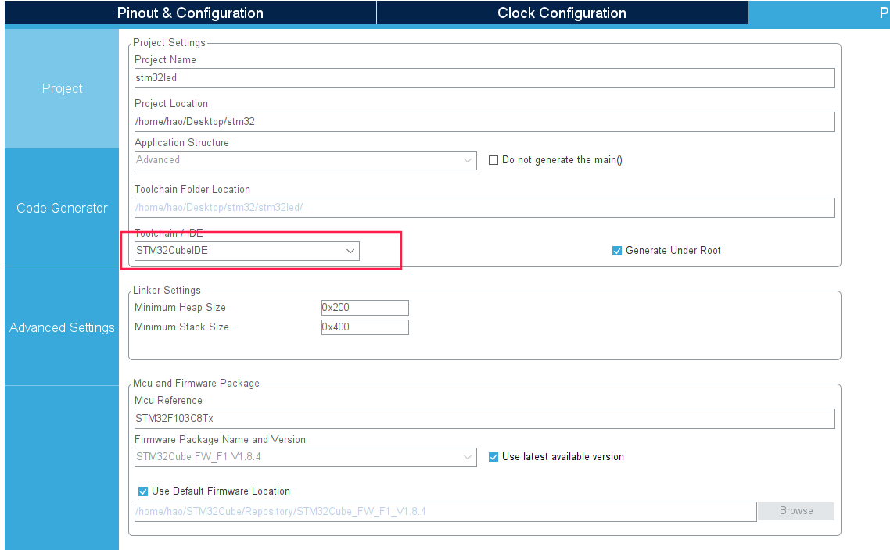
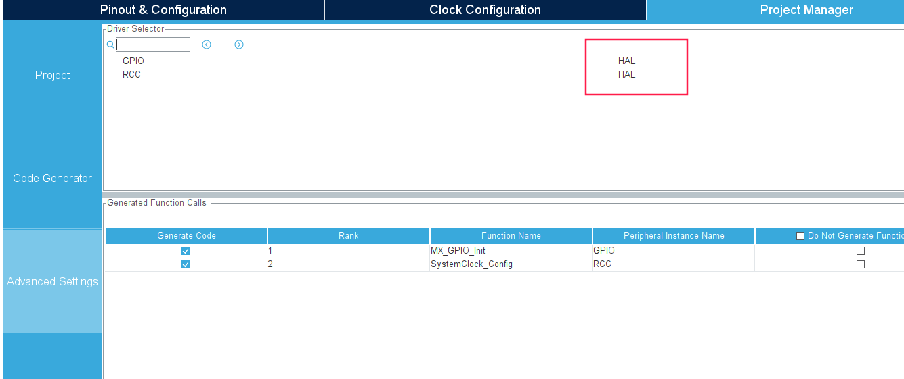

# 裸板开发

## +++++++++++++++++++++++++++++++

## jz2440 s3c2440芯片

教程地址：https://www.bilibili.com/video/BV1EW411L7RE?p=13

1.线的链接和驱动的安装

2.eop烧写裸版

### ==============================

### JZ2440裸机学习之从led学gpio

#### 第一步：开发环境配置

1. 先安装 linux 操作系统。  在 windows 系统上安装 linux 子系统，或者在 linux 系统上安装 windows 虚拟机。（作者使用 windowsOS，安装的 ubuntu 子系统，烧写工具用 oflash 工具）
2. 搭建交叉编译环境。安装 arm-linux-gcc， 或者其他的编译工具。
3. 连接 Opne JTAG 线到开发板和电脑。
4. 就可以进行裸机程序烧写。

#### 第二步：查看原理图

1. 查看原理图，看 led 接线原理。

   

   因为 Led 一端为 3.3v 高电平，所有要点亮 Led 需要 2440 这边的管脚为低电平时，Led 才会点亮。    由图显示，led1 与 GPF4 相连。因此要点亮 led 必须让 GPF4 处于低电平。

2. 让 GPF4 处于低电平

- 配置 GPF4 功能。输入：输出：其他
- 设置 GPF4 电平。高：低

1. 从用户手册中查找 GPF4 设置功能和电平。    由图可以看出 GPF4 控制寄存器地址为：0x56000050， 它的第【8：9】位用来设置该引脚功能，8：9 位为 01 时为输出功能。    由图中翻译：当端口配置为输出端口时，引脚状态与相应位相同。  则 GPF4 就是第【4】位。则：给 0x56000054 的第 4 位置 0（低电平）时，则灯亮。

#### 第三步：编写代码

至此，原理已经分析完成，就剩写代码了。

```assembly
.text.global _start_start:              
LDR     R0,=0x56000050     @ R0设为GPFCON寄存器。此寄存器                                      							@ 用于选择端口B各引脚的功能：                                      							@ 是输出、是输入、还是其他          
MOV     R1,#0x00000100                  
STR     R1,[R0]     
						@ 设置GPF4为输出口, 位[8:7]=01                     
LDR     R0,=0x56000054    @ R0设为GPBDAT寄存器。此寄存器                                      						  @ 用于读/写端口B各引脚的数据          
MOV     R1,#0x00000000    
						@ 此值改为0x00000010,                                      
						@ 可让LED1熄灭          
STR     R1,[R0]      @ GPF4输出0，LED1点亮
MAIN_LOOP:          
B       MAIN_LOOP
```


16 进制 0x100 转为二进制为：1 0000 0000

  


几个命令解释一下：

```c
LDR{条件}   目的寄存器     <存储器地址>作用：将 存储器地址 所指地址处连续的4个字节（1个字）的数据传送到目的寄存器中。

MOV{条件}{S} 目的寄存器，源操作数
MOV指令可完成从另一个寄存器、被移位的寄存器或立即数赋值到目的寄存器。其中S选项为指令的操作结果是否操作CPSR中的条件标志位，当没有S选项时指令不更新CPSR中的条件标志位结果。

STR{条件} 源寄存器，<存储器地址>
STR指令用亍从源寄存器中将一个32位的字数据传送到存储器中。该指令在程序设计中比较常用，丏寻址方式灵活多样，使用方式可参考指令LDR。
b引起处理器转移到“子程序名”处开始执行，不能返回，只能跳转。
```


### ==============================

### JZ2440裸板学习之存储控制器


### ==============================

### JZ2440裸板学习之MMU控制器


## +++++++++++++++++++++++++++++++

## tiny4412 s3c4412芯片


## +++++++++++++++++++++++++++++++

## stm32  arm-m3芯片


### 在linux开发环境下： 例如：debain系

硬件准备：

1.stm32f103c8t6

2.st-link

3.debain系统


下载环境：

1. [STM32CubeMX](https://www.st.com/stm32cubemx)工具：STM32CubeMX 是用于 32 位 ARM Cortex STM32 微控制器的图形工具。它允许对 STM32 微控制器和微处理器进行非常简单的配置，生成初始化 C 代码，还可以通过一步一步的操作为 Arm Cortex-M 内核或 Arm Cortex-A core 生成部分 Linux 设备树。它是 STMCube 生态系统的一部分，且可以作为独立应用程序或作为 Eclipse 插件集成在开发环境（STM32CubeIDE）中。
2. [STM32CubeIDE](https://blog.csdn.net/Brendon_Tan/article/details/107685044)工具：对CubeMX生成的工程文件进行编译，调试，烧写等功能。
3. 交叉编译工具链。arm-linux-gcc系。 使用arm-linux-gnueabi系工具链有问题，编译出来的二进制对比不一样，硬件不工作。

工具教程：https://blog.csdn.net/Brendon_Tan/article/details/107722164


操作步骤：

1.查看板子启动的BOOT引脚配置。如图所示，平常将板子BOOT0设置成低电平。


2.创建工程。

* 打开STM32CubeMX。
* 设置SYS.
* 设置RCC.
* 设置时钟。
* 设置工程。这个根据编译工具来选。 因为我用的cubeIDE，所有我就生成该工程。, 这块可以选择库的类型。
* 生成代码。点击 GENERATE CODE.

3.打开工程。

使用STM32CubeIDE打开工程，进行编译调试。 注意BOOT的设置。

后边的使用类似vStudio，就不做介绍。

4.任何调试，运行，操作均会使二进制文件烧写到板子里。


