# 30天自制操作系统

## 必备知识

### 1.c程序编译的步骤

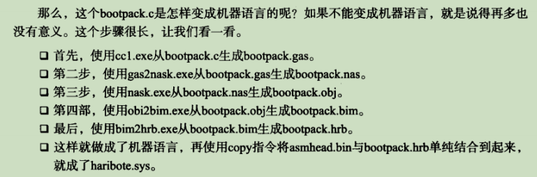

### 2.环境安装

windowsXP之后版本。

toolset包。

### 3.内存分布图

| start                       | end      | size                          | type                                 | description                            |
| :-------------------------- | :------- | :---------------------------- | :----------------------------------- | :------------------------------------- |
| Low Memory (the first MiB)  |          |                               |                                      |                                        |
| 00000000                    | 000003FF | 400 (1 KiB)                   | RAM - partially unusable (see above) | Real Mode IVT (Interrupt Vector Table) |
| 00000400                    | 000004FF | 100                           | RAM - partially unusable (see above) | BDA (BIOS data area)                   |
| 00000500                    | 00007BFF | 7700 (almost 30 KiB)          | RAM (guaranteed free for use)        | Conventional memory                    |
| 00007C00 (typical location) | 00007DFF | 200                           | RAM - partially unusable (see above) | Your OS BootSector                     |
| 00007E00                    | 0007FFFF | 7FB00 (481 KiB)               | RAM (guaranteed free for use)        | Conventional memory                    |
| 00080000                    | 0009FBFF | 1FC00 (approximately 120 KiB) | RAM (free for use, **if it exists**) | Conventional memory                    |
| 0009FC00 (typical location) | 0009FFFF | 400                           | RAM (unusable)                       | EBDA (Extended BIOS Data Area)         |
| 000A0000                    | 000FFFFF | 60000                         | various (unusable)                   | ROM Area (384 KiB)                     |

参考博客：https://blog.csdn.net/huangkangying/article/details/8495163

## 第一天：

因为咱们的目的是为了研究操作系统的组成，所以暂时略过bootloader的启动部分。　直接从系统启动的第二阶段的主引导记录开始。

前提是将编译工具放在该文件目录的同级目录下，该工具为日本人川合秀实自制的编译程序，优化过的nasm编译工具。

工具下载地址(内网)：http://10.7.11.84/my_os_source/tolset/z_tools/

写入以下汇编代码生成img文件，然后使用qemu虚拟机启动。

```assembly
; hello-os
; TAB=4

	DB 0xeb, 0x4e, 0x90
	DB "HELLOIPL"			;必须是8个字节
	DW 512					;一个扇区的大小
	DB 1
	DW 1					;fat的起始位置
	DB 2					;fat的个数，必须为2
	DW 224
	DW 2880
	DB 0xf0
	DW 9
	dw 18
	dw 2
	dd 0
	dd 2880
	db 0,0,0x29
	dd 0xffffffff
	db "HELLO-OS   "		;必须是11字节，磁盘的名称
	db "FAT12   "			;必须是8字节	磁盘格式名称
	resb 18
; 程序主体
	DB		0xb8, 0x00, 0x00, 0x8e, 0xd0, 0xbc, 0x00, 0x7c
	DB		0x8e, 0xd8, 0x8e, 0xc0, 0xbe, 0x74, 0x7c, 0x8a
	DB		0x04, 0x83, 0xc6, 0x01, 0x3c, 0x00, 0x74, 0x09
	DB		0xb4, 0x0e, 0xbb, 0x0f, 0x00, 0xcd, 0x10, 0xeb
	DB		0xee, 0xf4, 0xeb, 0xfd
	
; 信息显示部分
	db 0x0a, 0x0a 	;两个换行
	db "hello, uos"
	db 0x0a
	db 0
	
	resb 0x1fe-$	;$:表示前面已经输出多少个字节， 这里的$等于132
	db 0x55,0xaa
	
; 以下是启动区以外部分的输出

	DB		0xf0, 0xff, 0xff, 0x00, 0x00, 0x00, 0x00, 0x00
	RESB	4600
	DB		0xf0, 0xff, 0xff, 0x00, 0x00, 0x00, 0x00, 0x00
	RESB	1469432
```

启动运行脚本:

```powershell
..\z_tools\nask.exe helloos.nas helloos.img
copy helloos.img ..\z_tools\qemu\fdimage0.bin
..\z_tools\make.exe -C ..\z_tools\qemu
```


## 第二天：

### 1.将扇区加载到指定内存中。

在第一天的基础上进行代码的加工，第二天给程序中加入将引导扇区读入指定内存地址:0x7c00处，并使用软中断显示字符。

出现了一个问题，发现0扇区内出现莫名其妙的数据，经过分析，是编译器自己写入的启动数据。

优化后的代码为：

```assembly
; hello-os
; TAB=4

		ORG		0x7c00			; このプログラムがどこに読み込まれるのか
		JMP		entry
entry:
		MOV		AX,0			; 初始化寄存器
		MOV		SS,AX
		MOV		SP,0x7c00		;这一句啥意思？　没搞懂，注释后直接卡死了。上边不是已经有ORG 0x7c00了。
		MOV		DS,AX
		MOV		ES,AX

		MOV		SI,msg
putloop:
		MOV		AL,[SI]
		ADD		SI,1			
		CMP		AL,0
		JE		fin
		MOV		AH,0x0e			; ?示一个文字
		MOV		BX,15			; 指定字符?色，不知道???色没?， 有知道的大?告?我下。
		INT		0x10			; ?用??bios，可以理解??用了一个接口。
		JMP		putloop
fin:
		HLT						; ?cpu停止防止cpu空?，等待指令，只要外部?生?化，比如按下??，移?鼠?，cpu就会醒?来???行。
		JMP		fin				; 死循?。

msg:
		DB		0x0a, 0x0a		; 改行を2つ
		DB		"hello, uos1"
		DB		0x0a			; 改行
		DB		0

		RESB	0x7dfe-$		

		DB		0x55, 0xaa

; 以下はブートセクタ以外の部分の記述

		DB		0xf0, 0xff, 0xff, 0x00, 0x00, 0x00, 0x00, 0x00
		RESB	4600
		DB		0xf0, 0xff, 0xff, 0x00, 0x00, 0x00, 0x00, 0x00
		RESB	1469432
```

经过下面命令编译后，生成helloos.img打开后如图所示,出现了一些代码中未实现的数据。

```powershell
..\z_tools\nask.exe helloos.nas helloos.img
```

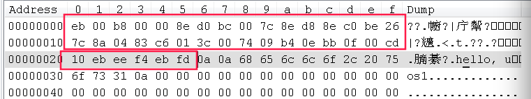

后来经过屏蔽代码，显示如图，证明是编译器写入的初始数据。

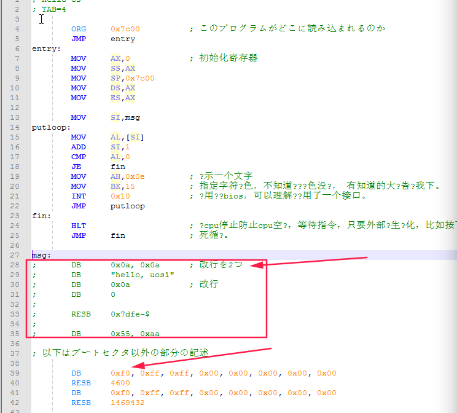

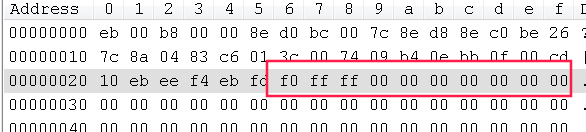

费了好长时间再调这个问题，请大佬们不要鄙视。

为什么是0x7c00处呢，这是bios规定的。0x00007c00-0x00007dff为启动区内容的装载地址

执行结果如图：


### 2.完善工程架构

去掉helloos.nas中55aa后边占字符的所有代码，只留下引导扇区内容。

```assembly
; hello-os
; TAB=4

		ORG		0x7c00			; このプログラムがどこに読み込まれるのか

; 以下は標準的なFAT12フォーマットフロッピーディスクのための記述

		JMP		entry
		DB		0x90
		DB		"HELLOIPL"		; ブートセクタの名前を自由に書いてよい（8バイト）
		DW		512				; 1セクタの大きさ（512にしなければいけない）
		DB		1				; クラスタの大きさ（1セクタにしなければいけない）
		DW		1				; FATがどこから始まるか（普通は1セクタ目からにする）
		DB		2				; FATの個数（2にしなければいけない）
		DW		224				; ルートディレクトリ領域の大きさ（普通は224エントリにする）
		DW		2880			; このドライブの大きさ（2880セクタにしなければいけない）
		DB		0xf0			; メディアのタイプ（0xf0にしなければいけない）
		DW		9				; FAT領域の長さ（9セクタにしなければいけない）
		DW		18				; 1トラックにいくつのセクタがあるか（18にしなければいけない）
		DW		2				; ヘッドの数（2にしなければいけない）
		DD		0				; パーティションを使ってないのでここは必ず0
		DD		2880			; このドライブ大きさをもう一度書く
		DB		0,0,0x29		; よくわからないけどこの値にしておくといいらしい
		DD		0xffffffff		; たぶんボリュームシリアル番号
		DB		"HELLO-OS   "	; ディスクの名前（11バイト）
		DB		"FAT12   "		; フォーマットの名前（8バイト）
		RESB	18				; とりあえず18バイトあけておく

; プログラム本体

entry:
		MOV		AX,0			; レジスタ初期化
		MOV		SS,AX
		MOV		SP,0x7c00
		MOV		DS,AX
		MOV		ES,AX

		MOV		SI,msg
putloop:
		MOV		AL,[SI]
		ADD		SI,1			; SIに1を足す
		CMP		AL,0
		JE		fin
		MOV		AH,0x0e			; 一文字表示ファンクション
		MOV		BX,15			; カラーコード
		INT		0x10			; ビデオBIOS呼び出し
		JMP		putloop
fin:
		HLT						; 何かあるまでCPUを停止させる
		JMP		fin				; 無限ループ

msg:
		DB		0x0a, 0x0a		; 改行を2つ
		DB		"hello, uos  "
		DB		0x0a			; 改行
		DB		0

		RESB	0x7dfe-$		; 0x7dfeまでを0x00で埋める命令

		DB		0x55, 0xaa

```

将文件名改为ipl.nas,因为要将程序逐渐修改成一个ipl（Initial program loader）

加入makefile文件,和makefile的执行批处理文件。

Makefile:    makefile的编写规则，自己学习，这是基础就不讲了。

```makefile
# 默认行为

default :
	../z_tools/make.exe img

# 文件生成规则

ipl.bin : ipl.nas Makefile
	../z_tools/nask.exe ipl.nas ipl.bin ipl.lst

helloos.img : ipl.bin Makefile
	../z_tools/edimg.exe   imgin:../z_tools/fdimg0at.tek \
		wbinimg src:ipl.bin len:512 from:0 to:0   imgout:helloos.img

# 命令

asm :
	../z_tools/make.exe -r ipl.bin

img :
	../z_tools/make.exe -r helloos.img

run :
	../z_tools/make.exe img
	copy helloos.img ..\z_tools\qemu\fdimage0.bin
	../z_tools/make.exe -C ../z_tools/qemu

install :
	../z_tools/make.exe img
	../z_tools/imgtol.com w a: helloos.img

clean :
	-del ipl.bin
	-del ipl.lst

src_only :
	../z_tools/make.exe clean
	-del helloos.img

```

make.bat:		这是批处理文件的编写规则，和linux下的shell类似，不讲了，自己学习。

```powershell
..\z_tools\make.exe %1 %2 %3 %4 %5 %6 %7 %8 %9
```

使用make run编译代码，生成ipl.bin二进制文件，并生成空img，然后将ipl.bin写入空img中,最后运行。

其实只用ipl.bin放入qemu中启动也是可以的。ipl.bin只是一个启动扇区。

结果如下图所示：

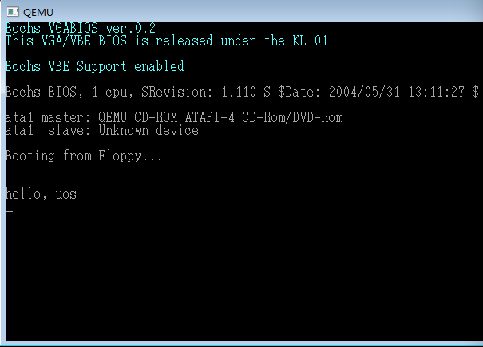

遗留问题：jmp开始直接跳过那段代码，为啥还不能删除？

实验证明可以删除，只是会影响他自己写的这个程序生成img文件而已。不影响。

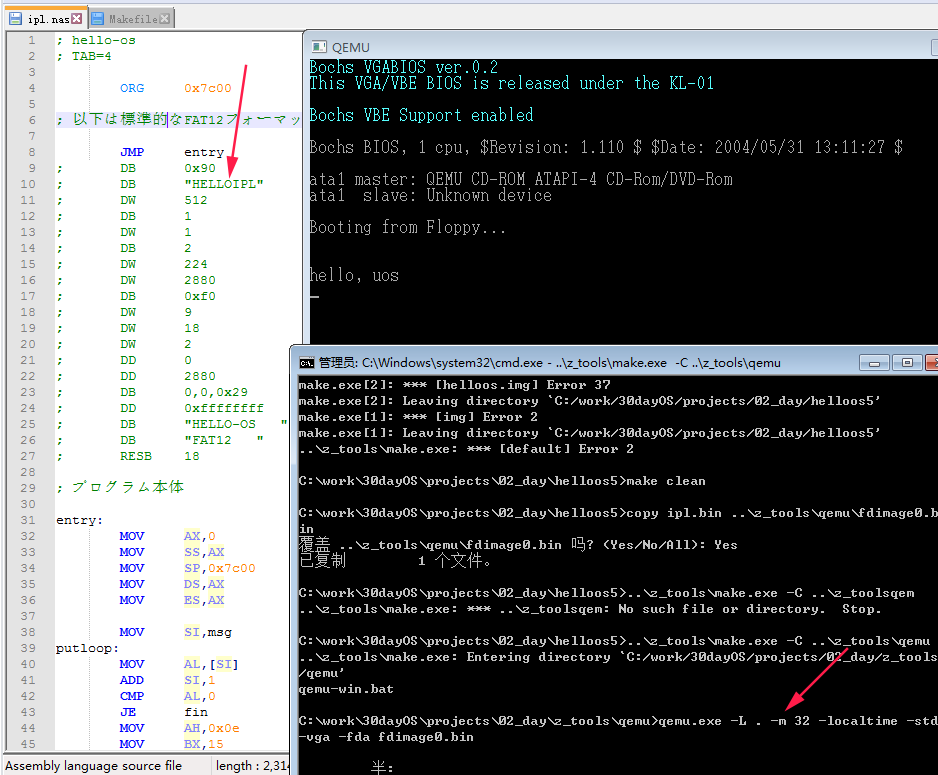

## 第三天：系统引导完成

对第二天代码进行了修改，只打印hello ,uos没一点意思。

读取磁盘上10个柱面的1-18个扇区，（目前ssd已经没有柱面这个概念了）。读出来的数据放入内存0x8200起始的地方。

启动区放在0x8000内存扇区中。为什么要放在0x8000以后的内存中的呢？　只是因为这块内存没有用而已。

为什么要将启动程序(img的0扇区)放在0x7c00处？　这是ibm规定的。

向一个空软盘保存文件时：

​	1.文件名会写在0x002600以后的地方。

​	2.文件内容会写在0x004200以后的地方。

所以若想启动位于0x004200的程序，就得让引导程序运行完成后跳转到0x8000+0x4200＝0xc200处。

作者这一块写的很混乱啊，咱们整理一下为啥是0xc200地址，看下图：

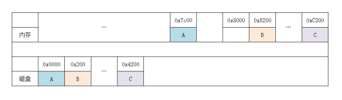

bios会把磁盘0位置的内容拷贝到内存0x7c00这个位置然后跳过去执行，
也就是把A拷贝到了内存，然后执行A
A会把磁盘后面的内容从内存0x8200开始拷贝
这样的话磁盘0x4200位置就会对应到内存0xC200
一个扇区512字节，十六进制表示就是0x200

**程序的执行情况：**

1.bios读取磁盘0扇区到0x7c00处。

2.bios跳转到0x7c00处开始执行,该处为ipl10.nas程序，该程序功能为加载磁盘[1-最后]扇区到内存的0x8200处。并跳转到0xc200处执行。

3.0xc200处为asmhead.nas程序，该程序功能为，调用显卡bios，设置画面模式，调用操作系统代码。

4.操作系统代码目前就一个功能就是让cpu睡眠，开始进入c程序。


下面根据功能修改代码：

### 1.修改ipl.nas

ipl10.nas：

```assembly
; haribote-ipl
; TAB=4

CYLS	EQU		10				; 声明CYLS=10

		ORG		0x7c00			; 指明程序装载地址

; 标准FAT12格式软盘专用的代码 Stand FAT12 format floppy code

		JMP		entry
		DB		0x90
		DB		"HARIBOTE"		; 启动扇区名称（8字节）
		DW		512				; 每个扇区（sector）大小（必须512字节）
		DB		1				; 簇（cluster）大小（必须为1个扇区）
		DW		1				; FAT起始位置（一般为第一个扇区）
		DB		2				; FAT个数（必须为2）
		DW		224				; 根目录大小（一般为224项）
		DW		2880			; 该磁盘大小（必须为2880扇区1440*1024/512）
		DB		0xf0			; 磁盘类型（必须为0xf0）
		DW		9				; FAT的长度（必??9扇区）
		DW		18				; 一个磁道（track）有几个扇区（必须为18）
		DW		2				; 磁头数（必??2）
		DD		0				; 不使用分区，必须是0
		DD		2880			; 重写一次磁盘大小
		DB		0,0,0x29		; 意义不明（固定）
		DD		0xffffffff		; （可能是）卷标号码
		DB		"HARIBOTEOS "	; 磁盘的名称（必须为11字?，不足填空格）
		DB		"FAT12   "		; 磁盘格式名称（必??8字?，不足填空格）
		RESB	18				; 先空出18字节

; 程序主体

entry:
		MOV		AX,0			; 初始化寄存器
		MOV		SS,AX
		MOV		SP,0x7c00
		MOV		DS,AX

; 读取磁盘

		MOV		AX,0x0820
		MOV		ES,AX
		MOV		CH,0			; 柱面0
		MOV		DH,0			; 磁头0
		MOV		CL,2			; 扇区2

readloop:
		MOV		SI,0			; 记录失败次数寄存器

retry:
		MOV		AH,0x02			; AH=0x02 : 读入磁盘
		MOV		AL,1			; 1个扇区
		MOV		BX,0
		MOV		DL,0x00			; A驱动器
		INT		0x13			; 调用磁盘BIOS
		JNC		next			; 没出错则跳转到next
		ADD		SI,1			; 往SI加1
		CMP		SI,5			; 比较SI与5
		JAE		error			; SI >= 5 跳转到error
		MOV		AH,0x00
		MOV		DL,0x00			; A驱动器
		INT		0x13			; 重置驱动器
		JMP		retry
next:
		MOV		AX,ES			; 把内存地址后移0x200（512/16十六进制转换）
		ADD		AX,0x0020
		MOV		ES,AX			; ADD ES,0x020因为没有ADD ES，只能通过AX进行
		ADD		CL,1			; 往CL里面加1
		CMP		CL,18			; 比较CL与18
		JBE		readloop		; CL <= 18 跳转到readloop
		MOV		CL,1
		ADD		DH,1
		CMP		DH,2
		JB		readloop		; DH < 2 跳转到readloop
		MOV		DH,0
		ADD		CH,1
		CMP		CH,CYLS
		JB		readloop		; CH < CYLS 跳转到readloop

; 读取完毕，跳转到haribote.sys执行！
		MOV		[0x0ff0],CH		; 记下IPL读到哪里了
		JMP		0xc200

error:
		MOV		SI,msg

putloop:
		MOV		AL,[SI]
		ADD		SI,1			; 给SI加1
		CMP		AL,0
		JE		fin
		MOV		AH,0x0e			; 显示一个文字
		MOV		BX,15			; 指定字符颜色
		INT		0x10			; 调用显卡BIOS
		JMP		putloop

fin:
		HLT						; 让CPU停止，等待指令
		JMP		fin				; 无限循环

msg:
		DB		0x0a, 0x0a		; 换行两次
		DB		"load error"
		DB		0x0a			; 换行
		DB		0

		RESB	0x7dfe-$		; 填写0x00直到0x001fe

		DB		0x55, 0xaa

```

我们在使用段寄存器时，以ES:BX这种方式表示地址，写成"MOV AL, [ES:BX]"她代表ES×16+BX内存地址。

### 2.修改asmhead.nas

```assembly
; haribote-os boot asm
; TAB=4

;一些定义
BOTPAK	EQU		0x00280000		; bootpack�̃��[�h��
DSKCAC	EQU		0x00100000		; �f�B�X�N�L���b�V���̏ꏊ
DSKCAC0	EQU		0x00008000		; �f�B�X�N�L���b�V���̏ꏊ�i���A�����[�h�j

; 有关BOOT_INFO
CYLS	EQU		0x0ff0			; 设定启动区
LEDS	EQU		0x0ff1
VMODE	EQU		0x0ff2			; 该位置保存颜色数目的信息，颜色的位数。
SCRNX	EQU		0x0ff4			; 该位置保存 分辨率的x
SCRNY	EQU		0x0ff6			; 该位置保存 分辨率的y
VRAM	EQU		0x0ff8			; 图像缓冲区的开始地址。

		ORG		0xc200			; 这个程序需要装载到内存的什么地方呢。

; 画面设定

		MOV		AL,0x13			; VGA显卡，320*320*8位彩色，调色板模式。
		MOV		AH,0x00
		INT		0x10			;调用显卡bios的函数，切换显示模式。
		MOV		BYTE [VMODE],8	; 将画面模式信息保存到这些内存地址中。
		MOV		WORD [SCRNX],320
		MOV		WORD [SCRNY],200
		MOV		DWORD [VRAM],0x000a0000		
;VRAM指的时显卡内存，也就是用来显示画面的内存。这一块内存地址都对应着画面上的像素。
;VRAM在0xa0000~0xaffff之间的64kb。 VRAM分布在内存分布图中的好几个不同的地方。

; 用bios取得键盘上各种led灯的状态。

		MOV		AH,0x02
		INT		0x16 			; keyboard BIOS
		MOV		[LEDS],AL

;=====================================后边的留以后再看,这块时调用bootpack.c程序的======================
; 防止PIC接受所有中断
;	AT兼容机的规范、PIC初始化
;	然后之前在CLI不做任何事就挂起
;	PIC在同意后初始化

		MOV		AL,0xff
		OUT		0x21,AL
		NOP						; ; 不断执行OUT指令
		OUT		0xa1,AL

		CLI						;进一步中断CPU

; ; 让CPU支持1M以上内存、设置A20GATE

		CALL	waitkbdout
		MOV		AL,0xd1
		OUT		0x64,AL
		CALL	waitkbdout
		MOV		AL,0xdf			; enable A20
		OUT		0x60,AL
		CALL	waitkbdout

; 保护模式转换

[INSTRSET "i486p"]				; 说明使用486指令

		LGDT	[GDTR0]			;设置临时GDT
		MOV		EAX,CR0
		AND		EAX,0x7fffffff	; 使用bit31（禁用分页）
		OR		EAX,0x00000001	; bit0到1转换（保护模式过渡）
		MOV		CR0,EAX
		JMP		pipelineflush
pipelineflush:
		MOV		AX,1*8			;  写32bit的段
		MOV		DS,AX
		MOV		ES,AX
		MOV		FS,AX
		MOV		GS,AX
		MOV		SS,AX

;bootpack传递

		MOV		ESI,bootpack	; 源
		MOV		EDI,BOTPAK		; 目标
		MOV		ECX,512*1024/4
		CALL	memcpy

; 传输磁盘数据

; 从引导区开始

		MOV		ESI,0x7c00		; 源
		MOV		EDI,DSKCAC		; 目标
		MOV		ECX,512/4
		CALL	memcpy

; 剩余的全部

		MOV		ESI,DSKCAC0+512	; 源
		MOV		EDI,DSKCAC+512	; 目标
		MOV		ECX,0
		MOV		CL,BYTE [CYLS]
		IMUL	ECX,512*18*2/4	; 除以4得到字节数
		SUB		ECX,512/4		; IPL偏移量
		CALL	memcpy

; 由于还需要asmhead才能完成
; 完成其余的bootpack任务

; bootpack启动

		MOV		EBX,BOTPAK
		MOV		ECX,[EBX+16]
		ADD		ECX,3			; ECX += 3;
		SHR		ECX,2			; ECX /= 4;
		JZ		skip			; 传输完成
		MOV		ESI,[EBX+20]	; 源
		ADD		ESI,EBX
		MOV		EDI,[EBX+12]	; 目标
		CALL	memcpy
skip:
		MOV		ESP,[EBX+12]	; 堆栈的初始化
		JMP		DWORD 2*8:0x0000001b

waitkbdout:
		IN		 AL,0x64
		AND		 AL,0x02
		JNZ		waitkbdout		; AND结果不为0跳转到waitkbdout
		RET

memcpy:
		MOV		EAX,[ESI]
		ADD		ESI,4
		MOV		[EDI],EAX
		ADD		EDI,4
		SUB		ECX,1
		JNZ		memcpy			; 运算结果不为0跳转到memcpy
		RET
; memcpy地址前缀大小

		ALIGNB	16
GDT0:
		RESB	8				; 初始值
		DW		0xffff,0x0000,0x9200,0x00cf	; 写32bit位段寄存器
		DW		0xffff,0x0000,0x9a28,0x0047	; 可执行的文件的32bit寄存器（bootpack用）

		DW		0
GDTR0:
		DW		8*3-1
		DD		GDT0

		ALIGNB	16
bootpack:

```

### 3.加入bootpack.c操作系统代码

这个操作系统实现了一个最简单的功能：让cpu睡眠

```c
void io_hlt(void);


void HariMain(void)
{

fin:
	io_hlt(); /* 执行naskfunc.nas里边的_io_hlt()函数。 */
	goto fin;

}

```

### 4.加入naskfunc.nas

加入这个文件是因为c程序不能调用HLT指令，所以使用c程序调用汇编程序，在汇编程序中用HLT让cpu睡眠。

```assembly
; naskfunc
; TAB=4

[FORMAT "WCOFF"]				; 制作目标文件的模式	
[BITS 32]						; 制作32位模式用的机器语言


; 制作目标文件的信息。
[FILE "naskfunc.nas"]			; 源文件名信息

		GLOBAL	_io_hlt			; 程序中包含的函数名


;实际的函数

[SECTION .text]		;目标中间中写了这些之后再写程序

_io_hlt:	; void io_hlt(void); 这个函数只执行了一个HLT命令，让cpu睡眠。
		HLT
		RET

```

### 5.运行结果

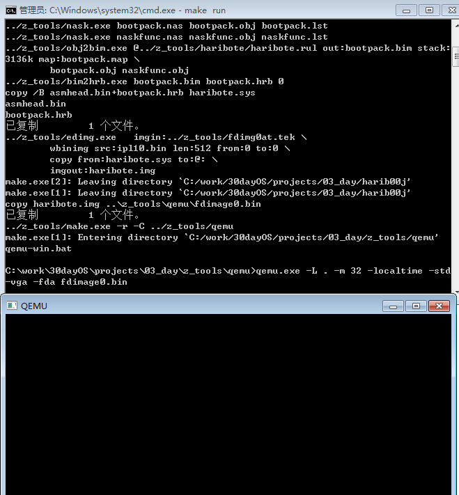


## 第四天：操作系统界面绘制

OUT:让cpu给设备发送电信号．

IN:让cpu从设备获取电信号．

为了区别不同的设备，要使用设备号码，用port表示．

pushad: 将所有的32位通用寄存器压入堆栈

pusha:将所有的16位通用寄存器压入堆栈

pushfd:然后将32位标志寄存器EFLAGS压入堆栈

pushf::将的16位标志寄存器EFLAGS压入堆栈

popad:将所有的32位通用寄存器取出堆栈

popa:将所有的16位通用寄存器取出堆栈

popfd:将32位标志寄存器EFLAGS取出堆栈

popf:将16位标志寄存器EFLAGS取出堆栈

今天比较简单是在第三天基础上扩充c语言进行画图的．

### 1.对内存写入数据

改写bootpack.c代码如下：

VRAM:保存的是0xa0000,指的是显卡内存．这块内存可以像一般的内存一样存储数据，也可以保存画面上的像素．利用这一点可以在画面上显示不同的图像．

```c
void io_hlt(void);

void HariMain(void)
{
	int i; /*i为DWORD４个字节*/
	char *p; /* p用于byte类型地址 */

	p = (char *) 0xa0000; /*  */

	for (i = 0; i <= 0xffff; i++) {
		*(p + i) = i & 0x0f;				//这样对内存进行赋值以后就会显示出图案了．
	}

	for (;;) {
		io_hlt();
	}
}
```

显示如下：

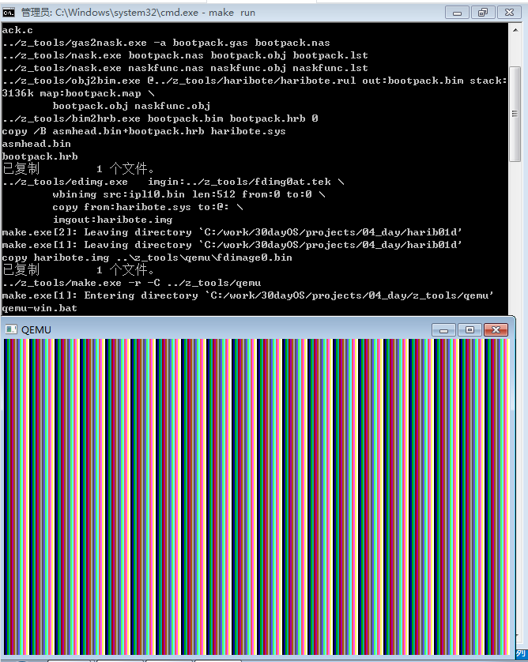

### 2.色号设定

　　rgb表示一个像素颜色时需要6位十六进制数，也就是24位来指定颜色．　而我们显示这个虚拟显示屏只有320*200的8位颜色模式．也就是只能使用0-255的数．　　　

　　这个8位彩色模式，是由程序员随意指定0-255的数字所对应的颜色的，比如25号颜色对应#ffffff,26号颜色对应#123456等，这种方式就叫做调色板．　　

　　目前需要这16种颜色就够了．　

```c
static unsigned char table_rgb[16 * 3] = {
		0x00, 0x00, 0x00,	/*  0:黑 */
		0xff, 0x00, 0x00,	/*  1:亮红*/
		0x00, 0xff, 0x00,	/*  2:亮绿*/
		0xff, 0xff, 0x00,	/*  3:亮黄*/
		0x00, 0x00, 0xff,	/*  4:亮蓝*/
		0xff, 0x00, 0xff,	/*  5:亮紫 */
		0x00, 0xff, 0xff,	/*  6:浅亮蓝*/
		0xff, 0xff, 0xff,	/*  7:白*/
		0xc6, 0xc6, 0xc6,	/*  8:亮灰*/
		0x84, 0x00, 0x00,	/*  9:暗红*/
		0x00, 0x84, 0x00,	/* 10:暗绿*/
		0x84, 0x84, 0x00,	/* 11:暗黄*/
		0x00, 0x00, 0x84,	/* 12:暗青*/
		0x84, 0x00, 0x84,	/* 13:暗紫*/
		0x00, 0x84, 0x84,	/* 14:浅暗紫*/
		0x84, 0x84, 0x84	/* 15:暗灰*/
	};
```

　　这个调色模式在上一节中已经说明，调用bios函数切换显示模式，

```assembly
int 0x10 ，
ah=0x00 设置显卡模式，
al=模式，
0x03：16色字符模式，80×25（最基础）  
0x12: VGA图形模式，640×480×4位彩色模式，独特的4面存储模式.
0x13：VGA图形模式，320×200×8位彩色模式，调色板模式.
0x6a: 扩展vga图形模式，800x600x4位彩色模式，独特的4面存储模式．
返回值：无
```

本系统采用0x13。8位彩色模式，就是有程序员随意指定0~255的数字所对应的颜色。如25号颜色对应#ffffff，26号对应#123456，这种方式叫做调色板palette。

调色板的访问步骤：

（1）首先在一连串的访问中屏蔽中断（比如CLI）。

（2）将想要设定的调色板号码写入0x03c8端口，紧接着，按RGB的顺序写入0x03c9。若还想继续设定下个调色板，就省略调色板的号码，再按RGB的顺序写入0x03c9就行了。

（3）若想读出当前调色板的状态，首先要将调色板的号码写入0x03c7，再从0x03c9中读取3次，顺序为RGB。若要继续读下一个，则省略调色板号码设定，继续按RGB读出。

（4）若开始执行了CLI，则最后执行STI。

调色板设置代码如下：

```c
void set_palette(int start, int end, unsigned char *rgb)
{
	int i, eflags;
	eflags = io_load_eflags();	/* 保存EFLAGS寄存器的值 */
	io_cli(); 					/*禁止中断*/
	io_out8(0x03c8, start);
	for (i = start; i <= end; i++) {
		io_out8(0x03c9, rgb[0] / 4);	//往指定装置里传送数据的函数
		io_out8(0x03c9, rgb[1] / 4);
		io_out8(0x03c9, rgb[2] / 4);
		rgb += 3;
	}
	io_store_eflags(eflags);	/* 恢复EFLAGS寄存器的值 */
	return;
}
```

c程序中调用的汇编函数如下：

```assembly
_io_out8:	; void io_out8(int port, int data);
		MOV		EDX,[ESP+4]		; port  DX寄存器通常被称为数据寄存器。常用来存放双字长数据的高16位，或存放外设端口地址。
		MOV		AL,[ESP+8]		; data
		OUT		DX,AL
		RET
_io_hlt:	; void io_hlt(void);
		HLT
		RET
		
_io_cli:	; void io_cli(void);
		CLI			;禁止中断发生
		RET

_io_sti:	; void io_sti(void);
		STI			;允许中断发生
		RET
		
_io_load_eflags:	; int io_load_eflags(void);
		PUSHFD		; PUSH EFLAGS 
		POP		EAX
		RET

_io_store_eflags:	; void io_store_eflags(int eflags);
		MOV		EAX,[ESP+4]
		PUSH	EAX
		POPFD		; POP EFLAGS 
		RET
```

### 3.绘制矩形

颜色配好了，现在开始画，在画面模式中，画面上有320x200=64000个像素，假设坐上角坐标是(0,0),右下角坐标是(319x199)，(书里为什么是319x319不明白)，那么像素坐标(x,y)对应的VRAM地址应该是

0xa0000+x+y*320

画矩形框函数如下：

```c
void boxfill8(unsigned char *vram, int xsize, unsigned char c, int x0, int y0, int x1, int y1)
{
	int x, y;
	for (y = y0; y <= y1; y++) {
		for (x = x0; x <= x1; x++)
			vram[y * xsize + x] = c; //将某个像素点设置成某个颜色．
	}
	return;
}
```

### 4.画出系统界面的大概轮廓

```c
void HariMain(void)
{
	char *vram;
	int xsize, ysize;

	init_palette();		//设定调色板
	vram = (char *) 0xa0000;
	xsize = 320;
	ysize = 200;

	boxfill8(vram, xsize, COL8_008484,  0,         0,          xsize -  1, ysize - 29);
	boxfill8(vram, xsize, COL8_C6C6C6,  0,         ysize - 28, xsize -  1, ysize - 28);
	boxfill8(vram, xsize, COL8_FFFFFF,  0,         ysize - 27, xsize -  1, ysize - 27);
	boxfill8(vram, xsize, COL8_C6C6C6,  0,         ysize - 26, xsize -  1, ysize -  1);

	boxfill8(vram, xsize, COL8_FFFFFF,  3,         ysize - 24, 59,         ysize - 24);
	boxfill8(vram, xsize, COL8_FFFFFF,  2,         ysize - 24,  2,         ysize -  4);
	boxfill8(vram, xsize, COL8_848484,  3,         ysize -  4, 59,         ysize -  4);
	boxfill8(vram, xsize, COL8_848484, 59,         ysize - 23, 59,         ysize -  5);
	boxfill8(vram, xsize, COL8_000000,  2,         ysize -  3, 59,         ysize -  3);
	boxfill8(vram, xsize, COL8_000000, 60,         ysize - 24, 60,         ysize -  3);

	boxfill8(vram, xsize, COL8_848484, xsize - 47, ysize - 24, xsize -  4, ysize - 24);
	boxfill8(vram, xsize, COL8_848484, xsize - 47, ysize - 23, xsize - 47, ysize -  4);
	boxfill8(vram, xsize, COL8_FFFFFF, xsize - 47, ysize -  3, xsize -  4, ysize -  3);
	boxfill8(vram, xsize, COL8_FFFFFF, xsize -  3, ysize - 24, xsize -  3, ysize -  3);

	for (;;) {
		io_hlt();
	}
}
```

执行效果如下：

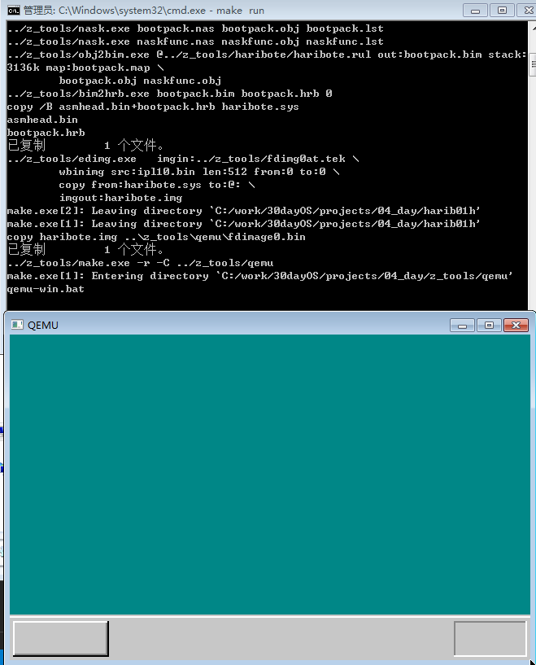

## 第五天:文字显示与GDT/IDT初始化

### 1.从内存中读出保存的值.

昨天程序中300x200都是直接写入程序,本来应该从asmhead.nas先前保存的值中取,不然当画面模式改变时,系统就挂了.

所以得修改bootpack.c文件代码从asmhead.nas写入的内存中取值.

### 2.显示字符

原理:将每一个bit当成一个黑点,那么,字符a就可以当成下图所示:

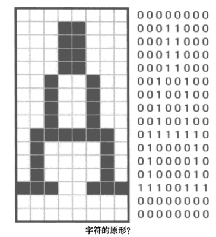

那么字符a要显示赋值给显卡的话,用字符数组表示就变成:

```c
static char font_A[16]=
	{0x00,0x18, 0x18, 0x18, 0x18, 
	 0x24, 0x24, 0x24, 0x24, 0x7e,
     0x42, 0x42,0x42, 0xe7, 0x00, 0x00
    };
```

### 3.增加字体

作者自己写了一个字体生成小工具,可以将图像字符转成16进制数据.

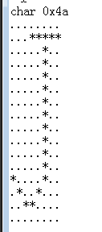

这个很简单,有c语言基础的一看就知道这个工具是怎么写的了. 

生成的字体数据存到hankaku[4096]数组中,后边程序会调用.


### 4.显示鼠标指针

将鼠标大小定为16x16,先准备16x16的内存,然后写入鼠标指针的数据.

```c
void init_mouse_cursor8(char *mouse, char bc)
/* 初始化鼠标*/
{
	static char cursor[16][16] = {
		"**************..",
		"*OOOOOOOOOOO*...",
		"*OOOOOOOOOO*....",
		"*OOOOOOOOO*.....",
		"*OOOOOOOO*......",
		"*OOOOOOO*.......",
		"*OOOOOOO*.......",
		"*OOOOOOOO*......",
		"*OOOO**OOO*.....",
		"*OOO*..*OOO*....",
		"*OO*....*OOO*...",
		"*O*......*OOO*..",
		"**........*OOO*.",
		"*..........*OOO*",
		"............*OO*",
		".............***"
	};
	int x, y;

	for (y = 0; y < 16; y++) {
		for (x = 0; x < 16; x++) {
			if (cursor[y][x] == '*') {
				mouse[y * 16 + x] = COL8_000000;
			}
			if (cursor[y][x] == 'O') {
				mouse[y * 16 + x] = COL8_FFFFFF;
			}
			if (cursor[y][x] == '.') {
				mouse[y * 16 + x] = bc;
			}
		}
	}
	return;
}
```

然后分别对* 0 . 进行颜色替换.

### 5.GDT和IDT初始化.

有分段,分页和中断的概念,自己百度吧.


**GDT**(全局段号记录表):

​	为了表示一个段,需要一下信息:

* 段的大小是多少.
* 段的起始地址在哪里. 
* 段的管理属性(禁止写入,禁止执行,系统专用等).

​	cpu 用8个字节(64位)来表示这些信息.  表示段的寄存器只有16位,而且由于cpu设计上的原因,段寄存器的低3位不能使用,因此只有13位,能够处理的就只有位于0~8191的区域了.  因此能够定义8192个段, 而设定8192个段需要8192x8=65536(64kb), 将这64kb存到内存中表示,就是GDT.

**IDT**(中断记录表):

​	idt记录了0~255的中断号码与调用函数的对应关系.

```c
struct SEGMENT_DESCRIPTOR {
	short limit_low, base_low;
	char base_mid, access_right;
	char limit_high, base_high;
};

struct GATE_DESCRIPTOR {
	short offset_low, selector;
	char dw_count, access_right;
	short offset_high;
};


//初始化<全局段号记录表><中断记录表>.
void init_gdtidt(void)
{
    //随便选了内存地址0x00270000~0x0027ffff设为GDT.只是因为未被使用.
	struct SEGMENT_DESCRIPTOR *gdt = (struct SEGMENT_DESCRIPTOR *) 0x00270000; 
	struct GATE_DESCRIPTOR    *idt = (struct GATE_DESCRIPTOR    *) 0x0026f800;
	int i;

	/* GDT的初始化 */
	for (i = 0; i < 8192; i++) {
		set_segmdesc(gdt + i, 0, 0, 0);
	}
    //段号为1的段的属性为0x4092 , 歧视地址是0, 大小是0xffffffff,刚好是4GB.表示cpu所能管理的全部内存.
	set_segmdesc(gdt + 1, 0xffffffff, 0x00000000, 0x4092); 
	set_segmdesc(gdt + 2, 0x0007ffff, 0x00280000, 0x409a); //段号为2的段的属性为0x409a
	//c语言不给能GDTR赋值.调用汇编给GDTR赋值.
    load_gdtr(0xffff, 0x00270000);

	/* IDT的初始化 */
	for (i = 0; i < 256; i++) {
		set_gatedesc(idt + i, 0, 0, 0);
	}
	load_idtr(0x7ff, 0x0026f800);

	return;
}
void set_segmdesc(struct SEGMENT_DESCRIPTOR *sd, unsigned int limit, int base, int ar)
{
	if (limit > 0xfffff) {
		ar |= 0x8000; /* G_bit = 1 */
		limit /= 0x1000;
	}
	sd->limit_low    = limit & 0xffff;
	sd->base_low     = base & 0xffff;
	sd->base_mid     = (base >> 16) & 0xff;
	sd->access_right = ar & 0xff;
	sd->limit_high   = ((limit >> 16) & 0x0f) | ((ar >> 8) & 0xf0);
	sd->base_high    = (base >> 24) & 0xff;
	return;
}

void set_gatedesc(struct GATE_DESCRIPTOR *gd, int offset, int selector, int ar)
{
	gd->offset_low   = offset & 0xffff;
	gd->selector     = selector;
	gd->dw_count     = (ar >> 8) & 0xff;
	gd->access_right = ar & 0xff;
	gd->offset_high  = (offset >> 16) & 0xffff;
	return;
}
```

### 6.至此,就把GDT和IDT写入到内存中. 执行结果如下:

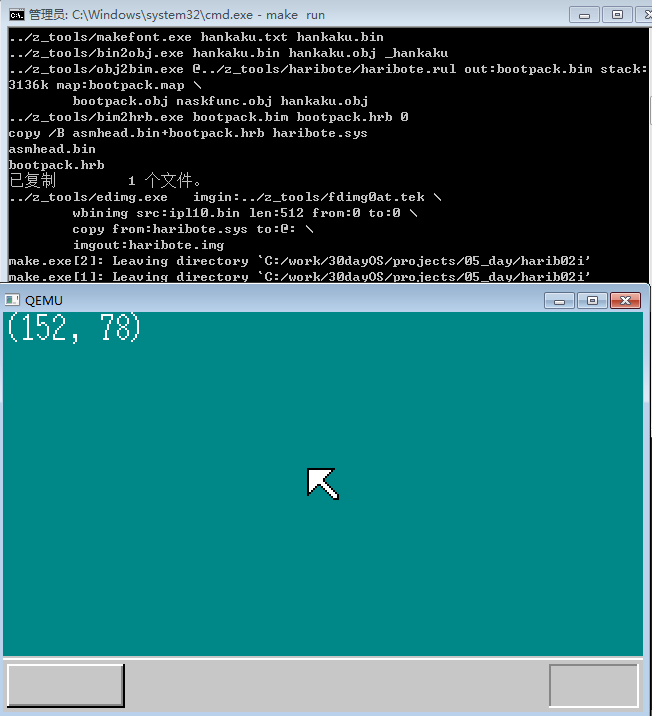

# 第六天：代码架构整理与中断处理

## 1.拆开bootpack.c文件。

根据设计模式将对应的功能封装成独立的文件。


## 2.初始化pic:

pic(可编程中断控制器)：

​	在设计上，cpu单独只能处理一个中断。 而pic是将8个中断信号集合成一个中断信号的装置。 只要有一个中断信息进来，就将唯一的输出管脚信号变成ON。后期扩充到了15个， 使用了主从PIC。

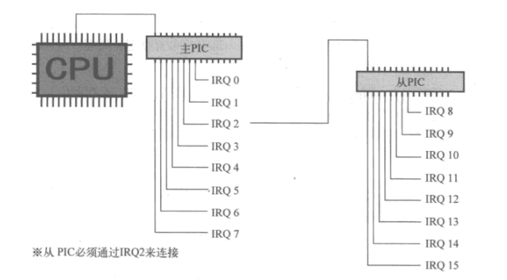

8259a可编程中断控制器介绍：https://blog.csdn.net/navysniper/article/details/4380306

初始化pic代码：

```c
void init_pic(void)
/* PICの初期化 */
{
	io_out8(PIC0_IMR,  0xff  ); /* 禁止所有中断 */
	io_out8(PIC1_IMR,  0xff  ); /* 禁止所有中断 */

	io_out8(PIC0_ICW1, 0x11  ); /* 边沿触发模式 */
	io_out8(PIC0_ICW2, 0x20  ); /* IRQ0-7由、INT20-27接收 */
	io_out8(PIC0_ICW3, 1 << 2); /* PIC1由IRQ2链接 */
	io_out8(PIC0_ICW4, 0x01  ); /* 无缓冲区模式*/

	io_out8(PIC1_ICW1, 0x11  ); /* 边沿触发模式 */
	io_out8(PIC1_ICW2, 0x28  ); /* IRQ8-15由、INT28-2f接收 */
	io_out8(PIC1_ICW3, 2     ); /* PIC1由IRQ2链接 */
	io_out8(PIC1_ICW4, 0x01  ); /* 无缓冲区模式 */

	io_out8(PIC0_IMR,  0xfb  ); /* 11111011 PIC1以外全部禁止 */
	io_out8(PIC1_IMR,  0xff  ); /* 11111111 禁止所有中断 */

	return;
}
```

IMR:中断屏蔽寄存器： 

​	8位寄存器，分别对应8路IRQ信号。如果某一位的值是1，则该位对应的IRQ信号被屏蔽，PIC就忽略该信号。

ICW：初始化控制数据：

​	ICW有4个，共有4字节的数据。

​	ICW1和ICW4与PIC主板配线方式、中断信号电气特性有关。 为固定值。

​	ICW3是有关主-从连接的设定。 只能写入00000100,因为硬件已经连接到2号，不可能更改，如果软件设定不一致，会发生错误。

​	ICW2能设定的就只有这个了 。


## 3.中断处理程序

​	鼠标是IRQ12,键盘是IRQ1，所以编写了用于INT 0X2C和INT 0x21的中断处理程序。

```c
void inthandler21(int *esp)
/* PS/2キーボードからの割り込み */
{
	struct BOOTINFO *binfo = (struct BOOTINFO *) ADR_BOOTINFO;
	boxfill8(binfo->vram, binfo->scrnx, COL8_000000, 0, 0, 32 * 8 - 1, 15);
	putfonts8_asc(binfo->vram, binfo->scrnx, 0, 0, COL8_FFFFFF, "INT 21 (IRQ-1) : PS/2 keyboard");
	for (;;) {
		io_hlt();
	}
}

void inthandler2c(int *esp)
/* PS/2マウスからの割り込み */
{
	struct BOOTINFO *binfo = (struct BOOTINFO *) ADR_BOOTINFO;
	boxfill8(binfo->vram, binfo->scrnx, COL8_000000, 0, 0, 32 * 8 - 1, 15);
	putfonts8_asc(binfo->vram, binfo->scrnx, 0, 0, COL8_FFFFFF, "INT 2C (IRQ-12) : PS/2 mouse");
	for (;;) {
		io_hlt();
	}
}
```

​	中断处理完成之后就处于待机状态，这样还不行，得让程序返回。

```assembly
;保存寄存器值，并调用中断处理函数，然后恢复现场，并调用IRETD使中断返回。
_asm_inthandler21:
		PUSH	ES
		PUSH	DS
		PUSHAD
		MOV		EAX,ESP
		PUSH	EAX
		MOV		AX,SS
		MOV		DS,AX
		MOV		ES,AX
		CALL	_inthandler21
		POP		EAX
		POPAD
		POP		DS
		POP		ES
		IRETD		;IRETD 助记符（中断返回双字）用于从使用 32 位操作数大小的中断返回；
```

PUSHAD: 

​	本指令将EAX,ECX,EDX,EBX,ESP,EBP,ESI,EDI 这8个32位通用寄存器依次压入堆栈。


然后将_asm_inthandler21注册到IDT中：

```c
/* IDT的设定： 中断处理函数*/
set_gatedesc(idt + 0x21, (int) asm_inthandler21, 2 * 8, AR_INTGATE32);
```

如果中断发生了，cpu会自动调用该函数，2*8表示asm_inthandler21属于哪个段，既段号是2，×8表示低3位有别的意思，这里低3位必须是0.

在bootpack.c中让中断许可标志位置1，cpu才能接收来自外部设备的中断。 

```assembly
_io_sti:	; void io_sti(void);
		STI
		RET
```


按下键盘执行结果如图：

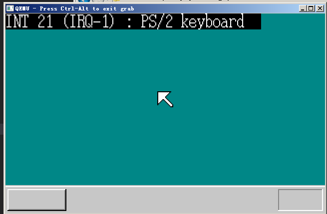


