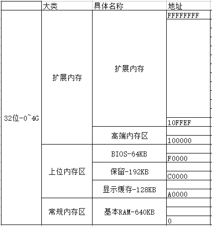
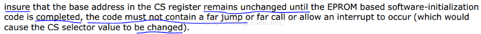
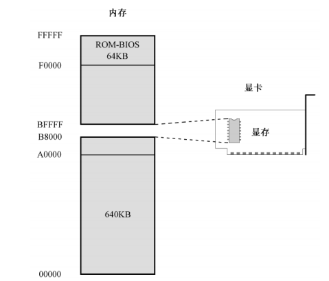

# X86汇编从实模式到保护模式

## 1.x86架构机器内核启动过程

机器启动到linux初始化是一个比较复杂并且细节性较强的过程，大部分的实现都是由于历史遗留问题以及各种协议约定而来的，衔接性比较强，而且比较难跟踪，毕竟不是C语言那么简单，一个函数调用一个函数，整个脉络比较清晰明了。

这里主要是以linux-3.2.55版本内核为基础，将整个系统的初始化流程梳理了一下。

A、自摁下电源开关后，是由主板自动初始化处理器信息的，将CS、DS、ES、SS置为0xffff，而PC置为0x0000，由于初始化时，处理器处于实模式，那么也就是计算机执行的第一条指令在0xffff0这个位置。计算机执行的第一条指令是来自BIOS的，存储在ROM里面，通过ROM芯片译码以读取出来执行，该指令通常都是一条跳转指令，这是由于0xffff0距离可访问的内存结尾已经不远了，该指令可以用来跳转到具体的BIOS操作代码中；

B、BIOS开始执行后，做了不少事情，比如Power On Self Test（POST，开机自检），检查CPU寄存器、周边芯片的状态，以及针对动态内存、主板芯片组、显卡以及相关外围的寄存器做初始化设置，并检查能够正常工作，同时记录系统的设置值，最重要的就是将常驻程序库（可以理解为BIOS的库，基本上就是中断）放置在某段内存中，提供给操作系统或者应用程序调用，比如int 0x13等；

C、BIOS毕竟不是系统，完成了分内工作后，执行int 0x19（前面提到的BIOS的常驻程序库）将存储在磁盘0头0道1扇区的MBR读入到内存0x7c00中，然后BIOS通过跳转指令去到0x7c00去执行引导程序代码；

D、MBR的引导程序对不同的linux版本而言各有不同，最初0.11版本中，linux的/boot/bootsect.s自己实现了这个MBR引导程序，而如今3.2.55的linux内核版本自身已经不再实现MBR引导程序了，都是由GRUB的/stage1/stage1.S实现的，具体的引导程序历史可以参考linux内核中的/Documentation/x86/boot.txt；

E、Linux 0.11的引导过程就不谈了，关于这块的资料数不胜数，那么GRUB实现的引导，主要是给用户提供了系统引导选择和引导编辑等功能，核心的是它通过调用BIOS的常驻程序库去将linux内核映像加载到内存当中；

F、GRUB加载完了内核映像，将会跳转到内核的文件/arch/x86/boot/header.S里面的_start开始执行，其实_start也没什么好执行的，就跳转到start_of_setup去设置准备给实模式下main函数运行的环境；

G、开始进入main函数执行，该函数的实现在文件/arch/x86/boot/main.c里面，具体可以进入去分析里面的代码，其主要的莫过于一些参数的准备、堆的初始化、CPU的检测、BIOS的设置以及内存检测等工作（这里使用了一些BIOS中断，所以这些都是在实模式下的！！！），然后开始转入保护模式；

H、进入保护模式后，将会跳转去执行arch/x86/boot/compressed/head_32.S里面的startup_32，其主要设置一个基本的环境，如堆栈等；

I、再往下就是调用文件/arch/x86/boot/compressed/misc.c里面的decompress_kernel，用来解压内核，当内核被解压到内存中之后，就可以调用它了；

J、解压完内核，还要调用一个startup_32，这个不同于前面的那个，这个是位于文件/arch/x86/kernel/head_32.S里面的，主要工作是对页表进行初始化，并启动内存分页功能，初始化0号进程；

K、startup_32执行完了之后，最后进入内核的主题函数start_kernel，该函数位于文件/init/main.c，自此完成linux的最后初始化。

以上就是机器启动linux的整个过程，主要是梳理了初始化实现的一个线索，暂时不深入分析。

## 2.x86cpu上电后

CPU上电后第一条指令是通过CS:IP来指定的，CPU厂家会给其初始值，对于386处理器来说，CPU第一条指令地址是

　　　　　　　　　　　　　　　　　　0xFFFFFFF0

　　这里会有一个问题，CPU怎么能一上来就去0xFFFFFFF0取指令呢？因为此时的内存都没有初始化呢，内存中什么都没有，第一条指令毫无疑问肯定在BIOS中，现在用来烧写BIOS的Flash芯片一般也就256KB、1MB、4MB，都是非常小的，怎么也没有0xFFFFFFF0这个地址的。

　　这里就需要说一下x86的地址编码方式了，我们平时说的内存，主存是指RAM，但是这里会有些问题，因为RAM是从0开始的一个地址范围，而ROM也是从0开始的一个地址范围，当我们要访问一个地址，比如0x100，此时到底是去RAM里找还是去ROM里找呢？

　　x86解决这个问题的方法是“统一编码”，也可以叫做地址映射，也就是在CPU眼里，它只看到一块打的空间，对于32位CPU，从0开始，4G结束，64位的CPU最大范围就更大了，CPU才不懂什么叫RAM，什么叫ROM，什么叫硬盘的，地址映射的概念就是给地址分段，不同位置是有不同的作用的，大部分是用来给程序运行的RAM的，但还有部分是映射给ROM，IO或者其他设备，下图是一种典型的地址映射关系：

　　

　　那么问题又来了，上面不是说CPU上电后会去0xFFFFFFF0处取第一条指令，这条指令肯定是在BIOS中，但是上图中BIOS的映射地址时0xF0000，这个就有点懵了，到底是为什么呢？那么BIOS代码到底映射在什么位置呢？

　　答案是--两个地址都有，BIOS的代码肯定是存在EPROM中的，CPU中的硬件回把EPROM芯片映射到2个地方，一个是从0xFFFFFFFF(4G)处向下扩展，一个是从0xFFFFF(1MB)处向下扩展，第一个映射是因为第一条指令在0xFFFFFFF0处，所以EPROM必须在哪个位置，第二个映射是为了兼容，在16位时代就有了，另外地址映射是占据地址空间，总是你的PC机只有2G内存也没关系，因为病没有使用内存，使用的只是地址空间，所到底对于CPU来说，它才不知道哪是哪，它只知道服从硬件安排，上面的所有所有地址映射，都是给程序员看的，不是给CPU看的，CPU只认各种“门”电路。

　　那么第一条指令的内容是什么呢？

　　这是比较容易产生混淆的地方，多数人说第一条指令是个长跳转（long jmp），跳转到0~0xFFFFF（0-1MB）这一段，然后再执行BIOS剩余的指令，但是intel手册中却又这么一段话：

　

　　　简单的说，就是不让有长跳转动作，其实这两种都对，intel手册上说的是让BIOS在高地址空间运行，器件一直修改CS寄存器，也就是一直使用Base+EIP的方式生成地址，这种新式方法应该是UEFI的，那种刚开始就长跳转的属于老式做法。

　　假设有一块1M的flash芯片，第一条指令一般都是在0xFFFF0的这个位置，这样的原因，我们可以很简单的想到，这是为了把这1M空间方便的映射到4G地址中最高的1M中吧，可能看起来比较对齐吧。

　　BIOS也就是ROM的地址空间通过CPU的硬件自动映射到了高地址1M，但是我们平时看到的都是低于1M的BIOS，因为在高地址的时候，CPU实际上是在访问ROM，这段时间内，基本的操作就是硬件初始化，最重要的肯定是RAM等重要硬件的初始化，初始化完成后，CPU根据BIOS中的“搬家”代码，回将ROM的所有内容拷贝到RAM中（整体拷贝比较方便，如果是想着把前面执行过的剔除掉，得不偿失），当然这个位置肯定就是低1M的地址空间，比如上图中，从0xF0000开始的那64Kb空间（放心，一般的BIOS不会超过64KB），拷贝完成后，CPU会执行一条长跳转，这会引起CS寄存器的改变，也就会控制CPU指向RAM进行执行程序了，这样带来2个好处，第一肯定是RAM比ROM更快，第二是这样重新满足了实模式下寻址范围是1M的这一特点，当然CPU寻址方式回重新回归到CS左移4位+IP的模式。

　　到这里还有一些疑问：我们一般会认为第一条紫菱本身就是一条长跳转指令，那么CPU是怎么完成内存初始化后，并将BIOS相关数据拷贝到1M以下地址空间呢？这里有几种可能（方便说服内心的猜测），第一是这条指令并不是真正的长跳转，而是先进行一些基本的初始化，才跳转，第二是ROM到地址空间的映射并不是简单的映射到搞地质的1M，而是有着更复杂的映射方式，使得长跳转后时间上CPU还是在访问ROM，第三就是CPU一旦上电，就自动的由硬件将BIOS内容复制到对应的RAM中，这一点在ARM9的工作模式可以验证。

## 3.扫盲

Intel 8086 在实模式下可以访问 1MB 的内存空间，地址范围为 0x00000 到 0xFFFFF。

出于各方面的考虑，计算机系统的设计者将这 1MB 的内存空间从物理上分为几个部分。
8086 有 20 根地址线，但并非全都用来访问 DRAM，也就是内存条。事实上，这些地址
线经过分配，大部分用于访问 DRAM，剩余的部分给了只读存储器 ROM 和外围的板卡.

1.0x00000-0x9FFFF:DRAM(动态随机访问存储器):

2.0xA0000-0xEFFFF:   分给外围设备

3.0xF0000-0xFFFFF:ROM(只读存储器),占据内存顶端的64k空间. 固化了开机时要执行的指令

​    0xB8000～0xBFFFF : 分给显卡的.

​    8086加电或复位时,cs=0xffff,ip=0x0000,位于rom处,开始执行bios程序. 

​    物理地址为0xFFFF0, 到最后结束也只有16个字节.所以一般为一个jmp指令.

​    处理器取指令执行的自然顺序是从内存的低地址向高地址推进.

## 4.x86基础硬件知识

总线(Bus)：是计算机各种功能部件之间传送信息的公共通信干线。

主板上的总线有：

```sh
# DIMM总线｛内存用｝
# FSB总线｛CPU到北桥｝
# DMI总线｛北桥到南桥｝
# PCIE总线
# IDE总线
# PCI总线
# 等等.....
```

总的来说就三大类：地址总线、数据总线、控制总线。

## 第一章: 十六进制计数法

唉，计算机专业基础知识，不写了。

## 第二章：处理器、内存和指令

略

## 第三章：汇编语言和汇编软件

略

## 第四章：虚拟机安装和使用

略

## 第五章：编写主引导扇区代码

8086 可以访问 1MB 内存。其中，0x00000～9FFFF 属于常规内存，
由内存条提供；0xF0000～0xFFFFF 由主板上的一个芯片提供，即 ROM-BIOS。



则中间的0x9FFFF~0xF0000之间有320K的空间。  地址为：0xA0000~0XEFFFF 这段内存有外围设备来提供，包含显卡。

0XB8000~0XBFFFF：这段地址空间就是留给显卡的。

其实就是从显卡的 I/O 接口那里映射过来的，当访问这部分地址时，实际上是在访问 I/O 接口。