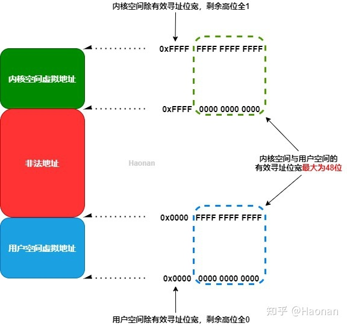

# 读书笔记-奔跑吧arm64体系结构编程与实践

## 临时配置环境变量

```shell
export ARCH=arm
export CROSS_COMPILE=arm-linux-gnueabi-
export PATH=/path/to/toolchain/bin/:$PATH
```

- `arm-linux-gnueabi` 是基于软浮点（soft-float）的交叉编译器，不支持硬件浮点运算（VFP/NEON），编译出的程序需要依赖软浮点库进行运算，因此比较慢。适用于 ARMv4t、ARMv5 和 ARMv6 架构的处理器，其中的 "gnueabi"表示 "GNU EABI"（GNU 嵌入式应用二进制接口）。

- `arm-linux-gnueabihf` 是基于硬浮点（hard-float）的交叉编译器，可以利用浮点运算单元（VFP/NEON）完成浮点数运算，因此编译出的程序性能更高。适用于 ARMv7 架构及以上的处理器，其中的 "hf" 表示 "hard-float"。

## 模拟树莓派4

1.查看本机都的qemu是否支持树莓派4。

```shell
qemu-system-aarch64 -machine help
```

2.qemu4.2之前的版本不支持树莓派4,因此，需要重新编译支持raspi4的新版本qemu。

[GitHub - 0xMirasio/qemu-patch-raspberry4: Official QEMU mirror. Please see http://wiki.qemu.org/Contribute/SubmitAPatch for how to submit changes to QEMU. Pull Requests are ignored. Please only use release tarballs from the QEMU website.](https://github.com/0xMirasio/qemu-patch-raspberry4)

代码中给出了编译步骤:

```shell
mkdir build
cd build
../configure
make
```

配置时会提示缺少一些必要的组建库，根据提示安装就行。

本机安装的支持树莓派4的qemu地址：

/media/hao/_dde_data/hao/work_my/kernel_source/arm/raspi/benos/qemu-patch-raspberry4/build/

3.启动树莓派镜像。

```shell
sudo qemu-system-arm   -M versatilepb   -cpu arm1176   -m 256   -hda ./2019-09-26-raspbian-buster-full.img  -dtb ./versatile-pb-buster.dtb   -kernel ./kernel-qemu-4.19.50-buster   -append 'root=/dev/sda2 panic=1'   -no-reboot   -netdev user,id=unet -device virtio-net-pci,netdev=unet
```

4.或者使用arm64启动树莓派4/3

```shell
qemu-system-aarch64 -machine raspi3 -nographic -kernel benos.bin
```

## 树莓派启动流程

    树莓派上电复位后， 运行在最高异常等级-EL3，经过固件的初始化，从GPU固件(start4.elf)跳转到入口地址0x80000时，异常等级已经从EL3切换到EL2了。 

    然后我们自己编写的代码将放入到0x80000处进行执行。

## 异常等级

    arm64支持4中特权模式，这些特权模式在ARMV8体系结构手册里称为异常等级。

* EL0为非特权模式，用于运行应用程序。

* EL1为特权模式，用于运行操作系统内核。

* EL2用于运行虚拟化管理程序。

* EL3用户运行安全世界的管理程序。


查看寄存器值：

```shell
#16进制显示寄存器值
info register x*

#也可以用如下命令显示， 10进制显示
print $x1
```

## 寄存器

### 异常相关寄存器：

**HCR_EL2**: （虚拟化管理软件配置寄存器，用来配置EL2）

其中RW字段（Bit[31]）用来控制低异常等级的执行状态。

    0:表示EL0和EL1都在AArch32执行状态下。

    1:表示EL1的执行状态为AArch64,而EL0执行状态有PSTATE.nRW字段来确定.

**SCTLR_EL1**:（系统控制器寄存器）

    EE字段（Bit[25]）：用来设置EL1下数据访问的大小端，也包括MMU中遍历页表的访问(阶段1)。0：小端。1：大端

    EOE字段（Bit[24]）：用来设置EL0下数据访问的大小端。0：小端。1：大端

    M字段（Bit[0]）：用来使能MMU，主要是阶段1的MMU映射。

**SPSR_EL***:

    SPSR_EL2用来保存发生异常时的PSTATE寄存器。

    其中SPSR.M[3:0] 字段记录了返回哪个异常等级.

**ELR_EL2**:（主要用来保存异常返回的地址）

## 汇编指令

CurrentEL:  

    该寄存器表示PSTATE寄存器的EL字段，其中保存了当前的异常等级， 使用mrs指令可以读取当前异常等级

eret:

    在异常处理例程中会进行具体的异常处理，处理结束后，需要返回到异常发生前的状态继续执行。异常返回指令eret来完成此项工作，eret指令既要清除Status寄存器的EXL字段，从而使能中断，还要将EPC寄存器保存的地址恢复到PC中，从而返回到异常发生处继续执行.

cmp:

.macro：

    伪操作可以将一段代码定义为一个整体，称为宏指令。

    然后就可以在程序中通过宏指令多次调用该段代码。

```asm6502
 .macro  func1 arg
        mov r1,#1
        mov r2,#2
        mov r3,#3
        b \arg   //这个是参数
 .endm
```

## 虚拟地址空间布局

### 虚拟地址空间划分

arm64处理器不支持完全的64位虚拟地址。目前最大宽度为48位，高16位都是1。

范围是[0xFFFF 0000 0000 0000，0xFFFF FFFF FFFF FFFF];


