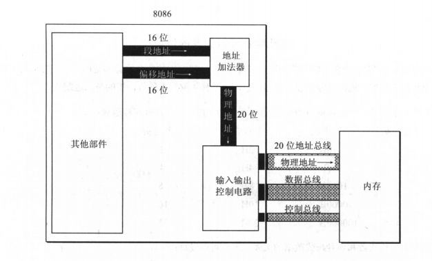
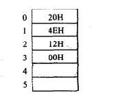
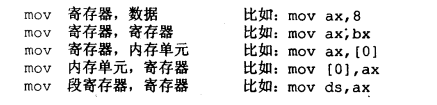
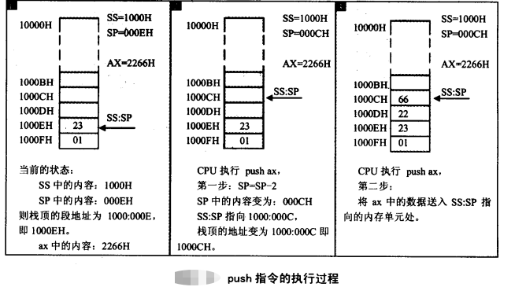
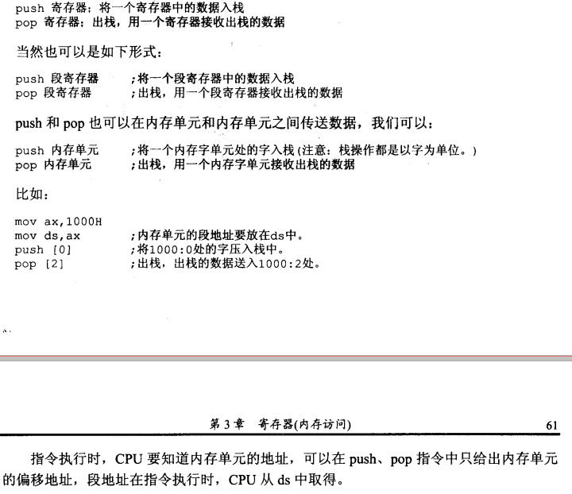
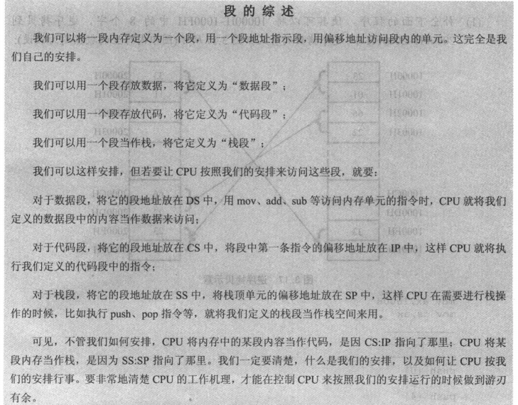
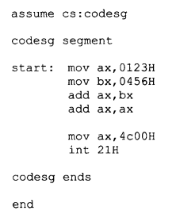

# 第一章 基础知识

Intel 8086 在实模式下可以访问 1MB 的内存空间，地址范围为 0x00000 到 0xFFFFF。

出于各方面的考虑，计算机系统的设计者将这 1MB 的内存空间从物理上分为几个部分。
8086 有 20 根地址线，但并非全都用来访问 DRAM，也就是内存条。事实上，这些地址
线经过分配，大部分用于访问 DRAM，剩余的部分给了只读存储器 ROM 和外围的板卡.

1.0x00000-0x9FFFF:DRAM(动态随机访问存储器):

2.0xA0000-0xEFFFF:   分给外围设备

3.0xF0000-0xFFFFF:ROM(只读存储器),占据内存顶端的64k空间. 固化了开机时要执行的指令

0xB8000～0xBFFFF : 分给显卡的.

8086加电或复位时,cs=0xffff,ip=0x0000,位于rom处,开始执行bios程序. 

物理地址为0xFFFF0, 到最后结束也只有16个字节.所以一般为一个jmp指令.

处理器取指令执行的自然顺序是从内存的低地址向高地址推进.

# 第二章 寄存器（cpu工作原理）

16位机器相关部件的逻辑结构：



地址加法器采用：

物理地址=段地址×16+偏移地址

使用段地址和偏移地址合成物理地址。

# 第三章：寄存器（内存访问）

## 3.1内存中字的存储



## 3.2DS和[address]

cpu读写一个内存单元时，必须要给出内存单元的地址。

8086cpu有一个DS寄存器，用来存放访问数据的段地址。

```assembly
mov bx,1000H
mov ds,bx
mov al,[0]
```

mov 指令可以完成两种传送：

1.将数据直接送入寄存器；

2.将一个寄存器中的内容送入另一个寄存器。

3.将一个内存单元中的内容送入一个寄存器中。

[...]表示送入寄存器中的内存单元，执行执行时，自动取DS寄存器中的数据为内存单元的段地址。取[0]中的0为偏移地址。

8086cpu不支持将数据直接送入段寄存器中。

## 3.3字的传送

mov指令在寄存器和内存之间进行字节型的数据传送。 因为8086cpu是16位结构，有16根数据线，所以可以一次性传送16位的数据。也就是说一次性可以传送一个字。 我们只要在Mov指令中给出16位的寄存器就可以进行16位数据的传送了。

## 3.4mov、add、sub指令



mov    寄存器，段寄存器

mov     内存单元，段寄存器

mov     段寄存器，内存单元

未统计完。  add 和 sub命令同理。

## 3.5数据段

在8086cpu中，我们可以根据需要，将一组内存单元定义为一个段，可以将一组长度为N(N<=64K),地址连续、起始地址为16的倍数的内存单元当做专门存储数据的内存空间，从而定义一个数据段。

比如我们用：123B0H~123BAH这段内存空间存放数据，我们就认为123B0H~123BAH这段内存是一个数据段，端地址为123BH长度为10字节。

## 3.6栈

## 3.7cpu提供的栈机制

8086cpu提供相关指令来以栈的方式访问内存空间，我们在编程的时候，可以使用一段内存当做栈来使用。

入栈：PUSH

出栈：POP

8086cpu的出栈入栈操作都是以字为单位进行的。

可是cpu如何知道栈顶的地址呢？

类比CS:IP：表示当前指令的段地址和偏移地址。  8086cpu中提供段寄存器SS和SP，表示栈顶地址和偏移地址。

任意时刻，SS:SP指向栈顶元素。push和pop执行时，cpu从ss:sp中得到栈顶地址。

push ax；指令执行过程示例：



从图所示：8086cpu中，入栈时，栈顶从高地址向低地址方向增长。

## 3.8栈顶越界问题

8086CPU没有越界检测，需要自己来控制， 一旦越界的栈空间是被cpu需要的，就会出现运行的不可控错误。

## 3.9push pop指令



## 3.10栈段

对于8086cpu我们可以根据需要，将一组内存单元定义为一个段。可以将这个段当做栈来使用。

这仅仅是我们在编程中的一种安排，cpu不会由于这种安排就在执行push,pop的时候自动的将我们定义的栈段当做栈空间访问， 而是要将SS:SP指向我们定义的栈段。

## 3.11段的综述



# 第四章　第一个程序

## 4.2源程序



### 1.伪指令

伪指令被编译器来执行的指令，编译器根据伪指令来进行相关的编译工作。

```assembly
xxx segment
.
.
.
.
.
xxx ends
```

segment和ends是成对使用的伪指令。  功能是定义一个段，segment说明一个段的开始，ends说明一个段的结束。 xxx是一个段的标识。

**end**:  标记这程序的结束。

**assume**:   

​    用assume将有特定用途的段和相关的段寄存器关联起来即可。

​    比如示例程序中： codesg segment定义了一个名为codesg的段，在这个段中我们存放代码，就是一个代码段。 在程序的开头，用assume cs:codesg将用作代码段的段codesg和cpu中的段寄存器cs关联起来。

### 2.源程序中的“程序”

就是源程序和程序  源程序就是源码，程序就是二进制码。

### 3.标号

汇编程序中，除了指令和伪指令外，还有一些标号。  比如示例代码中的"codesg"。一个标号指代了一个地址。比如codesg在segment的前面，作为一个段的名称，这个段的名称最终将被编译

连接程序处理为一个段的段地址。

### 4.程序的结构

如果要写运算一个2^3，源程序该怎样来写？

1.定义一个段，名称为abc:

```assembly
abc segment
    .
    .
abc ends
```

2.在这个段中写入汇编指令。

```assembly
abc segment
    mov ax,2
    add ax,ax
    add ax,ax
abc ends
```

3.写出结束符号

```assembly
abc segment
    mov ax,2
    add ax,ax
    add ax,ax
abc ends
end
```

4.abc为代码段，所以应该将abc与cs关联起来。

```assembly
assume cs:abc
abc segment
    mov ax,2
    add ax,ax
    add ax,ax
abc ends
end
```

### 5.程序的返回

一个程序p2在执行过程中，肯定是由另一个程序调起来的，这个程序是p1，将p2加载到内存后，将cpu权限交给p2，才能运行，p2开始后，p1暂停运行。当p2运行完成后，将cpu控制权交给p1，p1继续运行。而这个将cpu控制权交还的过程就是程序的返回。

```assembly
mov ax,4c00H
int 21H
```

上述代码功能为程序的返回。

### 6.语法错误和逻辑错误

。。。略

因此程序需要加上返回才是正确的程序。

```assembly
assume cs:abc
abc segment
    mov ax,2
    add ax,ax
    add ax,ax
    mov ax,4c00H
    int 21H
abc ends
end
```

## 4.2 到4.9 略

# 第五章 [bx]和loop指令
