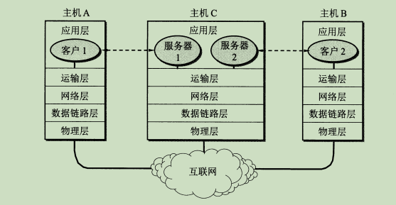
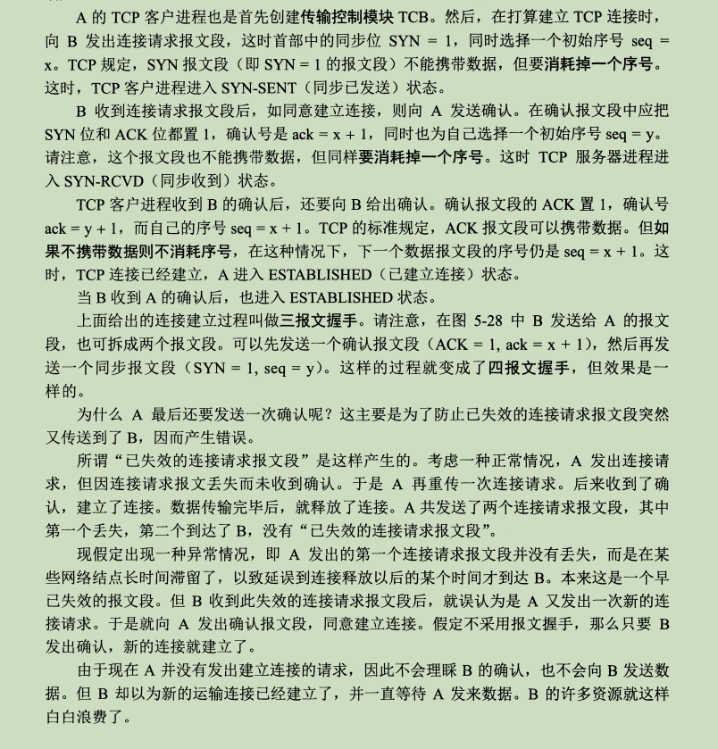

# 5层网络模型

五层协议：

# 物理层

双绞线，同轴电缆， 光纤 。 信号发生形式，信道这些。 

# 数据链路层

数据链路层功能：提供介质访问，和链路管理。

3个基本功能： 

1. 封装成帧。  收到物理层比特流后，根据首部和尾部的标记，从收到的比特流中识别帧的开始和结束。
2. 透明传输。  其实就是保证数据完整性，不把和结束符EOF二进制一样的结束符当做结束符。
3. 差错检测。 比特流在传输的时候，可能出现差错，将0传成1 ，叫比特差错。

ppp协议（点对点协议）：

​	作用： 是用户接入到互联网管理机构（ISP）的协议。

# 网络层

IP（网际协议） 

ARP(地址解析协议)

ICMP（网际控制报文协议）

IGMP(网际组管理协议)

#### ARP(地址解析协议)：

作用：从网络层使用的IP地址，解析出在数据链路层使用的硬件地址。

#### ICMP（网际控制报文协议）：

应用：ping 测试网络是否通。

#### IGMP(网际组管理协议)：

应用： 多播

# 传输层

## TCP:

3次握手：

四次挥手：

可靠传输的工作原理：

 	1. 停止等待协议：就是每发完一个分组就停止发送，等待对方确认，在收到确认后再发送下一个分组。
 	2. 连续ARQ协议(滑动窗口协议)：

## UDP:

# 应用层

http，ftp等协议。 